# Managing REST data, Use Approvals and Unified Tasks Lists

## Introduction

Oracle APEX allows you to build robust, feature-rich applications against remote, web, and REST data sources. In this lab, you login to a remote database, create a database table and then **Register a schema with RESTful Services**. You will then create a **New Application** and then consume the **REST Data Source** we created. Then, you will **Synchronise** the Data from REST Data Source to the Local Database table using **REST Data Synchronization**.

Estimated Time: 20 minutes


## Task 1: Enable Remote Database schema to Oracle REST Data Services.

Before starting this lab, you need to Provision a new **APEX instance** or **Workspace**.

In this hands-on lab, you will login to New Remote APEX workspace, create a Table and then **Register Schema with ORDS**.

1. Login to the new Workspace you created.

  

2. Under **SQL Workshop**, select **SQL Commands**.

  

3. Now, Copy the below statements and execute them one by one.

```
<copy>
CREATE TABLE "EMP_1"
   (    "EMPNO" NUMBER GENERATED BY DEFAULT ON NULL
     AS IDENTITY MINVALUE 1 MAXVALUE 9999999999999999999999999999
     INCREMENT BY 1 START WITH 8000 CACHE 20 NOORDER  NOCYCLE  NOKEEP  NOT NULL ENABLE,
    "EMP_NAME" VARCHAR2(10),
    "MGR" NUMBER(4,0),
    CONSTRAINT "EMP_1_PK" PRIMARY KEY ("EMPNO"))
insert into emp_1(empno, emp_name, mgr) values (10, 'JOHN', 30);
insert into emp_1(empno, emp_name, mgr) values (20, 'CLARA',30);
insert into emp_1(empno, emp_name, mgr) values (30, 'JANE', 40);
insert into emp_1(empno, emp_name, mgr) values (40, 'MATT', null);
</copy>
```

  

    


4. Select **RESTful Services** under **SQL Workshop**.

  

5. Click on the button **Register Schema with ORDS**.

  

6. In the next window, leave the Attributes to default and then click **Save Schema Attributes**.

  

7. Now, Select **Object Browser** under **SQL Workshop**.

  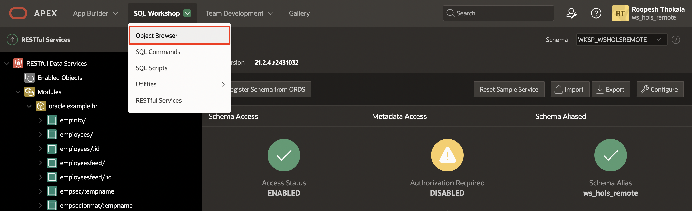


8. Under **Tables**, select **EMP_1** and then click on **REST**.  

    Under REST Attributes:
      - Set **REST Enable Object** to **Yes**.
      - Set **Authorization Required** to **No**.  

   Then Click **Apply**.

  

9. You need to copy the **RESTful URI** and paste it in your Note pad.

  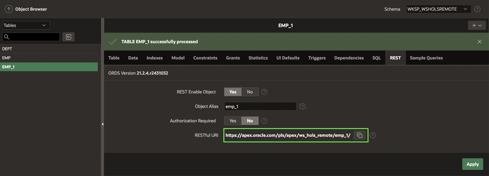

## Task 2: Creating an application and Integrating Application Data from REST Data Source

In this Lab, you create a **New Application** and then consume the **REST Data Source** we created in the previous task. Then, you will **Synchronise** the Data from REST Data Source to the Local Database table using **REST Data Synchronization**.

1. Log in to the first Workspace, where we have already created multiple applications.

  

2. Select **App Builder** under Workspace Home Page.

  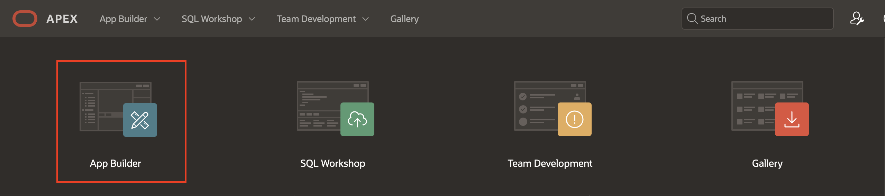

3. Now select **Create** button to create a new application.

  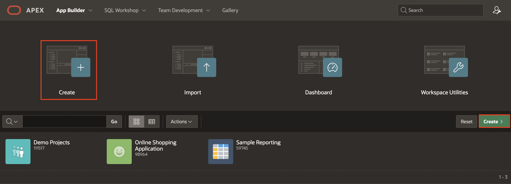

4. Under **Create an Application**, select **New Application**.

  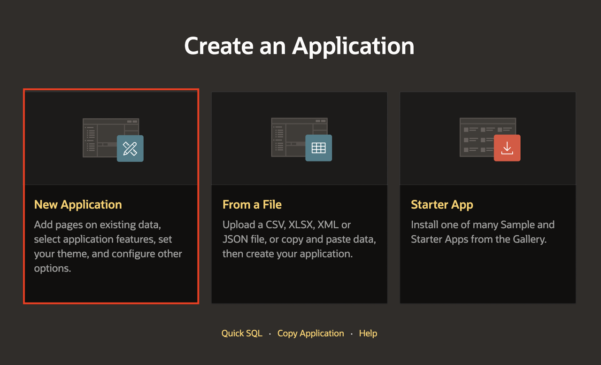

5. Enter the following and click **Create Application**.
  - For **Name** - enter **Leave Request Approval**

  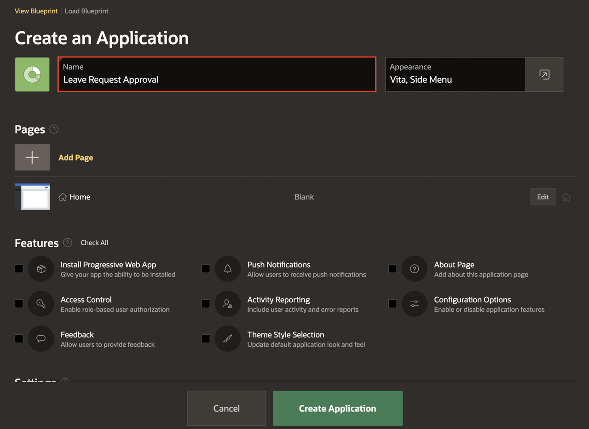

6. Navigate to **Shared Components** and then Select **REST Data Sources**.

  

  

7. Under **REST Data Sources**, Click **Create** button.

  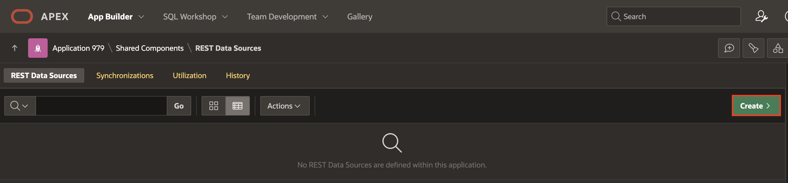

8. Under **Create REST Data Source - Method**, Leave the settings to default and select **Next**.

  

9.  Under **Create REST Data Source**, Enter the following and click **Next**.
  - For **REST Data Source Type** - select **Oracle REST Data Services**
  - For Name - enter **Employee Details API**
  - For URL Endpoint - Enter the URI we **copied** in **Task 1**

  

10. Now, under **Create REST Data Source - Remote Server** leave all fields to **Default** and then click **Next**.

  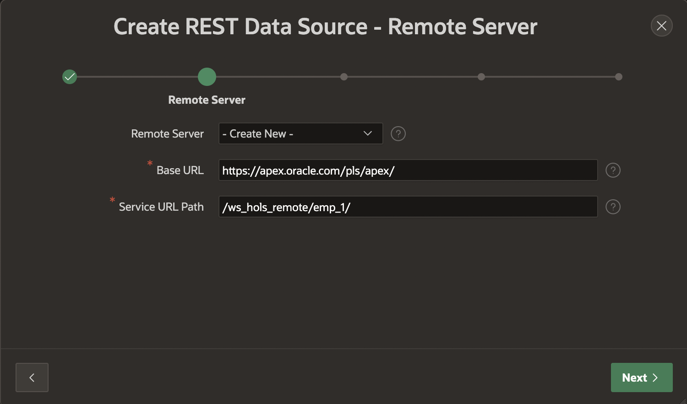


11. For Authentication, Set **Authentication Required** to **No**. Click **Discover**.

  

12. Click on the button **Create REST Data Source**.

  

## Task 3: Synchronizing Data from REST Data Sources to a Local Table.

In this lab, you will **Synchronize data** from the **REST Data source** you have created in Task 2 to a **Local table**.

**Data Synchronization** feature enables developers to automatically sync the contents of a local table with the data from an external REST service. Basically, APEX invokes the REST Service defined in the REST Data Source, downloads all data and synchronizes to a local table.

1. Now that you have created a **REST Data Source**, Under **REST Data Sources** select **No** under **Synchronized** column for **Employee Details API**.

  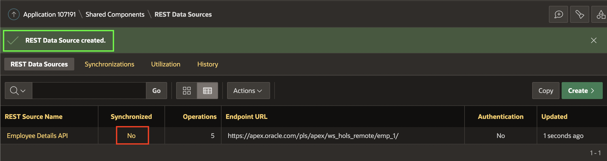

2. **Synchronization** is not configured yet. In this step, you provide the name of a new table or an existing table.
In this example, select New Table for Synchronize To and enter **EMP_1** for Table Name. Then, click **Save**.

  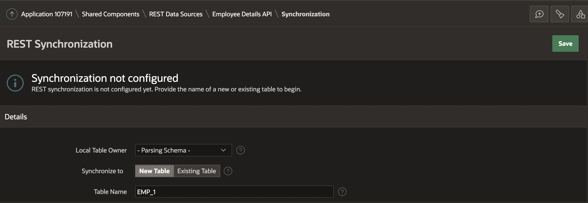

3. The synchronization table is not created yet. You can view the SQL that is used to create the table. Click **Show SQL**.

4. Under Table Status, click **Create Table**. The table **EMP_1** is now ready for synchronization. Notice the message **The synchronization table exists and matches the Data Profile**.

  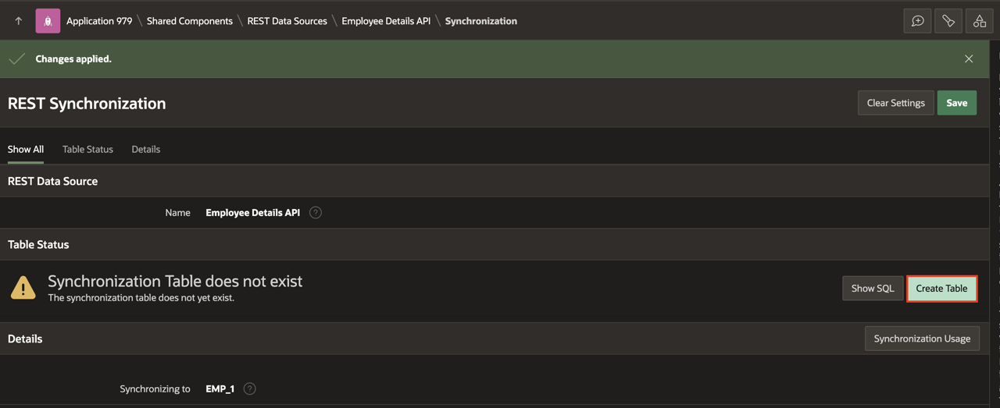

5. You will define a **synchronization schedule** now. In the Synchronization Schedule field, you can use the Database Scheduler calendaring syntax to define repeating synchronization schedules, such as "every Tuesday and Friday at 4:00 p.m." or "the second Wednesday of every month." This calendaring syntax can be provided manually. Click the **Schedule Builder Button** next to **Synchronization Schedule**.

  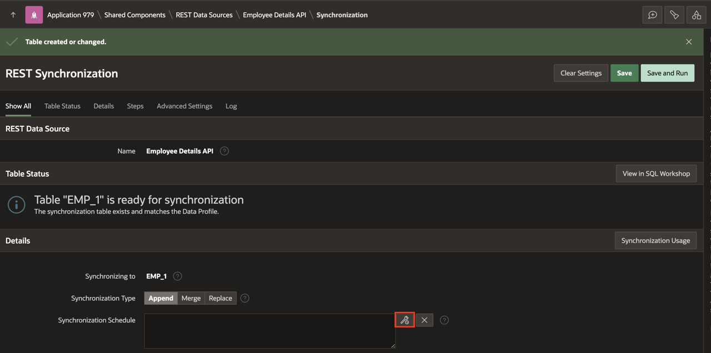

6. The Interval Builder dialog displays. In this example, for Frequency select **Minutely** and enter **10** for Interval. Then, click **Set Execution Interval**.

  

7. You are now ready to test the data synchronization. Click **Save and Run**.

  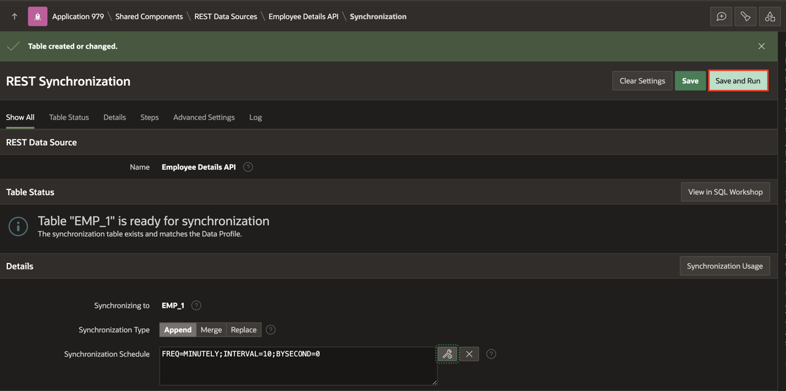

8. You can see that **the data synchronization is triggered**.

  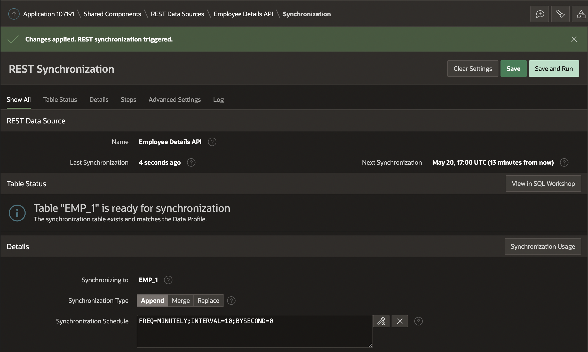

## **Acknowledgments**

- **Author** - Roopesh Thokala, Product Manager
- **Last Updated By/Date** - Roopesh Thokala, Product Manager, May 2022
