# Manage REST data

## Introduction

Oracle APEX allows you to build robust, feature-rich applications against remote, web, and REST data sources. In this lab, you log into a remote database, create a database table and then **Register a schema with RESTful Services**. You will then create a **New Application** and consume the **REST Data Source** we created. Then, you will **Synchronize** the Data from the REST Data Source to the Local Database table using **REST Data Synchronization**.

Estimated Time: 20 minutes

### Objectives

In this lab, you will:

- Learn how to register and expose an Oracle database schema using Oracle REST Data Services (ORDS).

- Understand how to create and configure REST data sources in Oracle APEX.

- Synchronize data from external REST APIs into a local database table.

- Work with nested JSON data, flattening hierarchical structures for better display and interaction in APEX.

- Create a Data Load Definition to map external data into your local database.

## Task 1: Enable Remote Database schema to Oracle REST Data Services

Before starting this lab, you must provide a new **APEX instance** or **Workspace**.

In this task, you will set up your Oracle database schema to be accessible via Oracle REST Data Services (ORDS). This involves creating a table and exposing it as a RESTful service. The data from this table will be used in later tasks to demonstrate how REST data is consumed and synchronized with local tables in APEX.

1. Log in to the new workspace you created.

    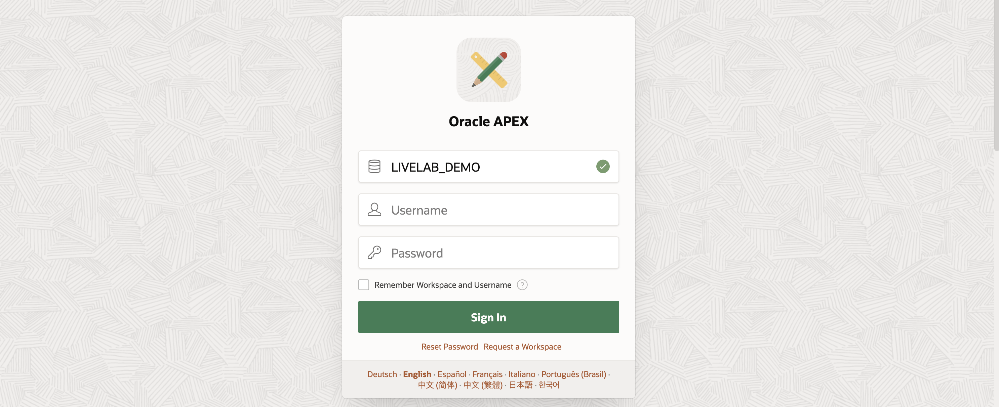

2. Under **SQL Workshop**, select **SQL Commands**.

    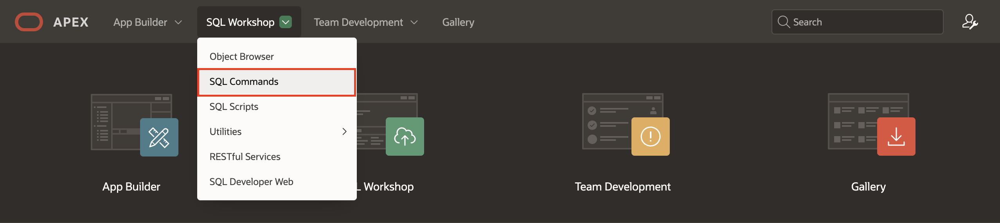

3. Now, copy the statements below and execute them individually.

    ```
    <copy>
    CREATE TABLE "EMP_1"
             (
                          "EMPNO" NUMBER generated BY DEFAULT ON NULL AS identity MINVALUE 1 MAXVALUE 9999999999999999999999999999 INCREMENT BY 1
                          START WITH 8000 CACHE 20 NOORDER NOCYCLE nokeep NOT NULL ENABLE,
                          "EMP_NAME" VARCHAR2(10),
                          "MGR"      NUMBER(4,0),
                          CONSTRAINT "EMP_1_PK" PRIMARY KEY ("EMPNO")
             );
    </copy>
    ```

    ```
    <copy>
    insert into emp_1(empno, emp_name, mgr) values (10, 'JOHN', 30);
    </copy>
    ```

     ```
    <copy>
    insert into emp_1(empno, emp_name, mgr) values (20, 'CLARA',30);
    </copy>
    ```

     ```
    <copy>
    insert into emp_1(empno, emp_name, mgr) values (30, 'JANE', 40);
    </copy>
    ```

     ```
    <copy>
    insert into emp_1(empno, emp_name, mgr) values (40, 'MATT', null);
    </copy>
    ```

    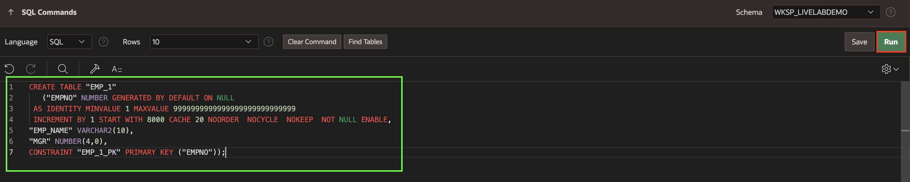

    

4. Navigate to **SQL Workshop**, select **RESTful Services**

    

5. Click **Register Schema with ORDS**.

    

6. In the next window, leave the attributes to default and click **Save Schema Attributes**.

    

7. Now, click **Enabled Objects** in the left navigation menu and select **Create AutoREST Object**.

    

8. Under **AutoREST Enable Object**, enter/select the following and click **Create**.

    - Object Type: **TABLE**

    - Object : **EMP_1**

    - Copy the **Full URL** and paste it into your Note pad.

     Click **Create**.

    

    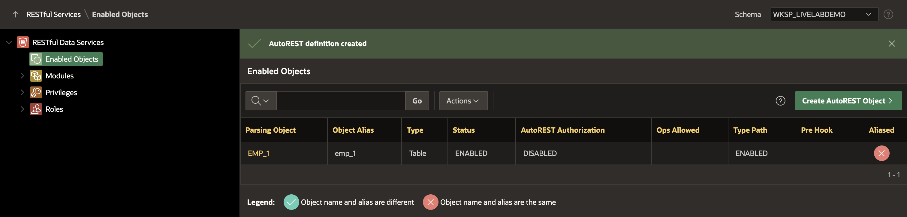

## Task 2: Integrate Application Data from REST Data Source

Now that you have set up a RESTful service in Task 1, you will integrate this service into Oracle APEX as a REST data source. In this task, you will configure the data source and synchronize it with a local database table. This will allow you to work with remote data as if it were part of your application’s local data model.

1. Log in to the first workspace, where we have already created multiple applications.

    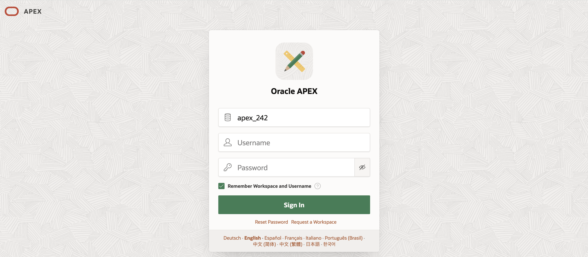

2. Select **Sample Reporting** application.

3. Navigate to **Shared Components** and select **REST Data Sources**.

    

    

4. Under **REST Data Sources**, click **Create**.

    

5. Under **Create REST Data Source - Method**, leave the settings to default and click **Next**.

    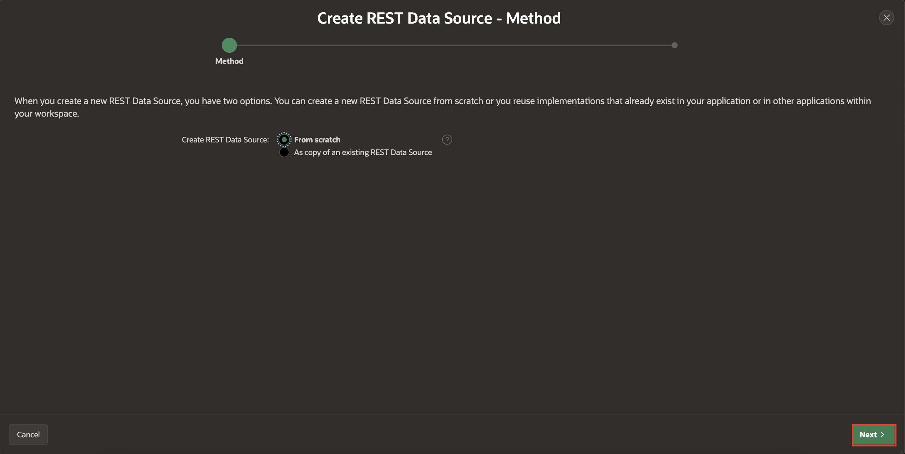

6. Under **Create REST Data Source**, enter/select the following and click **Next**.

    - REST Data Source Type: **Oracle REST Data Services**

    - Name: **Employee Details API**

    - URL Endpoint: Paste the URL you **copied** in **Task 1 > Step 8**

    

7. Now, under **Create REST Data Source - Remote Server** leave all fields to **Default** and click **Next**.

    

8. Set **Authentication Required** to **No**. Click **Discover**.

    

9. Click **Create REST Data Source**.

    

## Task 3: Synchronise Data from REST Data Sources to a Local Table

In this task, you will synchronize the data from the REST data source to a local table. APEX provides an automatic synchronization feature that allows you to periodically sync data between your application’s local tables and external data sources. This ensures that your application stays up to date with the remote data.

**Data Synchronisation** feature enables developers to automatically sync the contents of a local table with the data from an external REST service. APEX invokes the REST Service defined in the REST Data Source, downloads all data and synchronizes to a local table.

1. Now that you have created a **REST Data Source**, under **REST Data Sources**, select **No** under **Synchronised** column for **Employee Details API**.

    

2. **Synchronization** is not configured yet. In this step, you provide the name of a new or existing table.

   Select **New Table** for **Synchronise To** and select **EMP_1** for **Table Name** and click **Save**.

    

3. Under **Table Status**, click **Create Table**. The table EMP_1 is now ready for synchronization.

    

4. You will define a **synchronization schedule** now. In the Synchronisation schedule field, you can use the Database Scheduler calendaring syntax to define repeating synchronization schedules, such as "every Tuesday and Friday at 4:00 p.m." or "the second Wednesday of every month." This calendaring syntax can be provided manually. Click the **Schedule Builder Button** next to **Synchronisation Schedule**.

    

5. The Interval Builder dialog displays. Enter/select the following

     - Frequency: **Minutely**

     - Interval: **10**

    Click **Set Execution Interval**.

    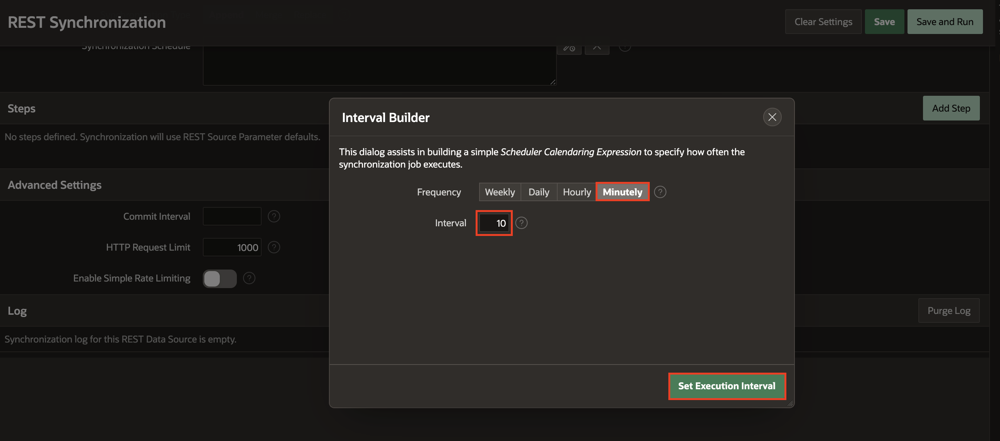

6. You are ready to test the data synchronization. Click **Save and Run**.

    

7. You can see that **the data synchronisation is triggered**.

    

## Task 4:  Hierarchical REST Data Source

Many modern APIs return nested or hierarchical JSON data, where objects contain arrays of objects. In this task, you will work with a nested JSON data source. You will configure Oracle APEX to correctly interpret and display the nested data. This task will demonstrate how to handle complex JSON structures, making them usable in APEX applications.

1. Navigate to **Sample Reporting** application.

    

2. Select **Shared Components**.

    

3. Under **Data Sources**, select **REST Data Sources**.

    

4. Click **Create**.

    

5. Under **Create REST Data Source - Method**, leave as default and click **Next**.

    

6. Under **Create REST Data Source**, enter/select the following:

    - Name: **Purchase Orders**

    - URL Endpoint: **https://apex.oracle.com/pls/apex/carstenczarski/orders/purchaseorders/**

    > **Note:** This URL endpoint consists of an array of purchase orders (denoted by the "items" attribute"), and within each purchase order, there is an array of order line items.

    Click **Next**.

    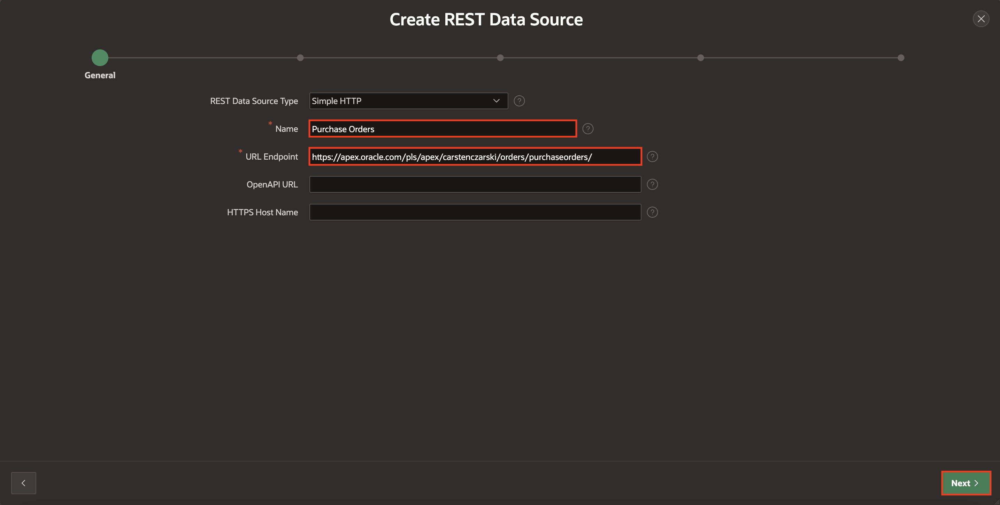

7. Under **Create REST Data Source - Remote Server**, leave as default and click **Next**.

    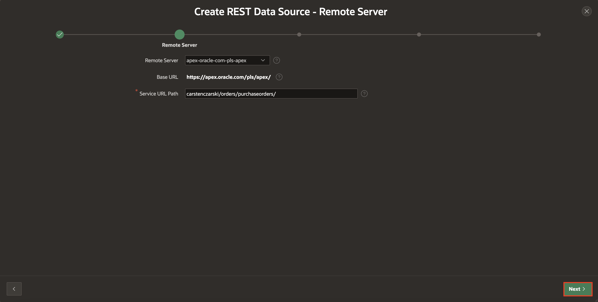

8. Under **Create REST Data Source - Settings**, leave as default and click **Next**.

    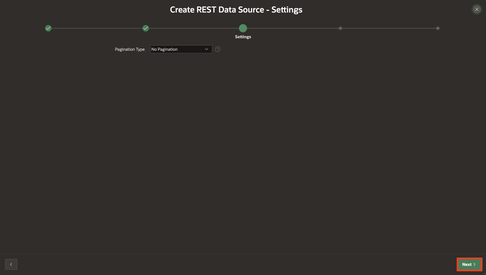

9. Click **Discover**.

    


10. Click **Create REST Data Source**. 

    

11. Navigate to your **Application ID**.

    

12. Click **Create Page**.

    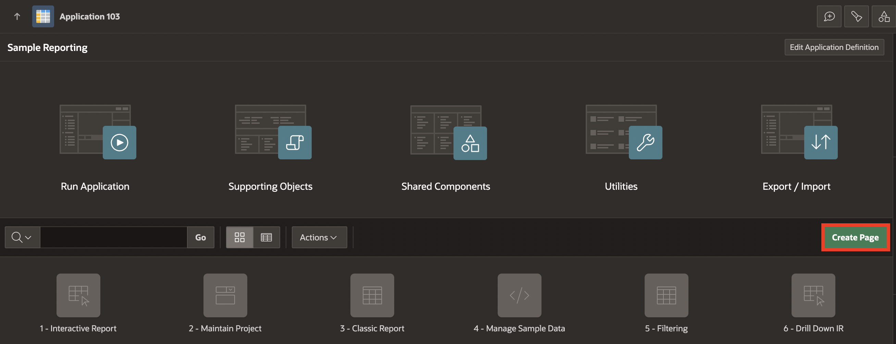

13. Select **Blank Page**.

    

14. Enter/select the following:

    - Page Number: **16**

    - Name: **Purchase Orders**

    Click **Create Page**.

    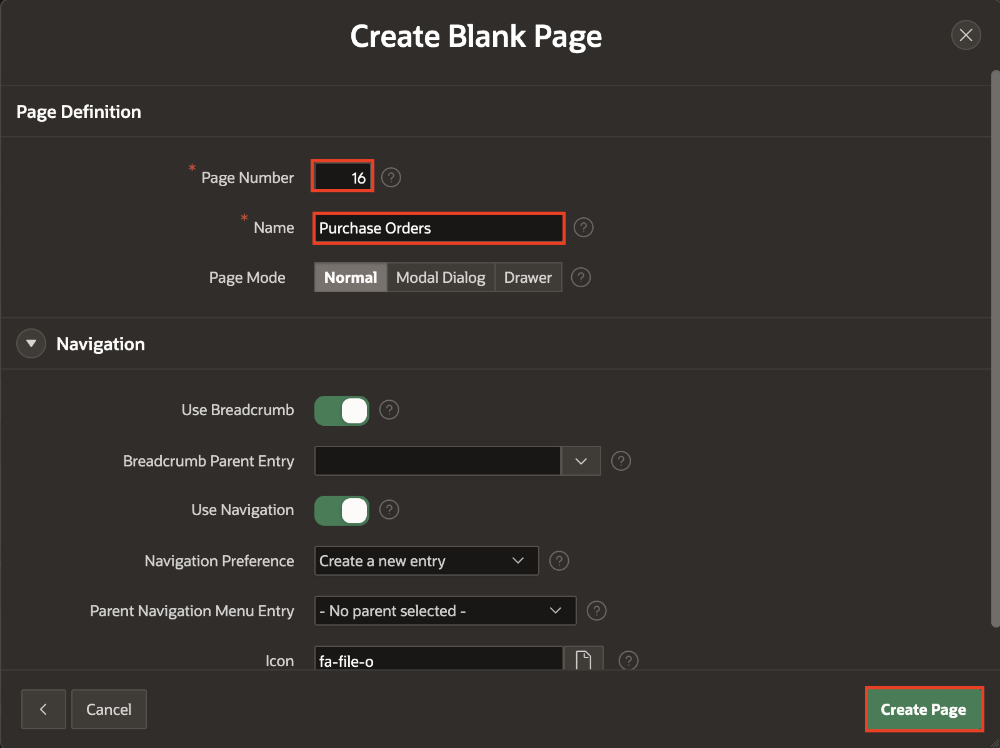

15. In the **Rendering** tab, right-click **Body** and select **Create Region**.

    

16. In the Property Editor, enter/select the following:

    - Under Identification:

        - Name: **Purchase Orders**

        - Type: **Interactive Report**

    - Under Source:

        - Location: **REST Source**

        - REST Source: **Purchase Orders**

    

17. Click **Save and Run**. You will see that Interactive Report does contain the nested JSON elements, but they only appear in JSON format. This is because we only created a report on a REST Data Source, as in earlier APEX versions. We did not tell APEX anything about what to do with the PO_LINEITEMS array column from the data profile, so it's being returned in JSON format.

    

18. Now, go back to Page Designer, and look up the Nested Rows attribute within the Data Profile section.

19. Select **Purchase Orders** region, in the Property Editor, enter/select the following:

    - Data Profile > Nested Rows: **1. PO_LINEITEMS**

    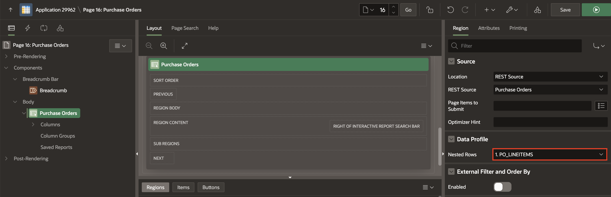

20. Click **Save and Run**. Now, watch how the region columns change. The PO_LINEITEMS column (which referenced the JSON fragment) goes away, and the individual nested columns are added now. Before running the page again, consider cleaning up some of the (unwanted) other columns, then run the page again.

    

## Task 5: Load Data using Data loading Definitions

A Data Load Definition comprises a Data Load Definition, Data Profile, and Data Profile Columns. The Data can be loaded to an existing table in your schema or a collection. For each data profile column, you can define SQL Expression, SQL Query, Lookups, or Transformation Rules. These definitions are used in the Native Data Loading page process type.

In this task, you will create a Data Load Definition and use it to load data into a table. This is an essential skill when you need to import large datasets into your application for analysis or reporting.

1. Navigate to **Sample Reporting** application and select **Shared Components**.

    

2. Under **Other Components**, select **Data Load Definitions**.

    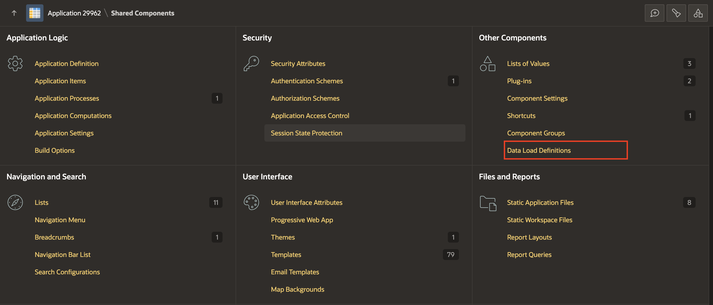

3. Select **Create**.

    

4. In **Create Data Load - Method** dialog, click **Next**.

    

5. In **Create Data Load** dialog, enter/select the following:

      - Name: **Data loading**

      - Table Name: **EBA\_DEMO\_IR\_EMP**

   Click **Next**.

    

6. Download the .xlsx  file from **[here](files/emp.xlsx)** and upload it. Click **Next**.

    

7. Click **Create Data Load**.

    

8. Navigate to **SQL Workshop** and select **Object Browser**.

    

9. Under **Tables**, select Table **EMP\_DEMO\_IR\_EMP** and click **Data** to view the loaded data using .xlxs file.

    

10. Now, navigate to **App Builder** and select **Sample Reporting** application.

    

11. Click **Create Page**.

    

12. Select **Data Loading**.

    

13. In **Create Data Loading** dialog, enter/select the following:

    - Under Page Definition:

        - Page Number: **44**

        - Name :**Data Loading**

    - Data Load Attributes > Data Load: **Data Loading**

    Click **Create Page**.

    

14. Click **Save and Run Page**.

    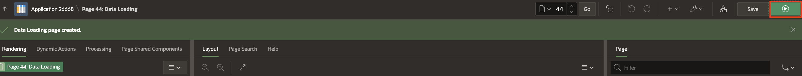

15. The new Data Load page appears.

    

16. Upload a sample file. Drag and Drop a file or click Choose File. A Preview page appears.

    

17. Click **Load Data**. The sample data is loaded into the target table with the **Merge** loading method.

## Summary

In this lab, you successfully created a RESTful data source in Oracle APEX and synchronized external data into a local table. You learned how to work with nested JSON data, using APEX’s built-in features to parse and display hierarchical information. The lab guided you through various tasks, including enabling REST services, creating a REST data source, and setting up synchronization schedules. By the end of this lab, you will be comfortable with integrating external REST APIs into Oracle APEX and managing complex JSON structures for practical use cases.

You may now **proceed to the next lab**.

## What's Next

In the upcoming hands-on lab, you will learn to integrate multi level authentication.

## Acknowledgements

- **Author** - Roopesh Thokala, Senior Product Manager; Ankita Beri, Product Manager
- **Last Updated By/Date** - Ankita Beri, Product Manager, November 2024
