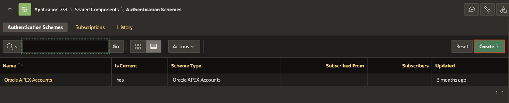
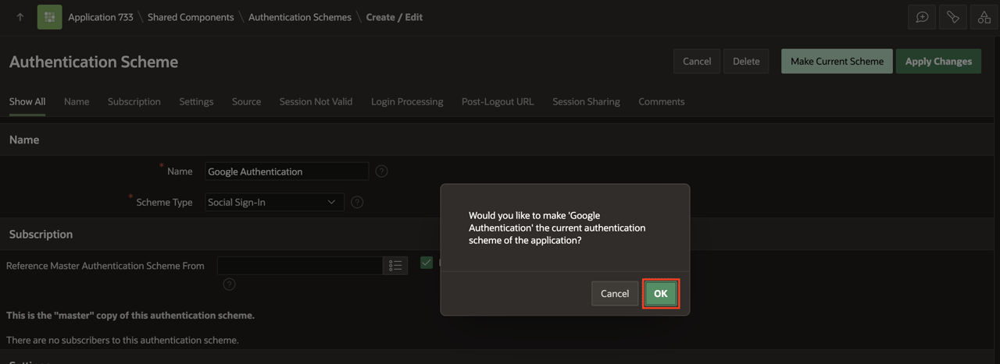
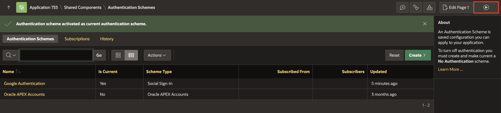
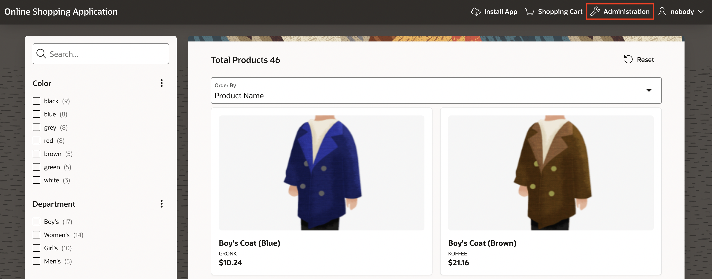
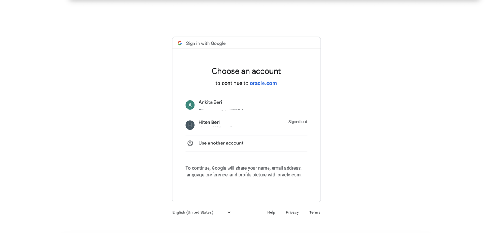
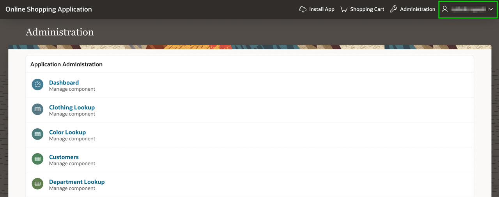

# Implement Security in your Application

## Introduction

Application security is very important for the majority of applications. You must ensure that users enter valid credentials. Generally, username and password (Authentication) and the logged-in user has appropriate rights within the application (Authorization).

Estimated Time: 20 minutes

### Downloads

- Did you miss out on trying the previous labs? Don't worry! You can download the application from **[here](files/online-shopping-cart-10.sql)** and import it into your workspace. To run the app, please run the steps described in **[Get Started with Oracle APEX](https://livelabs.oracle.com/pls/apex/r/dbpm/livelabs/run-workshop?p210_wid=3509)** and **[Using SQL Workshop](https://livelabs.oracle.com/pls/apex/r/dbpm/livelabs/run-workshop?p210_wid=3524)** workshops.

## Task 1: Implement Social Sign In(Google) Authentication in Online Shopping Application.

 You create a Social Sign-in authentication scheme in this hands-on lab to enable Google Authentication.

 1. Log in to Google's developer [console](https://console.developers.google.com).

   *Note: If you are logging in to the Google developer console for the first time, you must check and click on AGREE AND CONTINUE*

2. Click Create Project.

    

3. In the New Project Screen, For Project Name: Enter **APEX Social SignIn** and Click **Create**.

    

4. Click the OAuth consent screen (from the left side menu), Select **External**, and Click **Create**

    

5. In the OAuth consent screen, Enter the following:

   Under **App Information** Section:

      - For Application name: Enter your **Application Name**

      - For User support email: Enter your **Email Address**

   Under **App Domain** Section:

      - For Application Homepage link: Enter your **Application Homepage link**

   Under **Authorized domains** Section:

      - Click **+ADD DOMAIN** and add your Authorized domain. For example, I added oracle.com

   Under **Developer contact information** Section:

     - For Email addresses: Enter your **Email Address**

    

    

   Click **Save and Continue**.

6. In Scopes, leave everything as default and Click **Save and Continue**.

    

7. In Test users, leave everything as default and Click **Save and Continue**.

    

8. Click **Credentials** (from left side menu). Now Click **+Create Credentials** and select **OAuth client ID**.

    

9. Enter the following:

     - For Application type: Select **Web Application**

     - For Name: Enter **APEX Social Authentication**

   Under Authorized redirect URLs, Click **+Add URl**

     - For URls 1: Enter https://apex.oracle.com/pls/apex/apex_authentication.callback

     Click **Create**.

    

10. You will get the Client ID and Client secret. Save these IDs. We will use them later.

    

11. Login to your APEX workspace and click **Workspace Utilities**.

    

12. Under **Workspace Utilities**, Select **Web Credentials**.

    

13. Click **Create**.

    

14. In the **Web Credentials** enter the following and click **Create**.
    Under **Attributes**:
    - For Name: Enter **Google SignIn**
    - For Authentication Type: sSelect **OAuth2 Client Credentials Flow**.
    - For Client ID or Username: Enter the **Client ID** you copied in **Step 10**.
    - For Client Secret or Password and Verify Client Secret or Password: Enter the **App Secret** you copied in **Step 10**.

    

14. Navigate to **App Builder** and select **Online Shopping Application**.

    

15. Click **Shared Components**.

    

16. Under **Security**, Select **Authentication Schemes**.

    

17. In the **Authentication Schemes** page, click **Create**.

    

18. Under **Create Authentication Scheme** Page, leave the settings to default and click **Next**.

    

19. In the **Authentication Scheme**, Enter the following:
    Under **Name**:
    - For **Name**, Enter **Google Authentication**.
    - For **Scheme Type**, select **Social Sign-In**.  

    Under **Settings**:
    - For Credential Store: Enter **Google SignIn**.
    - For Authentication Provider: Select **Google**.
    - For Scope: Enter **profile,email**.
    - For Username: Enter **name**.
    - Additional User Attributes: Enter **email, name**

    Click **Create Authentication Scheme**

    

20. Notice that a new **Authentication Scheme** you created is displayed. Click **Google Authentication** to make it a current authentication.

    

21. Click **Make as Current** and then Click **Ok**.

    

    

22. Click **Run**.

    

23. In the **User Interface**, click **Administration**.

    

24. Log in to the application using your **Google Credentials**.

    

25. You are now logged in to the **Online Shopping Application**. Check the user name on the top right of the **Navigation Bar**.  

    

## Summary
You now know how to create a Social Sign-in authentication scheme to enable Google Authentication. You may now **proceed to the next lab**.

## What's Next
In the next hands-on lab, you will learn to create and customize a Calendar page, a Tree page and a Map page with a custom background.

## Acknowledgements
- **Author** - Ankita Beri, Product Manager
- **Last Updated By/Date** - Ankita Beri, Product Manager, January 2024
