# Implement Security in your Application

## Introduction

In modern web applications, ensuring security is a critical requirement. Oracle APEX provides a robust framework for implementing authentication and authorization mechanisms to safeguard applications from unauthorized access. In this lab, you will learn to implement social sign-in options, specifically using Oracle Identity Access Management (IAM) and Google Authentication, to allow users to securely log in to the Online Shopping Application. Additionally, you will explore how to enable multiple authentication schemes for flexibility and convenience.

This hands-on lab demonstrates how to integrate these features step-by-step, ensuring a secure and user-friendly experience for application users.

Estimated Time: 20 minutes

### Objectives

In this lab, you will:

- Configure Oracle IAM authentication for an application.

- Implement Google Authentication for seamless social sign-in.

- Enable multiple authentication schemes within an Oracle APEX application.

## Task 1: Configure Oracle IAM Authentication in Online Shopping Application

1. Log in to your Oracle cloud console.

2. Navigate to **Identity & Security**.

    

3. Under **Identity**, select **Domains**.

    

4. Select your **Domain**.

    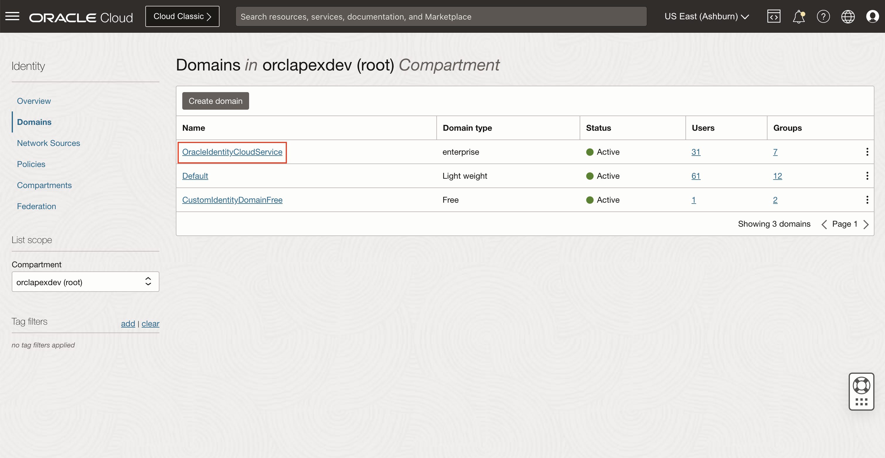

5. Under **Identity Domain**, navigate to **Integrated applications** and click **Add application**.

    

6. Select **Confidential Application** and click **Launch Workflow**.

    

7. Enter a **Name** for your application.

    

8. Under **Authentication and authorization** , enable **Enforce grants as authorization** and click **Next**.

    

9. Under **Client configuration**, enter/select the following:

    - Under Authorization:

        - Allowed grant types: Enable **Authorization code** (This will be used later to control access to the Oracle APEX application)

        - Redirect URL: **https://apex.oracle.com/pls/apex/apex_authentication.callback**

        - Post-logout redirect URL: **https://apex.oracle.com/pls/apex/r/<workspace_name>/<application name>/login**

    Click **Next**.

    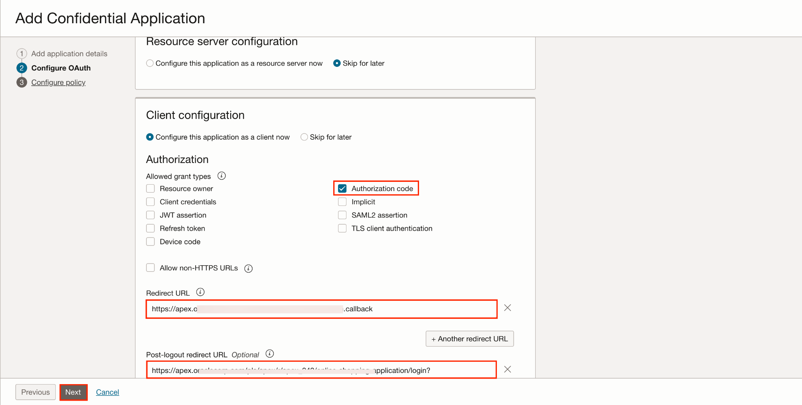

10. Under **Configure policy**, leave as default and click **Finish**.

    

11. Click **Activate** and **Activate application**.

    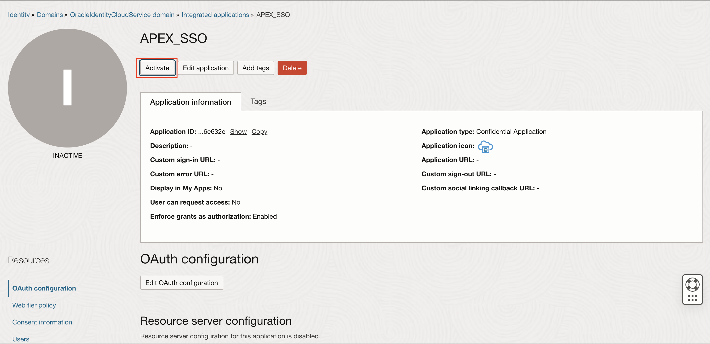

    

12. Copy the *Client ID* and *Client secret* which we will use in the configuration on Oracle APEX.

    

13. Now, log in to your Oracle APEX workspace and navigate to **Workspace Utilities**.

    

14. Select **Web Credentials**.

    

15. Under **Web Credentials**, click **Create**.

    

16. Enter/select the following information:

    - Name: **OCI IAM Credentials**

    - Authentication Type: **Basic Authentication**

    - Client ID or Username: Enter Client ID copied in **step 12**.

    - Client Secret or Password: Enter Client Secret copied in **step 12**.

    - Verify Client Secret or Password: Enter Client Secret copied in **step 12**.

    Click **Create**.

    

17. Assign a user to this application. Navigate back to your Oracle cloud console, select **Users** and click **Assign users**.

    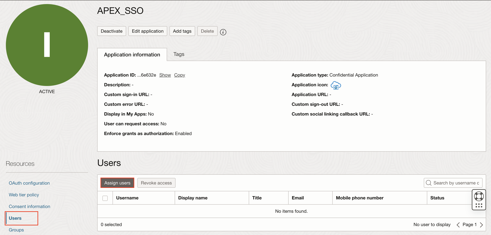

    

18. Also, under **Groups**, assign the group to the user you created.

19. Add a user *First name, Last name and Email* and click **Assign**.

    

20. Log in to your Oracle APEX workspace and select **Online Shopping Application**.

    

21. Click **Shared Components**. Under Security, click **Authentication Schemes**.

    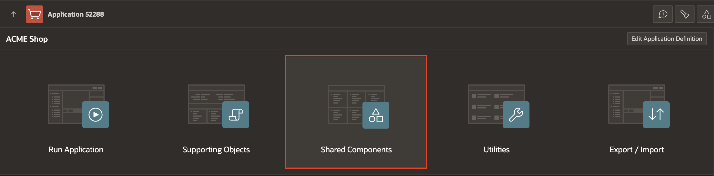

    

22. Click **Create**.

    

23. Enter/select the following information:

    - Name: **IAM**

    - Scheme Type: **Social Sign-In**

    - Credential Store: **OCI IAM Credentials**

    - Discovery URL: Enter the OpenID Connect provider's discovery URL. For example: https://[idcs-service-url]/.well-known/openid-configuration/.

    - Scope: **profile, email, groups**

    - Username: **#sub#**

    - Additional User Attributes: **groups**

    Click **Create Authentication Scheme**.

    

## Task 2: Implement Social Sign In(Google) Authentication in Online Shopping Application

 You create a Social Sign-in authentication scheme in this hands-on lab to enable Google Authentication.

1. Log in to Google's developer [console](https://console.developers.google.com).

    **Note**: If you are logging in to the Google developer console for the first time, you must check and click **AGREE AND CONTINUE**.

2. Click **Create Project**.

    

3. In the **New Project** Screen, for Project Name: Enter **APEX Social SignIn** and click **Create**.

    

4. Click the **OAuth consent screen** (from the left side menu), select **External**, and click **Create**

    

5. In the OAuth consent screen, enter/select the following:

    - Under **App Information**:

        - Application name: Enter your **Application Name**

        - User support email: Enter your **Email Address**

    - App Domain  > Application Homepage link: Enter your **Application Homepage link**

    - Authorized domains > Click **+ADD DOMAIN**: Add your Authorized domain. For example, I added oracle.com

    - Developer contact information > Email addresses: Enter your **Email Address**

       Click **Save and Continue**.

    

    

6. Under **Scopes**, leave everything as default and click **Save and Continue**.

    

7. Under **Test users**, leave everything as default and click **Save and Continue**.

    

8. Click **Credentials** (from left side menu). Click **+Create Credentials** and select **OAuth client ID**.

    

9. Enter/select the following:

    - Application type: **Web Application**

    - Name: **APEX Social Authentication**

    - Under Authorized redirect URLs, click **+Add URl**

        - URls 1: **https://apex.oracle.com/pls/apex/apex_authentication.callback**

    Click **Create**.

    

10. You will get the *Client ID* and *Client secret*. Save these IDs. You will use them later.

    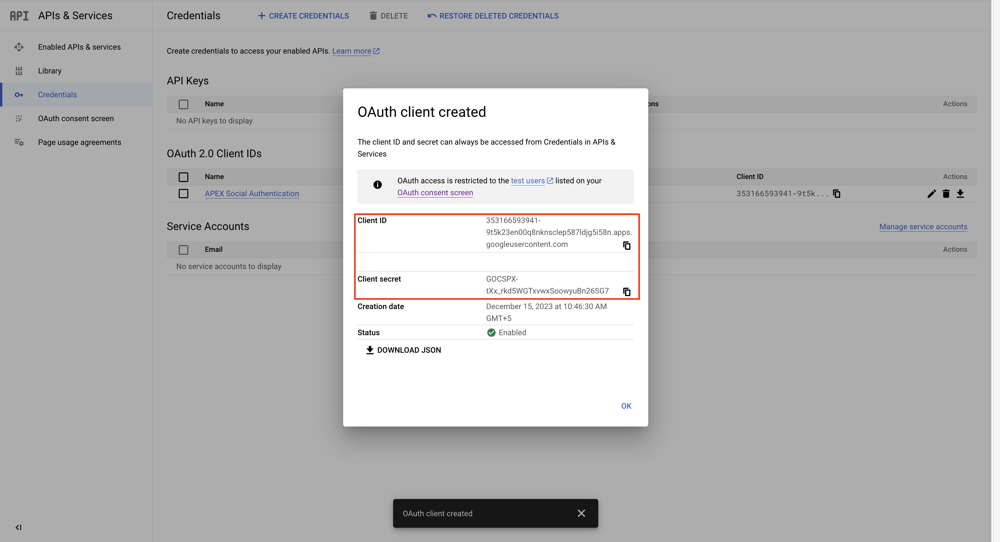

11. Login to your APEX workspace and click **Workspace Utilities**.

    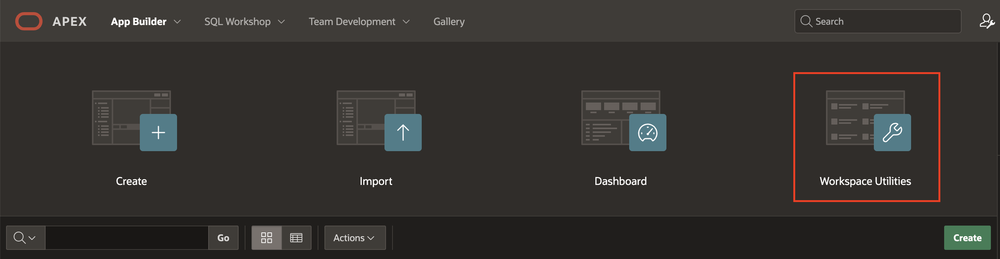

12. Under **Workspace Utilities**, select **Web Credentials**.

    

13. Click **Create**.

    

14. In the **Web Credentials** enter/select the following:

    - Under **Attributes**:

        - Name: **Google SignIn**

        - Authentication Type: **OAuth2 Client Credentials**.

        - Client ID or Username: Enter the **Client ID** you copied in **Step 10**.

        - Client Secret or Password and Verify Client Secret or Password: Enter the **App Secret** you copied in **Step 10**.

    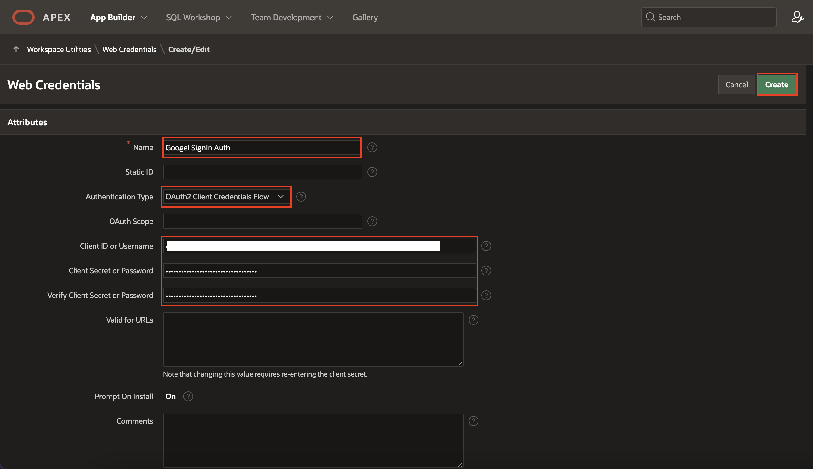

15. Click **Create**.

16. Navigate to **App Builder** and select **Online Shopping Application**.

    

17. Click **Shared Components**.

    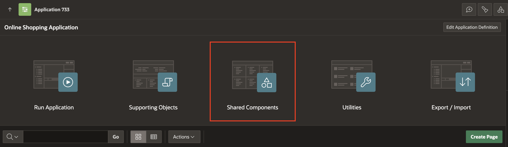

18. Under **Security**, select **Authentication Schemes**.

    

19. In the **Authentication Schemes** page, click **Create**.

    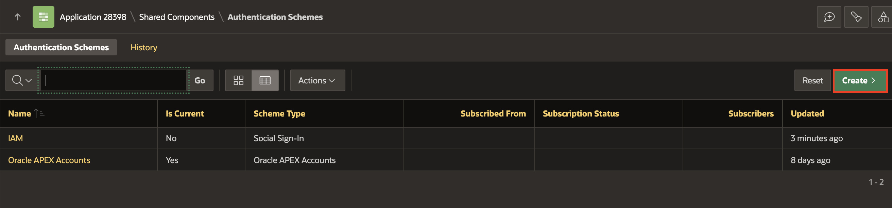

20. Under **Create Authentication Scheme** page, leave the settings to default and click **Next**.

    

21. In the **Authentication Scheme**, enter/select the following:

    - Under Name:

        - Name: **Google**

        - Scheme Type: **Social Sign-In**

    - Under Settings:

        - Credential Store: **Google SignIn**

        - Authentication Provider: **Google**

        - Scope: **profile,email**

        - Username: **email,name,roles**

        Click **Create Authentication Scheme**.

    

22. Click **Google** authentication, under **Login Processing**, select **Enabled** for **Switch in Session**. Do the same for **OCI** authentication as well.

    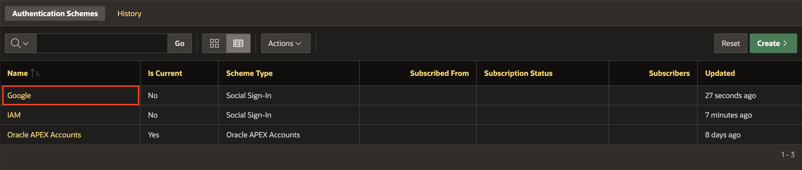

    

## Task 3: Enable Multiple Authentication in Online Shopping Application

Providing multiple authentication options improves the flexibility and usability of your application. In this task, you will enhance the Online Shopping Application's login page by implementing a multi-authentication approach. Users will be able to choose between IAM authentication and Google sign-in. You will also customize the login page with buttons for each authentication type and apply styling for a polished user experience.

1. In your **Online Shopping Application**, navigate to **9999 - Login Page**.

    

2. Right-click **Online Shopping Application** region, select **Create Sub-region**.

    

3. In the Property Editor, enter/select the following:

    - Identification > Name: **Multi Authentication**

    - Appearance > Template Options: Click **Use Template Defaults**

        - Header: **Hidden**

        Click **OK**

    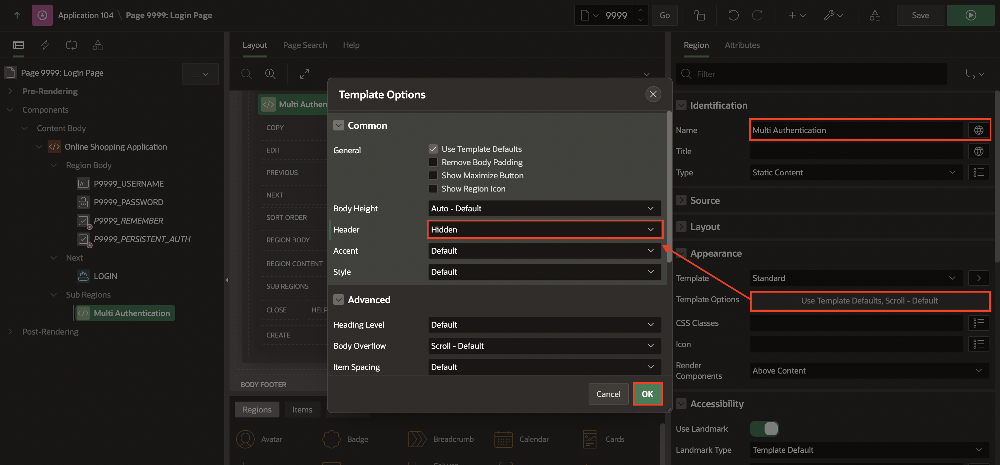

4. Right-click **Multi Authentication** sub-region, select **Create Button**.

    

5. In the Property Editor, enter/select the following:

    - Under Identification:

        - Button Name: **IAM_Login**

        - Label: **IAM Authentication**

    - Under Appearance:

        - Button Template: **Text with Icon**

        - Template Options > Use Template Defaults: Width > **Stretch**

        Click **OK**

        - Icon: **fa-oracle-o**

    - Under Behavior:

        - Action: **Redirect to Page in this Application**

        - Target: Click **No Linked Defined**

            - Target > Page: **10000**

            - Advanced > Request: **APEX_AUTHENTICATION=IAM**

            Click **OK**

    

6. Right-click **Multi Authentication** sub-region, select **Create Button**.

    

7. In the Property Editor, enter/select the following:

    - Under Identification:

        - Button Name: **Google_SignIn**

        - Label: **Google Sign In**

    - Layout > Start New Row: **Toggle Off**

    - Under Appearance:

        - Button Template: **Text with Icon**

        - Template Options > Use Template Defaults: Width > **Stretch**

        Click **OK**

        - Icon: **fa-google**

    - Under Behavior:

        - Action: **Redirect to Page in this Application**

        - Target: Click **No Linked Defined**

            - Target > Page: **10000**

            - Clear/Reset > Clear Cache: **APEX_AUTHENTICATION=Google**

            Click **OK**

    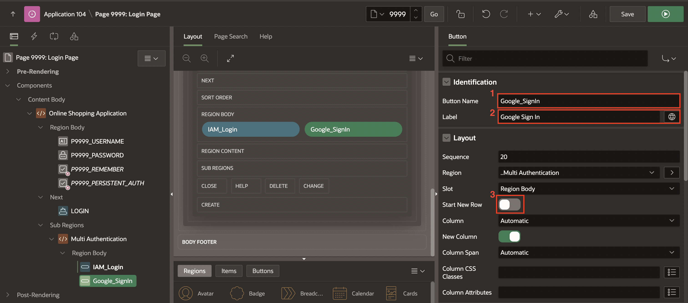

    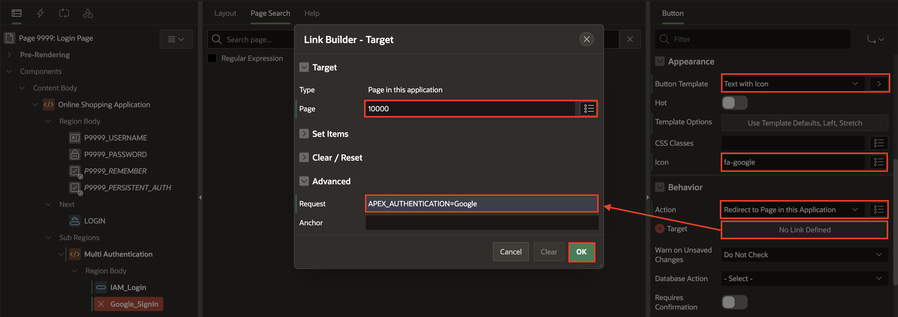

8. Navigate to **Page 9999: Login Page**, update the following:

    - Inline: Copy and paste the below CSS

        ```
        <copy>
        span.t-Icon.t-Icon--left.fa.fa-oracle-o {
        color: red;
        }
        span.t-Icon.t-Icon--left.fa.fa-google {
        color: mediumslateblue;
        }
        </copy>
        ```

    

9. Click **Save and Run**.

    > **Note:** If you get reader rights error while clicking on any authentication button, navigate to **User Interface Attributes** in shared components. Select **Security** tab and update **Authorization Scheme** to **- No application authorization required**.

    

## Summary

In this lab, you have successfully implemented secure authentication mechanisms for your Oracle APEX application
You now know how to create a Social Sign-in authentication scheme to enable Google and IAM Authentication. You may now **proceed to the next lab**.

## What's Next

In the next hands-on lab, you will learn to create and customize a Calendar page, a Tree page and a Map page with a custom background.

## Acknowledgements

- **Author** - Ankita Beri, Product Manager
- **Last Updated By/Date** - Ankita Beri, Product Manager, November 2024
