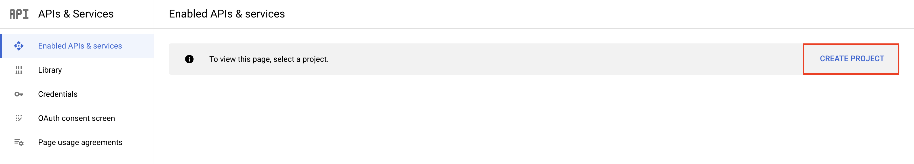
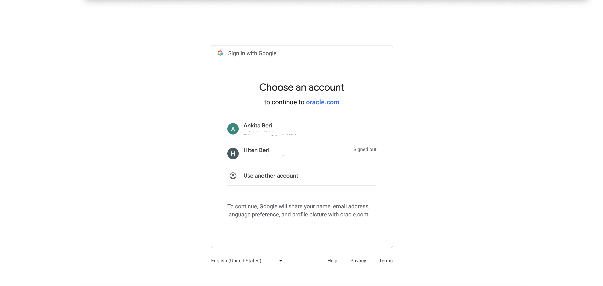
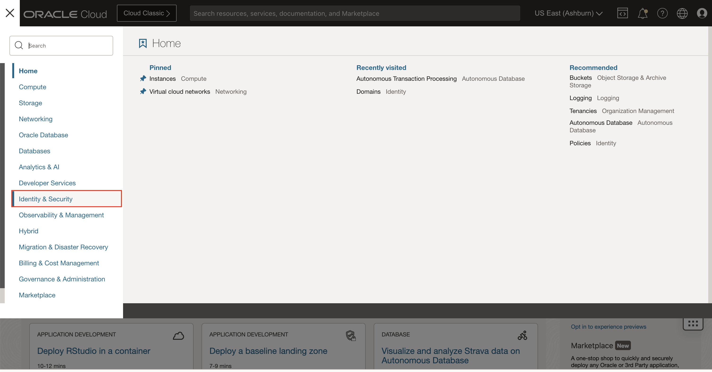
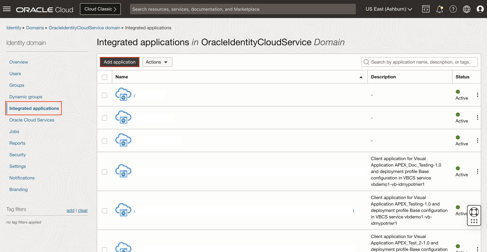
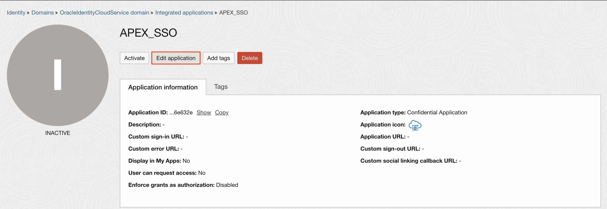
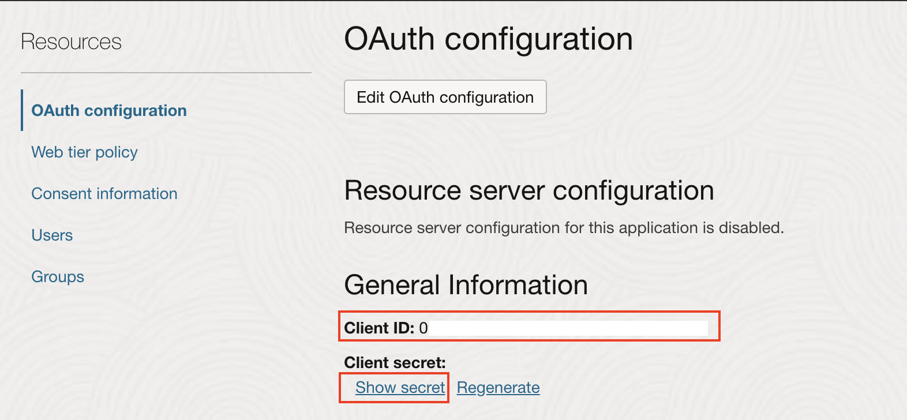
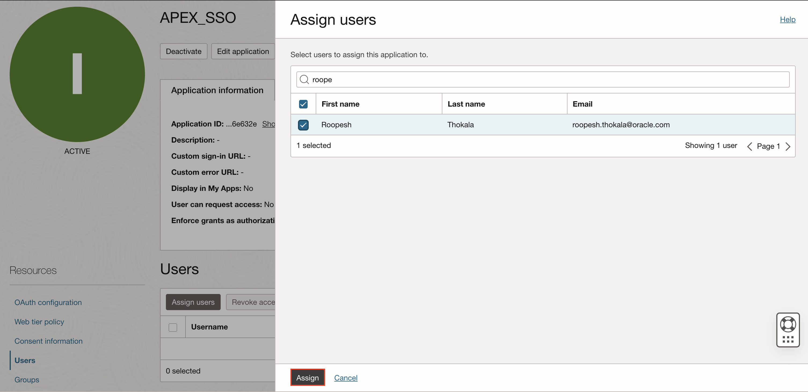
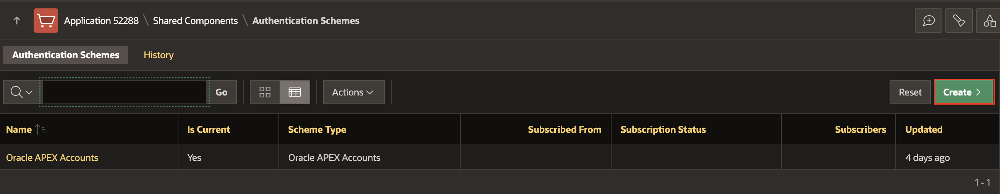

# Implement Security in your Application

## Introduction

Application security is very important for the majority of applications. You must ensure that users enter valid credentials. Generally, username and password (Authentication) and the logged-in user has appropriate rights within the application (Authorization).

Estimated Time: 20 minutes

### Downloads

- Did you miss out on trying the previous labs? Don't worry! You can download the application from **[here](files/online-shopping-cart-10.sql)** and import it into your workspace. To run the app, please run the steps described in **[Get Started with Oracle APEX](https://livelabs.oracle.com/pls/apex/r/dbpm/livelabs/run-workshop?p210_wid=3509)** and **[Using SQL Workshop](https://livelabs.oracle.com/pls/apex/r/dbpm/livelabs/run-workshop?p210_wid=3524)** workshops.

## Task 1: Implement Social Sign In(Google) Authentication in Online Shopping Application

 You create a Social Sign-in authentication scheme in this hands-on lab to enable Google Authentication.

1. Log in to Google's developer [console](https://console.developers.google.com).

    **Note**: If you are logging in to the Google developer console for the first time, you must check and click **AGREE AND CONTINUE**.

2. Click **Create Project**.

    

3. In the **New Project** Screen, for Project Name: Enter **APEX Social SignIn** and click **Create**.

    

4. Click the **OAuth consent screen** (from the left side menu), select **External**, and click **Create**

    

5. In the OAuth consent screen, enter/select the following:

    - Under **App Information**:

        - Application name: Enter your **Application Name**

        - User support email: Enter your **Email Address**

    - App Domain  > Application Homepage link: Enter your **Application Homepage link**

    - Authorized domains > Click **+ADD DOMAIN**: Add your Authorized domain. For example, I added oracle.com

    - Developer contact information > Email addresses: Enter your **Email Address**

       Click **Save and Continue**.

    

    

6. Under **Scopes**, leave everything as default and click **Save and Continue**.

    

7. Under **Test users**, leave everything as default and click **Save and Continue**.

    

8. Click **Credentials** (from left side menu). Click **+Create Credentials** and select **OAuth client ID**.

    

9. Enter/select the following:

    - Application type: **Web Application**

    - Name: **APEX Social Authentication**

    - Under Authorized redirect URLs, Click **+Add URl**

        - URls 1: **https://apex.oracle.com/pls/apex/apex_authentication.callback**

    Click **Create**.

    

10. You will get the *Client ID* and *Client secret*. Save these IDs. You will use them later.

    

11. Login to your APEX workspace and click **Workspace Utilities**.

    

12. Under **Workspace Utilities**, select **Web Credentials**.

    

13. Click **Create**.

    

14. In the **Web Credentials** enter/select the following:

    - Under **Attributes**:

        - Name: **Google SignIn**

        - Authentication Type: **OAuth2 Client Credentials**.

        - Client ID or Username: Enter the **Client ID** you copied in **Step 10**.

        - Client Secret or Password and Verify Client Secret or Password: Enter the **App Secret** you copied in **Step 10**.

    

15. Click **Create**.

16. Navigate to **App Builder** and select **Online Shopping Application**.

    

17. Click **Shared Components**.

    

18. Under **Security**, Select **Authentication Schemes**.

    

19. In the **Authentication Schemes** page, click **Create**.

    

20. Under **Create Authentication Scheme** page, leave the settings to default and click **Next**.

    

21. In the **Authentication Scheme**, enter/select the following:

    - Under Name:

        - Name: **Google Authentication**.

        - Scheme Type: **Social Sign-In**.

    - Under Settings:

        - Credential Store: **Google SignIn**.

        - Authentication Provider: **Google**.

        - Scope: **profile,email**.

        - Username: Enter **name**.

        - Additional User Attributes: Enter **email, name, roles**

        Click **Create Authentication Scheme**

    

22. Click **Run**.

    

23. In the **User Interface**, click **Administration**.

    

24. Log in to the application using your **Google Credentials**.

    

25. You are now logged in to the **Online Shopping Application**. Check the user name on the top right of the **Navigation Bar**.

    

## Task 2: Implement Social Sign In(IAM) Authentication in Online Shopping Application

1. Log in to your Oracle cloud console.

2. Navigate to **Identity & Security**.

    

3. Under **Identity**, select **Domains**.

    

4. Select your **Domain**.

    

5. Under **Identity Domain**, navigate to **Integrated applications** and click **Add application**.

    

6. Select **Confidential Application** and click **Launch Workflow**.

    

7. Enter a **Name** for your application and click **Next**.

    

8. Select **Authorization code** as the **Allowed Grant Type** and click **Next**.

9. For **Redirect URL**, enter: **https://apex.oracle.com/pls/apex/apex_authentication.callback**

10. For **Post-logout redirect URL**, enter: **https://apex.oracle.com/pls/apex/r/<workspace_name>/<application name>/login**

11. Click **Next**.

    

12. Under **Configure policy**, leave as default and click **Finish**.

    

13. Click **Edit application** and select **Enforce grant as Authorization** under **Authentication and Authorization** (This will be used later to control access to the Oracle APEX application).

    

    

14. Click **Activate** and **Activate application**.

    

    

15. Copy the *Client ID* and *Client secret* which we will use in the configuration on Oracle APEX.

    

16. Now, log in to your Oracle APEX workspace and navigate to **Workspace Utilities**.

17. Select **Web Credentials**.

    

18. Under **Web Credentials**, click **Create**.

    

19. Enter/select the following information:

    - Name: **OCI IAM Credentials**

    - Authentication Type: **Basic Authentication**

    - Client ID or Username: Enter Client ID copied in **step 15**.

    - Client Secret or Password: Enter Client Secret copied in **step 15**.

    - Verify Client Secret or Password: Enter Client Secret copied in **step 15**.

    Click **Create**.

    

20. Assign a user to this application. Navigate back to your Oracle cloud console, select **Users** and click **Assign users**.

    

    

21. Also, under **Groups**, assign the group to the user you created.

22. Add a user *First name, Last name and Email* and click **Assign**.

    

23. Log in to your Oracle APEX workspace and select **Online Shopping Application**.

24. Click **Shared Components**. Under Security, click **Authentication Schemes**.

    

    

25. Click **Create**.

    

26. Enter/select the following information:

    - Name: **OCI IAM Authentication Scheme**

    - Scheme Type: **Social Sign-In**

    - Credential Store: **OCI IAM Credentials**

    - Discovery URL: Enter the OpenID Connect provider's discovery URL. For example: https://[idcs-service-url]/.well-known/openid-configuration/.

    - Scope: **profile, email, groups**

    - Username: **#sub#**

    - Additional User Attributes: **groups**

    Click **Create Authentication Scheme**.

    

## Task 3: Enable Multiple Authentication in Online Shopping Application

1. In your **Online Shopping Application**

## Summary

You now know how to create a Social Sign-in authentication scheme to enable Google Authentication. You may now **proceed to the next lab**.

## What's Next

In the next hands-on lab, you will learn to create and customize a Calendar page, a Tree page and a Map page with a custom background.

## Acknowledgements

- **Author** - Ankita Beri, Product Manager
- **Last Updated By/Date** - Ankita Beri, Product Manager, November 2024
