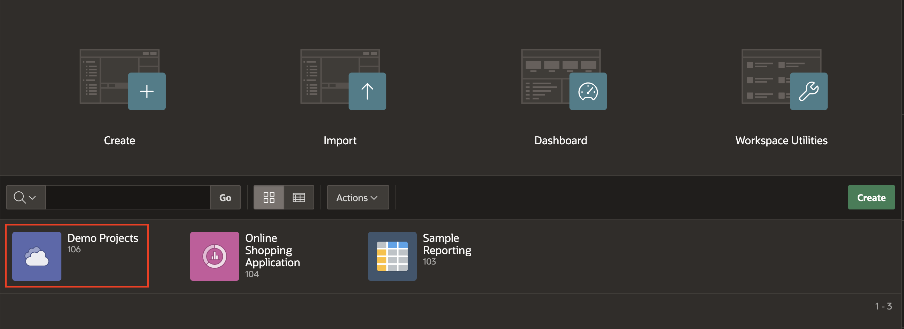
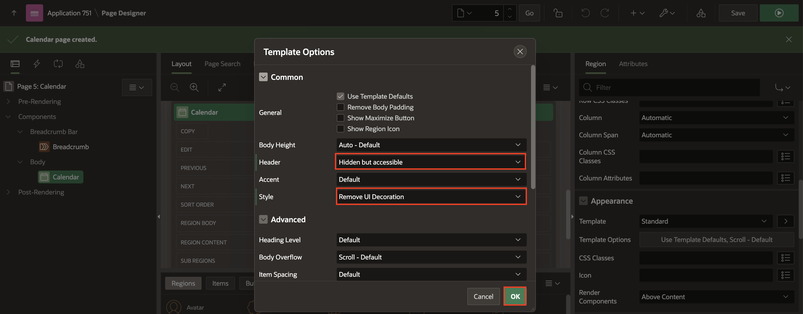
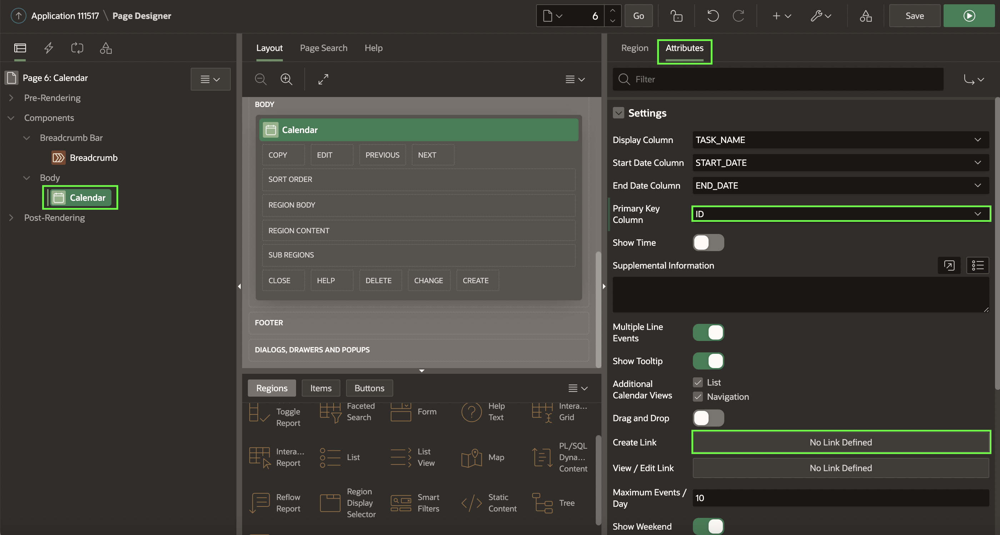
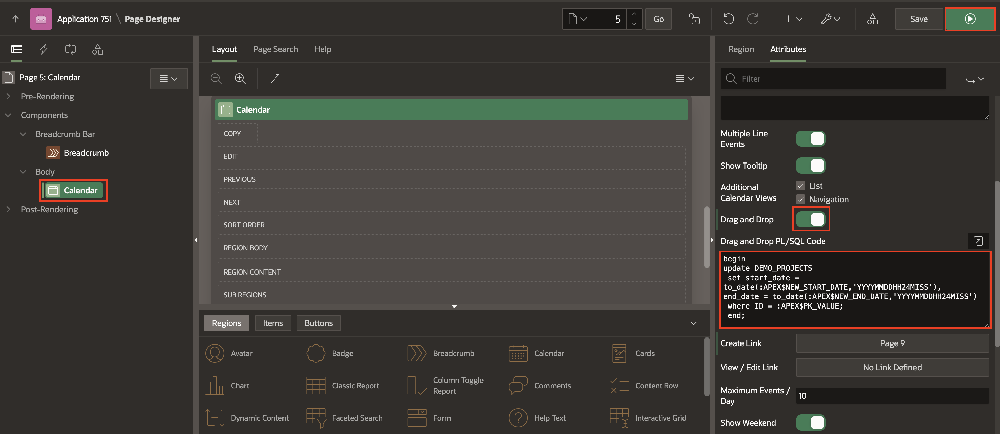
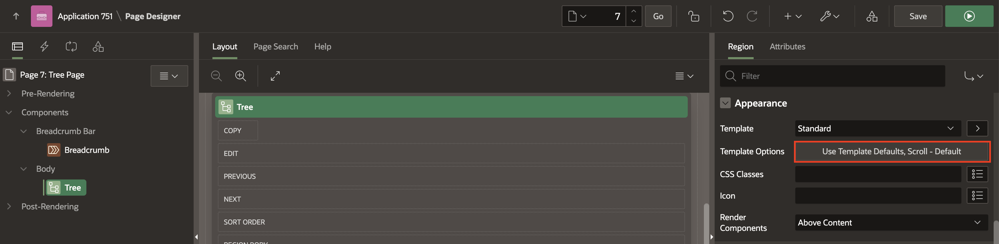
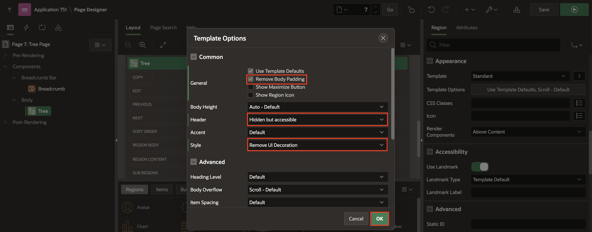

# Add additional pages to your Application

## Introduction

In this Hands-on-lab, you will add Calendars, Charts, Tree pages and Maps to Demo Projects application and to Online Shopping Application.

Estimated Time: 20 minutes

### Downloads

- Did you miss out on trying the previous labs? Don’t worry! You can download the application from **[here](files/demo-projects4.sql)** and import it into your workspace. To run the app, please run the steps described in **[Get Started with Oracle APEX](https://apexapps.oracle.com/pls/apex/r/dbpm/livelabs/run-workshop?p210_wid=3509)** and **[Using SQL Workshop](https://apexapps.oracle.com/pls/apex/r/dbpm/livelabs/run-workshop?p210_wid=3524)** workshops.

## Task 1: Create a Calendar

1. Navigate to **App Builder** and in the **Home Page**, click **Demo Projects**. application.

    

    

2. In the application home page, click **Create Page**.

    

3. Select **Calendar** page type.

    

4.  In the **Create Calendar** enter the following and click **Next**.

    Under **Page Definition**:
    - For **Name**, Enter **Calendar**.

    Under **Data Source**:
    - For **Table/View Name**, select **DEMO_PROJECTS**.

    Under **Navigation**:
    - For **Breadcrumb** and **Navigation**, Set it to **Yes**.

    

5. In the **Create Calendar** page, enter the following and click **Create Page**.
    - For **Display Column**, enter **TASK_NAME**.
    - For **Start Date Column**, enter **START_DATE**.
    - For **End Date Column**, enter **END_DATE**.

    

6. Click **Save** and **Run Page**. Log in to the application with your credentials.

7. In the Developer Toolbar, click **Edit Page \<n\>**.

    

8. The Calendar page displays the **region title Calendar**, and also has a border around the region. In the Rendering tree, locate the Calendar region. Click **Calendar**. In the **Property Editor**, under **Appearance**, click the **Template Options** button.

    

9. In the Template Options dialog, input the following:

    - Header - select **Hidden but accessible**  
    
    - Style - select **Remove UI Decoration**  
    
    Click **OK**. Then **Save** and **Run** the runtime environment to see the changes.

    

## Task 2: Create a Form page on DEMO_PROJECTS Tables.

In this Lab, you will create a Form Page on DEMO_PROJECTS Tables, then in the next labs, you will link the form to the Calendar Page.

1. Navigate to **App Builder** and in the **Home Page**, click **Demo Projects**. application. Then, click **Create Page**.

 

2. Select **Form** page type.

  

3. In the **Create Form** enter the following and click **Next**.

    Under **Page Definition**:
    - For **Page Number**, Enter **9**.
    - For **Name**, Enter **Form on Projects**.
    - For **Page Mode**, Select **Modal Dialog**.

  Under **Data Source**:
    - For **Table/View Name**, select **DEMO_PROJECTS**.

  

4. In the **Create Form** page, enter the following and click **Create Page**.
    - For **Primary Key Column 1**, Select **ID (Number)**.

    

## Task 3: Customize the Calendar Page.

In this lab, You will link the form page you created in Task 2 with the Calendar page.

1. Navigate to **Calendar** in the runtime environment and then click **Page <n>**

  

2. You need to add the **Create** and **View / Edit** links. In the Rendering tree, locate and select the **Calendar** region. In the **Property Editor**, Click **Attributes**. Then, Under Settings, Select **ID** for **Primary Key** and then locate **Create Link** and click **No Link Defined**.

  

3. In the Link Builder – Create Link dialog, select **9** for Page, and enter **9** for **Clear Cache**. Click **OK**.

    

4. In the Property Editor, locate **View/Edit Link** and click **No Link Defined**.

5. In the Link Builder – View / Edit Link dialog, input the following:
    - Page - select **9**
    - Name - select **P9_ID**
    - Value - select **ID** or enter **&ID**.
    - Clear Cache - enter **9**  

  Click **OK**.

    

6. You can enable calendar drag and drop by using the component attribute **Drag and Drop**. Your SQL query must select a primary key column, and you must have set the Primary Key Column calendar attribute. Then enter the PL/SQL code to update the event row in the database in the Drag and Drop PL/SQL Code attribute. That PL/SQL code typically performs a SQL update on the database table - the bind variables **:APEX$PK\_VALUE.**, **:APEX$NEW\_START\_DATE** and **:APEX$NEW\_END\_DATE** contain the dragged events primary key value as well as the new start and new end timestamp.  

    Under **Settings**:
    - For **Drag and Drop**, Set it to **Yes**.
    - For **Drag and Drop PL/SQL Code**, Copy and paste the below code.
    ```
    <copy>
    begin
    update DEMO_PROJECTS
     set start_date = to_date(:APEX$NEW_START_DATE,'YYYYMMDDHH24MISS'),
    end_date = to_date(:APEX$NEW_END_DATE,'YYYYMMDDHH24MISS')
     where ID = :APEX$PK_VALUE;
     end;
     </copy>
     ```
      

7. Click **Save** and **Run Page**.
Notice that you can now drag and drop tasks in the calendar. In the Developer Toolbar, click **Application< n >**.

    

## Task 4: Create and Customize a Tree Page.

In this hands-on lab, you create the **Employee** Tree by first creating a **blank page** and then adding a **Tree region**.

1. First, create a blank page in the **Demo Projects** application. In the application home page, click **Create Page**.

  

2. Select **Blank Page**.

  

3. Enter **Tree Page** for **Name** and then Click **Create Page**.

  

4. Now, you create a **Tree region**. In the page designer, under Rendering, right-click **Body** and select **Create Region**.

  

5. In the property editor, enter the following:  
    Under **Identification**:
    - For **Name**, Enter **Tree**
    - For **Type**, Select **Tree**

    Under **Source**:
    - For **Type**, Select **SQL Query**
    - For **Sql Query**, Copy the following code and paste it.

    ```
    <copy>
    select case when connect_by_isleaf = 1 then 0
             when level = 1             then 1
             else                           -1
        end as status,
        level,
        "ENAME" as title,
        null as icon,
        "EMPNO" as value,
        "ENAME" as tooltip
     from EBA_DEMO_IR_EMP
     start with "MGR" is null
     connect by prior "EMPNO" = "MGR"
     order siblings by "ENAME"
    </copy>
    ```
    

6. In the page designer, navigate to **Appearance** and then click the **Template Options** button.

    

7. In the Template Options dialog:
    - General: Select the **Remove Body Padding** check box.
    - Header: Select **Hidden but accessible**
    - Style: Select **Remove UI Decoration**
    Click **OK**.

    

8. In the **Property Editor**, Select **Attributes**. Navigate to **Settings** and select / enter the following:
    - Node Label Column: **TITLE**
    - Node Value Column: **VALUE**
    - Hierarchy: **Not Computed**
    - Node Status Column: **STATUS**
    - Hierarchy Level Column: **LEVEL**
    - Tooltip: **Database Column**
    - Tooltip Column: **TOOLTIP**

    Then, click **Save** and **Run Page**.

    

9. The **Tree Page** is now displayed.

    

## Summary
You now know how to add Calendars and Tree pages.

You may now **proceed to the next lab**.

## Acknowledgments

- **Author** - Roopesh Thokala, Product Manager
- **Contributor** - Ankita Beri, Product Manager
- **Last Updated By/Date** - Roopesh Thokala, Product Manager, May 2022
