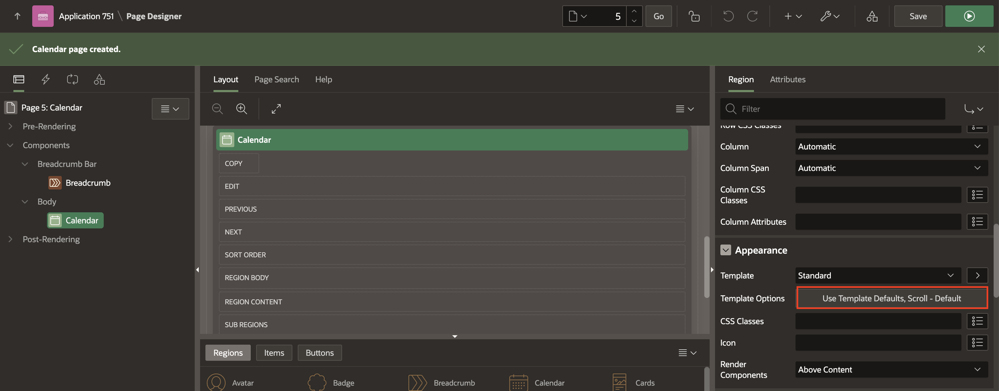
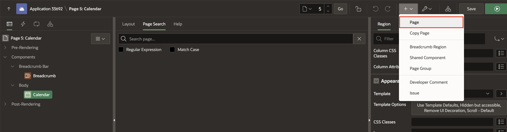
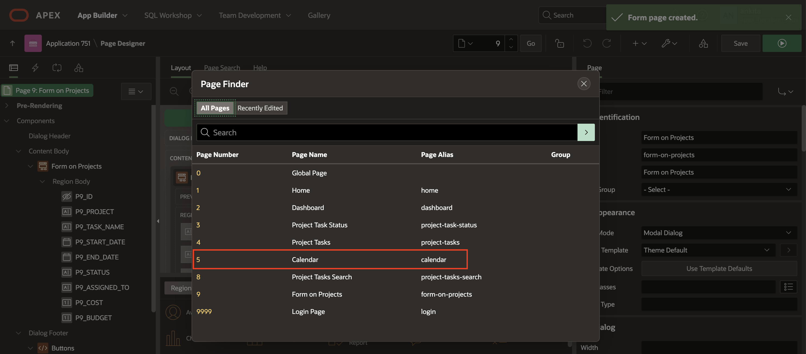
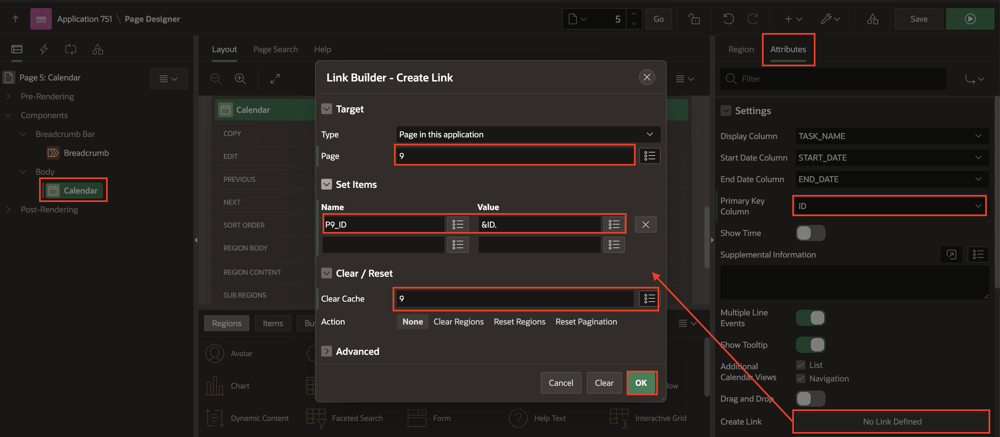
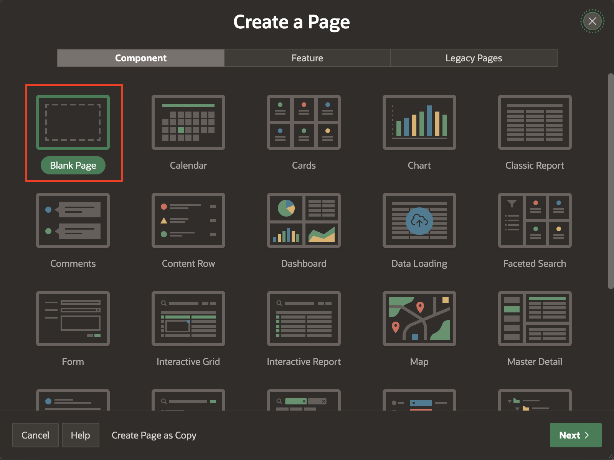
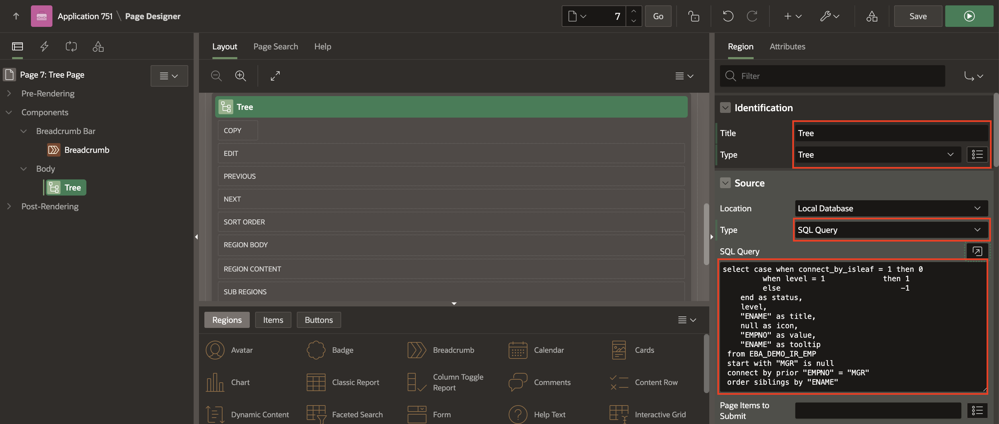

# Add additional pages to your Application

## Introduction

In this hands-on Lab, you add Calendars, Charts, Tree pages and Maps to the Demo Projects and Online Shopping applications.

Estimated Time: 20 minutes

### Downloads

- Did you miss out on trying the previous labs? Don't worry! You can download the Application from **[here](files/demo-projects-4.sql)** and import it into your workspace. To run the app, please run the steps described in **[Get Started with Oracle APEX](https://livelabs.oracle.com/pls/apex/r/dbpm/livelabs/run-workshop?p210_wid=3509)** and **[Using SQL Workshop](https://livelabs.oracle.com/pls/apex/r/dbpm/livelabs/run-workshop?p210_wid=3524)** workshops.

## Task 1: Create a Calendar

1. Navigate to **App Builder** and in the **Home Page**, click **Demo Projects**. application.

    

    

2. On the application home page, click **Create Page**.

    

3. Select **Calendar** page type.

    

4.  In the **Create Calendar**, Enter the following:

    Under **Page Definition**:
    - For **Name**, Enter **Calendar**.

    Under **Data Source**:
    - For **Table/View Name**, select **DEMO_PROJECTS**.

    Click **Next**.

    

5. In the **Create Calendar** page, Enter the following:
    - For **Display Column**, enter **TASK_NAME**.
    - For **Start Date Column**, enter **START_DATE**.
    - For **End Date Column**, enter **END_DATE**.

    Click **Create Page**

    

6. Click **Save** and **Run Page**. Log in to the Application with your credentials.

    

7. In the Developer Toolbar, click **Edit Page \<n\>**.

    

8. The Calendar page displays the **Region title Calendar** and has a border around the Region. In the Rendering tree, locate the Calendar region. Click **Calendar**. In the **Property Editor**, under **Appearance**, click the **Template Options** button.

    

9. In the Template Options dialog, input the following:

    - Header : Select **Hidden but accessible**  

    - Style : Select **Remove UI Decoration**  

    Click **OK**. Then, to see the changes, **Save** and **Run** the runtime environment.

    

## Task 2: Create a Form page on DEMO_PROJECTS Tables.

In this Lab, you create a Form Page on DEMO_PROJECTS Tables; then, you link the form to the Calendar Page in the following labs.

1. Navigate to Create(+) in the page designer and Select **Page**.

 

2. Select **Form**.

  

3. In the **Create Form**, Enter the following:

    Under **Page Definition**:

    - For **Page Number**, Enter **9**.

    - For **Name**, Enter **Form on Projects**.

    - For **Page Mode**, Select **Modal Dialog**.

  Under **Data Source**:

    - For **Table/View Name**, select **DEMO_PROJECTS**.

   Click **Next**.

  

4. In the **Create Form** page, Enter the following:

    - For **Primary Key Column 1**, Select **ID (Number)**.

    Click **Create Page**.

    

## Task 3: Customize the Calendar Page.

In this Lab, You link the form page you created in Task 2 with the Calendar page.

1. Navigate to Page Finder in the Page Designer and Select Page **5**.

  

2. You need to add the **Create** and **View / Edit** links. In the Rendering tree, locate and select the **Calendar** Region. In the **Property Editor**, Click **Attributes**. Then, under Settings, select **ID** for **Primary Key**, locate **Create Link**, and click **No Link Defined**.

3. In the Link Builder – Create Link dialog, select **9** for Page, and enter **9** for **Clear Cache**. Click **OK**.

4. In the Property Editor, locate **View/Edit Link** and click **No Link Defined**.

5. In the Link Builder – View / Edit Link dialog, input the following:
    - For Page: Select **9**

    - For Name: Select **P9_ID**

    - For Value : Select **ID** or Enter **&ID**.

    - For Clear Cache: Enter **9**  

  Click **OK**.

    

6. Use the component attribute **Drag and Drop**to enable the calendar to drag and drop. Your SQL query must select a primary key column, and you must have set the Primary Key Column calendar attribute. Then, enter the PL/SQL code to update the event row in the database in the Drag and Drop PL/SQL Code attribute. That PL/SQL code typically performs an SQL update on the database table - the bind variables **:APEX$PK\_VALUE.**, **:APEX$NEW\_START\_DATE** and **:APEX$NEW\_END\_DATE** contain the dragged events' primary key value and the new start and end timestamp.  

    Under **Settings**:

    - For **Drag and Drop**, Set it to **Yes**.

    - For **Drag and Drop PL/SQL Code**, Copy and paste the below code.
    ```
    <copy>
    begin
    update DEMO_PROJECTS
     set start_date = to_date(:APEX$NEW_START_DATE,'YYYYMMDDHH24MISS'),
    end_date = to_date(:APEX$NEW_END_DATE,'YYYYMMDDHH24MISS')
     where ID = :APEX$PK_VALUE;
     end;
     </copy>
     ```
      

7. Click **Save** and **Run Page**.
Notice that you can now drag and drop tasks in the calendar.

    

    

    

## Task 4: Create and Customize a Tree Page.

In this hands-on Lab, you create the **Employee** Tree by creating a **blank page** and adding a **Tree region**.

1. create a blank page in the **Demo Projects** application. Navigate to Create **(+)** and Select **Page**in the Page Designer.

  

2. Select **Blank Page**.

  

3. Enter **Tree Page** for **Name** and then Click **Create Page**.

  

4. Now, you create a **Tree region**. In the page designer, under Rendering, right-click **Body** and select **Create Region**.

  

5. In the property editor, enter the following:

    Under **Identification**:

    - For **Name**, Enter **Tree**

    - For **Type**, Select **Tree**

    Under **Source**:

    - For **Type**, Select **SQL Query**

    - For **Sql Query**, Copy the following code and paste it.

    ```
    <copy>
    select case when connect_by_isleaf = 1 then 0
             when level = 1             then 1
             else                           -1
        end as status,
        level,
        "ENAME" as title,
        null as icon,
        "EMPNO" as value,
        "ENAME" as tooltip
     from EBA_DEMO_IR_EMP
     start with "MGR" is null
     connect by prior "EMPNO" = "MGR"
     order siblings by "ENAME"
    </copy>
    ```
    

6. In the page designer, navigate to **Appearance** and then click the **Template Options** button.

    

7. In the Template Options dialog:
    - General: Select the **Remove Body Padding** check box.
    - Header: Select **Hidden but accessible**
    - Style: Select **Remove UI Decoration**

    Click **OK**.

    

8. In the **Property Editor**, Select **Attributes**. Navigate to **Settings** and enter the following:
     - Node Label Column: **TITLE**
     - Node Value Column: **VALUE**
     - Hierarchy: **Not Computed**
     - Node Status Column: **STATUS**
     - Hierarchy Level Column: **LEVEL**
     - Tooltip: **Database Column**
     - Tooltip Column: **TOOLTIP**

  Then, click **Save** and **Run Page**.

    

9. The **Tree Page** is now displayed.

    

## Summary
You now know how to add Calendars and Tree pages.

You may now **proceed to the next Lab**.

## Acknowledgements
- **Author** - Roopesh Thokala, Senior Product Manager
- **Contributor** - Ankita Beri, Product Manager
- **Last Updated By/Date** - Ankita Beri, Product Manager, January 2024
