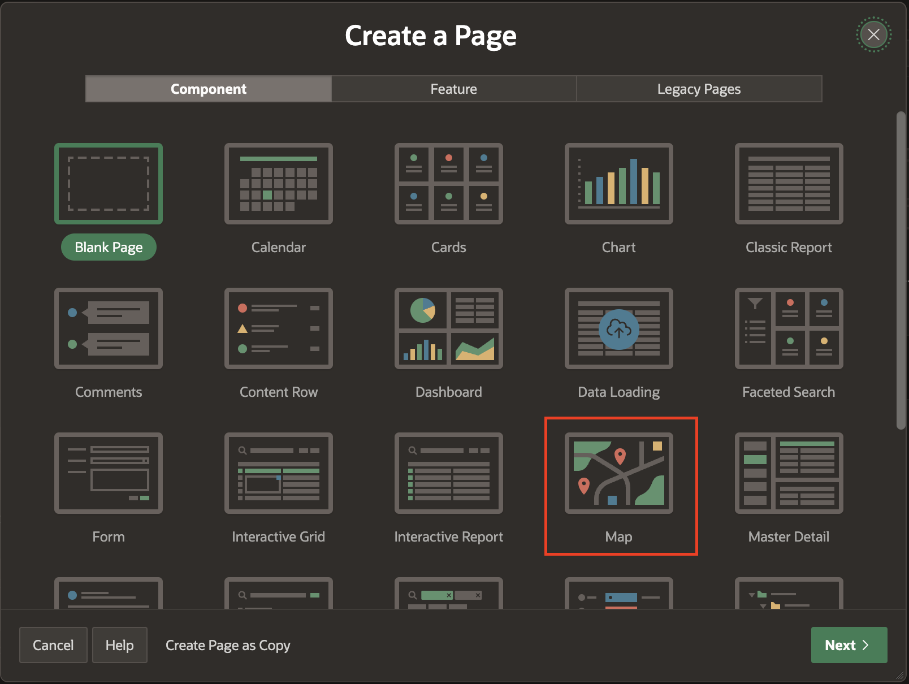
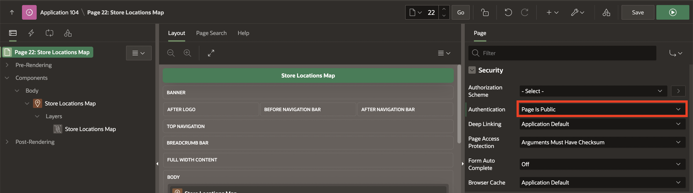
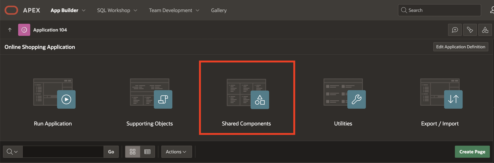
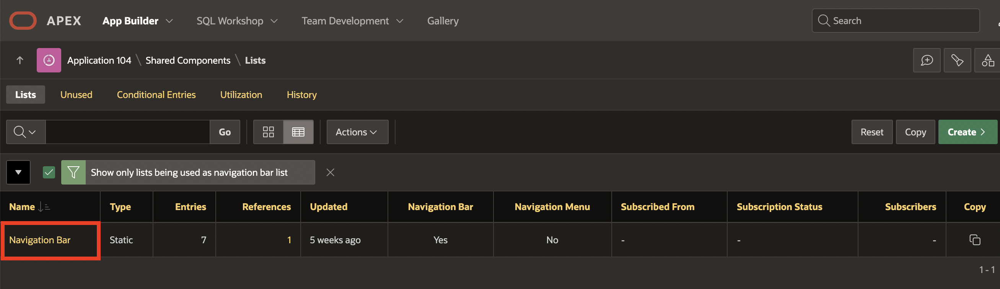
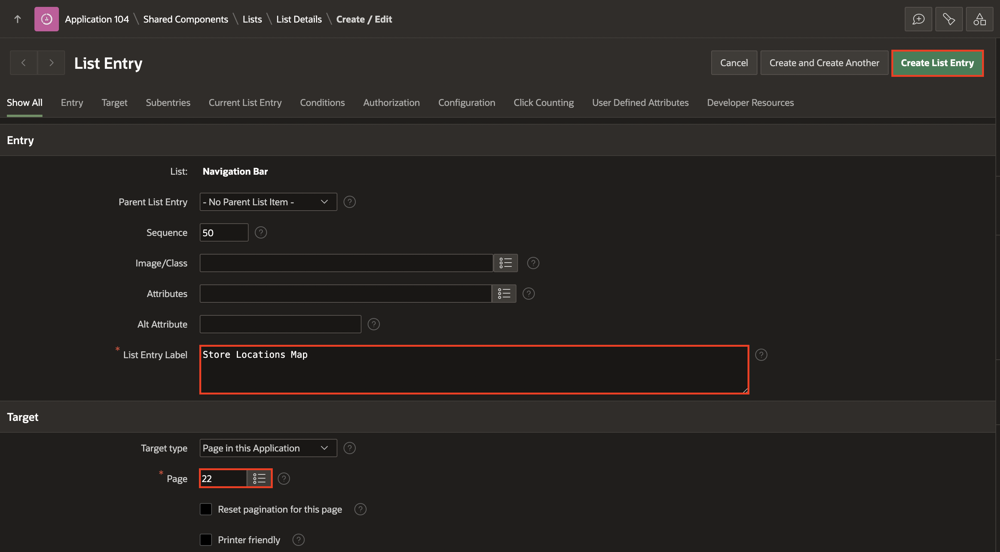

# Add additional pages to your Application

## Introduction

In this Lab, You will first create a Map Page with Store Details, and then you will create an entry for the Store Details Map in the navigation Menu Entry.

Estimated Time: 20 minutes

### Downloads

- Did you miss out on trying the previous labs? Don’t worry! You can download the application from **[here](files/online-shopping-cart-10.sql)** and import it into your workspace. To run the app, please run the steps described in **[Get Started with Oracle APEX](https://apexapps.oracle.com/pls/apex/r/dbpm/livelabs/run-workshop?p210_wid=3509)** and **[Using SQL Workshop](https://apexapps.oracle.com/pls/apex/r/dbpm/livelabs/run-workshop?p210_wid=3524)** workshops.

## Task 1: Creating a Store Details Map page and adding it to Desktop Navigation Bar.

1. Navigate to **App Builder** and in the **Home Page**, click **Online Shopping Application**.

  

  

2. In the application home page, click **Create Page**.

  

3. Select **Map** page type.

  

4. In the **Create Map** enter the following and click **Next**.

    Under **Page Definition**:
    - For **Page Number**, Enter **20**.
    - For **Name**, Enter **Store Locations Map**.

    Under **Data Source**:
    - For **Table/View Name**, select **STORES**.

    Under **Navigation**:
    - For **Breadcrumb**, Set it to **No**.

    

5. For **Create Map**, enter the following and click **Create Page**. For **Map Style**, Select **Points**.  
  Under **Map Attributes**:
    - For **Geometry column Type**, Select **Two Numeric Columns**.
    - For **Longitude Column**, Select **LONGITUDE**.
    - For **Latitude Column**, Select **LATITUDE**.
    - For **Tooltip Column**, Select **STORE_NAME**.

  Click **Create Page**.

  

6. The Store Locations Map should be visible to the Public. To set the page as Public, select **Page \<n\>: Store Locations Map** in the Rendering tree. In the Property Editor, navigate to **Security**, and for **Authentication**, select **Page is Public**.
    

7. Then, click **Save** and **Run Page**.

  

8. The **Store Details Map** Page is now displayed. Now, in the developer toolbar, select **App < n >**.

  

9. Navigate to **Shared Components**

  

10. In the **Shared Components** page, Under **Navigation**, select **Navigation Bar List**.

  

11. Select **Navigation Bar**, Under **Lists**.

  

12. Click **Create Entry**.

  

13. For **List Entry**, enter the following and click **Create List Entry**.  

 Under **Entry**:
    - For **List Entry Label**, enter **Store Locations Map**.

  Under **Target**:
    - For **Page**, Select **20**

    

14. Then, click **Save** and **Run Page**.

  

15. You can now see that **Store Locations Map** is now displayed in **Navigation Bar**.

    

## Summary
You now know how to manage Map pages. You may now **proceed to the next lab**.

## Acknowledgments
- **Author** - Roopesh Thokala, Product Manager
- **Contributor** - Ankita Beri, Product Manager
- **Last Updated By/Date** - Roopesh Thokala, Product Manager, May 2022
