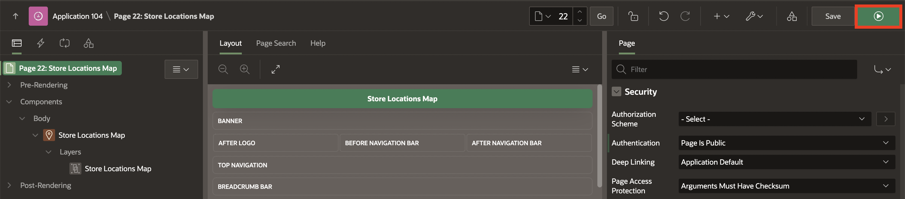
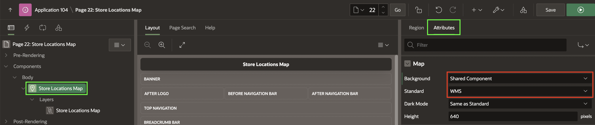

# Add additional pages to your Application

## Introduction

In this Lab, You create a Map Page with Store Details and custom Background, and then you make an entry for the Store Details Map in the navigation Menu Entry.

Estimated Time: 20 minutes

### Downloads

- Did you miss out on trying the previous labs? Don't worry! You can download the Application from **[here](files/online-shopping-cart-12.sql)** and import it into your workspace. To run the app, please run the steps described in **[Get Started with Oracle APEX](https://livelabs.oracle.com/pls/apex/r/dbpm/livelabs/run-workshop?p210_wid=3509)** and **[Using SQL Workshop](https://livelabs.oracle.com/pls/apex/r/dbpm/livelabs/run-workshop?p210_wid=3524)** workshops.

## Task 1: Create a Store Details Map page with a Background and add it to the Desktop Navigation Bar.

1. Navigate to **App Builder**, click **Online Shopping Application**.

  

  

2. On the application home page, click **Create Page**.

  

3. Select **Map**.

  

4. In the **Create Map** enter the following and click **Next**.

    Under **Page Definition**:
    - For **Page Number**, Enter **20**.
    - For **Name**, Enter **Store Locations Map**.

    Under **Data Source**:
    - For **Table/View Name**, select **STORES**.

    Under **Navigation**:
    - For **Breadcrumb**, Set it to **No**.

    

5. For **Create Map**, enter the following and click **Create Page**. For **Map Style**, Select **Points**.  
  Under **Map Attributes**:
    - For **Geometry column Type**, Select **Two Numeric Columns**.
    - For **Longitude Column**, Select **LONGITUDE**.
    - For **Latitude Column**, Select **LATITUDE**.
    - For **Tooltip Column**, Select **STORE_NAME**.

  Click **Create Page**.

  

6. The Store Locations Map should be visible to the Public. Select **Page 20: Store Locations Map** in the Rendering tree to set the page as Public. In the Property Editor, navigate to **Security**, and for **Authentication**, select **Page is Public**.
    

7. Then, click **Save** and **Run Page**.

  

8. The **Store Details Map** Page is now displayed. Now, select **App < n >**in the developer toolbar.

  

9. Navigate to **Shared Components**

  

10. In the **Shared Components** page, Under **Other Components**, select **Map Backgrounds**.

   

11. Select **Create**.

    

12. Under Create Map Background, Enter the following:

      - For Name: Enter **WMS**

      - For Type: Select **OGC WMS**

      - For WMS URL : Enter https://basemap.nationalmap.gov/arcgis/services/USGSTopo/MapServer/WMSServer?service=WMS&version=1.1.1&layers=0&styles=default

   Click **Create Map Background**

   

13. Select **Edit Page 20** in the top right corner.

    

14. Select **Store Locations Map** region, and Under Attributes, Enter the following:

     - For Background: Select **Shared Component**

     - For Standard: Select **WMS**

    Click **Save and Run Page**.

    

15. In the Developer Toolbar, click Application Id <n>

    

16. Navigate to **Shared Components**.

    

17. In the **Shared Components** page, Under **Navigation and Search**, Select **Navigation Bar List**.

    

18. Select **Navigation Bar**.

  

19. Click **Create Entry**.

  

20. For **List Entry**, Enter the following:
    Under **Entry**:
     - For **List Entry Label**, Enter **Store Locations Map**.

    Under **Target**:
     - For **Page**, Select **20**

 Click **Create List Entry**.  

    

21. Then, click **Save** and **Run Page**.

  

22. You can now see that **Store Locations Map** is now displayed in **Navigation Bar**.

    

## Summary
You now know how to manage Map pages. You may now **proceed to the next lab**.

## What's Next
In the upcoming hands-on lab, you will learn to Implement the 'Share' button, Enable Push Notifications, and Add Shortcuts to the PWA app. Also, you will learn to Include screenshots to be displayed while installing the PWA app and Enable Push Notifications. Additionally you learn how to configure Push Notifications.

## Acknowledgements
- **Author** - Roopesh Thokala, Senior Product Manager
- **Contributor** - Ankita Beri, Product Manager
- **Last Updated By/Date** - Ankita Beri, Product Manager, January 2024
