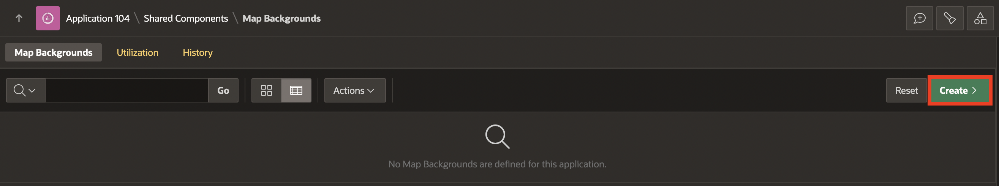
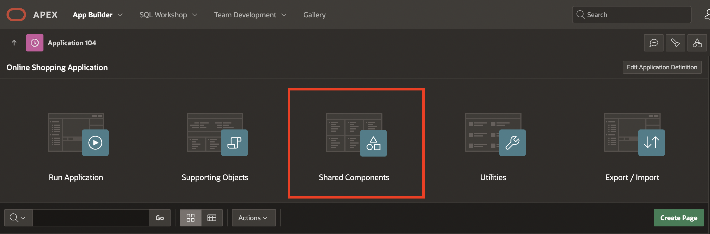
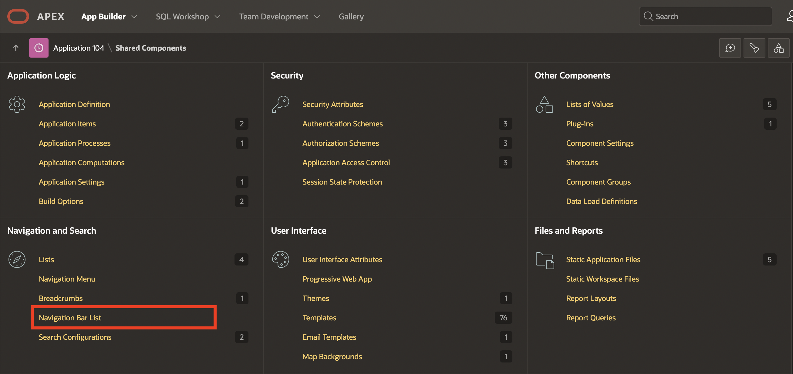
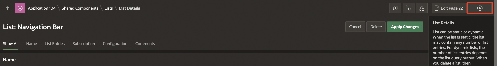

# Add additional pages to your Application

## Introduction

In this lab, you will learn how to enhance your Oracle APEX application by adding a new feature—a Store Details Map with a custom background. Additionally, you will make the map accessible from the application's navigation menu, ensuring a seamless user experience. This task will help you understand how to integrate interactive maps, manage navigation, and enhance application usability.

### Objectives

By the end of this lab, you will:

- Create a Map page in Oracle APEX with dynamic store details.

- Customize the map background using external WMS (Web Map Service).

- Configure the page for public access.

- Add the map page to the application's navigation menu for easy access.

Estimated Time: 5 minutes

## Task 1: Create a Store Details Map page with a Background and add it to the Desktop Navigation Bar

In this task, you will create a new Map page in your Oracle APEX application to display store locations. The map will include geo spatial details such as longitude, latitude, and tooltips for each store. You will then customize the map’s background using a Web Map Service (WMS) and integrate it into the navigation menu

1. Navigate to **App Builder**, click **Online Shopping Application**.

    

    

2. On the application home page, click **Create Page**.

    

3. Select **Map**.

    

4. In the **Create Map**, enter/select the following:

    - Page Number: **22**

    - Name: **Store Locations Map**

    - Data Source > Table/View Name: **STORES**

    - Navigation > Use Breadcrumb: **Toggle Off**

    Click **Next**.

    

5. For **Create Map**, enter/select the following:

    - Map Style: **Points**

    - Under Map Attributes:

        - Geometry column Type: **Two Numeric Columns**

        - Longitude Column: **LONGITUDE(Number)**

        - Latitude Column: **LATITUDE(Number)**

        - Tooltip Column: **STORE_NAME(Varchar2)**

    Click **Create Page**.

    

6. The Store Locations Map should be visible to the Public. Select **Page 22: Store Locations Map**, in the **Rendering** tree to set the page as **Public**. In the Property Editor, navigate to **Security**, and for **Authentication**, select **Page is Public**.

    

7. Then, click **Save** and **Run**.

    

8. The **Store Details Map** page is now displayed. Now, select **App < n >**in the developer toolbar.

   

9. Navigate to **Shared Components**.

   

10. Under **User Interface**, select **Map Backgrounds**.

    

11. Select **Create**.

    

12. Under **Create Map Background**, enter/select the following:

      - Name: **WMS**

      - Type: **OGC WMS**

      - WMS URL : https://basemap.nationalmap.gov/arcgis/services/USGSTopo/MapServer/WMSServer?service=WMS&version=1.1.1&layers=0&styles=default

      Click **Create Map Background**.

     

13. Click **Edit Page 22** in the top right corner.

    

14. Select **Store Locations Map** region, and under **Attributes**, enter/select the following:

     - Background: **Shared Component**

     - Standard: **WMS**

    Click **Save and Run**.

    

15. In the Developer Toolbar, navigate to **Application Id**.

    

16. Navigate to **Shared Components**.

    

17. Under **Navigation and Search**, select **Navigation Bar List**.

    

18. Select **Navigation Bar**.

    

19. Click **Create List Entry**.

    

20. For **List Entry**, enter/select the following:

    - Entry > List Entry Label: **Store Locations Map**

    - Under Target > Page: **22**

    Click **Create List Entry**

    

21. Click **Save** and **Run**.

    

22. You can now see that **Store Locations Map** is now displayed in **Navigation Bar**.

    

## Summary

You now know how to manage Map pages. You may now **proceed to the next lab**.

## What's Next

In the upcoming hands-on lab, you will learn to Implement the 'Share' button, Enable Push Notifications, and Add Shortcuts to the PWA app. Also, you will learn to Include screenshots to be displayed while installing the PWA app and Enable Push Notifications. Additionally you learn how to configure Push Notifications.

## Acknowledgements

- **Author** - Roopesh Thokala, Senior Product Manager; Ankita Beri, Product Manager
- **Last Updated By/Date** - Ankita Beri, Product Manager, November 2024
