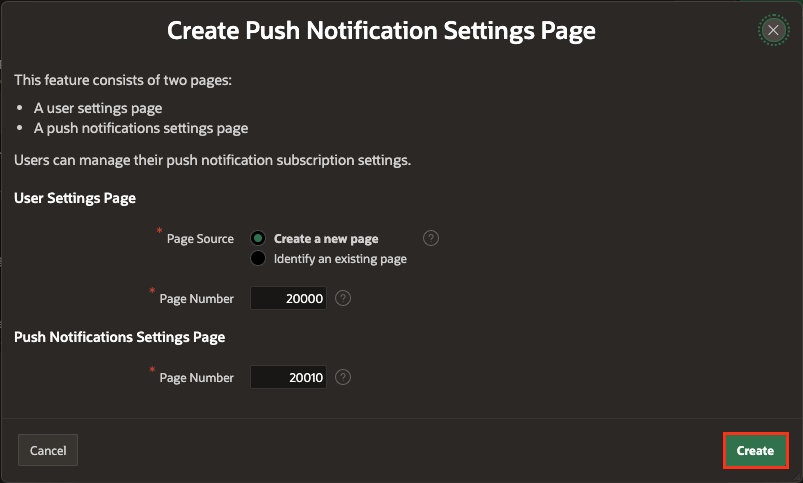
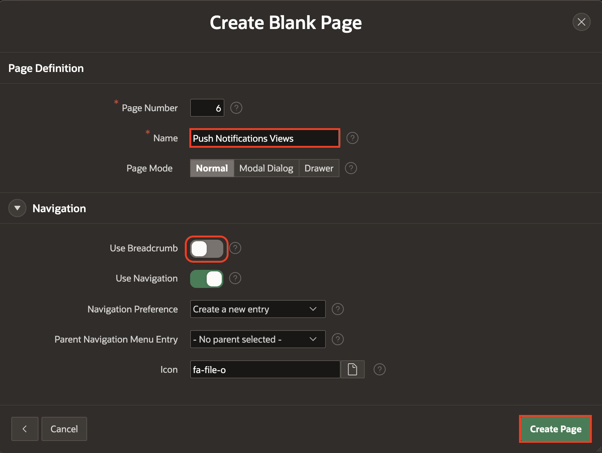
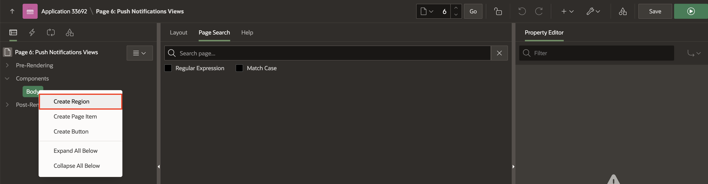
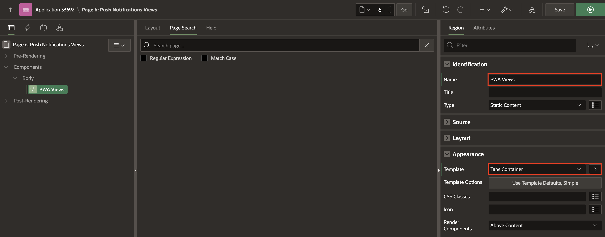
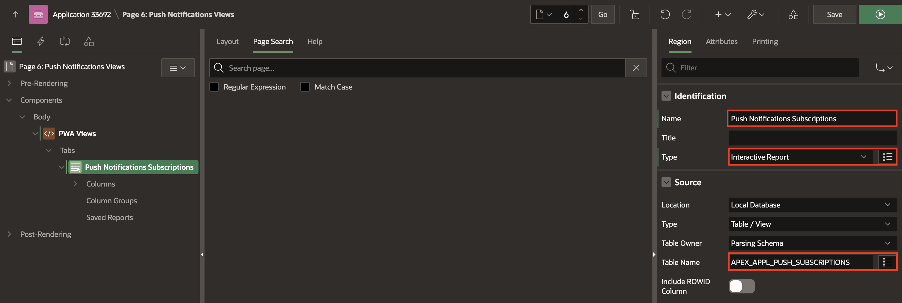
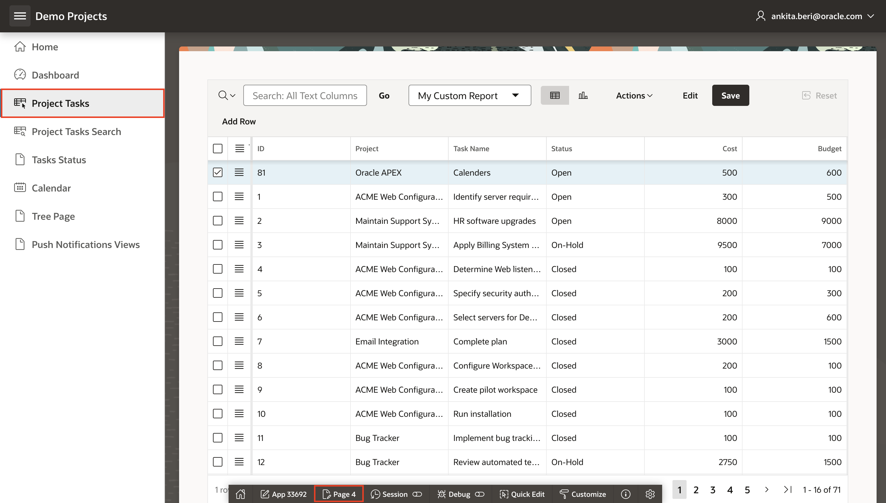
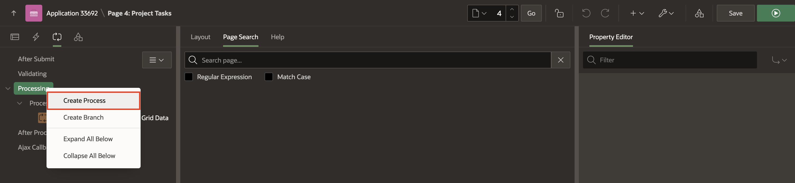
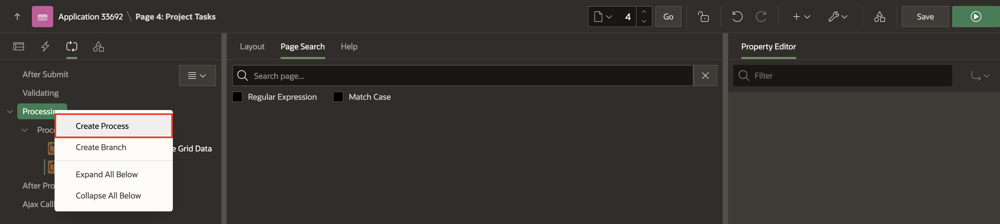
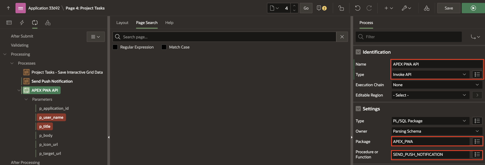

# Enhance the App with Mobile Features

## Introduction

In this lab, you improve the user experience of the Social Media App by including an APEX 23.2 new item called Image Upload that allows the user to crop images before uploading. You also implement a 'Share' button where a user can share the uploaded images with other users via email or 3rd party apps. Finally, you add mobile capabilities to the app by enabling Push Notifications for the Social Media App, where a user receives a notification on their device whenever a user likes the image. You also learn to add Shortcuts and Screenshots to the PWA app.

Estimated Time: 20 minutes

### Objectives

In this lab, you:

- Enable Push Notifications.

- Learn how to configure Push Notifications.

## Task 1: Enable Push Notifications

1. 1. Navigate to the **Demo Projects** application.

    

2. Select **shared components**.

    

3. Under **User Interface**, select **Progressive Web App**.

    

4. Click **Push Notifications** tab and toggle **ON** the **Enable Push Notifications**. Click **+ Generate Credentials** and select **Generate Credentials** in the confirm dialog window.

    

    

5. Click **+ Add Settings Page**.

    

6. Create Push Notifications Settings Page dialog window appears. Click **Create**.

    

7. Progressive Web App is updated. Now, **Save and Run** the page.

    

8. In the Demo Projects Application, click on your username at the top-right corner and select **Settings**.

    

9. Push Notifications are turned off by default. Click **Off** and enable the checkbox for **Enable push notifications on this device**.

    

    

10. Push Notifications is now enabled for the username.

    > **Note:**

    - If you cannot see the Push Notifications, ensure that the DND option is turned off in your system and your browser has the necessary permissions to send notifications.

    - View the compatibility matrix of Push Notifications [here](https://apex.oracle.com/pls/apex/r/apex_pm/apex-pwa-reference/push-notifications)

## Task 2: Create a Page with reports for Push Notifications Views

No matter the approach you opt for in sending push notifications, it is crucial (especially for the APEX engine) to possess the ability to recognize users who have subscribed to this feature. This recognition is essential for meaningful use of page processes or the API. APEX provides two distinct views to analyze records, revealing the subscribers to push notifications within your application and the notifications currently in the queue.

1. Navigate to the Demo Projects Application by clicking **Application ID** in the top left of the application.

    

2. Click **Create Page**.

    

3. Select **Blank Page**.

    

4. For Page Attributes, enter/select the following:

    - Page Definition > Name: **Push Notifications Views**

    - Navigation > Breadcrumb: Toggle **OFF**

    Click **Create Page**.

    

5. In the **Rendering** tab, right-click **Body** and select **Create Region**.

    

6. In the Property Editor, enter/select the following:

    - Identification > Title: **PWA Views**

    - Appearance > Template: **Tabs Container**.

    

7. In the **Rendering** yab, right-click **PWA Views** and select **Create Sub Region**.

    

8. In the Property Editor, enter/select the following:

    - Under Identification:

        - Title: **Push Notifications Subscriptions**

        - Type: **Interactive Report**

    - Source > Table Name: **APEX\_APPL\_PUSH\_SUBSCRIPTIONS**.

    

9. In the **Rendering** tab, right-click **PWA Views** and select **Create Sub Region**.

    

10. In the Property Editor, enter/select the following:

    - Under Identification:

        - Title: **Push Notifications Queue**

        - Type: **Interactive Report**

    - Source > Table Name: **APEX\_PUSH\_NOTIFICATIONS\_QUEUE**

    

11. Click **Save** and **Run** to view the changes.

    

## Task 3: Create Page Processes to send Push notifications

APEX offers two methods for sending push notifications from an app. Each offers its benefits and levels of control. Understanding these methods can help you choose the best approach for your needs.

**Send using Page Process**
The built-in 'Send Push Notification' page process lets you send a notification declaratively. This option is ideal for users who prefer a straightforward process without extensive customization. This Process sends a notification to a single user, although this user might have multiple devices expecting the same notification. To use this Process, fill in the required fields, including the username, title, and description of the push notification. The Process ensures your message is delivered to the intended recipient on any device they've opted to receive notifications.

**Send using API**
For users seeking more control over the appearance and content of their push notifications, the apex_pwa API offers more flexibility. This API allows you to manage additional parameters, such as the icon and a different destination application. This approach is practical for looping through multiple users and sending notifications simultaneously.

1. In the **Demo Projects** application, navigate to **Project Tasks** page and click **Page 4** in the developer toolbar.

   

2. Navigate to **Processing** tab. Right-click **Processing** and select **Create Process**.

    

3. In the Property Editor, enter/select the following:

    - Under Identification:

        - Title: **Send Push Notification**

        - Type: **Send Push Notification**

    - Under **Settings**:

        - To: Enter a username for whom you have Subscribed to Push Notifications.

        - Title: Enter a Title of your wish; in this example, enter **Hey there!**

        - Body: **Welcome to PWA Push Notifications.**

    

4. Right-click **Processing** and select **Create Process**.

    

5. In the Property Editor, enter/select the following:

    - Under Identification:

        - Title: **APEX PWA API**

        - Type: **Invoke API**

    - Under Settings:

        - Package: **APEX\_PWA**

        - Procedure or Function: **SEND\_PUSH\_NOTIFICATION**

    

6. Under **APEX PWA API** process, select **p\_user\_name** parameter. Then, in the Property Editor, enter/select the following:

    - Under Value:

        - Type: **Static Value**

        - Static Value: Enter a username for whom you have Subscribed to Push Notifications.

    

7. Now, select **p\_title** parameter. Then, in the Property Editor, enter/select the following:

    - Under Value:

        - Type: **Static Value**

        - Static Value: **Welcome to Push Notifications.**

    

8. Click **Save**.

## Summary

You learned to enhance the **Demo Projects** app with push notifications in this lab.

## What's Next

In the upcoming hands-on lab, you will learn to Create Working Copy, Installation Scripts and Data Packages. Also, you gain insights into how to Export Applications with supporting Objects and use Remote Deployment to deploy your Application.

## Acknowledgements

- **Author(s)** - Roopesh Thokala, Senior Product Manager; Ankita Beri, Product Manager
- **Last Updated By/Date** - Ankita Beri, Product Manager, December 2024
