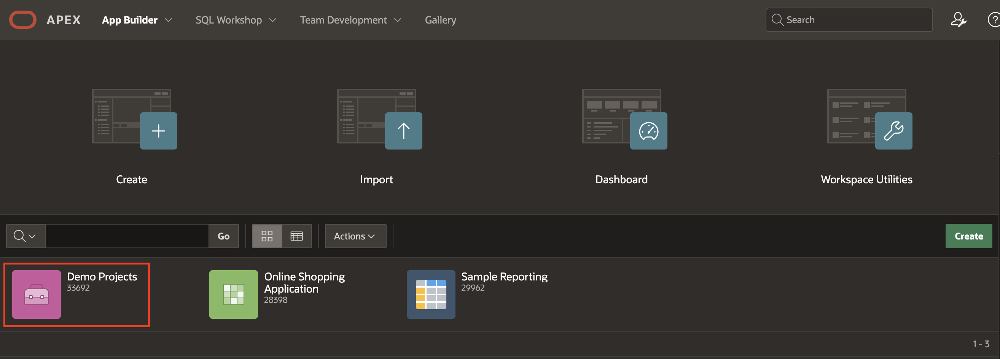
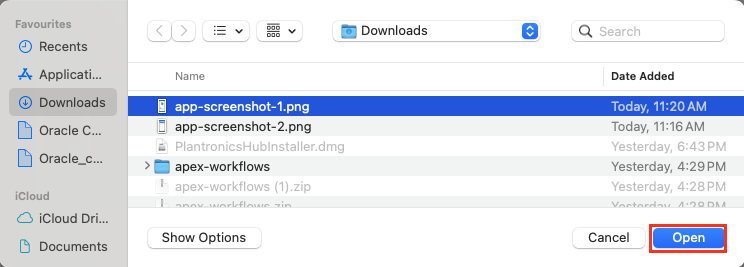
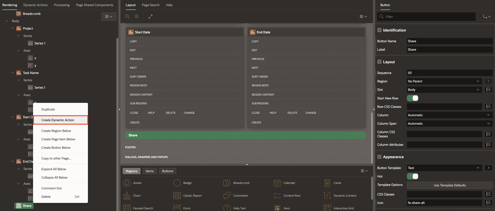

# Enhance the App with Mobile Features

## Introduction

In this lab, you improve the user experience of the Demo Projects App. You also implement a 'Share' button where a user can share the pages with other users via email or 3rd party apps. Finally, you will also learn to add shortcuts, screenshots, and meta tags to the PWA app.

Estimated Time: 15 minutes

### Objectives

In this lab, you:

- Implement the 'Share' button.

- Enable Push Notifications.

- Add Shortcuts to the PWA app.

- Include screenshots to be displayed while installing the PWA app.

## Task 1: Configure Progressive Web Application

1. Navigate to the **Demo Projects** Application.

    

2. Select **Shared Components**.

    

3. Under **User Interface**, select **Progressive Web App**.

    

4. Make sure that **Installable** is set to **Yes** and click **Apply Changes**.

   

## Task 2: Enhance the PWA install experience with Screenshots

The Oracle APEX Progressive Web App screenshots are used for promotional purposes when users are prompted to install the Progressive Web App.

1. Navigate to the **Demo Projects** application and select **Shared Components**. Under **User Interface**, select **Progressive Web App**

    

2. Under **Screenshots**, click **Add Screenshot**.

    

3. Click **Upload a Screenshot** in the PWA screenshot wizard.

    

    > **Note:** You can save the images by clicking on the links below:

    - [**app-screenshot-1.png**](images/app-screenshot-1.png)

    - [**app-screenshot-2.png**](images/app-screenshot-2.png)

4. From your local system, select the screenshot that you wish to upload. In this case, select **app-screenshot-1** from your local system and click **Create**.

    

    

5. Repeat steps 2-4 to add as many screenshots as possible. In this case, add **app-screenshot-2**, which you downloaded earlier.

    

6. Click **Apply Changes**.

    

    > **Note:**

    - *View the compatibility matrix for the* **Screenshots** [here](https://apex.oracle.com/pls/apex/r/apex_pm/apex-pwa-reference/installation)

    - *View the compatibility matrix for the* **Shortcuts** [here](https://apex.oracle.com/pls/apex/r/apex_pm/apex-pwa-reference/app-icon)

## Task 3: Add Shortcuts for the PWA app

Oracle APEX Progressive Web App shortcuts provide a convenient way for users to access specific pages within the application.

Users can long-press on the home screen app icon on touch-enabled devices to access the shortcuts. Users can right-click the taskbar app icon for non-touch devices, such as computers, to access the same feature.

By providing these shortcuts, Oracle APEX enhances the user experience and makes it easier for users to access the pages they need within the PWA quickly.

> **Note:** _An APEX application can only use PWA Shortcuts if Rejoin Sessions is enabled. Before configuring shortcuts, click either Enable for Public Sessions or Enable for All Sessions._

1. Scroll down to **Shortcuts** and click **Enable for All Sessions**. Confirm by clicking **Enable for All Sessions** in the popup window.

    > **Note:** _This option does not work in *apex.oracle.com* instance._

    

    

2. Click **Add Shortcut**.

    

3. In the Add Shortcut dialog, enter/select the following:

    - Name: **Dashboard**

    - Target URL: Click **Item Picker** and select **Dashboard** page.

    

    - Upload an Icon: click the **Upload an Icon** button and select the icon from your local system.

    

    

4. Click **Create**.

    Similarly, you can add multiple shortcuts, each pointing to a different page in your app.

5. Click **Apply Changes**.

## Task 4: Add the Share Button

In this task, you add a Share button that allows a user to share the post via email or other apps.

> **Note:**

- On macOS, Share will NOT work on Chrome and Firefox browsers. Use Edge or Safari browsers.

- On Windows, Share will NOT work on the Edge browser. Use Chrome, Edge or Safari browsers.

1. Navigate to the **Application ID** and select the **2-Dashboard** page in your **Demo Projects** Application.

2. Right-click **Body** and select **Create Button**.

    

3. In the Property Editor, enter/select the following:

    - Identification > Button Name: **Share**

    - Under Appearance:

        - Hot: **Toggle On**

        - Icon: **fa-share-alt**

    

4. In the **Rendering** tab, right-click **Share** button and select **Create Dynamic Action**.

    

5. In the Property Editor, Identification > Name: **Share Page**.

    

6. Under **True** action, select **show**. In the Property Editor, enter/select the following:

    - Identification > Action: **Share**

    - Under Settings:

        - Title: **Share Dashboard Page**

        - Text: **Sharing the Dashboard Page to the World!**

    Click **Save**.

    

## Task 5: Configure Meta Tags

Meta tags are information about a web page that allows other systems to read a summary of the page content. Sharing APEX pages is more convenient when the content of that page can be previewed on other social media platforms. APEX allows the definition of meta tags for **public-facing** APEX pages directly from Page Designer.

1. In Page Designer, select **Page 2 : Dashboard** and in the Property Editor, enter/select the following:

    - Security > Authentication: **Page is Public**

    - Advanced > Enable Meta Tags: Toggle **On**

    

2. A new section will appear in the Page Designer under **Pre-Rendering**. Select **description** and enter the following:

    - Identification > Value: **Web share - Demo Projects App, Dashboard**

    

3. Click **Save**.

## Summary

In this lab, you learned to enhance the **Demo Projects** app with mobile features like Sharing Pages and add the latest PWA features like Shortcuts and Screenshots.

## Acknowledgements

- **Author(s)** - Roopesh Thokala, Senior Product Manager; Ankita Beri, Product Manager
- **Last Updated By/Date** - Ankita Beri, Product Manager, December 2024
