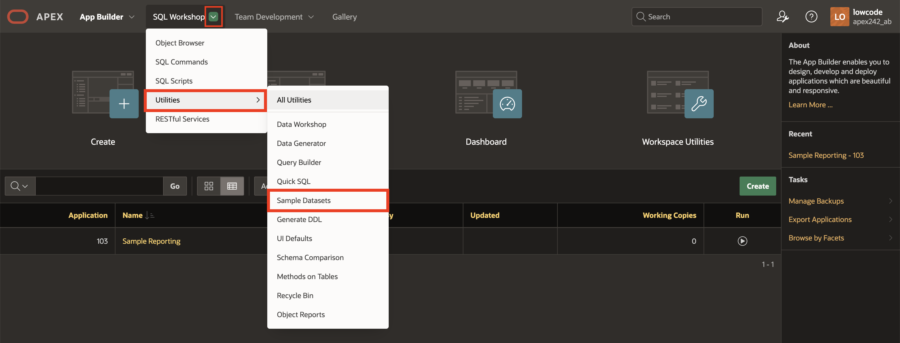
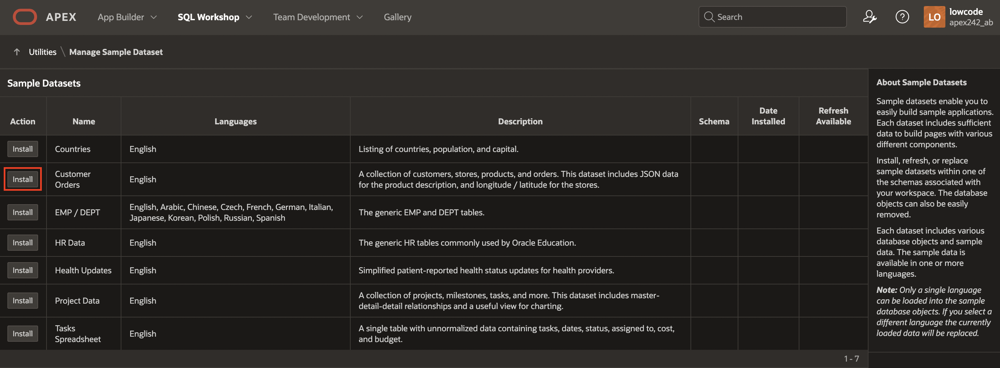

# Install a Sample Dataset

## Introduction

In this lab, you learn to install sample tables and views from Sample Datasets. This sample dataset has tables for  customers, stores, products, and orders that are used to manage the shopping cart.

<!--
Watch the video below for a quick walkthrough of the lab.

-->

Estimated Time: 5 minutes

### Objectives

In this lab, you will:

- Install a sample dataset into your Oracle APEX Workspace.

## Task 1: Create Customer Orders Tables

1. Log in to your workspace. If you are already logged in, click on the **APEX** logo in the upper left-hand corner of the page to return to the APEX workspace home page.

2. From the APEX workspace home page, navigate to **SQL Workshop** and select **Utilities > Sample Datasets**.

    

3. On the **Customer Orders** row, click **Install**.

    

4. Accept the default settings and click **Next**.

   *The schema name defaults to your current schema and, hence, will differ from the schema name shown below.*

    

5. Click **Install Dataset**.

    

6. Click **Exit**.

    

## Summary

You now know how to install sample tables and views from Sample Datasets. You may now **proceed to the next lab**.

## Acknowledgements

- **Author** - Roopesh Thokala, Senior Product Manager; Ankita Beri, Product Manager
- **Last Updated By/Date** - Ankita Beri, Product Manager, December 2024
