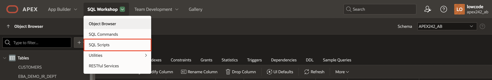
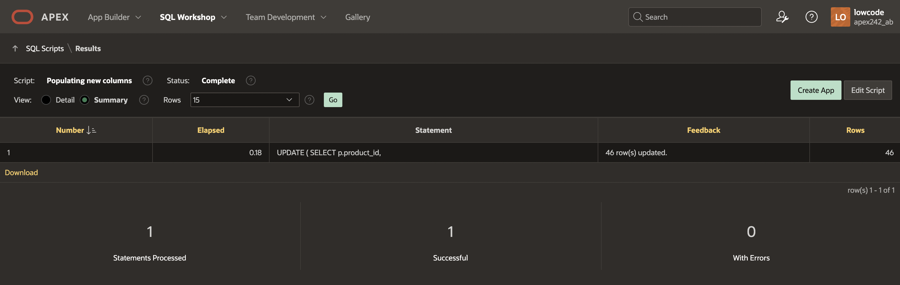
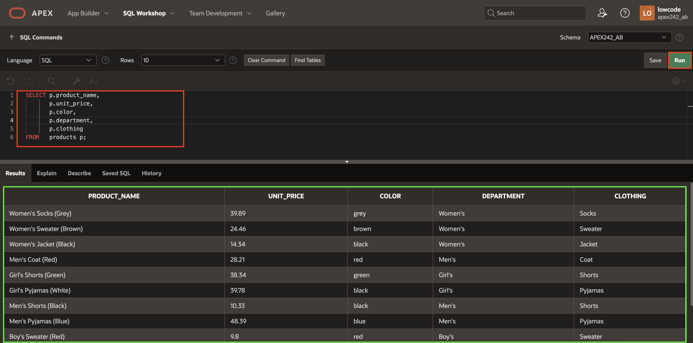
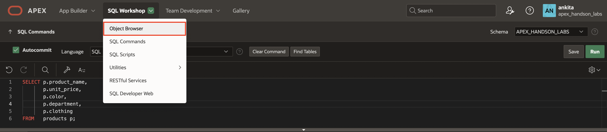
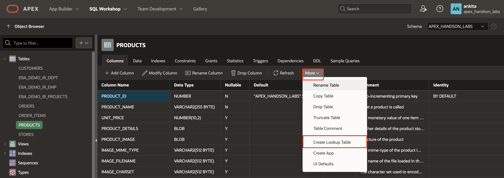

# Add columns to the products table

## Introduction

The **PRODUCTS** table includes columns such as image, price, and details. However, customers would appreciate knowing other characteristics about a product, such as color, type of clothing, and department. In this lab, you will add these columns to the Products table.

Since many products will share the same colors, clothing type, and department, it is best practice to create three additional tables to store the unique values of color, type, and department data to avoid data redundancy. Instead of creating these three tables, you'll use the **Create Lookup Table** feature.

Estimated Time: 10 minutes

### Objectives

In this lab, you will:

- Add new columns to the existing Products table.

- Populate the new columns.

- Create lookup tables.

## Task 1: Add Columns to the Products Table

1. From the APEX workspace home page, select the down arrow next to **SQL Workshop**, select **Object Browser**.

    

2. Under **Tables**, select **PRODUCTS** and click **+ Add Column**.

    

3. To create the **Color** column, enter/select the following:

    - Column: **COLOR**

    - Data Type: **VARCHAR2**

    - Length: **200**

     Click **Apply**.

    

4. To create the **Department** column, click **+ Add Column** and enter/select the following:

    - Column: **DEPARTMENT**

    - Data Type: **VARCHAR2**

    - Length: **200**

     Click **Apply**.

    

5. To create the **Clothing** column, click **+ Add Column** and enter/select the following:

    - Column: **CLOTHING**

    - Data Type: **VARCHAR2**

    - Length: **200**

     Click **Apply**.

    

## Task 2: Populate the new columns

In this task, you will extract and populate specific information from existing data into existing columns using SQL Scripts. You will work with the Products table within your database. You will update several columns (clothing, color, and department) based on the information stored in other columns.

1. Click **SQL Workshop** from the top navigation menu and select **SQL Scripts**.

    

2. Click **Create**.

    

3. For **Script Name**, enter **Populating new columns**.

4. Copy the following script and paste it into the editor.

    ```
    <copy>
    UPDATE
        (
                SELECT p.product_id,
                        p.product_name,
                        p.clothing,
                        p.color,
                        p.department,
                        p.product_details
                FROM   products p ) p
     SET    p.clothing = Substr(product_name, Instr(product_name, ' ',1,1)+1, Instr(product_name, ' ',1, 2)+1 - Instr(product_name, ' ',1,1)- 2),
        p.color =
        (
                SELECT c.color
                FROM   json_table (p.product_details, '$' COLUMNS ( color VARCHAR2(4000) path '$.colour') ) c),
        p.department =
        (
                SELECT g.department
                FROM   json_table (p.product_details, '$' COLUMNS ( department VARCHAR2(4000) path '$.gender') ) g)
     </copy>
     ```

    This script inserts the unique product type values (e.g. Shirt, Jacket, Skirt, etc.) into the CLOTHING column in the **Products** table. Similarly, it inserts the unique department names (e.g. Boy's, Girl's, Men's, Women's) and color names into the DEPARTMENT and COLOR columns, respectively, based on information found in the JSON product details column in the **Products** table.

5. Click **Run** and **Run Now**.

    

    

    The Script Results page lists the count of statements processed, successful, and with errors.

    

6. To check the values in the **Products** table, click **SQL Workshop** and select **SQL Commands**.

    

7. Copy and paste the following SQL Query in the editor:

    ```
    <copy>
    SELECT p.product_name,
           p.unit_price,
           p.color,
           p.department,
           p.clothing
    FROM   products p;
    </copy>
    ```

8. Click **Run**.

    

## Task 3: Create Lookup Tables

Since multiple products may have the same color, department, and clothing values, you can create a lookup table for each column to avoid repetition and make updates easier. A lookup table stores the value of the available colors, departments, or clothing in a single place, and then each product can reference the value from the lookup table.

You create lookup tables in this lab based on the three new columns. After you create a lookup table, the PRODUCTS table can reference the new color, clothing type, and department lookup value by its new numeric primary key value in the lookup table.

1. From the APEX main menu, click **SQL Workshop** and  select **Object Browser**.

    

2. Under **Tables**, select **PRODUCTS**. Then, navigate to **More** and select **Create Lookup Table**.

    

3. For **Text Column**, select **COLOR** and click **Create Lookup Table**.

    

    *Note: Click the **Create Lookup Table** button only once. Then, you will find the new table listed in the Object Browser.*

4. To create **Department** lookup table, navigate back to the **PRODUCTS** table. Click **More** and select **Create Lookup Table**.

    

5. For **Text Column**, select **DEPARTMENT** and click **Create Lookup Table**.

    

    *Note: Click the **Create Lookup Table** button only once. Then, you will find the new table listed in the Object Browser.*

6. To create **Clothing** lookup table, navigate back to the **PRODUCTS** table. Click **More** and select **Create Lookup Table**.

    

7. For **Text Column**, select **CLOTHING** and click **Create Lookup Table**.

    

    *Note: Click the **Create Lookup Table** button only once. Then, you will find the new table listed in the Object Browser.*

8. The columns COLOR, DEPARTMENT, and CLOTHING in the **PRODUCTS** table are renamed to COLOR\_ID, DEPARTMENT\_ID, and CLOTHING\_ID, respectively, and their data type is changed to NUMBER. Also, there are new tables containing the values of the products:
    - COLOR_LOOKUP
    - DEPARTMENT_LOOKUP
    - CLOTHING_LOOKUP

    The numeric value of the COLOR\_ID column will now store a reference to the system-assigned unique id of a particular color, whose name is stored in the new COLOR\_LOOKUP table. Similarly, the DEPARTMENT\_ID column references the id of a row in the DEPARTMENT\_LOOKUP table, and CLOTHING\_ID references the id of a row in the CLOTHING\_LOOKUP table.

    

## Summary

You now know how to add new columns to your existing tables, create lookup tables for reference information, and create and run an SQL script to populate your tables. You may now **proceed to the next lab**.

## Acknowledgements

- **Author** - Roopesh Thokala, Senior Product Manager; Ankita Beri, Product Manager
- **Last Updated By/Date** - Ankita Beri, Product Manager, December 2024