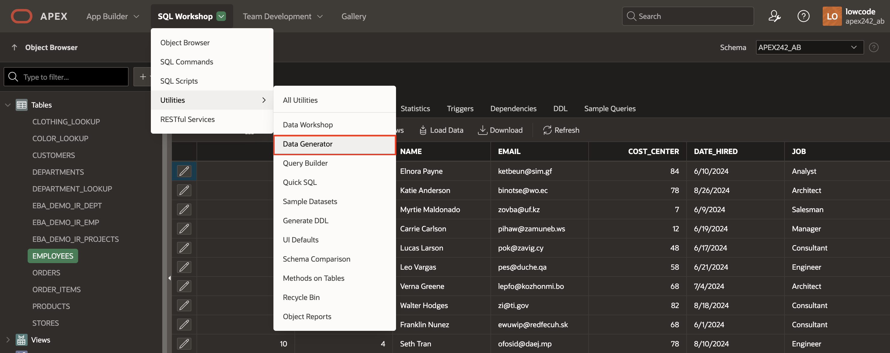
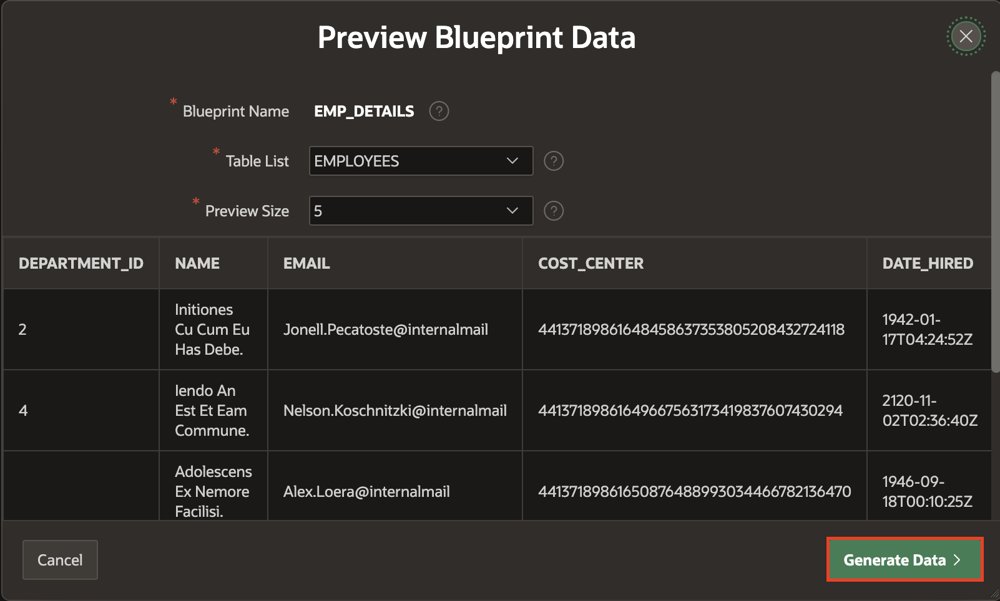
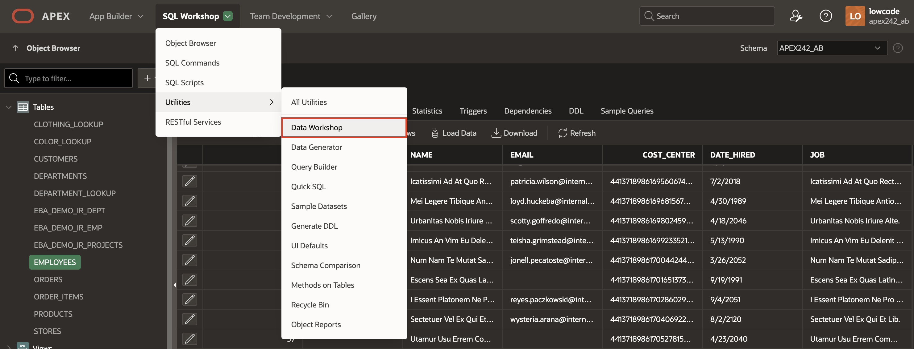
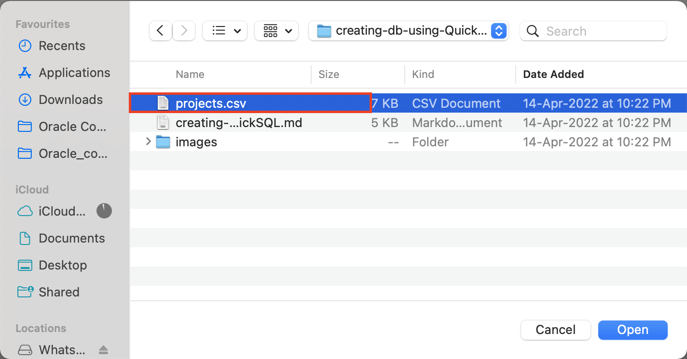

# Use QuickSQL and Data Workshop

## Introduction

Memorizing the SQL to create and maintain database objects can be difficult. However, some tools can generate the code based on a shorthand syntax or a graphical user interface. In this lab, you will create database objects using Quick SQL and then view the objects in database actions. You will then use the Data Workshop page to load data from a file into your workspace.

Estimated Time: 15 minutes

### Objectives

In this lab, you will:

- Create database objects using Quick SQL.
- Load data using Data Generator.
- Load data using the Data Workshop page.

## Task 1: Create database objects using Quick SQL

1. From the APEX workspace home page, select the down arrow next to **SQL Workshop**, select **Utilities > Quick SQL**.

    

2. Copy the following SQL shorthand code and paste it into the left pane in Quick SQL.

    ```
    <copy>
    departments /insert 4
      name /nn
      location
      country
      employees /insert 14
        name /nn vc50
        email /lower
        cost center num
        date hired
        job vc255

    view emp_v departments employees
     </copy>
    ```

    *Note that the Indentation from the code you copied should be similar to the one we have in the screenshot below*

3. Review the shorthand code to see how it creates numerous tables, columns, and constraints. The **Help** button details the shorthand syntax and several usage examples.

    When ready, click **Review and Run** in the Quick SQL toolbar.

    

4. In the code editor, replace the forward slash(/) at the end of the **emp_v** view with a semicolon to run the script without errors.

    

5. Review the SQL generated in the right-hand pane. For **Script Name**, enter **Employee Department Details**, and click **Run**.

    

6. On the Run Script page, click **Run Now**.

    

7. The Results page shows the results of running the script. Scroll to the bottom to see a summary. You should not see any errors.

    

8. To view the created database objects, click the down arrow next to the **SQL Workshop** tab and select **Object Browser**.

    

9. Select the **EMPLOYEES** table and click the **Data** tab to see the loaded data.

    

## Task 2: Load data using the Data Generator

In this task, you learn to use the data generator utility to create blueprints and generate sample data in the Employee table.

1. On the workspace home page, select **SQL Workshop > Utilities > Data Generator**.

    

2. Click the **Create Blueprint**.

    

3. Select **Use Existing Tables**.

    

4. On **Create Blueprint from Tables** dialog, click **Select from List** tab and enter/select the following:

    - Blueprint Name: **Emp_Details**

    - In the List of tables, check **Employees**.

    Click **Create Blueprint**.

    

5. Click **Preview Data** to preview data for the **Employee** table and columns.

    

6. Click **Generate Data**.

    

7. In the **Generate Blueprint Data** dialog, enter/select the following:

    - Action: **Insert into Database**

     Click **Insert Data**.

    

8. To see newly generated data in the Employees table, close the Generate Blueprint dialog, navigate to **SQL workshop**, and select **Object browser**.

    

9. Select the **Data** tab for the Employees table. You see 50 new rows added to the Employees table.

    

## Task 3: Load data using the Data Workshop Utility

In this step, you will learn how to create a table and load data using the Data Workshop utility.

1. On the Workspace home page, click the down arrow next to SQL Workshop and select **Utilities > Data Workshop**.

    

2. Select **Load Data**.

    

3. Click **Choose File**.

    

4. Download [projects.csv](files/projects.csv) and select the file.

    

    *Note: If the uploaded XLSX file contains multiple worksheets, the Load Data wizard picks the first sheet by default. To load another sheet, pick it from the Select Sheet select list. The First line contains a headers checkbox that works similarly to CSV files. The same is true for the Configure dialog; the behavior is the same as for CSV files. Uploading XLSX files is limited to 20MB for each File.*

5. Under **Load Data**, for Table Name, enter **PROJECTS** and click **Load Data**.

    

6. After Data Loading finishes, the system displays a success message. If any rows fail to load into the target table, they are stored in the error table and displayed in the error table. Click View Table to review the details.

    

7. Under Tables, select **PROJECTS** and click **Columns** tab to review its columns.

    

8. Click the **Data** tab to see the loaded data.

    

## Summary

You know how to use Quick SQL to generate database objects using a SQL shorthand. You also learn how to use the Data Workshop utility to load data.

## What's Next?

In the upcoming hands-on workshop, you will develop a database application utilizing pre-existing tables. It incorporates various pages, such as a dashboard, multiple reports, and an administration page. Additionally, you'll be creating an application through a spreadsheet. Furthermore, you'll gain insights into loading an application using a blueprint and configuring attributes for a Progressive Web App.

## Acknowledgements

- **Author** - Roopesh Thokala, Senior Product Manager, Ankita Beri, Product Manager
- **Last Updated By/Date** - Ankita Beri, Product Manager, December 2024
