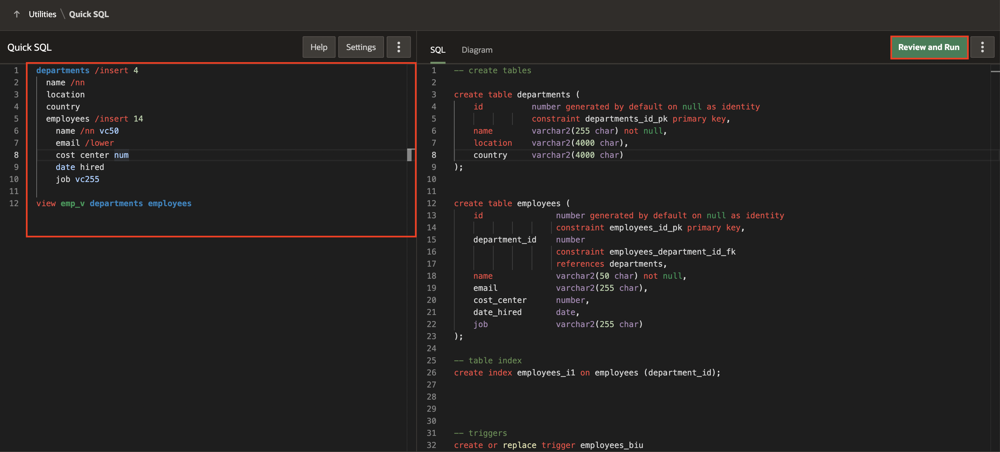
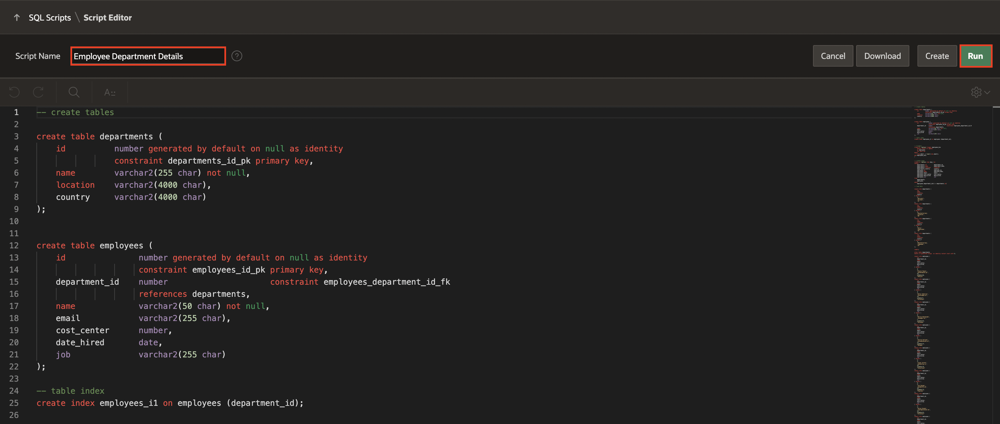
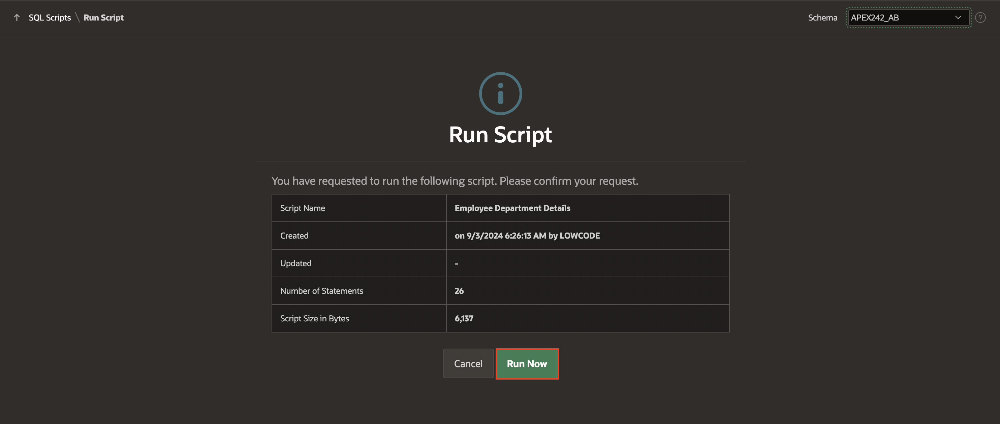
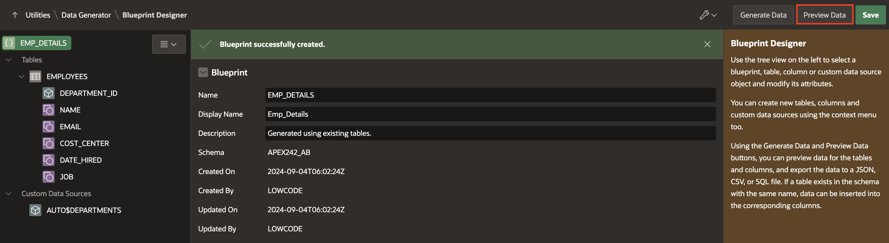
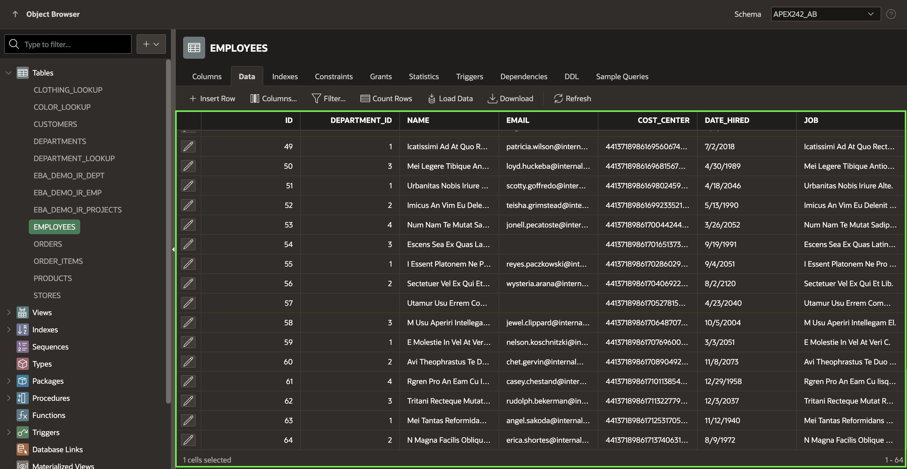
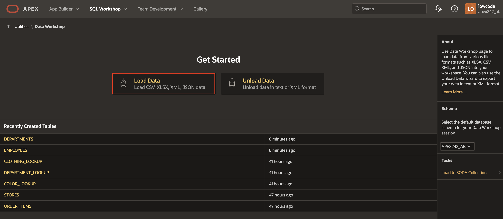
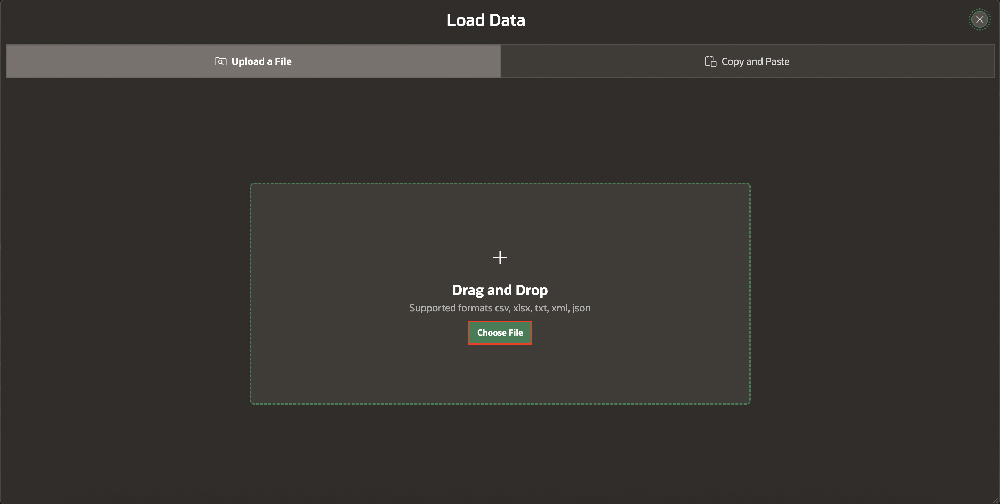

# Use QuickSQL and Data Workshop

## Introduction

Memorizing the SQL to create and maintain database objects can be difficult. However, some tools can generate the code based on a shorthand syntax or a graphical user interface. In this lab, you will create database objects using Quick SQL and then view the objects in Database Actions. You will then use the Data Workshop page to load data from a file into your workspace.

Estimated Time: 15 minutes

### Objectives
In this lab, you will:
- Create database objects using Quick SQL.
- Load data using Data Generator.
- Load data using the Data Workshop page.

## Task 1: Create database objects using Quick SQL

1. Return to your APEX Workspace and click **'⌄'** next to **SQL Workshop** tab, then click **Utilities > Quick SQL**.

   

2. Copy the following SQL shorthand code and paste it into the left pane in Quick SQL.

    ```
    <copy>
    departments /insert 4
      name /nn
      location
      country
      employees /insert 14
        name /nn vc50
        email /lower
        cost center num
        date hired
        job vc255

    view emp_v departments employees
     </copy>
    ```
    *Note that the Indentation from the code you copied should be similar to the one we have in the screenshot below*

3. Review the shorthand code. You can see how Numerous tables are created and how they are related, and what types of columns and constraints will be created for the tables. Note that the **Help** button provides details of the shorthand syntax and several examples of its usage.

    When ready, in the Quick SQL toolbar, click **Review and Run**.

   

4. Review the SQL generated in the right-hand pane, then for Script Name, enter **Employee Department Details**, and click **Run**.  

   

5. On the Run Script page, click **Run Now**.

    

6. The Results page shows the results of running the script. Scroll to the bottom to see a summary. You should not see any errors.

    

7. To view the created database objects, click the arrow  **'⌄'** in the **SQL Workshop** tab and then select **Object Browser**.

    

8. Select the **EMPLOYEES** table and then click the **Data** tab to see the loaded data.

    

## Task 2: Load data using the Data Generator

In this task, you learn to Use the Data Generator utility to create Blueprints and generate sample data in the Employee table.

1. On the Workspace home page, select **SQL Workshop > Utilities > Data Generator**.

    

2. On the Data Generator home page, click the **Create Blueprint**.

    

3. Select **Use Existing Tables**.

    

4. Under the Select from List tab, choose an existing table in your workspace schema on which to base the blueprint.

    - Blueprint Name: **Emp_Details**

    - In the List of tables, check **Employees**. 

    

5. Click **Create Blueprint**.

6. Click **Preview Data** to preview data for the Employee table and columns.

    

7. Click **Generate Data**.    

    

8. In the Generate Blueprint Data dialog, for Action, select **Insert into Database** and click **Insert Data**.

    

9. To see newly generated data in the Employees table, close the Generate Blueprint dialog, navigate to **SQL workshop**, and select **Object browser**.    

    

10. Select the **Data** tab for the Employees table. 50 new rows are added to the Employees table.    

    

## Task 3: Load data using the Data Workshop Utility

In this step, you will learn how to create a table and Load data using the Data Workshop utility.

1. On the Workspace home page, click the **'⌄'** next to **SQL Workshop** tab, then select **Utilities > Data Workshop**.

   

2. Under Get Started, select **Load Data**. The Load Data Wizard appears.

   

3. Under Upload a File, click **Choose File**.

   

4. Download [projects.csv](files/projects.csv) and select the file.

   

  *Note: If the uploaded XLSX file contains multiple worksheets, the Load Data wizard picks the first sheet by default. To load another sheet, pick it from the Select Sheet select list. The First line contains a headers checkbox that works similarly to CSV files. The same is true for the Configure dialog; the behaviour is the same as for CSV files. Uploading XLSX files is limited to 20MB for each File.*

5. Under **Load Data**, for Table Name, enter **Projects**. Then click **Load Data**.

   

6. Once Data Loading is finished, a success message is displayed. If some rows are not loaded to the target table, then they will be stored in the error table, and the error table will be displayed. Click **View Table**.

   

7. Select the **PROJECTS** table and select **Columns** tab to review its columns.

    

8. Click the **Data** tab to see the loaded data.

    

## Summary
You know how to use Quick SQL to generate database objects using a SQL shorthand. You also learn how to use the Data Workshop utility to load data.

## What's Next?
You will develop a database application utilizing pre-existing tables in the upcoming hands-on workshop. It incorporates various pages, such as a dashboard, multiple reports, and an administration page. Additionally, you'll be creating an application through a spreadsheet. Furthermore, you'll gain insights into loading an application using a blueprint and configuring attributes for a Progressive Web App.

## Acknowledgements
* **Author** - Roopesh Thokala, Senior Product Manager, Ankita Beri, Product Manager
* **Contributors** - Ankita Beri, Product Manager
* **Last Updated By/Date** - Ankita Beri, Product Manager, January 2024
