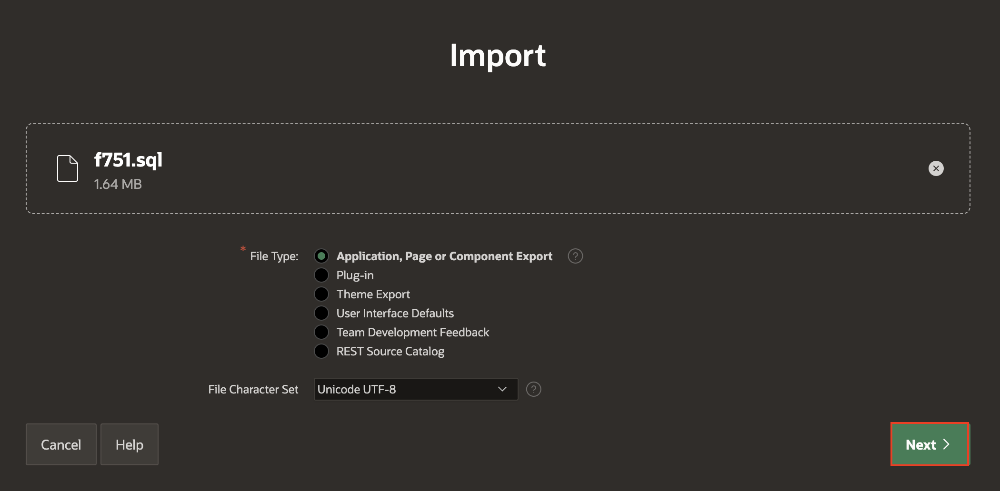

# Migrate Application Development Between Environments

## Introduction

In this lab, You will create Installation scripts and Data Packages to export Database objects along with Data. Then you will export the **DEMO PROJECTS** Application along with supporting objects and import it into another workspace.

Estimated Time: 10 minutes

### Objectives

In this lab, you will:
- Create Installation Scripts
- Create Data Packages
- Export application with supporting Objects.

### Downloads

- Did you miss out on trying the previous labs? Don’t worry! You can download the application from **[here](files/demo-projects-5.sql)** and import it into your workspace. To run the app, please run the steps described in **[Get Started with Oracle APEX](https://livelabs.oracle.com/pls/apex/r/dbpm/livelabs/run-workshop?p210_wid=3509)** and **[Using SQL Workshop](https://livelabs.oracle.com/pls/apex/r/dbpm/livelabs/run-workshop?p210_wid=3524)** workshops.

## Task 1: Create Installation Scripts, Data packages, and Export Applications.

1. On the Workspace home page, click the App Builder icon.

    

2. Select the **Demo Projects** application.

    

3. Click **Supporting Objects**. The Supporting Objects page appears.

    

4. Under **Installation**, Select **Installation Scripts**.

    

5. Click **Create**.

    

6. Select **Create from Database Object** under **Create Script**.

    

7. Under **Script Attributes**, select the below options and click **Next**.

    - For **Name**, Select **Database Objects**.

    - For **Object Type**, select Table**

    

8. Now, set the following attributes and then click **Next**.

    - For **Object**, Select and Move the tables **DEMO\_PROJECTS** and **EBA\_DEMO\_IR\_EMP** to the right side.

    

9. You will now see the **Scripts** created. Click **Create**.

    

10. Now, you will see that the Scripts got created and Saved. You will need to include **Data** in your **Supporting Objects**. Select **Create Data Package** under **Tasks** on the Right side of your page.

    

11. Under **Script Attributes**, Select the following and click **Next**.

    - For **Name**, select **data.sql** (Script Name should be Unique)

    - For **Tables**, ensure **DEMO\_PROJECTS** and **EBA\_DEMO\_IR\_EMP** are listed on the right side, and if not, select and shuttle these two tables over there.

    

12. For **Create Script**, accept the defaults and click **Finish**.

    

13. The Scripts are now Created. Navigate back to the application and Select **Export/Import**.

    

    

14. Select **Export** and click **Next**.

    

15. In the **Export Application** page, Under **Export Preferences**

    - Select **Yes and Install on Import Automatically**

    Click **Export**.

    

16. You will now notice that the application is downloaded as **fNNN.sql**

    

## Task 2: Import Application into the Target Workspace and Verify Database Objects.

In this Lab, You will login into a new workspace or the Workspace you created in previous labs and import the application along with Supporting objects.

> **Note:**_In this task, Please use different environments for creating the target and the main workspace_

1. Log in to the Target **Workspace**.

    

2. Click **App Builder** and then select **Import**.

    

    

3. Under **Import**, click **Drag and Drop**.

    

4. Choose the file we exported in the previous lab from your **Local System** and then click **Next**.

    

    

5. Under **Install**, Set **Build Status** to **Run and Build Application**. Leave the remaining settings to default and Click **Install Application**.

    

6. In the **Application Installed Wizard**, Click **Install Supporting Objects**.

    

7. You will now see that **Your application's supporting objects have been installed**. Click **Edit Application** to review the **Database Objects**.

    

8. Click on the Arrow mark next to **SQL Workshop** and then click **Object Browser**.

    

9. Select **DEMO\_PROJECTS** table and then click **Data**. Verify the Data in the table **DEMO\_PROJECTS**.

    

## Summary

You now know how to create Installation scripts and Data Packages to export Database objects along with Data. You may now **proceed to the next lab**.

## Acknowledgements

- **Author** - Roopesh Thokala, Senior Product Manager
- **Contributor** - Ankita Beri, Product Manager
- **Last Updated By/Date** - Roopesh Thokala, Senior Product Manager, Jan 2024
