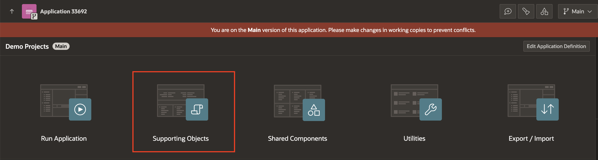
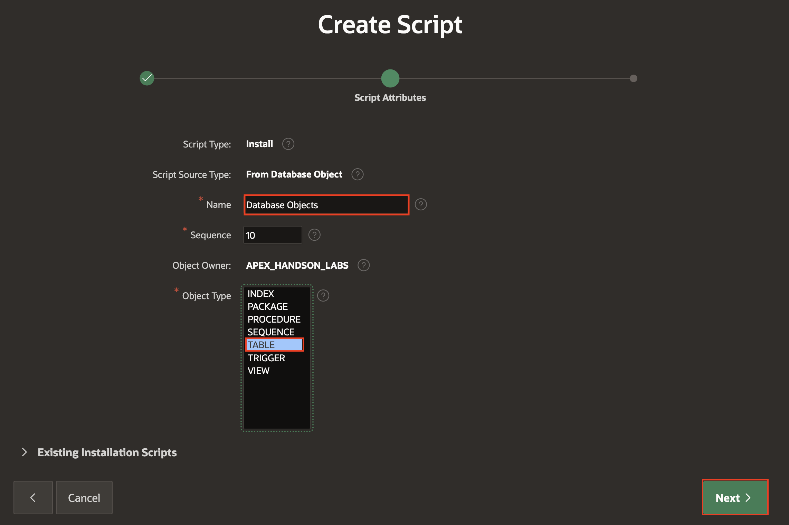
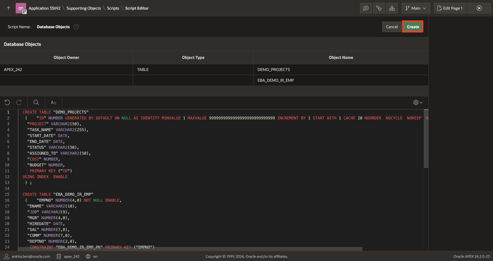
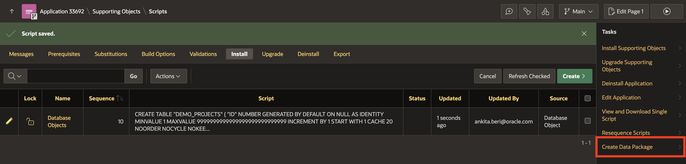
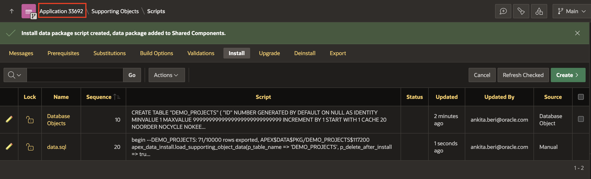
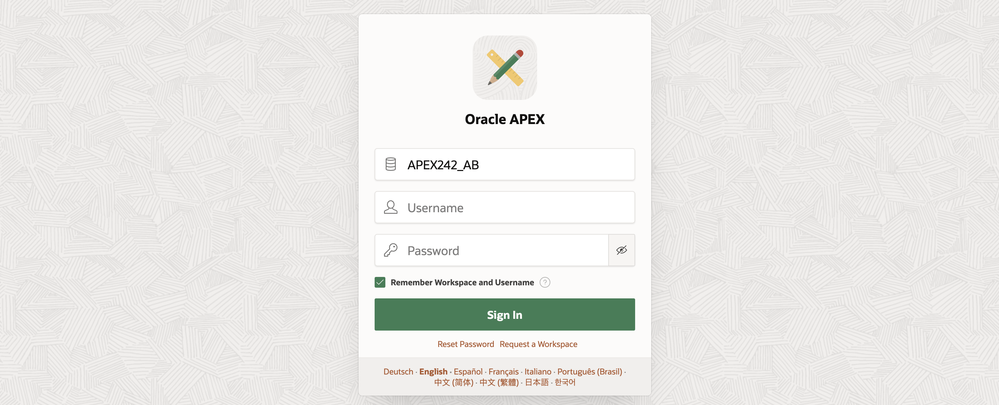
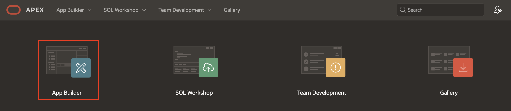

# Migrate Application Development Between Environments

## Introduction

In this lab, you will create Installation Scripts and Data Packages to export Database objects along with Data. Then you will export the **DEMO PROJECTS** Application along with supporting objects and import it into another workspace.

Estimated Time: 10 minutes

### Objectives

In this lab, you will:

- Create Installation Scripts

- Create Data Packages

- Export application with Supporting Objects.

## Task 1: Create Installation Scripts, Data Packages, and Export Applications

1. On the Workspace home page, click **App Builder**.

    

2. Select the **Demo Projects** application.

    

3. Click **Supporting Objects**.

    

4. Under **Installation**, select **Installation Scripts**.

    

5. Click **Create**.

    

6. Select **Create from Database Object**.

    

7. Under **Script Attributes**, enter/select the following:

    - Name: **Database Objects**

    - Object Type: **Table**

    Click **Next**.

    

8. For **Object**, select and move the tables **DEMO\_PROJECTS** and **EBA\_DEMO\_IR\_EMP** to the right side.

    

9. Click **Create**.

    

10. To include data in your Supporting Objects, select **Create Data Package** under **Tasks** on the right side of your page.

    

11. Under **Script Attributes**, enter/select the following:

    - Name: **data.sql** (Script Name should be Unique)

    - Tables: ensure **DEMO\_PROJECTS** and **EBA\_DEMO\_IR\_EMP** are listed on the right side, and if not, select and shuttle these two tables over there.

    Click **Next**.

    

12. For **Create Script**, accept the defaults and click **Finish**.

    

13. The Scripts are now created. Navigate to the Application ID and select **Export/Import**.

    

    

14. Select **Export** and click **Next**.

    

15. For Supporting Object Definitions, select **Yes and Install on Import Automatically** and click **Export**.

    

16. You will now notice that the application is downloaded as **fNNN.sql**

    

## Task 2: Import Application into the Target Workspace and Verify Database Objects

In this lab, you will login into a new workspace or the workspace you created in previous labs and import the application along with Supporting objects.

> **Note:**In this task, Please use different environments for creating the target and the main workspace.

1. Log in to the target **Workspace**.

    

2. Click **App Builder** and select **Import**.

    

    

3. Under **Import**, click **Drag and Drop**.

    

4. Choose the file we exported in the previous lab from your **Local System** and then click **Next**.

    

    

5. Click **Install Application**.

    

6. In the **Application Installed** wizard, click **Install Supporting Objects**.

    

7. You will now see that **Your application's supporting objects have been installed**. Click **Edit Application** to review the **Database Objects**.

    

8. Navigate to **SQL Workshop** and click **Object Browser**.

    

9. Select **DEMO\_PROJECTS** table and click **Data**. Verify the data in the table **DEMO\_PROJECTS**.

    

## Summary

You now know how to create Installation Scripts and Data Packages to export Database objects along with Data. You may now **proceed to the next lab**.

## Acknowledgements

- **Author** - Roopesh Thokala, Senior Product Manager; Ankita Beri, Product Manager
- **Last Updated By/Date** - Ankita Beri, Product Manager, December 2024
