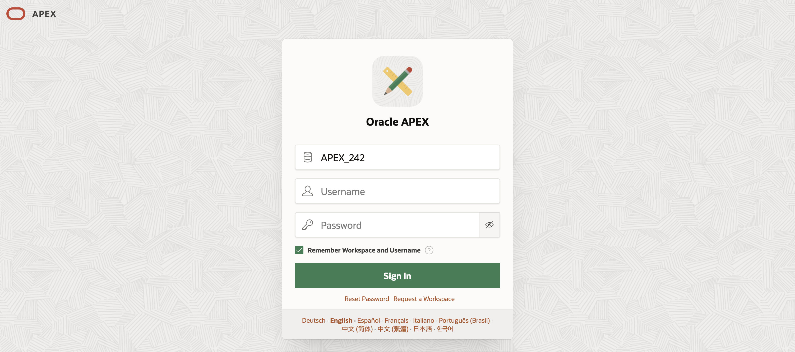
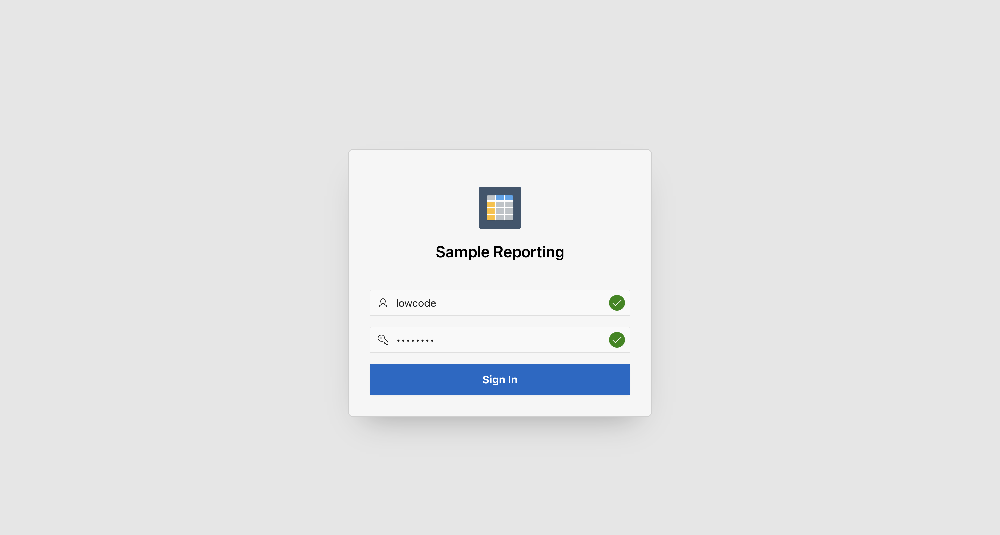
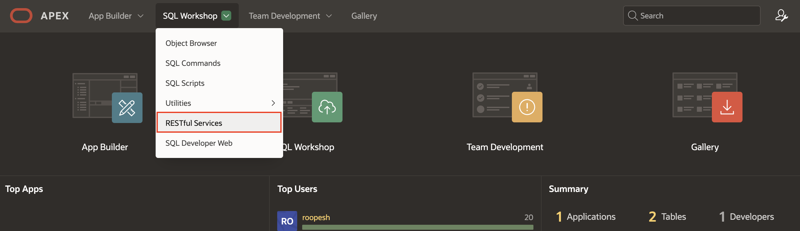
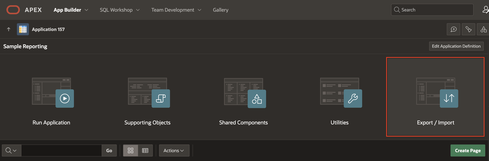
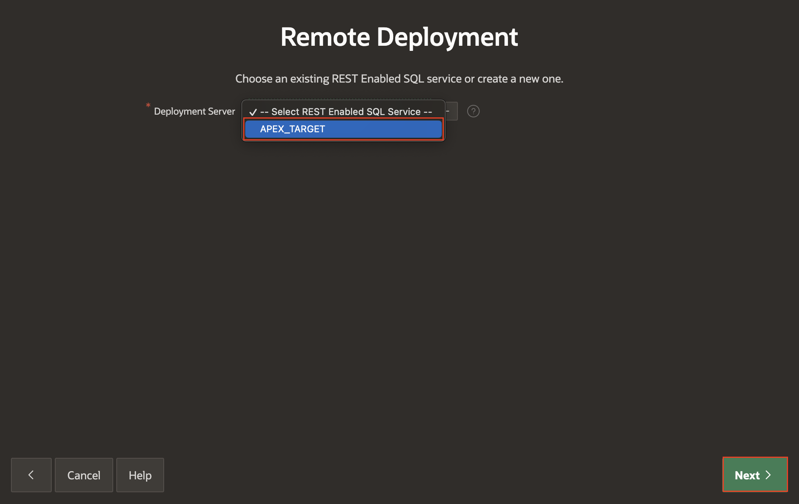

# Migrate Application Development Between Environments

## Introduction

In this lab, you will be using Remote Deployment to deploy your application from Development to UAT. The ORDS feature, **REST Enabled SQL** is not available for **apex.oracle.com** users. Therefore, you will not be able to perform this lab in the hosted instance apex.oracle.com. You should be using **APEX Service** or **APEX on Autonomous Database** options for this lab.

Estimated Time: 10 minutes

### Objectives

In this lab, you will:

- Export application with Supporting Objects.

- Use Remote Deployment to deploy your Application.

## Task 1: Import Sample application

The ORDS feature, **REST Enabled SQL** is not available for **apex.oracle.com** users. Therefore, you will not be able to perform this lab in the hosted instance apex.oracle.com. You should be using **APEX Service** or **APEX on Autonomous Database** options for this lab.

In this Lab, you will install a **Sample Application** in a new workspace you created either on **APEX Service** or **APEX on Autonomous Database**. Please follow the steps in **Get Started with Oracle APEX** workshop to provision an instance or to create workspace on **APEX Service** or **APEX on Autonomous Database**.

1. Log in to the new workspace you created.

    

2. Navigate to **Gallery**. Under **Sample Apps**, search for apps by typing "**Reporting**" into the "Search Apps" search box and navigate to **Sample Reporting**.

    

3. Click **Install**.

    

4. You can now see that the application is installed. Run the application by selecting **Run Application**.

    

5. Log in to the **Sample Reporting** application as an End User. Enter your **Username** and **Password** (Same as your Workspace credentials) and click **Sign In**.

    

6. You now see the Sample Reporting application home page. In your Runtime environment, under **Developer Toolbar**, click **Home** to return to the home page of the APEX development environment.

    

7. Click **App Builder**.

    

8. Toggle between the **View Icons** and the **View Reports** buttons. You see that applications are displayed along with their icons and report format.

    

    

## Task 2: Configure the Target System

In this Lab, you will enable the **Target System** to **ORDS**, and then you will copy the URL and paste it into your notepad.

**Note**: You need to provision a new **APEX Service** or **APEX on Autonomous Database** and create a new workspace in order to perform this lab.

1. Log in to your **Target System**.

   

2. Navigate to **SQL Workshop > RESTful Services**.

   

3. Click **Register Schema with ORDS**.

   

4. Review the **ORDS Schema Attributes** and click **Save Schema Attributes**. Now, you see a message that the schema has been successfully registered.​

   

5. Navigate to **SQL Workshop > Restful Services**. Expand **RESTful Data Services > Modules > oracle.example.hr > empinfo/ GET**. Copy the **Full URL** and paste it into your **Clipboard** or **Notepad**.

   

6. Click **Sign Out**.

   

## Task 3: Remote Deployment

Your application is now ready for deployment. Perform the following steps:

1. Log in to your development environment (WS_APEXDEV in this example)

   

2. Navigate to your application home page. select **App Builder** and then click **Sample Reporting**.

   

3. Click **Export / Import**.

   

4. Select **Remote Deployment** and click **Next**.

   

5. Choose an existing **REST Enabled SQL Service** or create a new one. In this example, click the **Add Deployment Server** ( **+** ) icon next to the Deployment Server select list.

   

6. Enter the base URL for the **REST Enabled SQL Service** defined for your deployment server (APEX\_HANDSON\_TARGET in this example). The schema in your deployment server has already been enabled for use with ORDS RESTful Data Services in prerequisites.

    For **Endpoint URL**, paste the base URL copied from the deployment instance in the previous step(**Task 2**). The base URL should include the ORDS context root and schema URL prefix. For example, https://host:8096/ords/apexstage. Then, click **Next**.

    

7. In the **Create REST Enabled SQL Service - Authentication** wizard, perform the following steps.

    - Credential Name: **Credential for APEX\_TARGET**.

    - Username: provide the workspace associated **Schema Name**. In this example, enter **wksp_apexhandsontarget**.

    - Password and Verify Password: enter your Schema Password.

    Click **Create**.

    

8. Now you see a message that REST Enabled SQL Service has been created.

    

9. From the Deployment Server select list, choose the one that you just created.

    

10. Click **Next**.

    

11. The Remote Deployment Options page appears.

    - Deploy Application > Build Status Override: **Run and Build Application**.

    - Export Preferences > Export Supporting Object Definitions: **Yes and Install on Import Automatically**.

    - **Deployment Overrides**: In this example, even though the application does not yet exist on the target system, turn the **Overwrite Existing Application option** **On** so that you can preserve the application ID, and enable this application for future overwrites.

    After making the above selections, click **Deploy**.

    

12. You see the Remote Deployment Successful message. Your application has been successfully deployed to the remote server.

    

13. Log in to your remote APEX instance. Make sure that the application is available and with the same application id as in the source system.

    

## Summary

You now know how to deploy your application from Development to Target.

## Acknowledgements

- **Author** - Roopesh Thokala, Senior Product Manager; Ankita Beri, Product Manager
- **Last Updated By/Date** - Ankita Beri, Product Manager, December 2024
