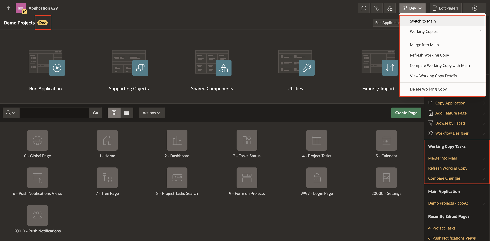
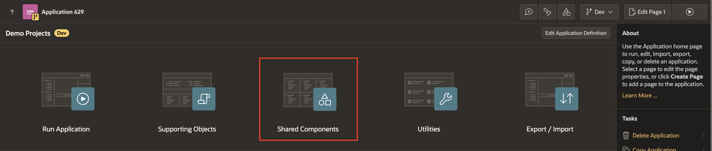
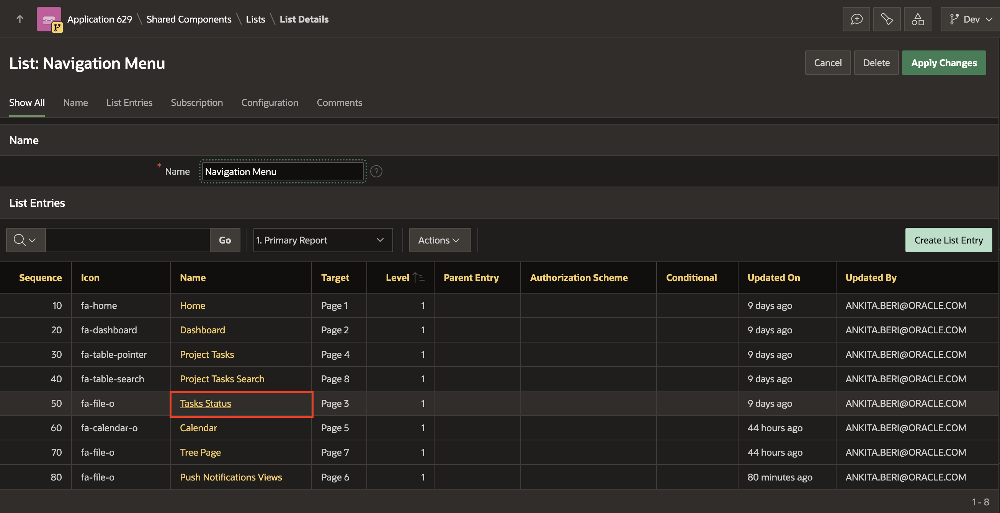
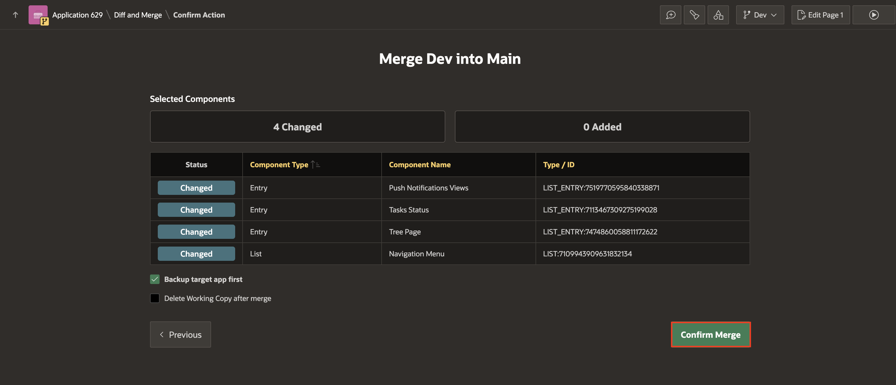
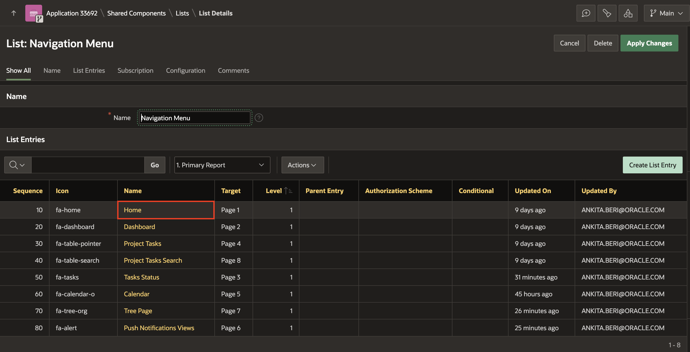
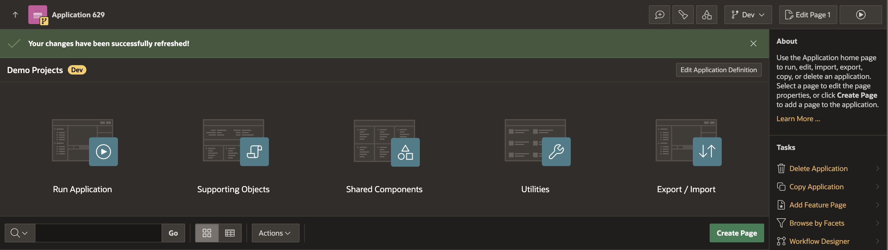

# Create a Working Copy to Merge, Refresh, or Compare

## Introduction

Oracle APEX allows developers to create and manage Working Copies of applications, enabling seamless collaboration, iterative testing, and controlled updates. A Working Copy serves as a sandbox for experimenting with changes before merging them back into the Main application. This lab demonstrates the complete lifecycle of managing a Working Copy, including creation, comparison, merging, and refreshing changes.

Estimated Time: 10 minutes

### Objectives

In this lab, you will:

- Create a Working Copy of an application.

- Compare changes between a Working Copy and the Main application.

- Merge updates from the Working Copy into the Main application.

- Refresh the Working Copy with changes from the Main application.

## Task 1: Create a Working Copy of an Application

Creating a Working Copy is the first step in isolating changes. In this task, you'll learn how to create a Working Copy of an existing application, allowing you to work on updates without affecting the Main application.

1. On the Workspace home page, click the **App Builder** icon and select **Demo Projects** application.

2. On the Application home page, find **Working Copy Tasks** on the side bar.

    

3. Under **Working Copy Tasks**, click **Create Working Copy**.

    

4. On Create Working Copy page, enter/select the following:

    - Working Copy Name: **Dev**

    Click **Create Working Copy**.

    

5. When viewing a Working Copy on the Application Home page, the Working Copy Name displays next to the application name and a Working Copy: Name menu displays on the menu bar between Shared Components and Edit Page.

    - Options on the Working Copy: Name menu include:

        - **Switch to Main** - Links to the Main application.

        - **Working Copies** - Displays links to existing working copies.

        - **Merge into Main** - Merge changes from the Working Copy into the Main application.

        - **Refresh Working Copy** - Import changes from the Main application into the Working Copy.

        - **Compare Changes** - Compare changes between the Working Copy and Main application.

        - **View Working Copy Details** - View or edit the Working Copy Name or Description.

        - **Delete Working Copy** - Delete the current Working Copy.

    - The side bar on Application home page features links to these commonly uses options:

        - **Working Copy Tasks**:

            - Merge to Main

            - Refresh Working Copy

            - Compare Changes

        - **Main Application** - Include a link to the Main application.

    

## Task 2: Compare Changes between a Working Copy and Main

Once changes are made in the Working Copy, it’s essential to identify the differences with the Main application. This task guides you through the process of comparing changes, helping you assess what’s been modified, added, or removed.

1. To compare changes between a Working Copy and the Main Application, let's make changes in the Demo Projects application.

2. Navigate to **Navigate to Demo Projects - Dev Working Copy** application, select **Shared Components**.

    

3. Under **Navigation and Search**, select **Navigation Menu**.

    

4. Select **Navigation Menu**.

    

5. Under **List Entries**, select **Tasks Status**.

    

6. For **Image/Class**, enter **fa-tasks** and click **Apply Changes**.

    

7. Now similarly, update **Image/Class** for the following list entries:

    | List Entries > Name | Image/Class |
    |-------              |-------      |
    | Tree Page | fa-tree-org |
    | Push Notification Views | fa-alert |

8. As you have made the changes in your working copy, now let's compare the changes between a Working Copy and Main.

9. Go to the Application Home Page, under **Working Copy Tasks**, select **Compare Changes**.

    

10. App Builder exports the Main app and Working copy and compares the two versions. The **Compare Dev with Main** dialog appears summarizing what has been changed, added, or is missing.

    

## Task 3: Merge Changes between a Working Copy and Main

After verifying your updates, you can integrate them into the Main application. This task covers the merging process, ensuring a smooth transition of changes while maintaining application stability.

1. Navigate **Demo Projects - Dev Working Copy** application. Under **Working Copy Tasks**, select **Merge into Main**.

    

2. The **Merge Dev into Main** dialog appears.

    - To view a Diff of the changes, click the Compare Changes icon. The View Differences window appears. Click Close to exit the window.

    - To exclude a change, deselect the row.

    - To continue, click **Next**.

3. Let's merge all the changes and leave everything as default. Click **Next**.

    

4. The Merge Project Name into Main dialog now includes two new options appears:

    - Backup target app first

    - Delete Working Copy after merge

    Click **Confirm Merge**.

    

5. The Application home page appears and displays the message: **Your changes have been successfully merged!**

    

## Task 4: Refresh a Working Copy with Changes from Main

Applications often evolve in the Main branch while you work on a Working Copy. This task teaches you how to refresh the Working Copy with updates from the Main application, ensuring your Working Copy reflects the latest changes.

1. To refresh a Working Copy, let's make some changes in the Main application. You will set up **Dashboard** page as the **Home** page. First, switch to Main application.

    

2. Navigate to **Demo Projects** applications, select **Shared Components**.

    

3. Under **Navigation and Search**, select **Navigation Menu**.

    

4. Select **Navigation Menu**.

    

5. Under **List Entries**, select **Home**.

    

6. Under **Target**, update **Page** to **2** and click **Apply Changes**.

    

7. Under **List Entries**, select **Dashboard**.

    

8. Click **Delete** and confirm by clicking **OK**.

    

    

9. Go to the Application Home Page. Now, navigate to **Dev** working copy, under **Working Copy Tasks**, select **Refresh Working Copy**.

    

    

10. The Refresh Name from Main dialog appears summarizing what has been changed, added, or is missing. Click **Next**.

    

11. Configure Backup target app first as appropriate and click **Confirm Refresh**.

    

12. The Application home page appears and displays the message: **Your changes have been successfully refreshed!**

    

## Summary

You now know how to create a Working Copy, compare its changes with the Main application, merge updates seamlessly, and refresh the Working Copy to stay aligned with the Main application. With this knowledge, you can confidently implement iterative changes while maintaining application integrity.

## Acknowledgements

- **Author** - Ankita Beri, Product Manager
- **Last Updated By/Date** - Ankita Beri, Product Manager, December 2024