# Enhance the App with Mobile Features

## Introduction

In this lab, you improve the user experience of the Social Media App by including an APEX 23.2 new item called Image Upload that allows the user to crop images before uploading. You also implement a 'Share' button where a user can share the uploaded images to other users via email or 3rd party apps. Finally, you add mobile capabilities to the app by enabling Push Notifications for the Social Media App where a user receives a notification on their device whenever a user likes the image. You also learn to add Shortcuts and Screenshots to the pwa app.

Estimated Time: 20 minutes

### Objectives

In this lab, you:

- Enable Push Notifications
- Learn how to configure Push Notifications

## Task 1: Enable Push Notifications

1. 1. Navigate to the **Demo Projects** application.

   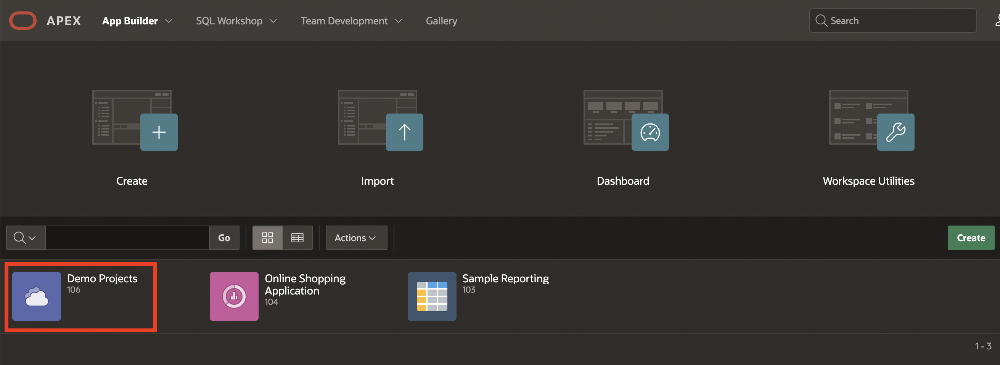

2. In the App Builder, select **shared components**.

   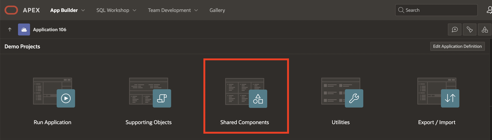

3. Under **User Interface**, select **Progressive Web App**.

   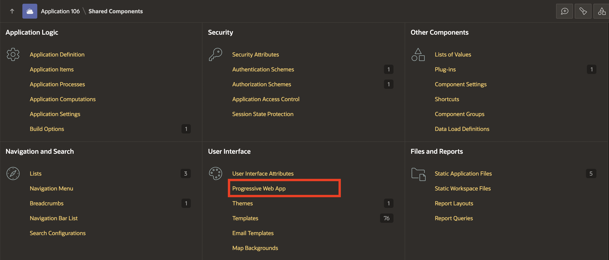

4. Navigate to **Push Notifications** tab and toggle the **Enable Push Notifications** button to **ON**.

    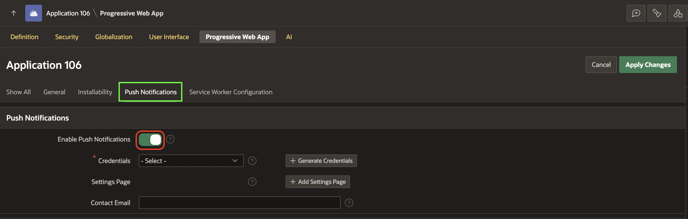

5. Click **+ Generate Credentials** and select **Generate Credentials** in the confirm dialog window.

    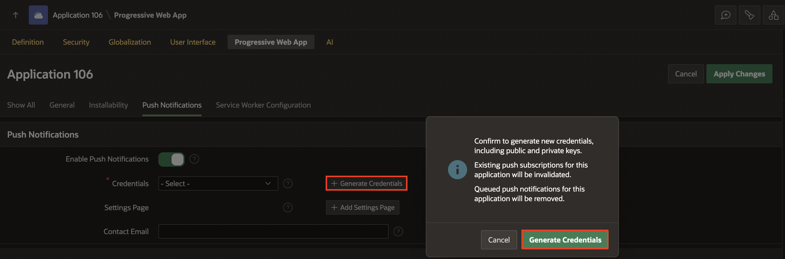

6. Click **+ Add Settings Page**.

    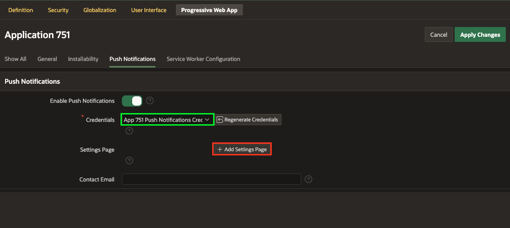

7. Under **Create Push Notifications Settings Page** dialog, click **Create**.

    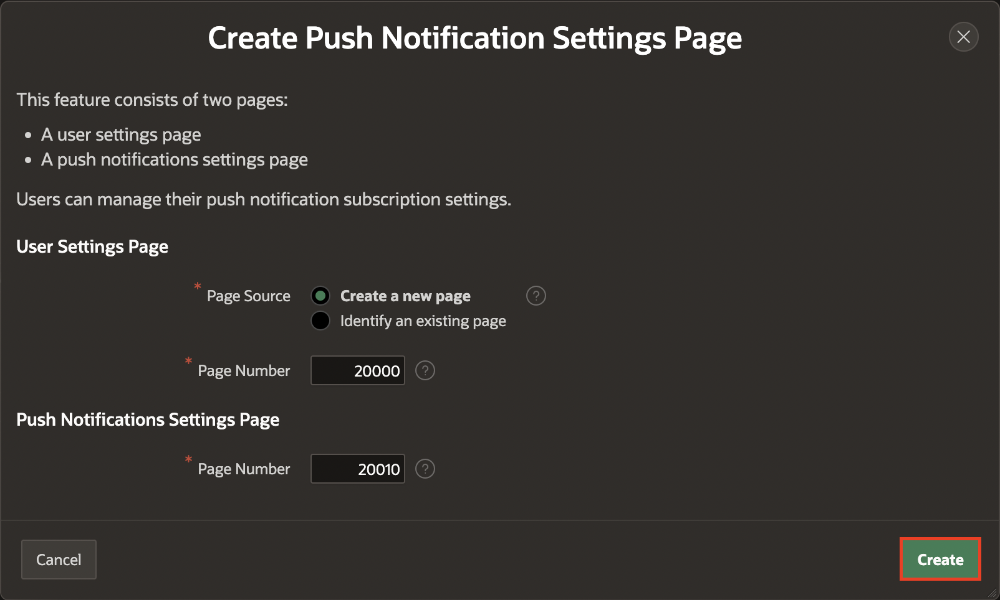

8. Now, click **Save and Run**.

    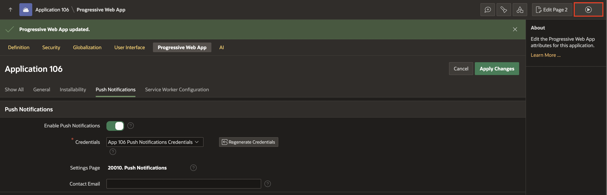

9. In the **Demo Projects** application, click on your username at the top-right corner and select **Settings**.

    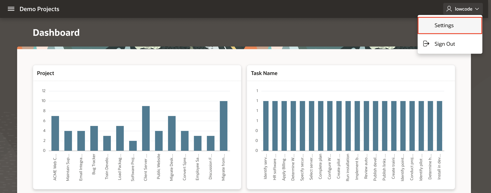

10. Push Notifications is disabled by Default. Click **Off** and enable the checkbox for **Enable push notifications on this device**.

    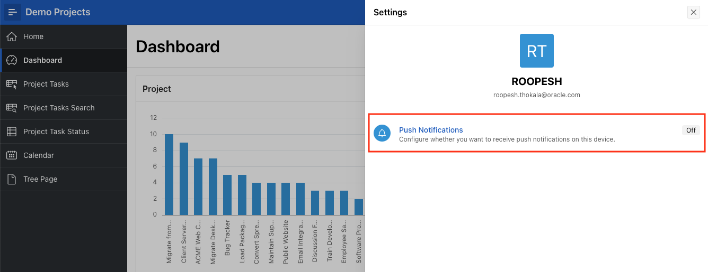

    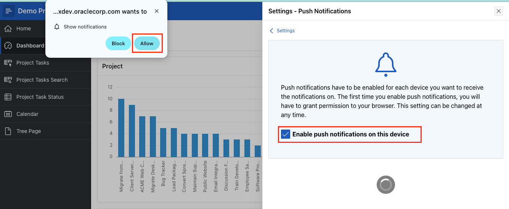

11. Push Notifications is now enabled for the username.

> **Note:**

- If you are unable to see the Push Notifications, ensure that the DND option is disabled in your system and your browser has necessary permissions to send notifications.

- View the compatibility matrix of Push Notifications [here](https://apex.oracle.com/pls/apex/r/apex_pm/apex-pwa-reference/push-notifications)

## Task 2: Creating a Page with reports for Push Notifications Views

No matter the approach you opt for in sending push notifications, it is crucial (especially for the APEX engine) to possess the ability to recognize users who have subscribed to this feature. This recognition is essential for the meaningful utilization of page processes or the API. APEX provides two distinct views to assist in analyzing records, revealing the subscribers to push notifications within your application, as well as the notifications currently in the queue.

1. Navigate to the **Demo Projects** application.

    

2. Click **Create Page**.

    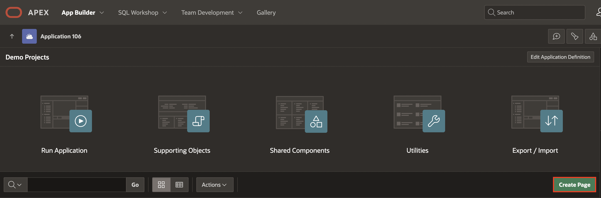

3. Select **Blank Page**.

    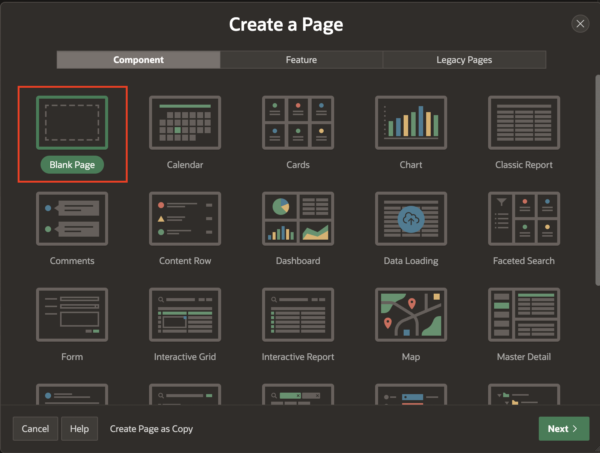

4. For Page Attributes, enter/select the following:

    - Page Definition > Name: **Push Notifications Views**

    - Navigation > Use Breadcrumb: **Toggle Off**

    Click **Create Page**.

    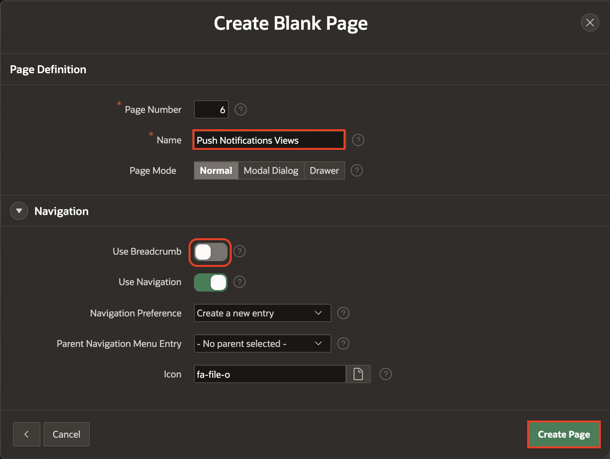

5. Right-click **Body** , select **Create Region**.

   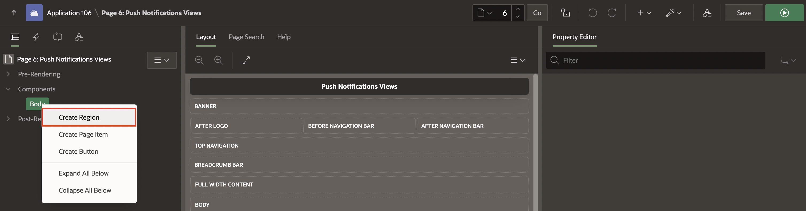

6. In the Property Editor, enter/select the following:

    - Identification> Title: **PWA Views**

    - Appearance > Template: **Tabs Container**

    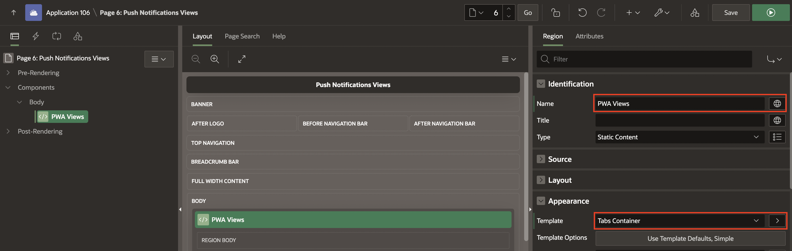

7. Right-click **PWA Views** and click **Create Sub Region**.

    

8. In the Property Editor, enter/select the following:

    - Under Identification:

      - Title: **Push Notifications Subscriptions**

      - Type: **Interactive Report**

    - Source > Table Name: **APEX_APPL_PUSH_SUBSCRIPTIONS**.

    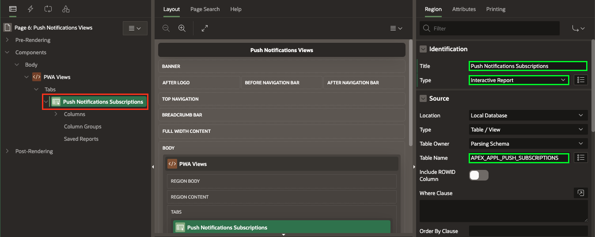

9. In the Rendering Tree, Right-click **PWA Views** and click **Create Sub Region**.

    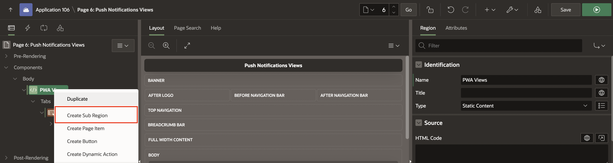

10. In the Property Editor, enter/select the following:

    - Under Identification:

      - Title: **Push Notifications Queue**

      - Type: **Interactive Report**

    - Source > Table Name: **APEX_PUSH_NOTIFICATIONS_QUEUE**

    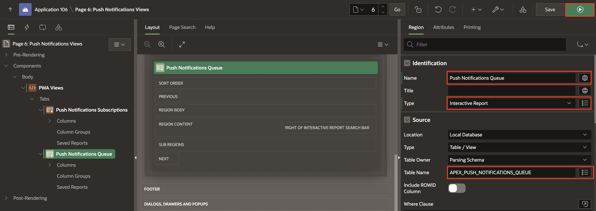

11. Click **Save** and **Run** on the top right corner.

## Task 3: Create Page Processes to send Push notifications

APEX offers two methods for sending push notifications from an app. Each offers its own benefits and levels of control. Understanding these methods can help you choose the best approach for your specific needs.

**Send using Page Process**
The built-in 'Send Push Notification' page process lets you send a notification declaratively. This option is ideal for users who prefer a straightforward process without the need for extensive customization. This process sends a notification to a single user, although this user might have multiple devices expecting the same notification. To use this process, simply fill in the required fields, including the username, title, and description of the push notification. The process ensures your message is delivered to the intended recipient on any of their devices on which they've opted-in to receive notifications.

**Send using API**
For users seeking more control over the appearance and content of their push notifications, the apex_pwa API offers more flexibility. By using this API, you can manage additional parameters such as the icon and a different destination application. This approach is useful for looping through multiple users and sending multiple notifications at once.

1. In the **Demo Projects** application, navigate to **Page 4**.

2. Navigate to **Processing** tab. Right-click **Process** and click **Create Process**.

    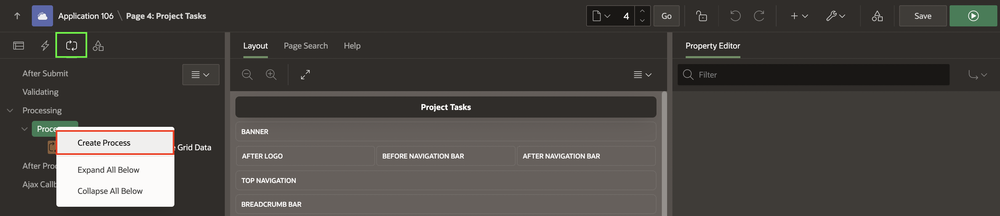

3. In the Property Editor, enter/select the following:

    - Under Identification:

      - Title: **Send Push Notification**

      - Type: **Send Push Notification**

    - Under Settings:

      - To: Enter a username for whom you have Subscribed Push Notifications.

      - Title: **Hey There!**.

      - Subject: **Welcome to PWA Push Notifications**.

    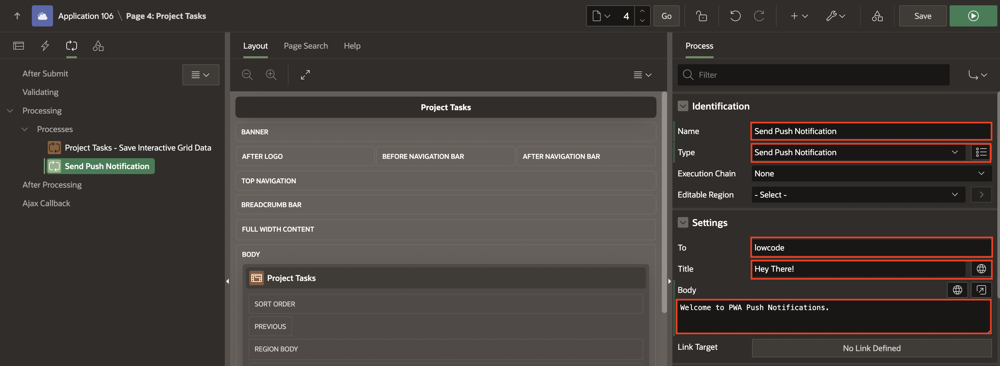

4. Right-click **Process** and click **Create Process**.

    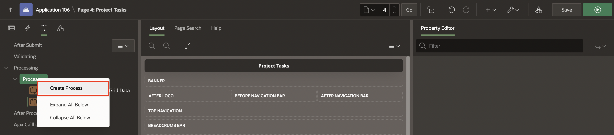

5. In the Property Editor, enter/select the following:

    - Under Identification:

      - Title: **APEX PWA API**

      - Type: **Invoke API**

    - Under Settings:

      - Package: **APEX_PWA**

      - Procedure or Function: **SEND_PUSH_NOTIFICATION**.

    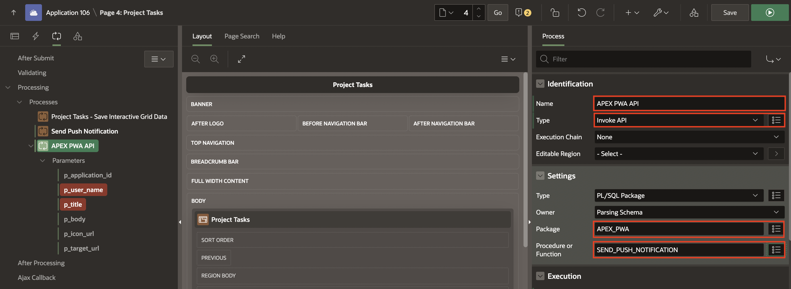

6. Select **p_user_name** parameter. In the Property Editor, enter/select the following:

    - Under Value:

      - Type: **Static Value**

      - Static Value: Enter a username for whom you have Subscribed Push Notifications.

    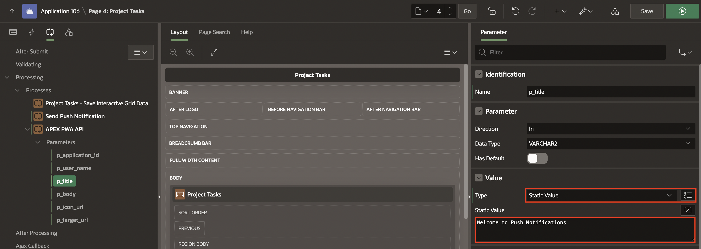

7. Select **p_title** parameter. In the Property Editor, enter/select the following:

    - Under Value:

      - Type: **Static Value**

      - Static Value: **Welcome to Push Notifications**.

    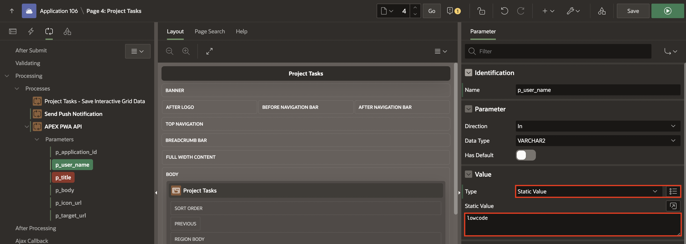

8. Click **Save**.

## Summary

In this lab, you learnt to enhance the **Demo Projects** app with Push Notifications.

## Acknowledgments

- **Author** - Roopesh Thokala, Senior Product Manager; Ankita Beri, Product Manager
- **Last Updated By/Date** - Ankita Beri, Product Manager, December 2024
