# Enhance the App with Mobile Features

## Introduction

In this lab, you improve the user experience of the Demo Projects App. You also implement a 'Share' button where a user can share the pages to other users via email or 3rd party apps. Finally, You also learn to add Shortcuts, Screenshots and Meta Tags to the PWA app.

Estimated Time: 15 minutes

### Objectives

In this lab, you:

- Implement the 'Share' button
- Enable Push Notifications
- Add Shortcuts to the pwa app
- Include screenshots to be displayed while installing the pwa app

## Task 1: Configure Progressive Web Application

1. Navigate to the **Demo Projects** Application.

    

2. In the App Builder, select **shared components**.

    

3. Under **User Interface**, select **Progressive Web App**.

    

4. Under **General**, set **Installable** to **Yes**.

   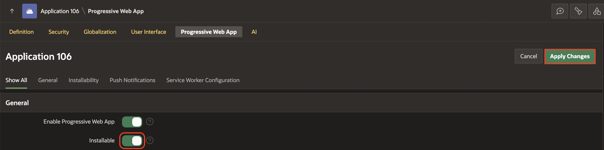

5. Click **Apply Changes**.

## Task 2: Enhance the PWA install experience with Screenshots

The Oracle APEX Progressive Web App screenshots are used for promotional purposes when users are prompted to install the Progressive Web App.

1. Navigate to **Demo Projects** application and select **Shared Components**. Under **User Interface**, select **Progressive Web App**.

   

2. Under **Screenshots**, click **Add Screenshot**.

   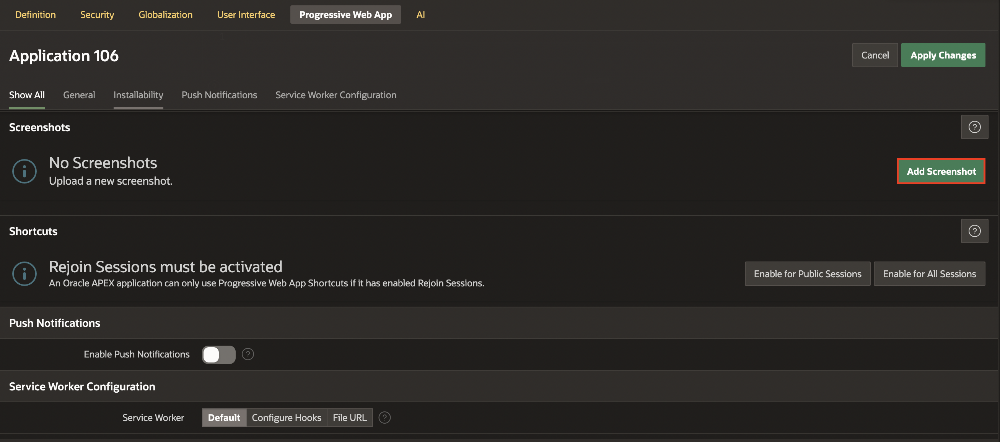

3. Click **Upload a Screenshot**.

    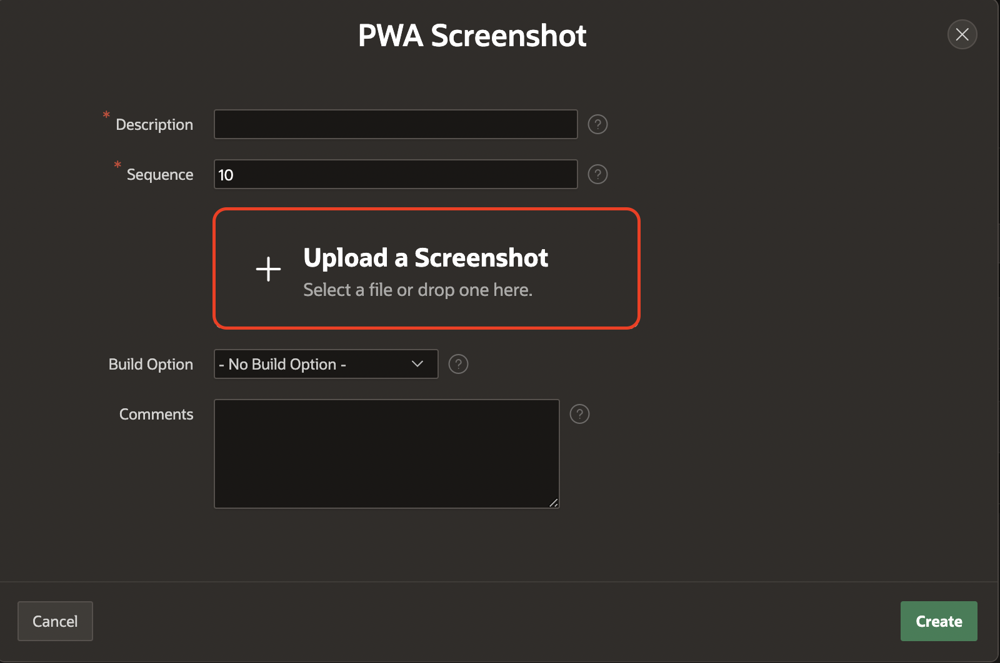

   > **Note:** You can download the images by clicking on the links: [**app-screenshot-1.png**](images/app-screenshot-1.png) , [**app-screenshot-2.csv**](images/app-screenshot-2.png)

4. From your local system, select the Screenshot that you wish to upload. In this case, select **app-screenshot-1** from your local system. And then, Click **Create**.

    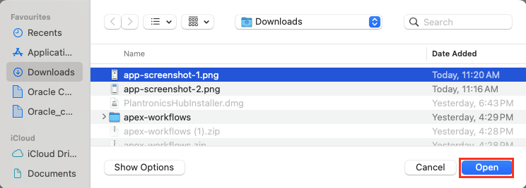

    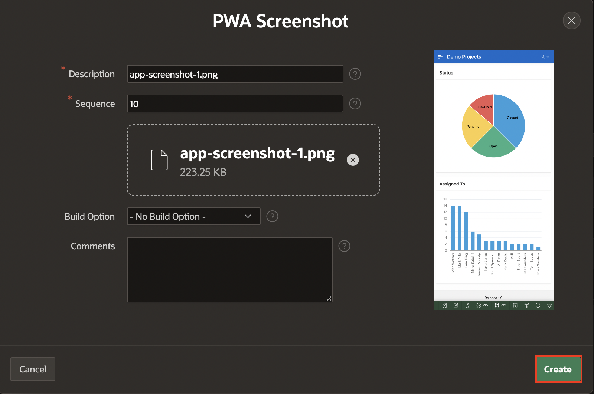

5. Repeat steps 2-4 to add as many screenshots as you like and click **Apply Changes**. In this case, add **app-screenshot-2** which you have downloaded earlier.

    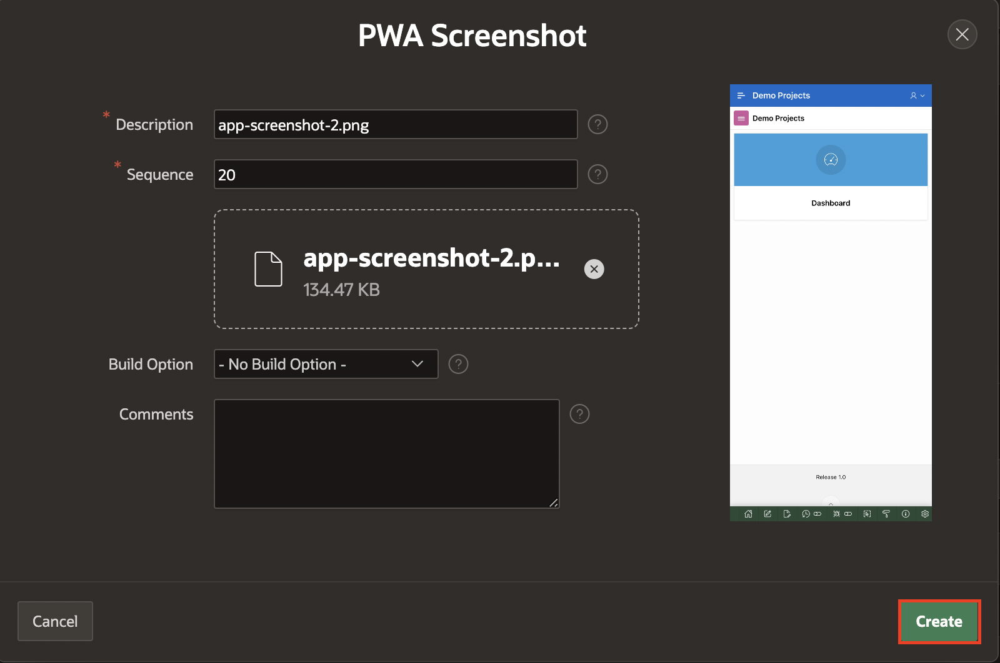

6. Click **Apply Changes**.

     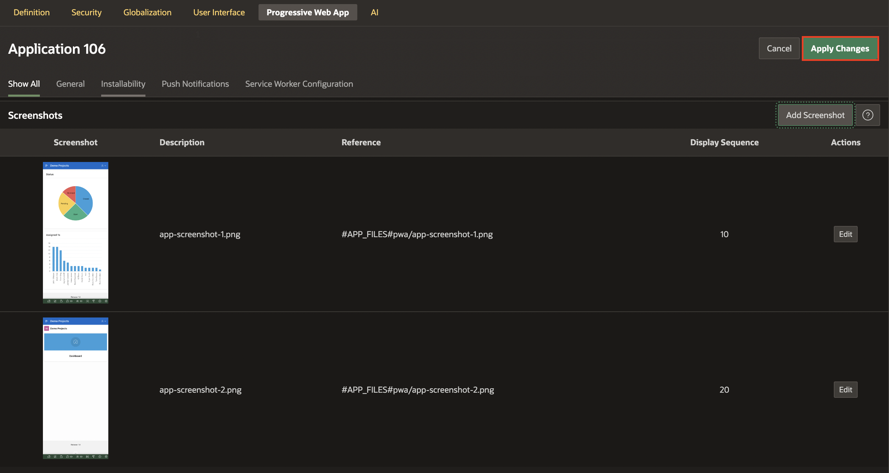

   >**Note:**

    - View the compatibility matrix for the **Screenshots** [here](https://apex.oracle.com/pls/apex/r/apex_pm/apex-pwa-reference/installation)

    - View the compatibility matrix for the **Shortcuts** [here](https://apex.oracle.com/pls/apex/r/apex_pm/apex-pwa-reference/app-icon)

## Task 3: Add Shortcuts for the PWA app

Oracle APEX Progressive Web App shortcuts provide a convenient way for users to access specific pages within the application.

On touch-enabled devices, users can simply long-press on the home screen app icon to access the shortcuts. For non-touch devices, such as computers, users can right-click on the taskbar app icon to access the same feature.

By providing these shortcuts, Oracle APEX enhances the user experience and makes it easier for users to quickly access the pages they need within the PWA.

1. Scroll down to **Shortcuts** and click **Enable for All Sessions**. In the popup window, confirm by clicking **Enable for All Sessions**.

    > **Note:** This option does not work in *apex.oracle.com* instance.

    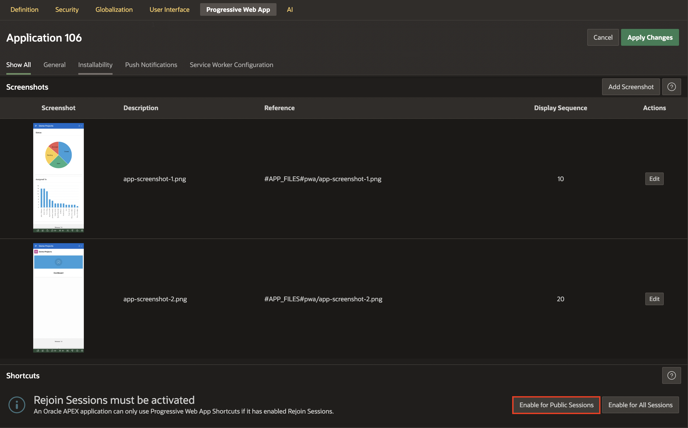

    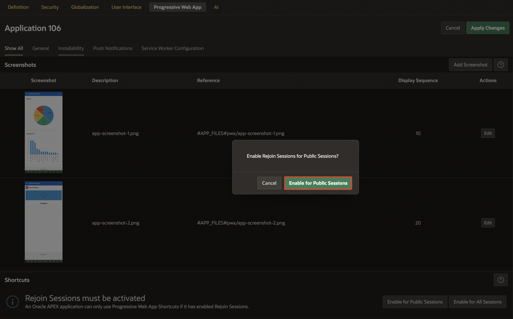

2. Click **Add Shortcut**.

   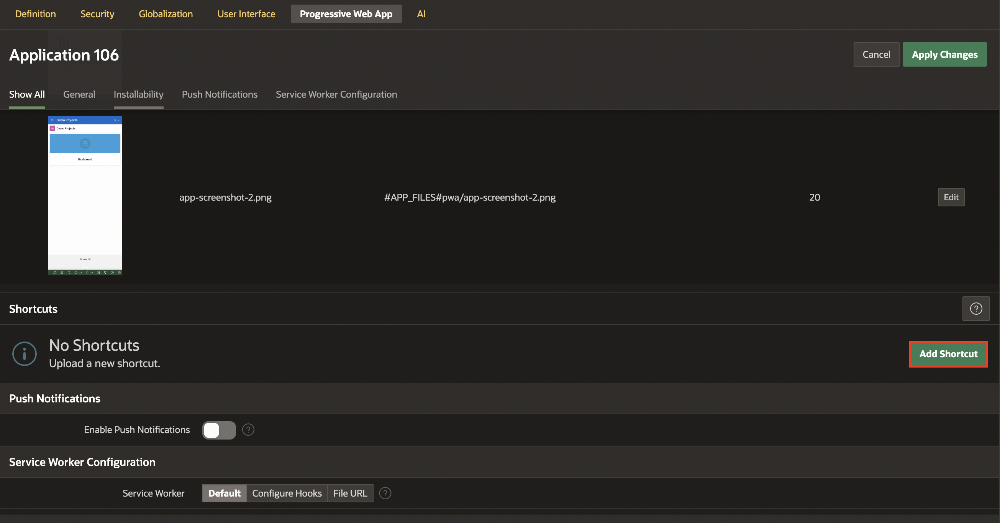

3. In the **Add Shortcut** dialog, enter/select the following:

    - Name: **Dashboard**

    - Target URL: click **Item Picker** and select **Dashboard** page.

    - Upload an Icon: click **Upload an Icon** and select the icon from your local system.

    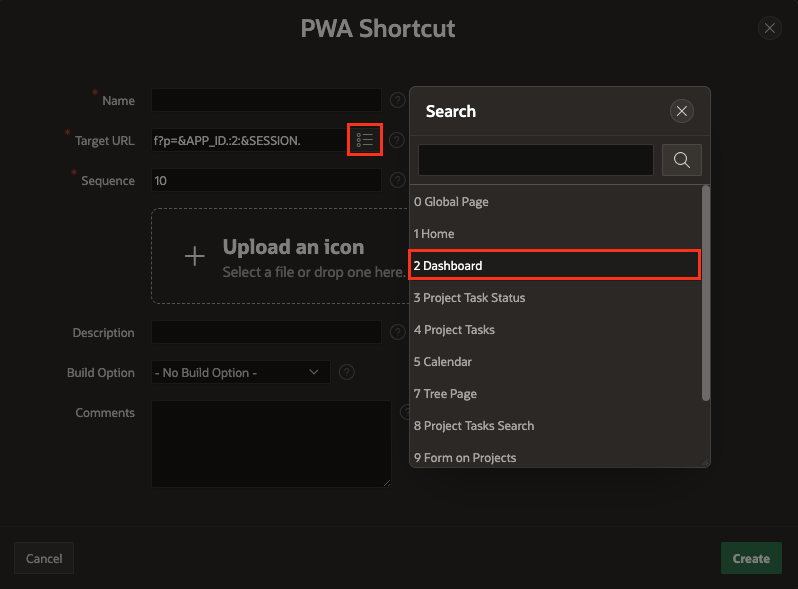

    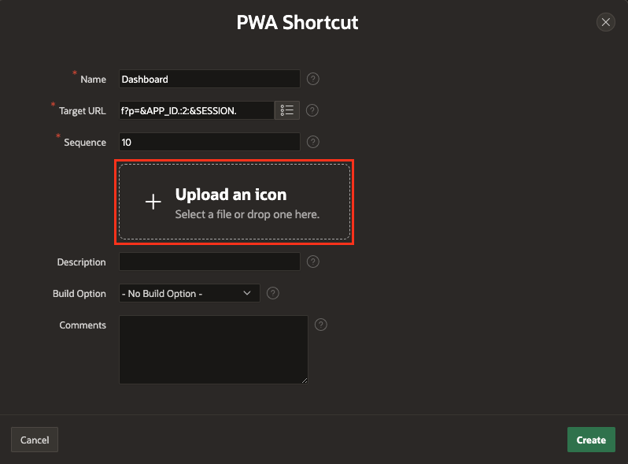

    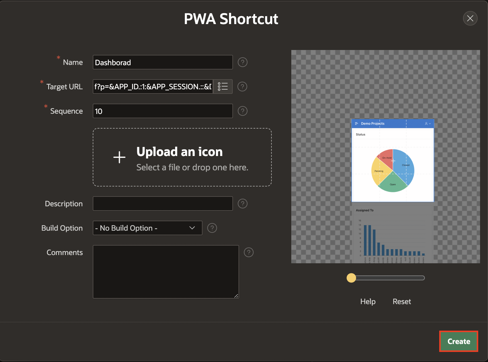

4. Click **Create**. Similarly, you can add multiple shortcuts each pointing to a different page in your app.

## Task 4: Add the Share Button

In this task, you add a **Share** button that allows a user to share the post via email, or other apps.

> **Note:**

  - On macOS, Share will NOT work on Chrome and Firefox browsers. Use Edge or Safari browsers.

  - On Windows, Share will NOT work on Edge browser. Use Chrome, Edge or Safari browsers.

1. Navigate to the **Dashboard** in your **Demo Projects** application.

    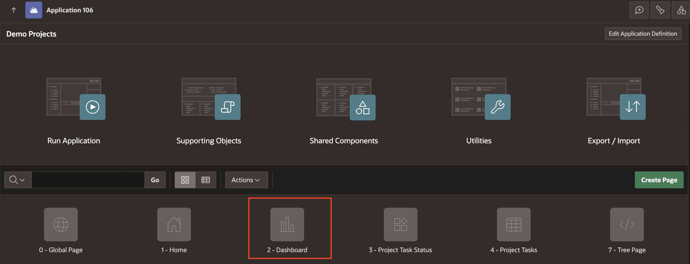

2. Right-click **Body** and select **Create Button**.

    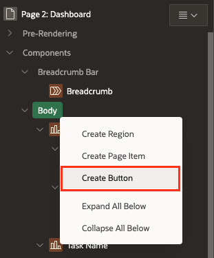

3. In the Property Editor, enter/select the following properties:

    - Under Identification:

        - Button Name: **Share**

        - Label: **Share**

    - Layout > Sequence: **5**

    - Under Appearance:

        - Hot: **Toggle On**

        - Icon: **fa-share-alt**

    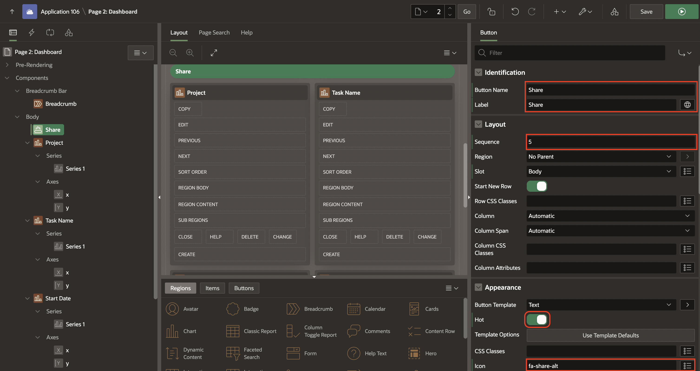

4. Right-click **Share** button and click **Create Dynamic Action**.

    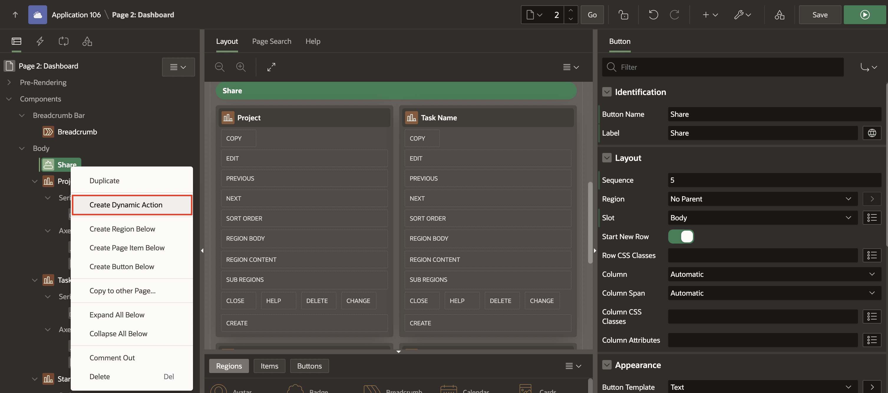

5. In the Property Editor, enter the following:

    - Identification > Name: **Share Page**

    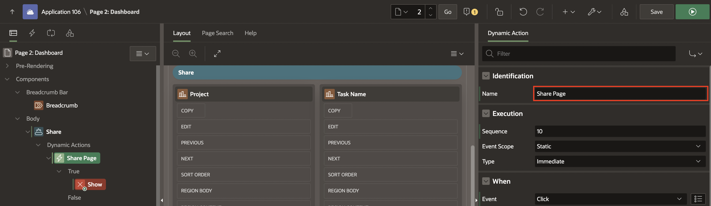

6. Under **True Action**, select **show** and in the Property editor enter/select the following:

    - Under Identification:

        - Name: **Share**

        - Action: **Share**

    - Under Settings:

      - Title: **Share Dashboard Page**

      - Text: **Sharing the Dashboard Page to the World!**

    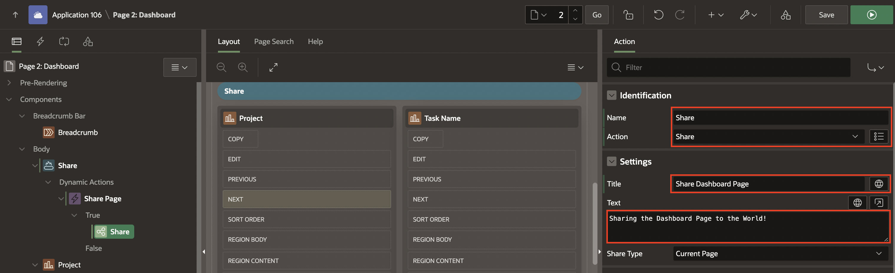

7. Click **Save**.

## Task 5: Configure Meta Tags

Meta tags are pieces of information about a web page that allows other systems to read a summary of the page content. Sharing APEX pages is more convenient when the content of that page can be previewed on other social media platforms. APEX allows to define meta tags for **public-facing** APEX pages directly from Page Designer.

1. Navigate to the **Dashboard page** in your Demo Projects App.

2. In Page Designer, select **Page 2 : Dashboard** and in the Property Editor, enter/select the following:

    - Security > Authentication: **Page is Public**

    - Advanced > Enable Meta Tag: **Toggle On**

    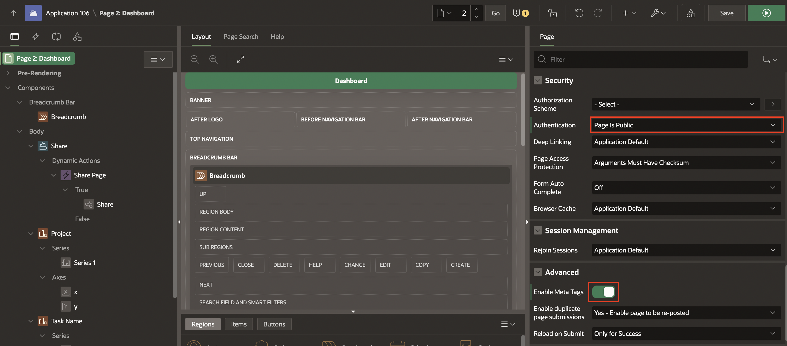

3. Under **Pre-Rendering**, a new section will appear. Select the newly created **Meta Tag** and in the Property Editor, enter/select the following:

    - Under Identification:

        - Name: **Description**

        - Value: **Web share - Demo Projects App, Dashboard**

    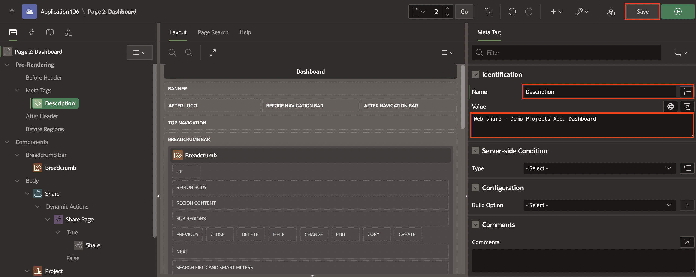

4. Click **Save**.

## Summary

In this lab, you learnt to enhance the **Demo Projects** app with mobile features such as sharing pages, and add the latest pwa features like Shortcuts and Screenshots.

## Acknowledgments

- **Author** - Roopesh Thokala, Senior Product Manager; Ankita Beri, Product Manager
- **Last Updated By/Date** - Ankita Beri, Product Manager, December 2024
