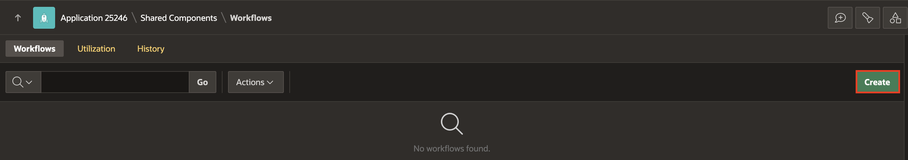
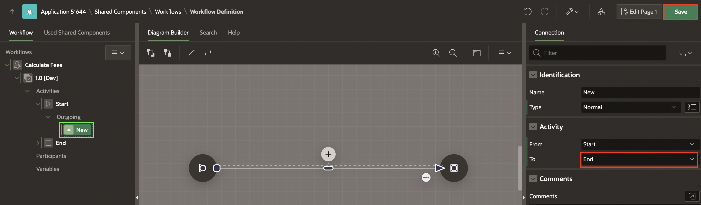
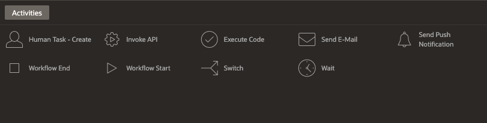

# Create Calculate Fees Workflow

## Introduction

In this lab, you will create a **Calculate Fees** Workflow to manage fee calculations. You will then integrate it into the **Doctor Appointment** Workflow using the **Invoke Workflow** activity. Invoke Workflow activity allows you to call and execute one workflow from within a parent workflow, enabling seamless integration between workflows.

### Objectives

In this lab, you learn how to:

- Create a Calculate Fees Workflow.

- Modify the Calculate Fees Workflow details.

- Add Calculate Fees Workflow Variables

Estimated Time: 20 minutes

### Prerequisites

- All the previous Labs have been completed.

## Task 1: Create the Workflow

To create a Workflow:

1. In the App Builder, navigate to **Doctor Appointments Made Easy!** application and select **Shared Components**.

   

   

2. Under **Workflows and Automations**, select **Workflows**.

   

3. In the Workflows Page, click **Create**.

   

4. This will lead you to the Workflow Designer. A new workflow with a Start Activity, Execute Code Activity, and End Activity will be auto-created.

   

## Task 2: Modify Workflow Details

1. Select **New** in the **Rendering** tab, in the Property Editor, enter/select the following:

    - Under Identification:

        - Name: **Calculate Fees**

        - Title: **Check Appointment Fee for patient &PATIENT_NAME.**

    - Advanced > Static ID: **CHECK\_APPT\_FEE**

    

2. In the left pane, select **New[Dev]** and in the property editor, for Workflow Version enter **1.0**.

    

    > **Note:** _You may have noticed the label [Dev] next to the version in the tree on the left pane. This means that this version of the Workflow is In Development and all parts of it are editable. We will learn about workflow versioning- Active vs. In Development versions in future labs in this workshop._

3. The Workflow cannot be saved yet as there are validation errors. Click on the **error icon (Yellow exclamation mark)** to see the error.

    

4. At this point, we will remove this activity since we plan to introduce new specific activities in subsequent sections of this lab. To do this, either right-click on the highlighted RED activity in the Workflow tree and select **Delete**, or click the three dots at the bottom right corner of the activity in the Diagram. This will open a menu, and choose **Delete** from the options provided.

   

   

5. Navigate to **Start**. Under **Outgoing**, select **New** and select the following:

    - Activity > To: **End**

   

6. Click **Save**.

## Task 3: Familiarize with Workflow Elements

1. At this stage, let's explore the fundamental elements and terminology of a workflow. You have introduced the notions of Activities and Connections in the Workflow. Now, let's take a moment to understand the different types of workflow elements and terms such as Activities, Connections, and Connection Types.

2. Refer to the Activity Palette at the bottom in the Designer for a list of activity types.

  

  | Activity Type         | Description                                                                                                              | Blocks the workflow engine until execution completes? |
  |------------------------|--------------------------------------------------------------------------------------------------------------------------|--------------------------------------------------------|
  | Execute Code           | Executes PL/SQL Code                                                                                                     | Yes                                                    |
  | Invoke API             | Invokes a procedure or function inside a PL/SQL package or an API from a REST Data Source.                              | Yes                                                    |
  | Send Push Notifications    | Sends push notifications using PWA                                                                                      | Yes                                                    |
  | Send E-Mail            | Sends an Email based on the Email settings.                                                                             | Yes                                                    |
  | Invoke Workflow          | An activity that invokes another workflow in the current application.settings.                                                                             | Yes                                                    |
  | Human Task - Create    | Creates an Approval or Action Task based on the Task Definition specified. Once the task is created, the activity and workflow go into the Waiting state until the task is completed/approved/rejected by its owner/errors out/expires. | No                                                     |
  | Wait                   | Denotes a deliberate pause in the workflow execution. At runtime, the workflow pauses execution when it encounters a Wait Activity. A Wait Activity can have timeout specifications. When the specified time has elapsed, the workflow resumes execution. A Wait Activity can also be interrupted by calling apex\_workflow.continue\_activity() passing the Static ID of the Wait Activity and the Workflow Instance ID as parameters. | No                                                     |
  | Switch                 | Denotes a fork or conditional branching in a workflow execution. After adding a switch activity, the developer must define branches or connections out of the switch activities with the appropriate conditions specified. | Yes                                                    |
  | Workflow Start         | Denotes the Start of a workflow. A workflow model must have exactly one Start Activity.                                   | Yes                                                    |
  | Workflow End           | Denotes the End of a workflow. Depending on the End State attribute of this activity, the Workflow is either Completed or Terminated. | Yes                                                    |
  {: title="List of Activity Types"}

  | Connection Type | Description                                                                                                        |
  |------------------|--------------------------------------------------------------------------------------------------------------------|
  | Normal           | Connects two activities in the workflow. No conditions. Not applicable for Switch Activities                         |
  | Timeout          | If an activity has a due date specified, the timeout connection can be used to move the workflow to an alternate target activity in case the current activity execution times out. Not applicable for Switch and Wait activities.  |
  | Error            | Allows for efficient error management within the workflow without letting it go into a state of exception. Not applicable for Switch activities.                                      |
  | Switch connections | Connections leading out of a Switch Activity. They are conditional in nature.                                      |
  {: title="List of Connection Types"}

## Task 4: Add Inputs to the Calculate fees Workflow

In this lab, you explore various aspects of workflow data using the example of a doctor appointment application that you are building. You will focus on understanding parameters, variables, activity variables, and additional data.

Referring to the flow chart in Lab 1, illustrating the business logic, the appointment booking process initiates with the Hospital Staff submitting patient details to the system, marking the commencement of the workflow.

The inputs to the workflow will be the patient details. In workflow terminology, these are called **Workflow Parameters**.

You will define the following parameters for the Calculate fees Workflow:
   BOOKING\_ID,
   DNO,
   PATIENT\_NAME, PATIENT\_EMAIL, REQUEST\_DATE, STATUS

1. To create Workflow Parameters, right-click **Calculate Fees** Workflow and select **Create Parameter**.

   

2. This adds a Parameter with a label "New" in the Workflow tree. In the Property Editor, enter/select the following:

    - Static ID: **BOOKING_ID**

    - Label: **Booking ID**

    - Data Type: **Number**

   

3. Similarly, add the following **Parameters** one after the other, given in the table below.

  |Static ID | Label | Data Type | Direction |
  |----------|-------|-------------|----------|
  | DNO | DNO | NUMBER |    |
  | PATIENT_EMAIL | Patient Email | VARCHAR2 |     |
  | PATIENT_NAME | Patient Name | VARCHAR2 |       |
  | REQUEST_DATE | Request Date | TIMESTAMP |  |
  | STATUS       |  Status      | VARCHAR2 | Out |
  {: title="List of Parameters to be Created"}

## Task 5: Add Workflow Variables

The inputs provided to the Appointment Workflow are read-only in nature. This means that, once the workflow is submitted, their values will never be modified. The workflow needs to process and pass data from one activity to the next.

As an example, consider the following business scenario:

Before an appointment is confirmed, the workflow needs to compute the doctor's availability based on his/her current appointment schedule. So, availability of the doctor is a variable that will be determined based on this computation.

When an appointment is confirmed, the Booking ID for the appointment is carried forward to later activities which calculate and update the appointment fees.

Data such as Availability, Booking ID and Fee need to be updatable by the activities of the workflow as part of the execution. Such data is defined as **Workflow Variables**.

1. Right-click **1.0 [DEV]** (workflow version), select **Create Variable**.

    

2. A new variable with Name **New** gets created in the tree. In the Property Editor, enter/select the following:

    - Identification > Static ID: **APPROVER**

    - Label > Label: **Approver**

   

3. Similarly, create a variable called **Fees**. In the Property Editor, enter/select the following:

    - Identification > Static ID: **FEES**

    - Label > Label: **Fees**

    - Variable > Data Type: **NUMBER**

   

4. Finally, create a variable **Task Outcome**. In the Property Editor, Enter/Select the following:

    - Identification > Static ID: **TASK_OUTCOME**

    - Label > Label: **Task Outcome**

   

5. Click **Save**.

## Summary

In this lab, you learned the process of creating a calculate fees Workflow using Oracle APEX.

## What's Next

In the next lab, you will learn how to create a Doctor Appointment Workflow using Oracle APEX.

You may now **proceed to the next lab**.

## Acknowledgements

- **Author(s)** - Roopesh Thokala, Senior Product Manager & Ananya Chatterjee, Consulting Member of Technical Staff.
- **Last Updated By/Date** -  Ankita Beri, Product Manager, December 2024
