# Create a Doctor Appointment Workflow

## Introduction

In this lab, you learn the process of creating a Doctor Appointment Workflow using Oracle APEX.

### Objectives

In this lab, you learn how to:

- Create a Doctor Appointment Workflow

- Modify theDoctor Appointment Workflow details

- Define Doctor Appointment Workflow Data

- Add Doctor Appointment Variables

Estimated Time: 20 minutes

### Prerequisites

- All the previous Labs have been completed.

## Task 1: Create the Workflow

To create a Workflow:

1. In the App Builder, navigate to **Doctor Appointments Made Easy!** application and select **Shared Components**.

   

   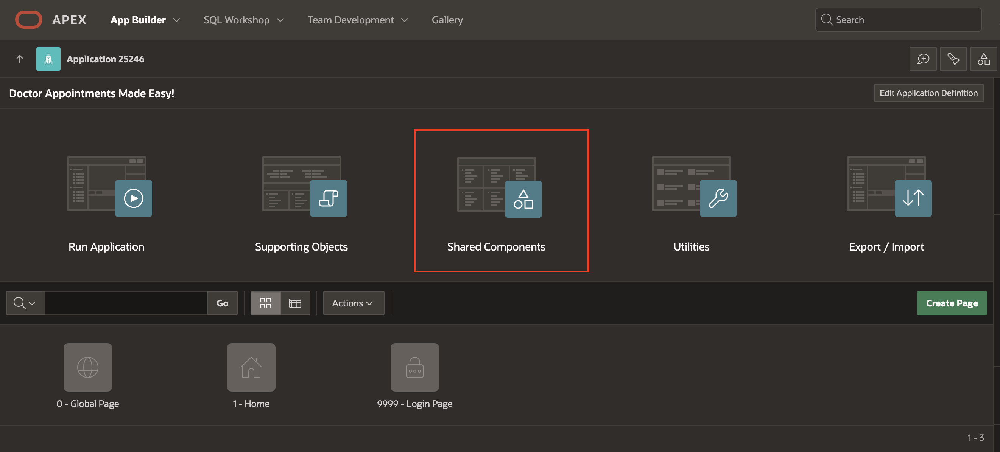

2. Under **Workflows and Automations**, select **Workflows**.

   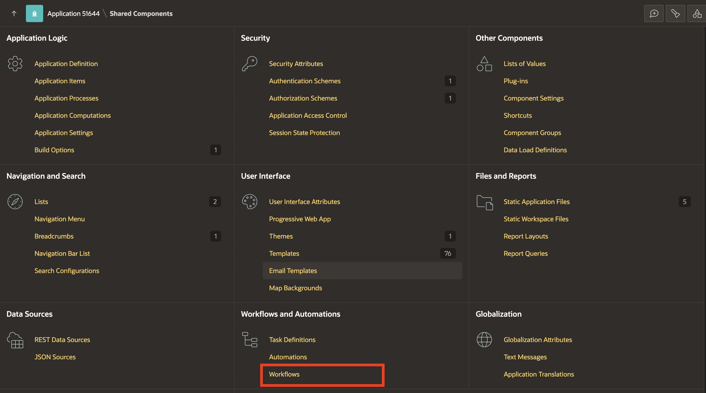

3. In the **Workflows** Page, click **Create**.

   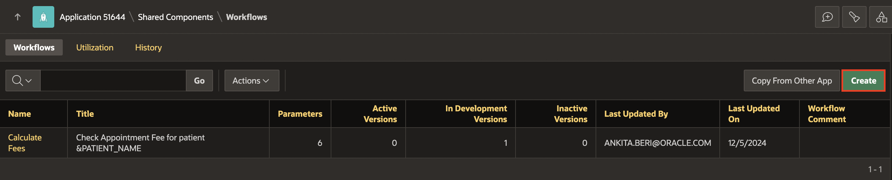

4. This will lead you to the Workflow Designer. A new workflow with a Start Activity, Execute Code Activity, and End Activity will be auto-created.

  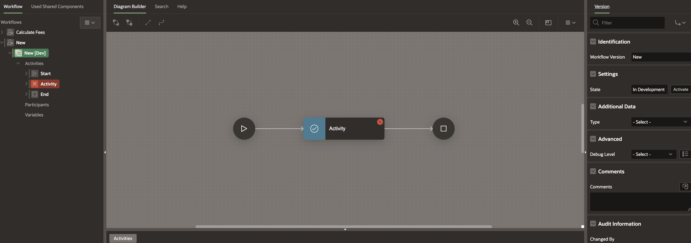

## Task 2: Modify Workflow Details

1. Select **New** and in the Property Editor, enter/select the following:

    - Identification > Name: **Doctor Appointment**

    - Advanced > Static ID: **DOC_APPT**

    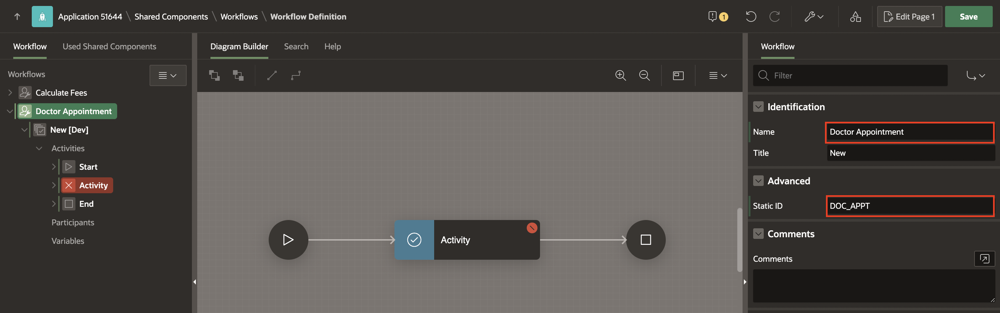

2. Select **New[Dev]** and in the property editor, for Workflow Version enter **1.0**.

   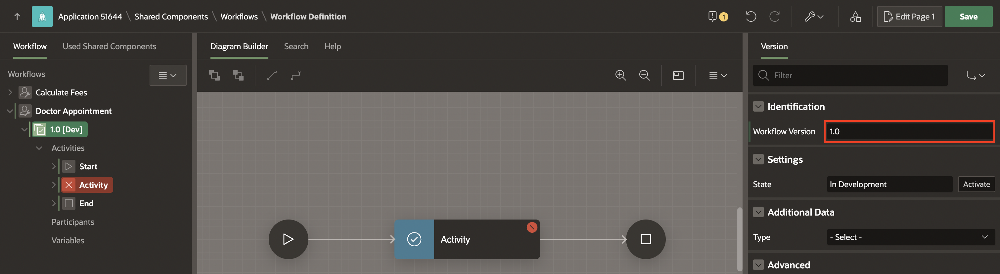

   > **Note:** _You may have noticed the label [Dev] next to the version in the tree on the left pane. This means that this version of the Workflow is In Development and all parts of it are editable. We will learn about workflow versioning- Active vs. In Development versions in future labs in this workshop._

3. The Workflow cannot be saved yet as there are validation errors. Click on the **error icon (Yellow exclamation mark)** to see the error.

   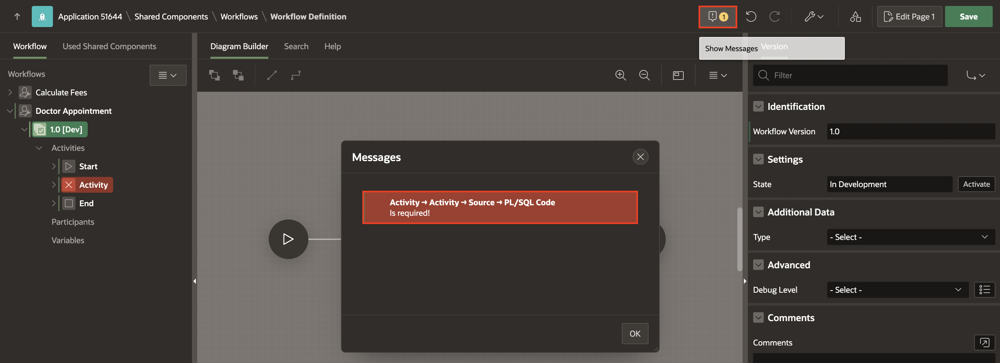

4. At this point, we will remove this activity since we plan to introduce new specific activities in subsequent sections of this lab. To do this, either right-click on the highlighted RED activity in the Workflow tree and select **Delete**, or click the three dots at the bottom right corner of the activity in the Diagram. This will open a menu, and choose **Delete** from the options provided.

   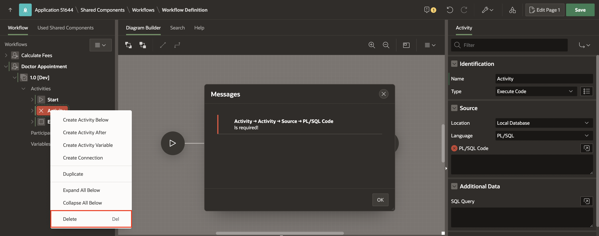

   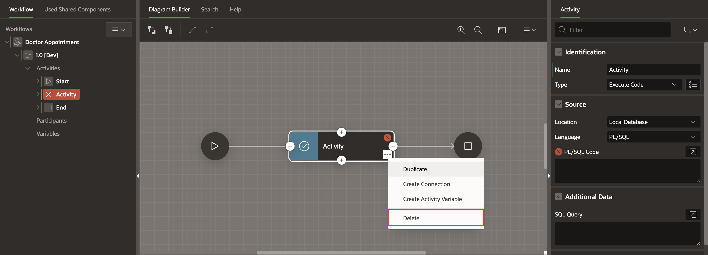

5. Navigate to **Start**. Under **Outgoing**, select **New** and select the following:

    - Activity > To: **End**

   

6. Click **Save**.

## Task 3: Add Inputs to the Doctor Appointments Workflow

In this lab, you explore various aspects of workflow data using the example of a doctor appointment application that you are building. You will focus on understanding parameters, variables, activity variables, and additional data.

Referring to the flow chart in Lab 1, illustrating the business logic, the appointment booking process initiates with the Hospital Staff submitting patient details to the system, marking the commencement of the workflow.

The inputs to the workflow will be the patient details. In workflow terminlogy, these are called **Workflow Parameters**.

You will define the following parameters for the Doctor Appointment Workflow:
   PATIENT\_NAME, PATIENT\_AGE, PATIENT\_EMAIL, PROBLEM, REQUEST\_DATE

1. To create Workflow Parameters, right-click **Doctor Appointment** Workflow in the tree and select **Create Parameter**.

   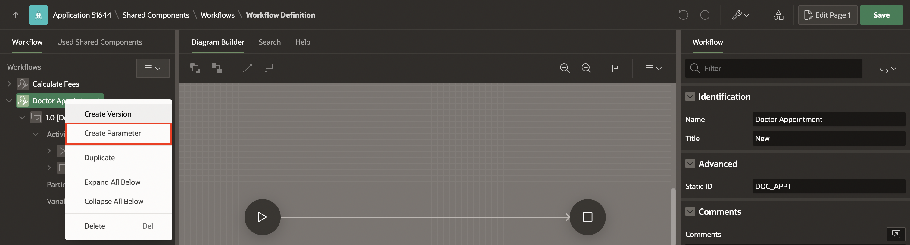

2. This adds a Parameter with a label "New" in the Workflow tree. In the Property Editor, enter/select the following:

    - Identification > Static ID: **PATIENT_NAME**

    - Label > Label: **Patient Name**

    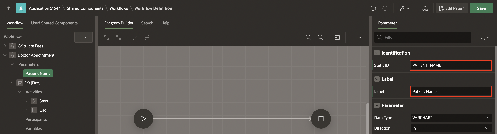

3. Similarly, add the following **Parameters** one after the other, given in the table below.

   |Static ID | Label | Data Type | Display Format Masks > Session State Format Mask |
   |----------|-------|-------------|----------|
   | PATIENT_AGE | Patient Age | Number |    |
   | REQUEST_DATE | Request Date | Timestamp | DD-MON-YYYY HH24:MI:SS |
   | PATIENT_EMAIL | Patient Email | Varchar2 |     |
   | PROBLEM | Problem | Varchar2 |       |
   {: title="List of Parameters to be Created"}

4. Click **Save**.

## Task 4: Use the parameters in the Workflow Subject

The Workflow has a Title field which is a descriptive title for the Workflow and shows up in the Workflow Console that the Hospital Staff will eventually use to monitor the progress of the appointment process. The Title supports using workflow parameter static IDs as substitution strings.

1. To set the Workflow Title, in the left pane, select **Doctor Appointment** Workflow.

2. In the Property Editor, change the Title to **Workflow for patient &PATIENT_NAME.**

    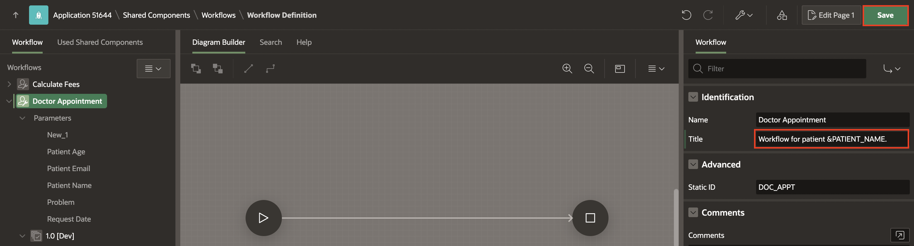

3. Click **Save**.

## Task 5: Add Additional Data to the Workflow

In addition to the input parameters, the Workflow also needs information about the available doctors based on the patient's problem. An understanding of the appointment process tells us that all activities of the workflow need the doctor data.

1. To define Additional Data, under **Doctor Appointment** workflow, click **1.0[Dev]**.

2. In the Property Editor, enter/select the following:

    - Under Additional Data:

        - Type: **Table/View**

        - Table Name: **DOCTOR**

    - Column Mapping > Primary Key Column: **DNAME**

   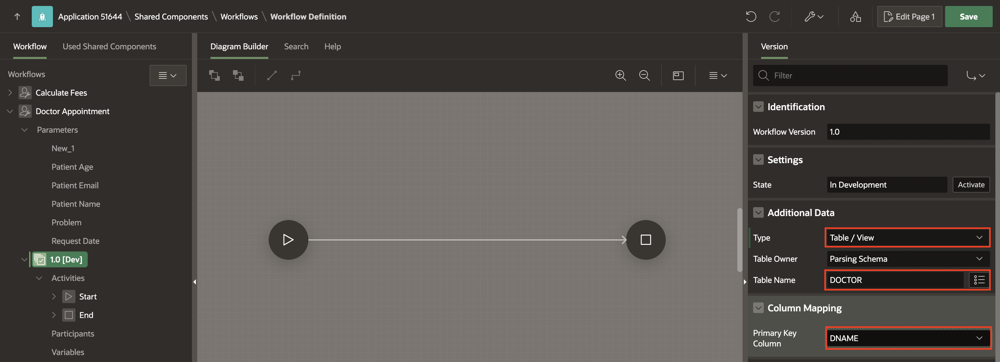

3. Click **Save**.

> **Note:** _Now, all the columns' values of the DOCTOR table will be available as Bind Variables or Substitution Strings at all points and by all activities during the execution of this Workflow._

## Task 6: Add Workflow Variables

**Why Parameters and Additional Data are not enough?!**

The inputs provided to the Appointment Workflow are read-only in nature. This means that, once the workflow is submitted, their values will never be modified. The workflow needs to process and pass data from one activity to the next.

As an example, consider the following business scenario:

Before an appointment is confirmed, the workflow needs to compute the doctor's availability based on his/her current appointment schedule. So, availability of the doctor is a variable that will be determined based on this computation.

When an appointment is confirmed, the Booking ID for the appointment is carried forward to later activities which calculate and update the appointment fees.

Data such as Availability, Booking ID and Fee need to be updatable by the activities of the workflow as part of the execution. Such data is defined as **Workflow Variables**.

1. Under **Doctor Appointment** workflow, right-click **1.0 [DEV]** (workflow version) and select **Create Variable**.

    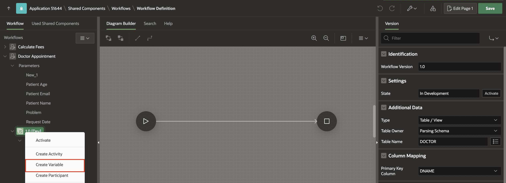

2. A new variable with Name **New** gets created in the tree. In the Property Editor, enter/select the following:

    - Identification > Static ID: **AVAILABILITY**

    - Label > Label: **Availability**

    - Variable > Data Type: **BOOLEAN**

    - Under Application Format Masks:

        - True Value: **AVAILABLE**

        - False Value: **BUSY**

   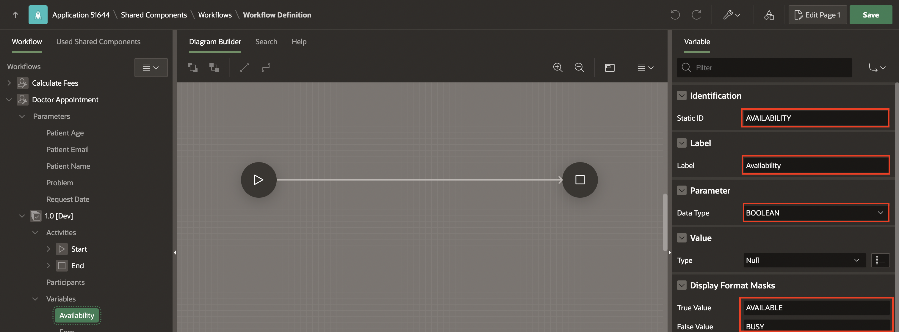

3. Create a variable **FEES**. In the Property Editor, enter/select the following:

    - Identification > Static ID: **FEES**

    - Label > Label: **Fees**

    - Variable > Data Type: **NUMBER**

    - Under Value:

        - Type: **Static Value**

        - Static Value: **0**

   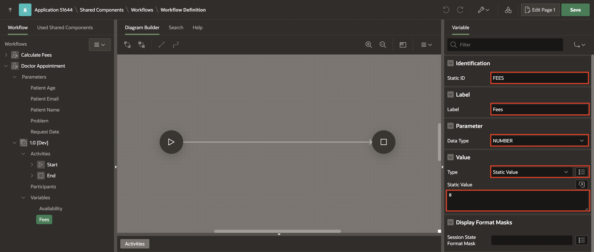

4. Similarly, create the following variables one after the other:

    | Static ID | Label | Data Type |
    | --------- | ----- | --------- |
    | APPROVER  | Approver | VARCHAR2 |
    | ID  | ID | NUMBER |
    | TASK_STATUS  | Sub Task Status | VARCHAR2 |
    | TASK_OUTCOME  | TaskOutcome | VARCHAR2 |
    {: title="List of Variables to be Created"}

5. Click **Save**.

## Summary

In this lab, you learned the process of creating a Doctor Appointment Workflow using Oracle APEX.

## What's Next

Now, you're ready to proceed to the next section where you'll learn how to add Human Tasks to your Workflow. Stay tuned for more hands-on guidance!

You may now **proceed to the next lab**.

## Acknowledgements

- **Author(s)** - Roopesh Thokala, Senior Product Manager & Ananya Chatterjee, Consulting Member of Technical Staff.
- **Last Updated By/Date** -  Ankita Beri, Product Manager, December 2024
