# Add Doctor Appointment workflow Activities and Connections

## Introduction

In this lab, you will continue building the Doctor Appointment Workflow, focusing on defining activities, setting parameters, and creating conditional branches.

### Objectives

In this lab, you will:

- Create and configure the Doctor Appointment workflow by adding activities and connections.

Estimated Time: 45 minutes

### Prerequisites

- All the previous Labs have been completed.

## Task 1: Navigate to Workflow Designer

Now that we have defined the Approval and Action tasks, let us go back to the Doctor Appointment Workflow and resume from where we left off.

1. Navigate to **Shared Components**.

   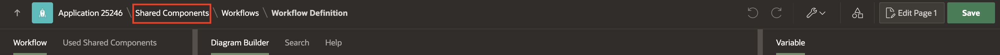

2. Under **Workflows and Automations**, select **Workflows**.

   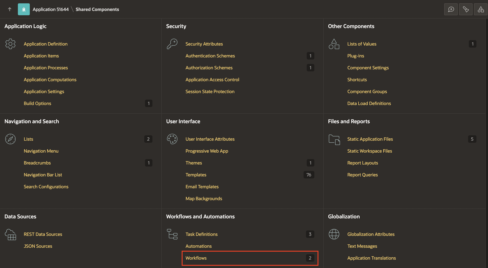

3. Click the **Doctor Appointment** workflow to access the Workflow Designer.

   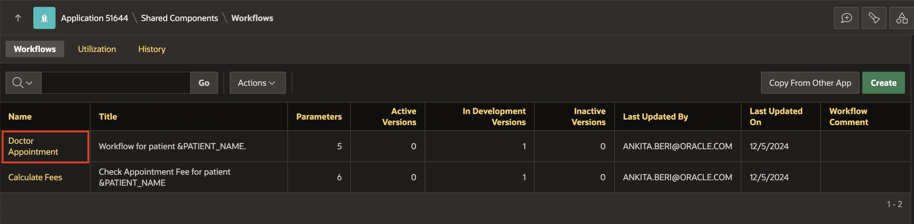

## Task 2. Add Compute Doctor Availability Activity

1. From the **Activities Palette**, drag an **Invoke API** activity into the **Diagram Builder** area and drop it on the connection joining the Start and End activities.

   

2. Click the newly added **Invoke API** and in the Property Editor, enter/select the following:

    - Identification > Name: **Compute Doctor Availability**

    - Under Settings:

        - Package Name: **EBA\_DEMO\_WF\_DOC\_APT**

        - Procedure or Function: Functions > **CHECK_AVAILABILITY**

    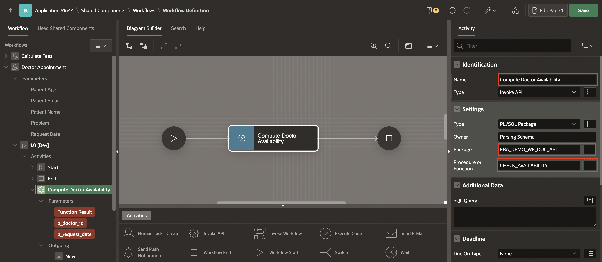

3. Under **Rendering** tab, notice that there are some Fields marked in Red. The **CHECK_AVAILABILITY** function has three Parameters, highlighted in RED, to show that they are required.

4. Under **Compute Doctor Availability**, expand **Parameters** and select **Function Result** parameter, in the Property Editor, enter/select the following:

    - Value > Item: **Version Variables > AVAILABILITY**

    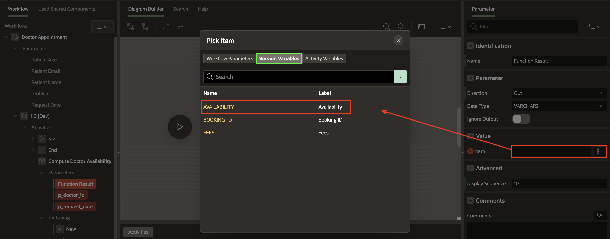

    > **Note:** _The Item Picker in the Workflow Designer allows you to select Workflow Parameters, Version Variables, and Activity Variables. You may also reference Additional Workflow Data by using the Substitution String Syntax._

5. Select **p\_doctor\_id** parameter and in the Property Editor, enter/select the following:

    - Under Value:

        - Type: **Static Value**

        - Static Value: **&DNO.**

    

6. Select **p\_request\_date** and in the Property Editor, enter/select the following:

    - Under Value:

        - Item: **Workflow Parameter > REQUEST_DATE**

        - Format Mask: **DD-MON-YYYY HH24:MI:SS**

    

7. Click **Save**.

Upon execution, this activity will determine if the doctor is available or engaged on the requested date and time by consulting the appointment schedule.

## Task 3: Use Workflow Switch Activity

Based on the Doctor's availability, the workflow needs to branch conditionally. Let us revise the workflow diagram.

1. Drag and drop a **Switch Activity** on the connection between the **Compute Doctor Availability** and the **End** activities.

    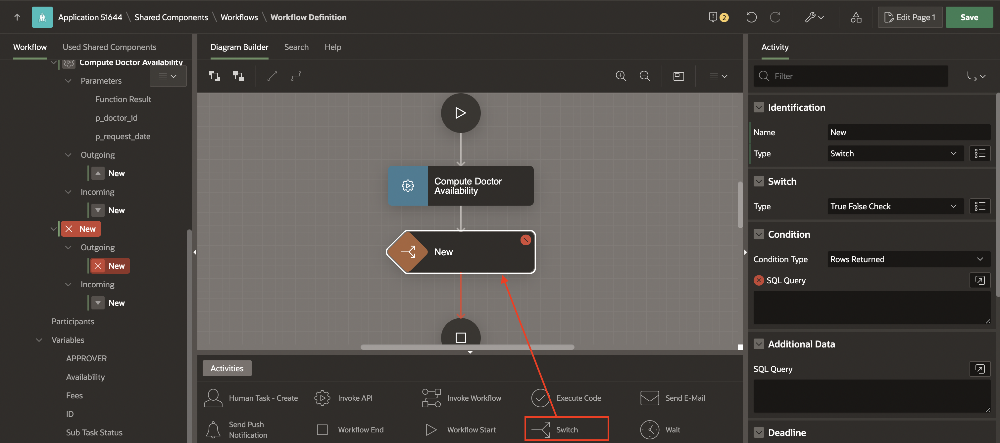

2. Configure the Switch activity in the Property Editor for Doctor Availability conditions. Click the workflow activity you just placed in the workflow diagram, and then in the Property Editor, enter/select the following:

    - Identification > Name: **Doctor Available?**

    - Under Condition:

        - Condition Type: **Workflow Variable = Value**

        - Workflow Variable: Version Variables > **AVAILABILITY**

        - Value: **BUSY**

    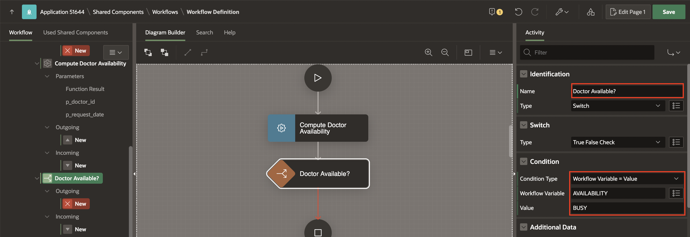

  > **Note:** _The Switch Type is defaulted to True False Check. Switch Activity can be of four types. Learn about the different Switch types in the APEX 24.2 App Builder Documentation Guide._

## Task 4: Create Conditional Connections(Branches) and No Appointment Mail Activity

Next, we need to create the Conditional Connections (branches) for this Switch activity. A True False Check activity typically has a True Branch, a False Branch, and a Null Branch, depending on the evaluation of the condition.

1. Going by the flowchart created earlier, if **AVAILABILITY** is set to **BUSY**, our Workflow sends a 'No Appointment' Mail and terminates the business process. Otherwise, it proceeds to raise an appointment request for the doctor to approve or reject.

2. Now, select the connection(Arrow) leading out of the Switch activity, **Doctor Available?**, you created in the previous task.

3. In the Property Editor, enter/select the following:

    - Identification > Name: **No**

    - Condition > When: **True**

    

4. After configuring the connection, drag and drop a **Send E-Mail Activity** on the **+** (Plus) symbol in the middle of the arrow.

    

5. Select the **Send E-Mail** activity and in the Property Editor, edit the name to **No Appointment Mail**.

    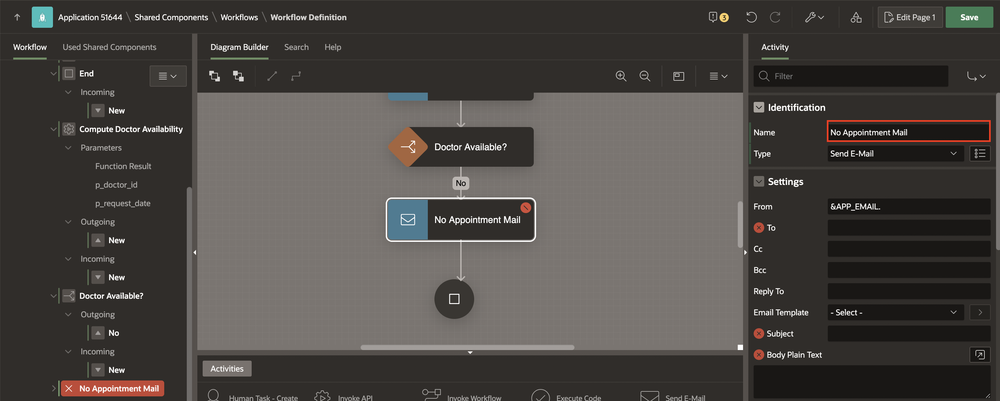

6. Re-adjust the arrow and the activity by dragging them to the left in order to make the diagram more aesthetic.

7. Select the **True connection** and in the Property Editor, verify that the **To** is correctly set to **No Appointment Mail**.

   

## Task 5: Configure 'No Appointment Mail' Activity

1. Select **No Appointment Mail** activity.

2. In the Property Editor, enter/select the following:

   Under Settings:

    - To: **&PATIENT_EMAIL.**

    - Subject: **Appointment Canceled**

    - Body Plain Text: Copy and Paste the below text:

        ```
        <copy>
        Hello &PATIENT_NAME. ,

        We regret to inform you that your appointment request for &REQUEST_DATE. It could not be confirmed due to the unavailability of the doctor/non-confirmation of the invoice.
        The requested appointment has been canceled.
        Please try again at a later date.
        We regret the inconvenience caused.

        Regards,
        Management Team
        ABC Hospital
        </copy>
        ```

    

## Task 6: Adjust Workflow End Activity

1. Select the **Workflow End Activity**, and in the Property Editor enter/select the following:

    - Identification > Name: **Close Request**

    - Settings > End State: **Terminated**

    

2. At this point, make sure there are no validation errors in the workflow model. Click **Save** to save your changes.

## Task 7: Create the 'Raise Appointment Request' Activity

1. From the activities palette, drag and drop a **Human Task - Create** activity.

    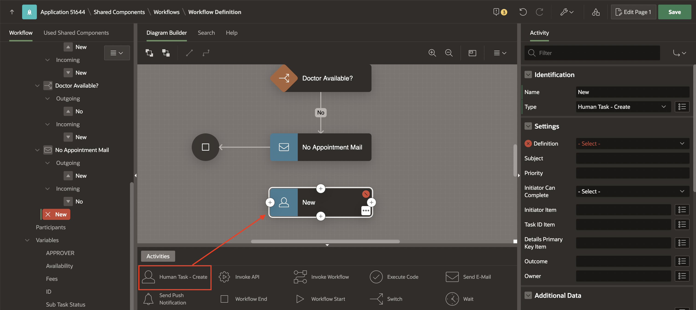

2. In the Property Editor, for Name: Enter **Raise Appointment Request**.

    

## Task 8: Connect 'Raise Appointment Request' to Workflow

Re-adjust the Workflow Diagram to make the diagram more aesthetic.

1. Click on the **Doctor Available?** activity and draw a connection to the **Raise Appointment Request** activity.

    

2. With the **Raise Appointment Request** activity selected, in the Property Editor, enter/select the following:

    - Name: **Yes**

    - When: **False**

    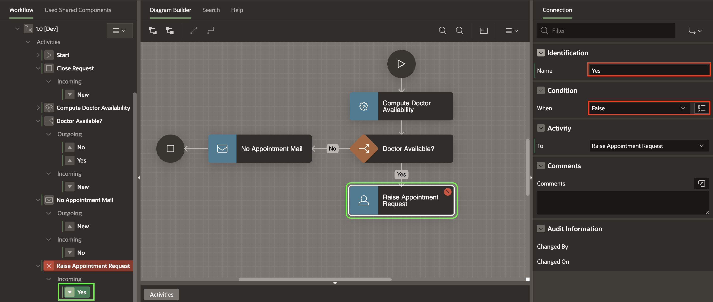

## Task 9: Verify the Variables in Workflow Tree

At this point, check the **Variables** in your workflow tree. You will notice there are two new workflow variables automatically created under **Variables**.

1. The two Variables created are:

    - **Approver** with Static ID **APPROVER**.

    - **TaskOutcome** with a Static ID **TASK_OUTCOME**.

    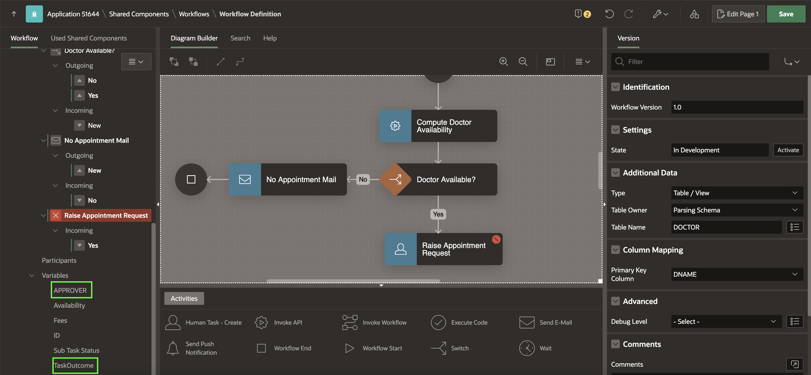

> **Note:** _The developer can choose to set the Human Task properties Approver and TaskOutcome to these Workflow Variables. At runtime, when the Human Task activity has been completed, i.e., when the actual owner of the task has approved, rejected, or completed the task, the approver and the task outcome values are saved into the Workflow Variables and can be used later by other workflow activities. Alternatively, the developer can choose to ignore the outcome and approver details and, in that case, delete those auto-generated Workflow variables and leave the corresponding Task attributes empty._

## Task 10: Configure 'Raise Appointment Request' Parameters

1. In the **Rendering** tab or in the **Workflow Designer**, select **Raise Appointment Request**.

2. In the Property Editor, enter/select the following:

    - Under Settings:

        - Definition: **Appointment Request**

        - Detail Primary Key Item: **DNO** (Doctor No. from the DOCTOR table)

        - Outcome: **Version Variables > TASK_OUTCOME**

        - Owner: **Version Variables > APPROVER**

    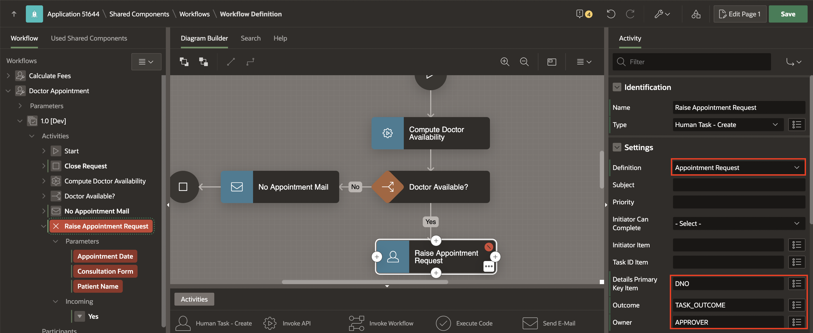

3. In the **Rendering** tab, notice that there are some fields marked in Red. The **Raise Appointment Request** function has three Parameters, highlighted in RED, to show that they are required.

4. Under **Raise Appointment Request**, add the following parameters one after the other:

    |Parameter | Type | Item|
    |---------|--------|------------|
    | Appointment Date | Item | REQUEST_DATE |
    | Consultation Form | Item | PROBLEM |
    | Patient Name | Item | PATIENT_NAME |

    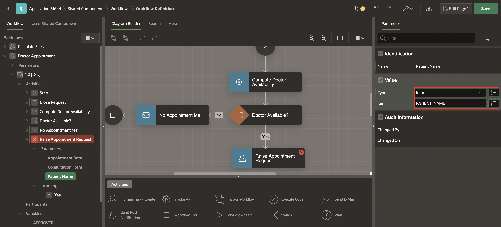

5. At this point, we still have a validation error. Click the **Error Icon** at the top of your Page Designer.

    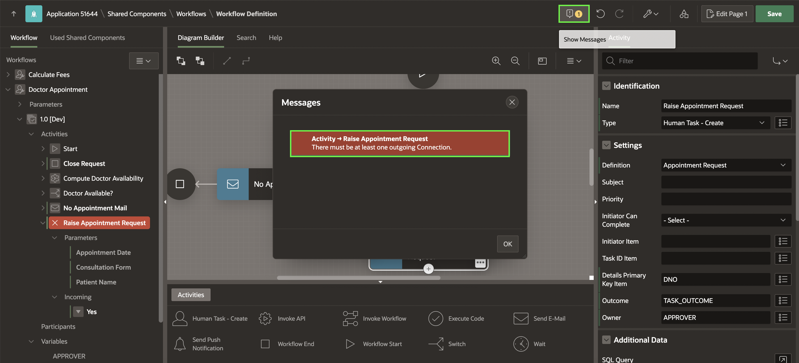

6. To resolve this error, you need to drag and drop another **Workflow End** Activity.

    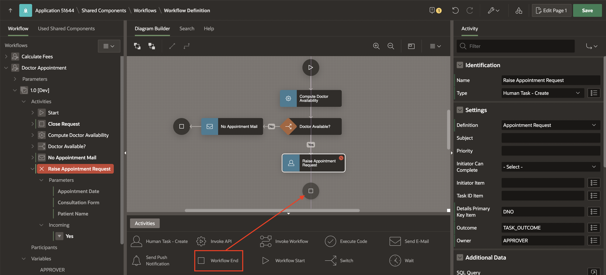

7. Select the **Workflow End Activity** and enter the following in the Property Editor:

    - Identification > Name: **Complete Appointment**

    

8. Create a connection from the **Raise Appointment Request** to **Complete Appointment**. Note that the validation error no longer shows up.

    Click **Save** to save the workflow model.

    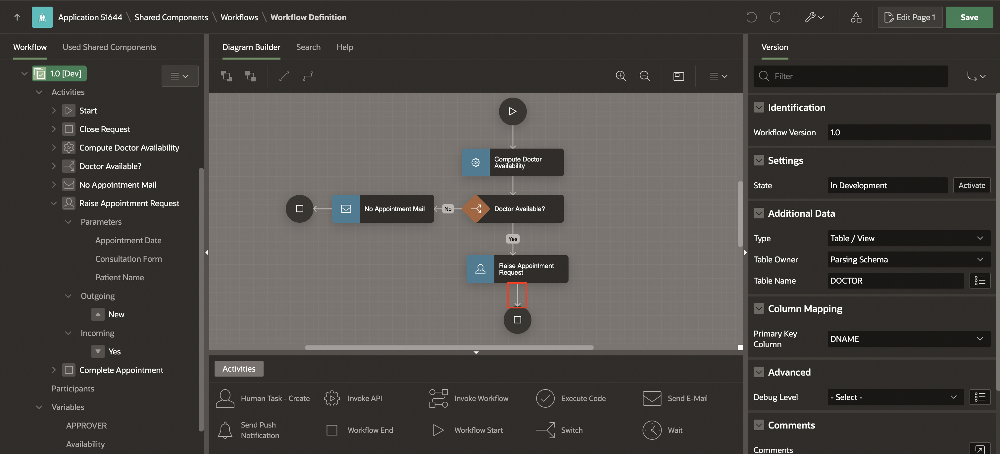

## Task 11: Handle the Task Outcome

In this task, you learn to manage appointment requests using a Switch activity in a workflow. The Appointment Request Task can result in two outcomes: APPROVED or REJECTED.

- In case it is **APPROVED**, we create an entry in the **APPOINTMENT** table with details of the appointment and set the status to **CONFIRMED**.

- In case it is **REJECTED**, we send a **No Appointment Mail** to the patient.

1. To add a Switch activity, open the workflow diagram in the workflow editor.

2. Drag and drop a **Switch Activity** to the left of the **Raise Appointment Request** Activity.

    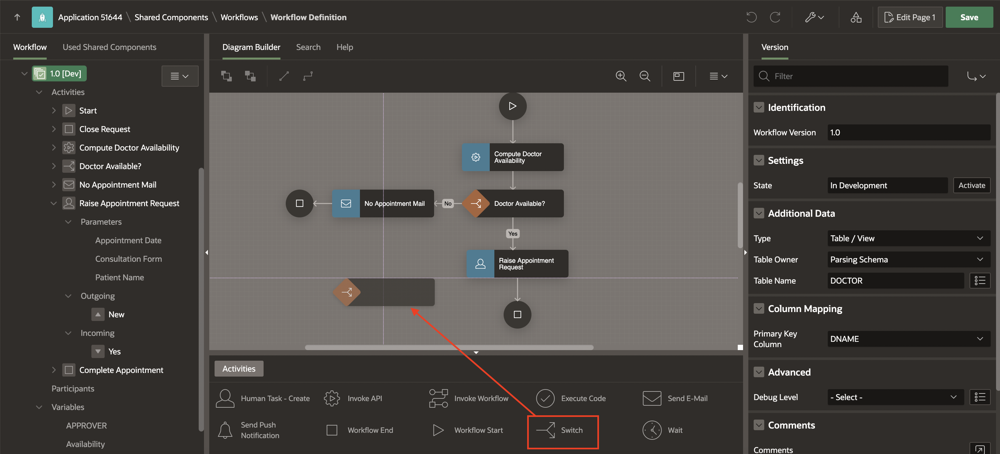

3. Select the **Switch** activity you just created and in the Property Editor, enter/select the following:

    - Identification > Name: **Appointment Approved?**

    - Switch > Type: **Check Workflow Variable**

    - Compare > Compare Variable: Version Variable > **TASK_OUTCOME**

    

4. In the Workflow designer, detatch the end of the arrow connecting between the **Raise Appointment Request** and the **Complete Appointment** activities and attach it to the **Appointment Approved?** activity.

    

5. Now, select the **Appointment Approved?** activity and draw an arrow to the **No Appointment Mail** activity. In the Property Editor, enter/select the following:

    - Identification > Name: **No**

    - Under Condition:

        - Operator: **Is Equal To**

        - Value: **REJECTED**

    

6. Click **Save**.

## Task 12: Add Invoke API for Confirm Appointment

1. From the Activities palette, drag an **Invoke API** Activity into the Diagram Builder area and drop it below the **Appointment Approved?** activity.

    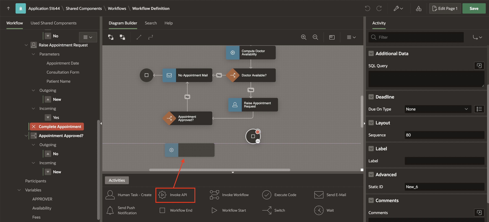

2. Select the newly added **Invoke API** Activity and in the Property Editor, enter/select the following:

    - Identification > Name: **Confirm Appointment**

    - Under Settings:

        - Package: **EBA\_DEMO\_WF\_DOC\_APT**

        - Procedure or Function: **CONFIRM_APPOINTMENT**

    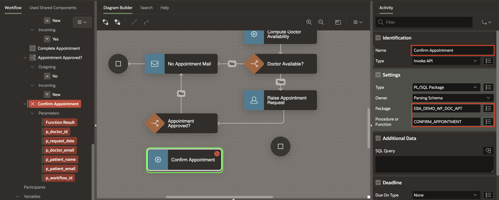

3. Under **Rendering** tab, notice some fields marked in Red. The **Confirm Appointment** function has several Parameters, highlighted in RED, to show that they are required.

4. Navigate to **Confirm Appointment** activity and select **Function Result** parameter. In the **Property Editor**, enter/select the following:

    - Value > Item: **Version Variables > ID**

    

5. Similarly, set the remaining parameters under **Confirm Appointment** as follows:

    |Parameter | Value | Format Mask|
    |---------|--------|------------|
    |p\_doctor\_id|Static Value: **&DNO.**||
    |p\_request\_date|Workflow Parameters: **REQUEST_DATE**|**DD-MON-YYYY HH24:MI:SS**|
    |p\_doctor\_email| Static Value: **&DOC_EMAIL.**||
    |p\_patient\_name| Workflow Parameters: **PATIENT_NAME**||
    |p\_patient\_email| Workflow Parameters: **PATIENT\_EMAIL**||
    |p\_workflow\_id| Static Value: **&APEX$WORKFLOW_ID.**||

    > **Note:** _APEX$WORKFLOW\_ID is a substitution string that holds the ID of the workflow instance while it runs. You will learn more about the available substitution strings for Workflows in the App Builder Documentation Guide._

6. Now, click the **Appointment Approved?** activity and draw an arrow to the **Confirm Appointment activity**.

7. With the arrow selected, in the Property Editor, enter/select the following:

    - Identification > Name: **Yes**

    - Under Condition:

        - Operator: **Is Equal To**

        - Value: **APPROVED**

    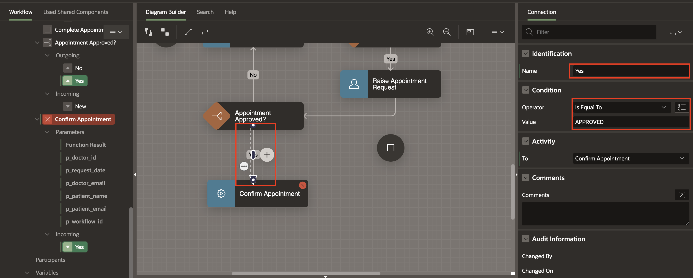

8. To be able to save the model at this point, we need to get rid of validation errors. Create a **Connection** from **Confirm Appointment** to **Complete Appointment** End activity.

    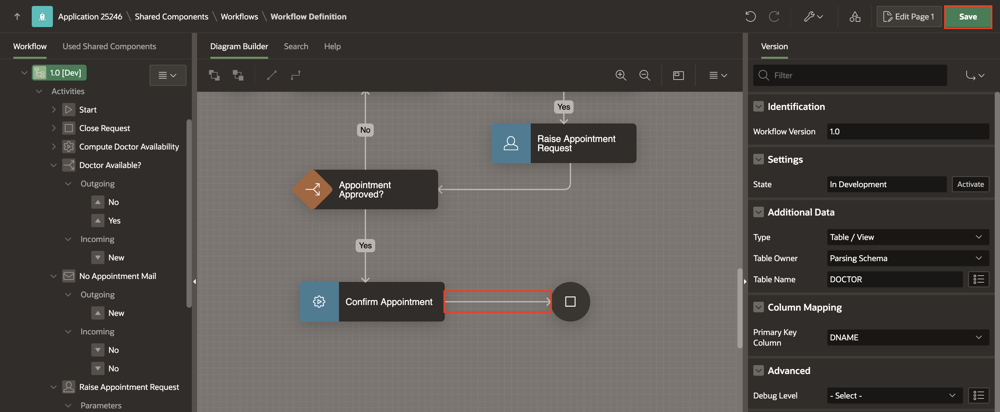

9. Click **Save** to save the workflow model.

## Task 13: Add Invoke Workflow

In this task, you will call **Calculate Fees** workflow using Invoke workflow activity.

1. From the Activities palette, drag an **Invoke Workflow** Activity into the Diagram Builder area and drop it below the **Confirm Appointment** activity.

    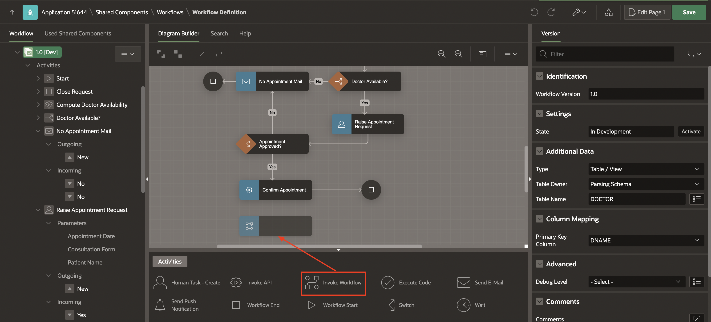

2. In the Property Editor, enter/select the following:

    - Identification > Name: **Check Appointment Fee**

    - Under Settings:

        - Definition > **Calculate Fees**

        - Details Primary Key Item: Version Variables > **ID**

    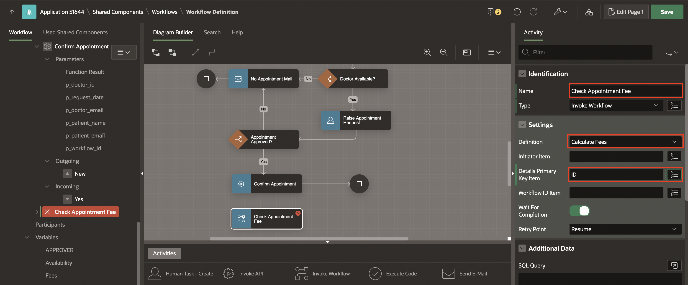

3. Under **Check Appointment Fee**, expand **Parameters** and select **Status** parameter, in the Property Editor, enter/select the following:

    - Parameter > Ignore Output: Toggle **OFF**

    - Value > Item: Version Variables > **TASK_STATUS**

    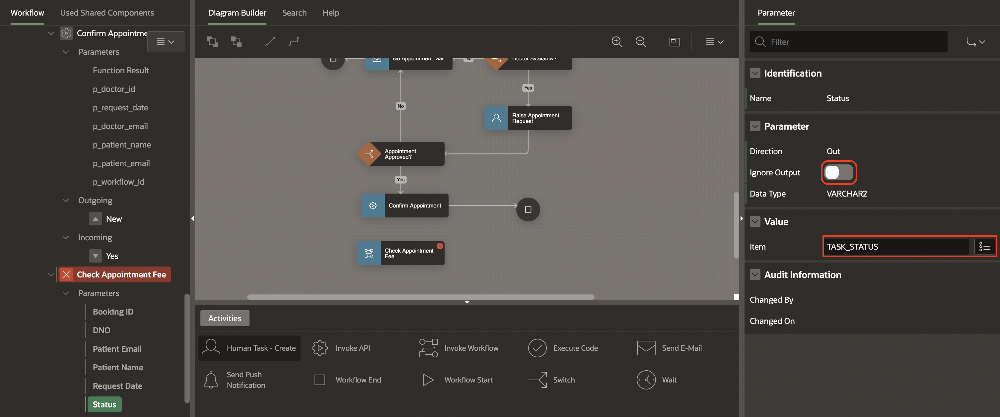

4. Similarly, update the following parameters:

    |Parameter | Value |
    |---------|--------|
    |Booking ID|Item: **ID**|
    |DNO |Static Value: **&DNO.**|
    |Patient Email| Item: **PATIENT_EMAIL**|
    |Patient Name| Item: **PATIENT_NAME**|
    |Request Date| Item: **REQUEST_DATE**|

5. Now, detach the connection from the Confirm Appointment Activity and re-attach it to this Switch Activity.

    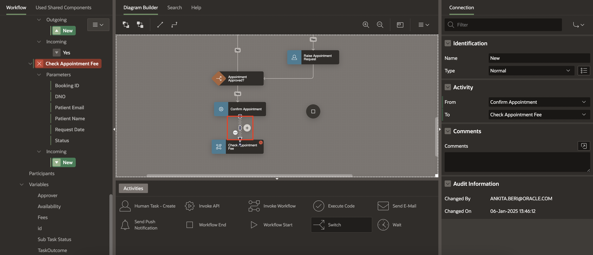

## Task 14: Configure Switch Activity for Approved Appointment

1. From the Activities palette, drag an **Switch** Activity into the Diagram Builder area and drop it below the **Check Appointment Fee** activity.

    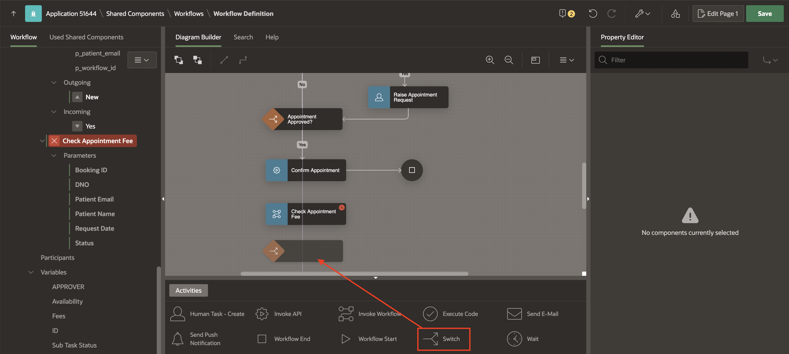

2. In the Property Editor, enter/select the following:

    - Identification > Name: **Approved?**

    - Under Condition:

        - Condition Type: **Workflow Variable = Value**

        - Workflow Variable > Version Variables: **TASK_STATUS**

        - Value: **APPROVED**

    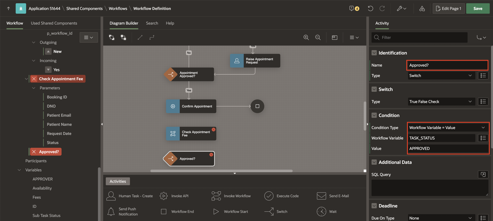

3. Create a **Connection** from **Check Appointment Fee** to **Approved?** activity.

    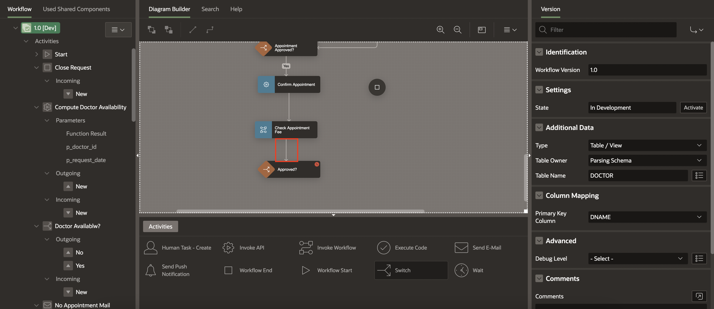

## Task 15: Update Status of the Workflow

Once the Patient confirms the invoice / makes the payment, the Appointment record status needs to be updated to PAID.

1. Drag and Drop an **Invoke API** activity beside **Approved?** activity.

    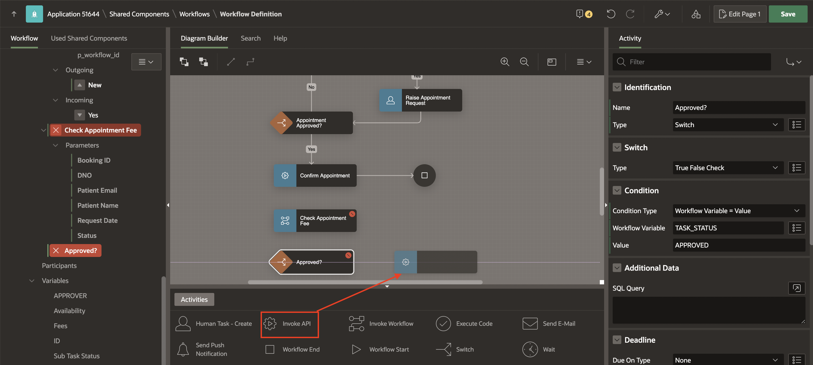

2. In the Property Editor, enter/select the following:

    - Identification > Name: **Update Appointment**

    - Under Settings:

        - Package: **EBA\_DEMO\_WF\_DOC\_APT**

        - Procedure or Function: **UPDATE_APPOINTMENT**

   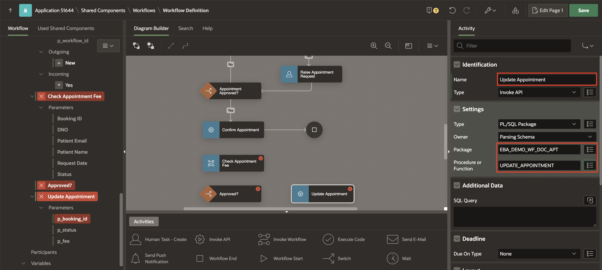

3. The procedure **UPDATE_APPOINTMENT** will update the Status in the *APPOINTMENT* table record to **PAID**.

4. In the Rendering Tree, notice that there are some Fields marked in Red. The **Update Appointment** has Parameters, highlighted in RED to show that they are required. Set the Parameters for the Invoke API activity by clicking on them in the Workflow Tree.

5. In the Left Pane, select **Update Appointment > p\_booking\_id**. In the Property Editor, enter/select the following:

    - Value > Item > Version Variables: **ID**

   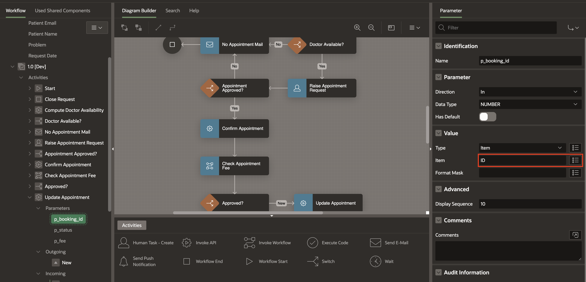

6. Similarly, set the remaining parameters under **Update Appointment** as follows:

    - For **p_status**, under Value:

        - Type: **Static Value**

        - Static Value: **PAID**

    - For **p_fee**, under Value:

        - Type: **Item**

        - Item > Version Variables: **FEES**

    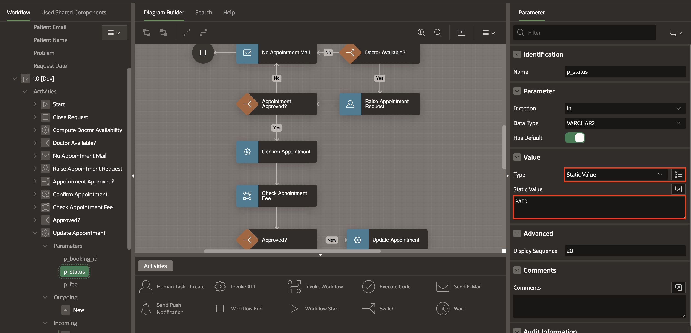

7. Now, select **Approved?** activity and draw an arrow to the **Update Appointment** activity and in the Property Editor, update the following:

    - Condition > When: **True**

    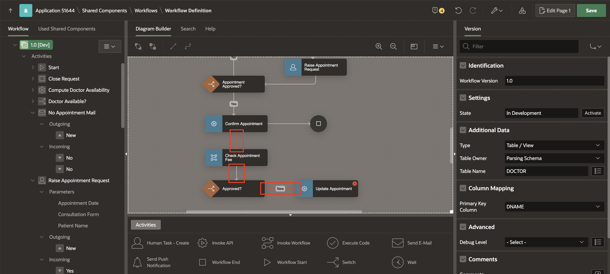

## Task 16: Add a Wait Activity

1. From the Activities palette, drag an **Wait** Activity into the Diagram Builder area and drop it below the **Update Appointment** activity.

    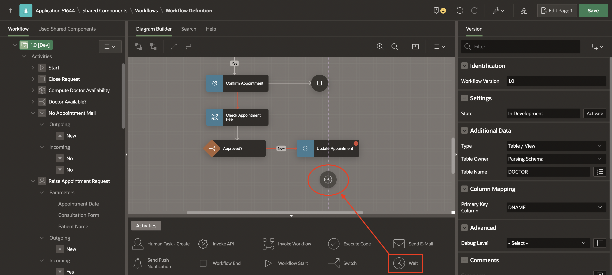

2. In the Property Editor, enter/select the following:

    - Identification > Name: **Wait Before Requesting Feedback**

    - Under Settings:

        - Timeout Type: **SQL Query**

        - SQL Query: Copy and paste the below code

        ```
        <copy>
        select schedule from appointment where booking_id = :ID;
        </copy>
        ```

    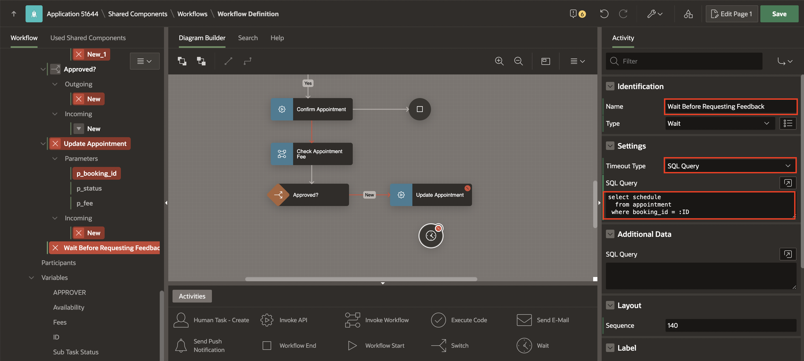

3. Select **Update Appointment** activity and draw an arrow to the **Wait** activity.

    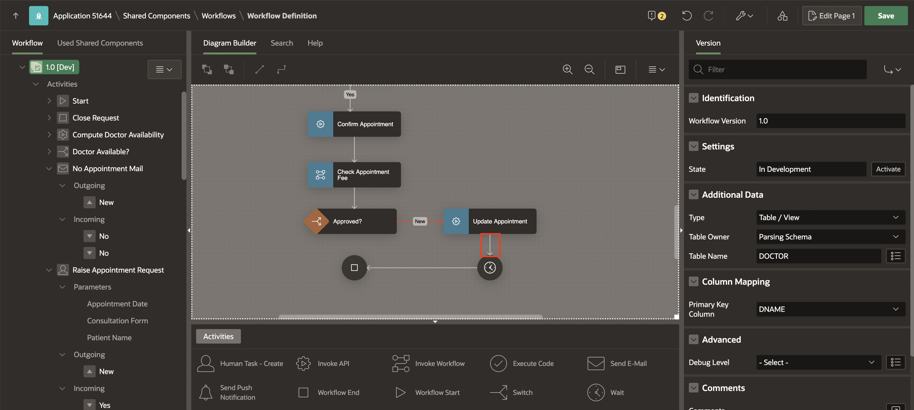

## Task 17: Final steps

Going back to our flowchart, at this point the Workflow waits for the appointment to happen and after that it raises a Feedback Request for the Patient. If the feedback is not received within a specific period, the Workflow is Completed without Feedback, else a Thank You Email is sent to the Patient.

1. From the Activities Palette , drag a **Human Task - Create** Activity and drop it under the **Wait** Activity.

    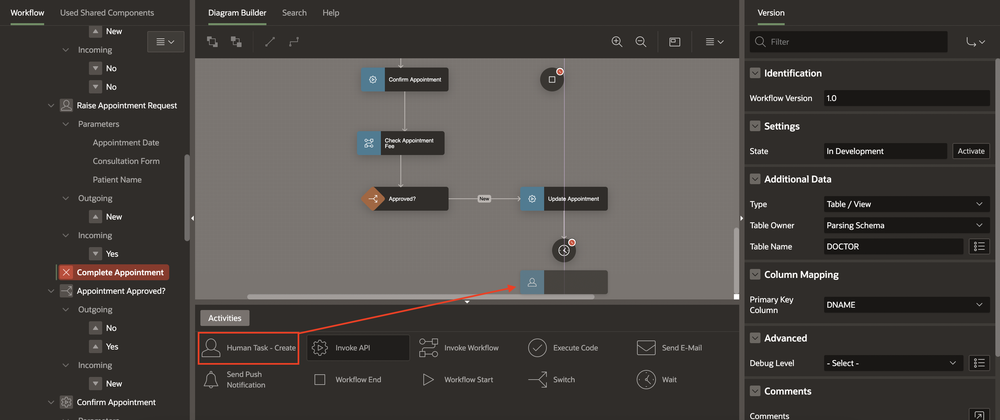

2. In the Property Editor, enter/select the following:

    - Identification > Name: **Request For Feedback**

    - Under Settings:

        - Definition: **Feedback Request**

        - Detail Primary Key Item: **ID**

    - Under Deadline:

        - Due On Type: **Interval**

        - Interval: **PT24H** (This implies that the Workflow will wait for at most 24 hours for the feedback activity to be completed.)

    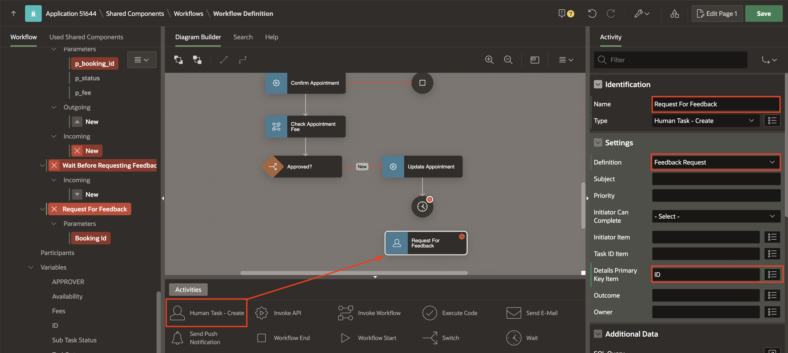

    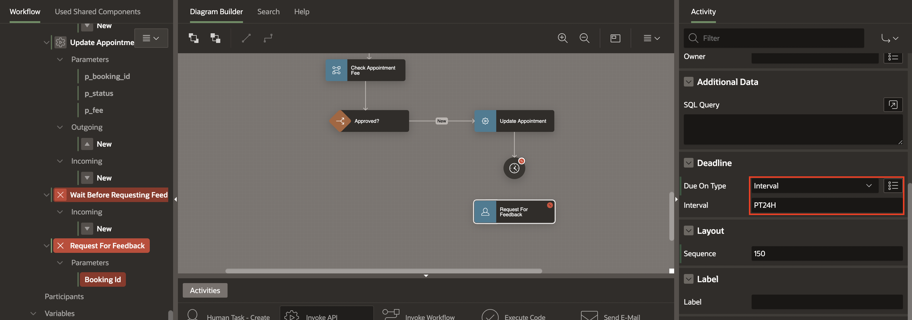

3. Under **Rendering** tab, navigate to **Request For Feedback** activity, select **Booking Id**. In the Property Editor, enter/select the following:

    - Under Value:

        - Type: **Item**

        - Item > Version Variables: **ID**

    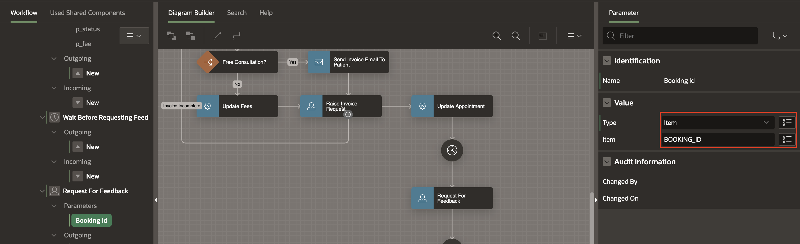

4. Drag a **Workflow End** Activity from the Activity Palette and drop it on the Diagram area to the left of the **Request for Feedback** activity.

5. In the Property Editor, for Identification > Name, enter **End Without Feedback**.

    

6. Draw a Connection from the **Wait Before Requesting Feedback** to the **Request For Feedback** Activity.

    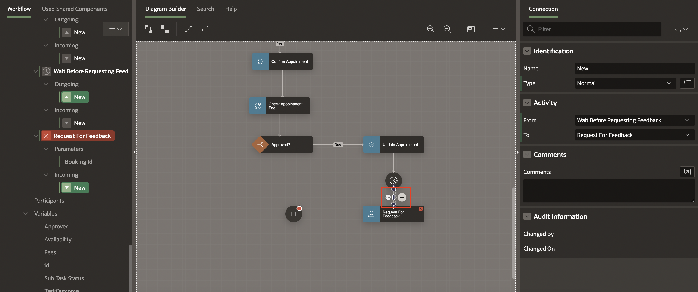

7. Draw a Connection from the **Request for Feedback** to the **End Without Feedback** Activity.

    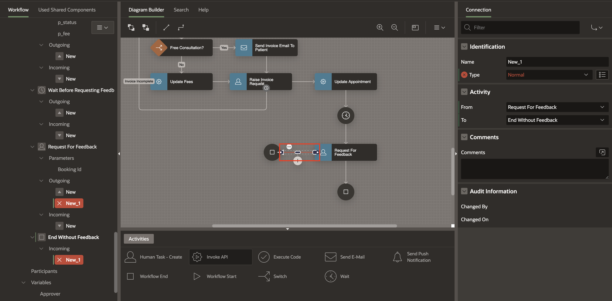

8. Notice that the connection is in RED and this is because an activity cannot have more than one outgoing connection of type Normal.

9. Click on the Connection and then in the Property Editor, enter/select the following:

    - Under Identification:

        - Name: **No Feedback**

        - Type: **Timeout**

    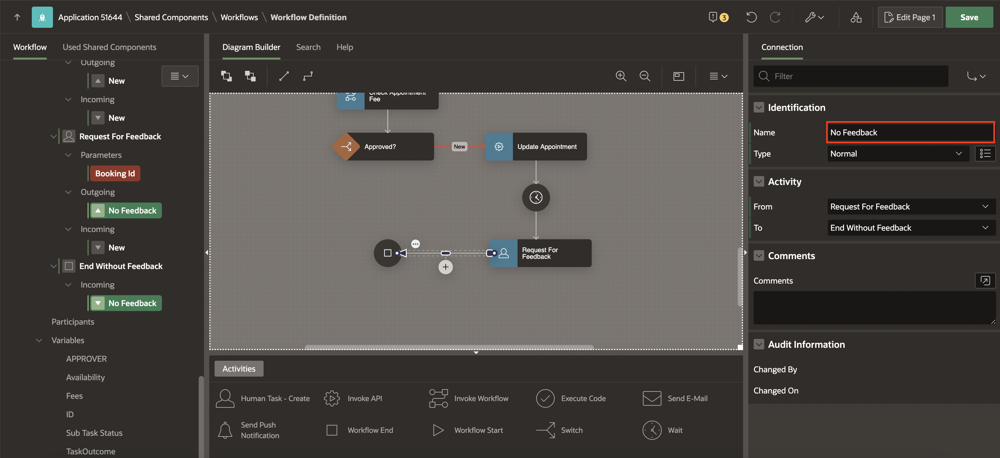

    > **Note:** _Connections of type Timeout can only be added to an activity if the activity has 'Due On' Type and value populated in the 'Deadline' section of the Property Editor._

10. Finally, drag a **Send E-Mail** Activity from the Activities Palette and drop it under **Request For Feedback** Activity.

    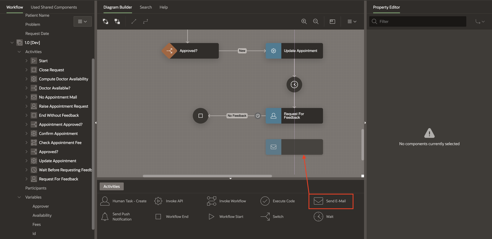

11. In the Property Editor, enter/select the following:

    - Identification > Name: **Send Thank You Note To Patient**

    - Under Settings:

        - To: **&PATIENT_EMAIL.**

        - Subject: **Thank You!**

        - Body Plain Text: Enter as given below.

        ```
        <copy>
        Dear &PATIENT_NAME. ,

        Thank you for your feedback regarding your recent appointment with Dr. &DNAME.
        We hope to keep serving you in the future!

        Regards,
        Management Team,
        ABC Hospital Pvt Ltd.

        </copy>
        ```

    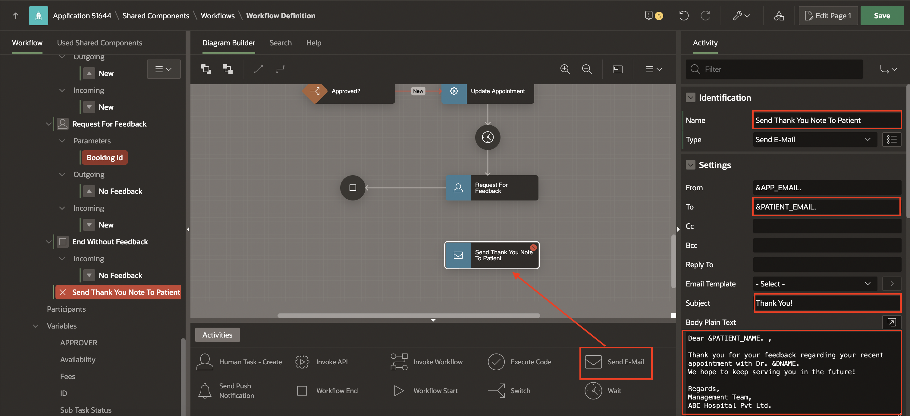

12. Draw a Connection from the **Request for Feedback** to the **Send Thank You Note To Patient** Activity.

    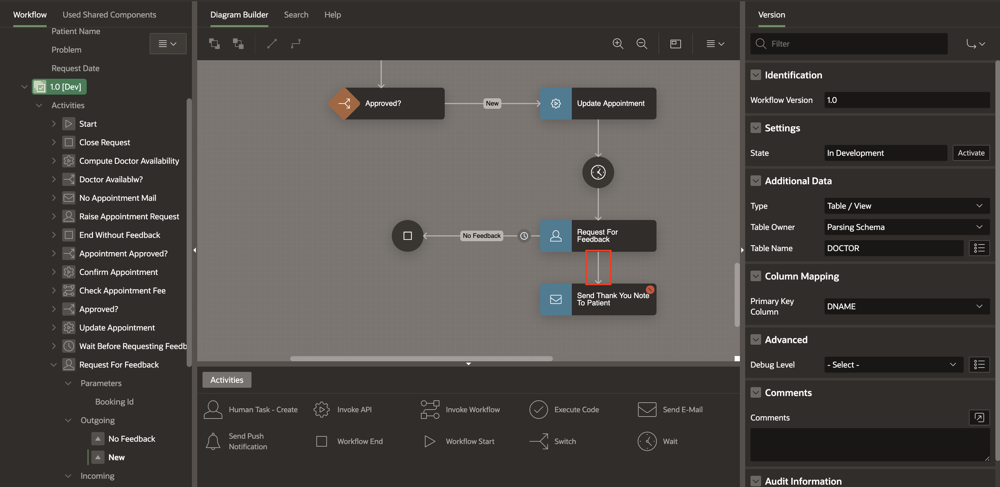

13. Drag a **Workflow End** Activity from the Activity Palette and drop it under the **Send Thank You Note To Patient** activity.

    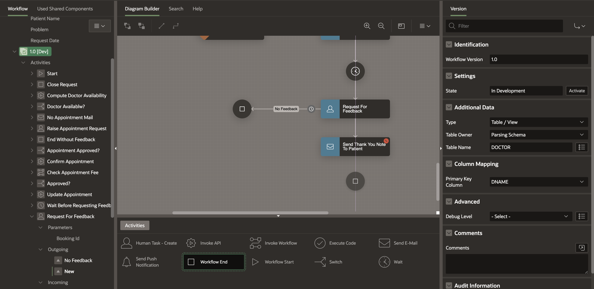

14. Also, Draw a Connection from the **Send Thank You Note To Patient** to the **Workflow End** Activity.

    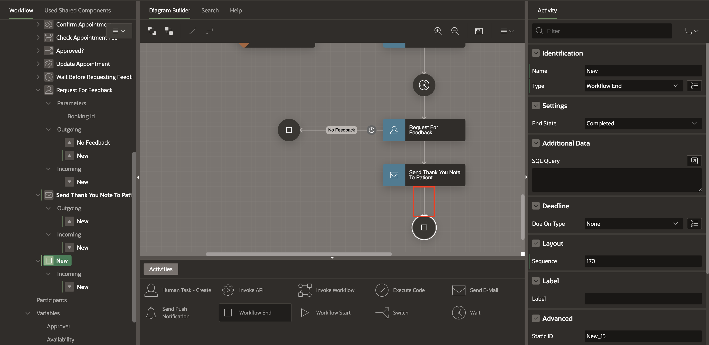

15. Lastly, Also, Draw a Connection from the **Approved?** activity to the **No Appointment Mail** Activity and in the Property Editor, under **Condition**, select **False** for **When**.

    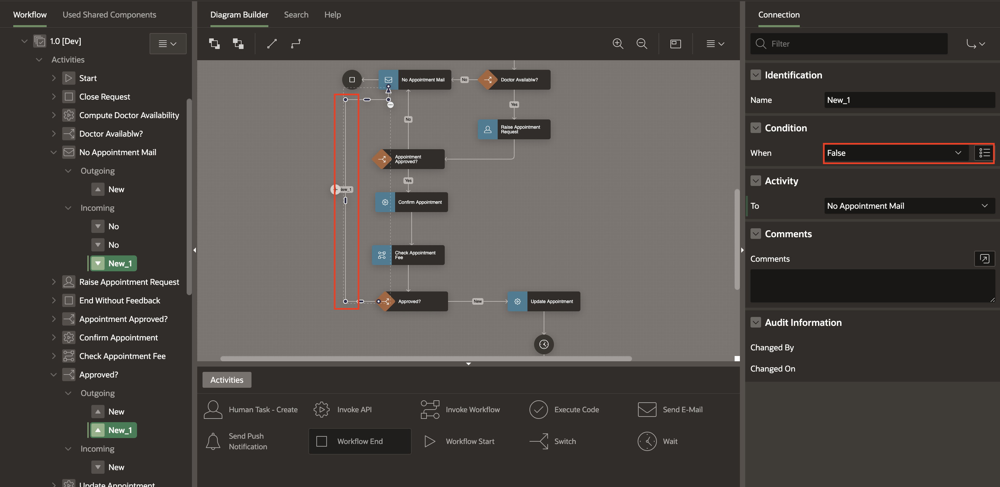

16. Click **Save**. At this point, our Appointment Workflow model is **Complete!**

## Summary

You have successfully created and configured the workflow for the 'Doctor's Appointment Made Easy!' application.

## What's Next

In the next section, you will create pages in the application that will utilize this workflow.

You may now **proceed to the next lab**.

## Acknowledgements

- **Author(s)** - Roopesh Thokala, Senior Product Manager & Ananya Chatterjee, Consulting Member of Technical Staff.
- **Last Updated By/Date** - Ankita Beri, Product Manager, December 2024
