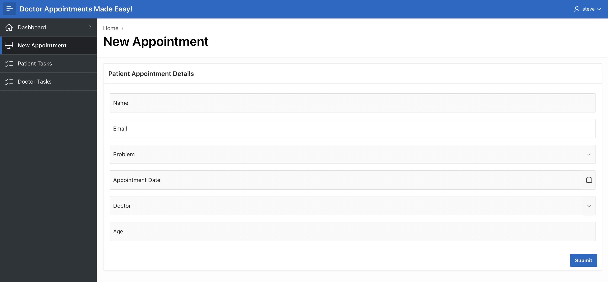
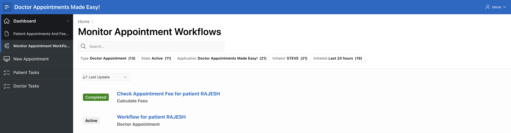

# Run the 'Doctor Appointments Made Easy!' Application

## Introduction

In this lab, you will run and understand the behavior of the **Doctor Appointments Made Easy!** application through hands-on activities. You also perform various tasks to understand the workflow and automation implemented in the application.

### Objectives

- Demonstrate the behavior of the "Doctor Appointments Made Easy!" application through hands-on activities.

Estimated Time: 20 minutes

### Prerequisites

- All the previous Labs have been completed.

## Task 1: Set Automatic Timezone for the Application

To demonstrate the application's behavior, we will use an automatic timezone setup. This will ensure that the appointment dates and times are in sync with the End User's timezone.

1. To do this, navigate to the Application Home Page and then go to **Shared Components > Globalization > Globalization Attributes**.

   

2. Toggle the **Automatic Time Zone** button to **ON**.

   

3. Click **Apply Changes**.

## Task 2: Set the APP_EMAIL Substitution String

1. Go to the Application Home Page and click **Edit Application Definition**.

2. Under Substitutions, add the following entry for APP_EMAIL settings.

    - Substitution: **APP_EMAIL**

    - Value: **no-reply@abchospitals.com**

   

3. Click **Apply Changes**.

## Task 3: Book an Appointment

1. From the Application Home Page, click **Run Application**.

2. Log in as STEVE (Hospital Staff).

   

3. Click **New Appointment** to book an appointment for **RAJESH**.

   

4. Select **Psychiatric** from the problem dropdown.

5. Choose **ANACHATT** as the available doctor.

6. Fill in the **Age** (example: 45) and click **Submit**.

   

7. Verify the success message.

   

## Task 4: Monitor the Workflow

1. Click on **Monitor Appointment Workflows** from the left navigation menu.

   

2. Click on the **Workflow for Patient RAJESH** entry and observe the Workflow Details Popup.

    - Workflow is waiting at "Raise Appointment Request" Activity.

    - Observe Workflow Parameters.

    

## Task 5: Approve the Appointment Request

1. Log in as **ANACHATT**, who is a Doctor in this workflow.

2. Select **Doctor Tasks** from the left navigation menu.

    

3. Click **Approve** to approve the appointment request.

## Task 6: Observe the Workflow

1. Log out and log in as **STEVE** (Hospital Staff).

2. Click on **Monitor Appointment Workflows** from the left navigation menu.

3. Observe that there are two active workflows: **Calculate Fees** and **Doctor Appointment** and Calculate Fees workflow is waiting at **Raise Invoice Request** activity for the patient (RAJESH), to pay and confirm the invoice. Observe that there is a **To Parent Workflow** button which navigate you to the **Doctor Appointment** workflow.

   

   

   

4. Note the correctly set Workflow Variables: Approver, Fee, and TaskOutcome.

## Task 7: Complete the Workflow

1. Log out and log in as **RAJESH**.

2. Navigate to **Patient Tasks** and click on the entry **Invoice for Rajesh for consultation....** to complete the request after confirming the invoice.

   

3. Log out and log back in as **STEVE** to monitor the workflow. Observe that the Calculate fees workflow has been completed. Now, Doctor Appointment workflow is waiting at **Wait Before Requesting Feedback** activity to complete.

   

## Task 8: Request Feedback Process

1. As the Doctor Appointment workflow is waiting at **Wait Before Requesting Feedback** activity to complete.

   Recall that the Wait activity has a timeout setting that elapses once the Appointment Time is reached.

   

2. At this point, we wait for the appointment time to elapse and check back again once that happens. This is what is observed.

   

## Task 9: Provide Patient Feedback

1. Now that the Feedback Request has been raised, log out and log back in as **RAJESH** (the patient).

2. Click on **Patient Tasks** and find the Feedback Request Task (Feedback fro Consultation on ....) waiting for your action.

3. Fill in the Feedback Details and click **Complete**.

  

## Task 10: Complete the Workflow

1. Log out and log back in as **STEVE** to monitor the workflow.

2. Observe that the both the Workflows are now completed.

   

## Task 11: Verify Email Confirmation

1. Check the inbox of the patient's email for a 'Thank You' email.

   

2. Log in as **RAJESH** and verify that the Feedback was entered successfully.

   

## [OPTIONAL] Additional Scenarios to Try

1. **Double Booking:** As a Hospital Staff, try to book 2 appointments for the same time for 2 different patients with the same doctor. Observe the workflow termination for the second patient.

2. **Doctor Rejects Appointment:** As a Doctor, reject an appointment request. Observe the workflow termination for the patient.

3. **Appointment Within 7 Days:** As a Hospital Staff, try to book an appointment for the same patient with the same doctor within 7 days of the last appointment. Observe the calculated consultation fees.

4. **Delay in Invoice Response:** As a patient, after receiving an Invoice Request, do not act on the task. Observe the workflow termination and receive a No Appointment Email after one day.

5. **Delay in Feedback Response:** As a patient, after receiving a Feedback Request, do not act on the task. Observe the workflow completion, and after 12 hours, 'Thank You' email is not received.

## Summary

In this hands-on lab, you learned how to:

- Automate business processes using APEX Workflows.
- Define workflow activities, variables, parameters, additional data, and connections.
- Start a new workflow through a Page Process.
- Monitor the progress of initiated workflows.

## Acknowledgements

- **Author(s)** - Roopesh Thokala, Senior Product Manager; Ananya Chatterjee, Consulting Member of Technical Staff.
- **Last Updated By/Date** - Ankita Beri, Product Manager, December 2024
