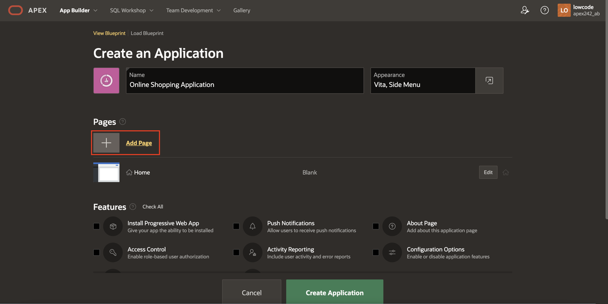
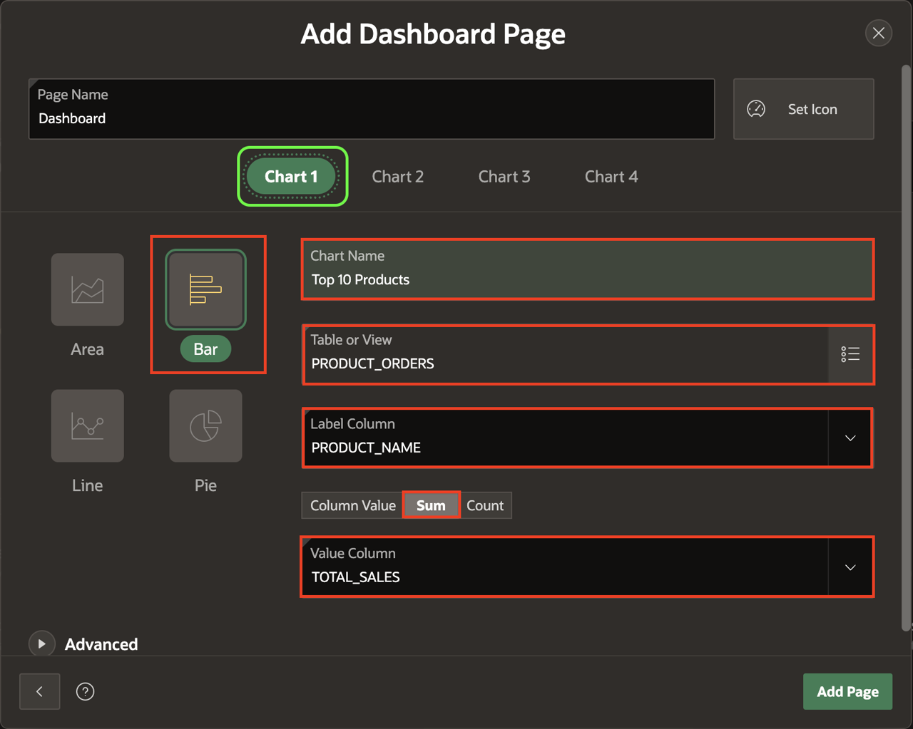
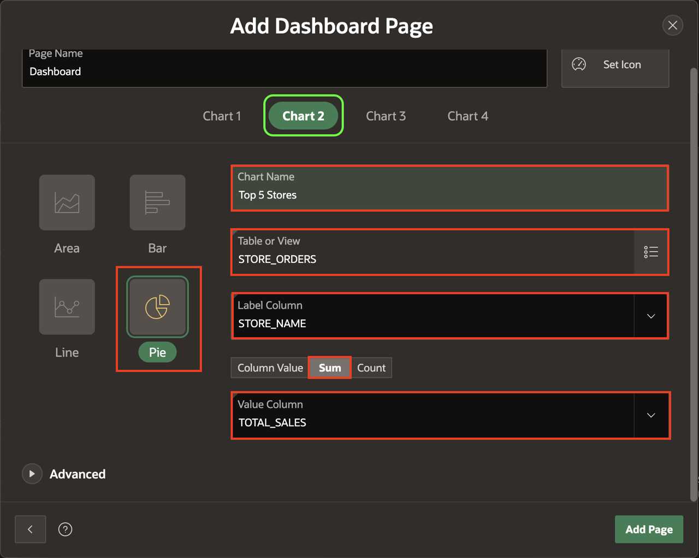
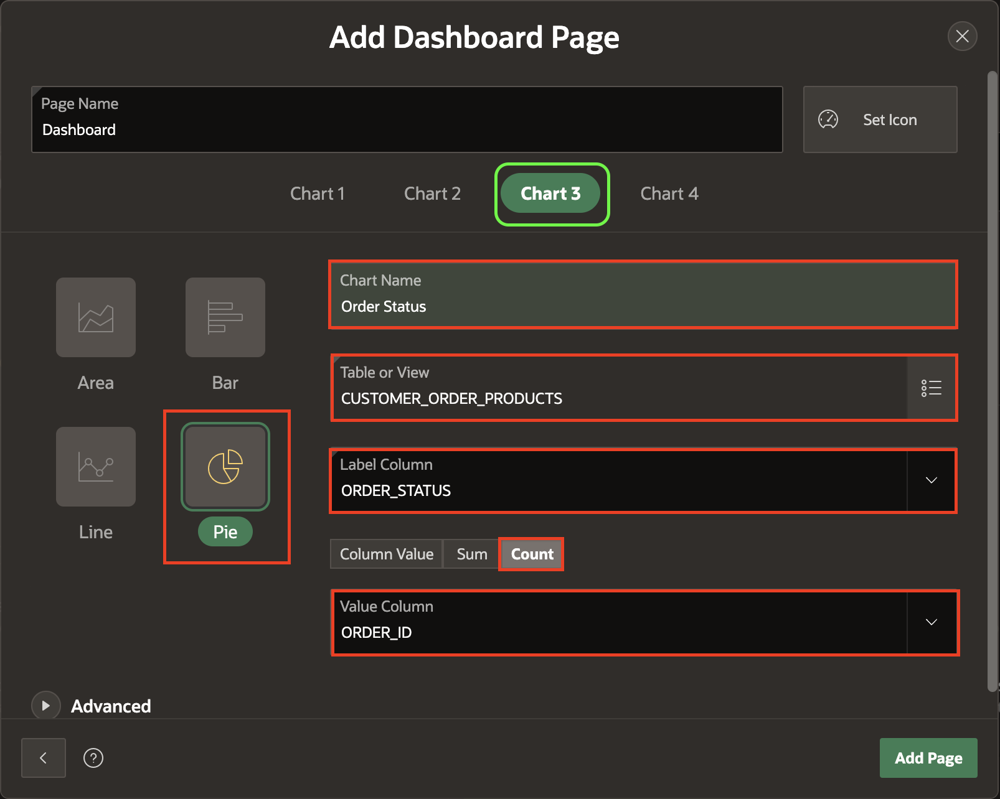
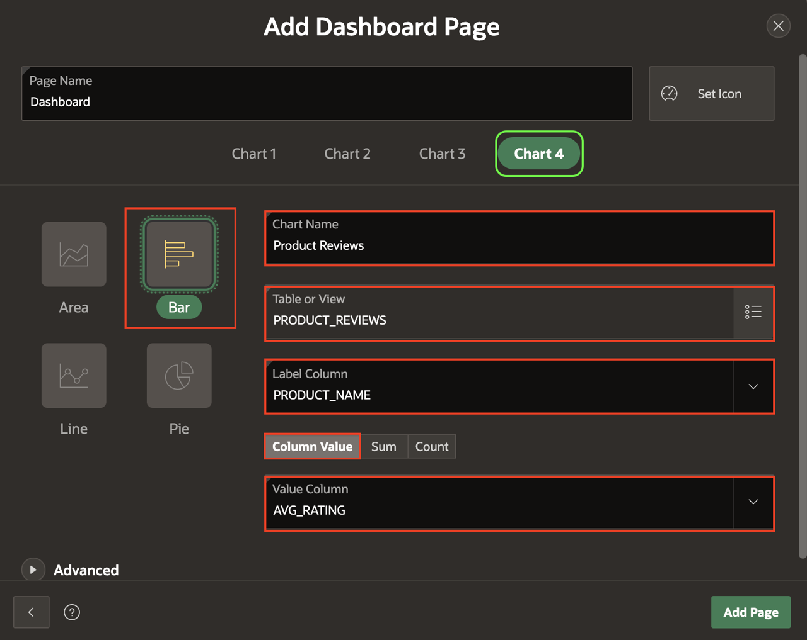
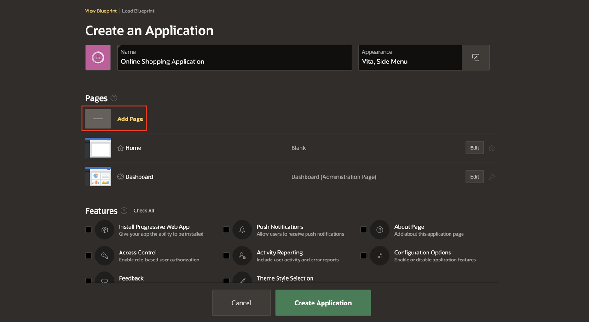
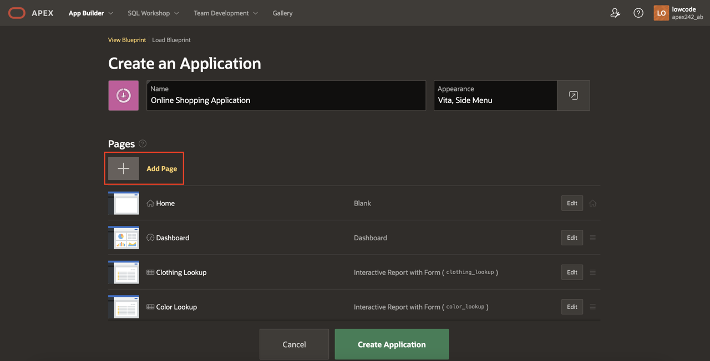
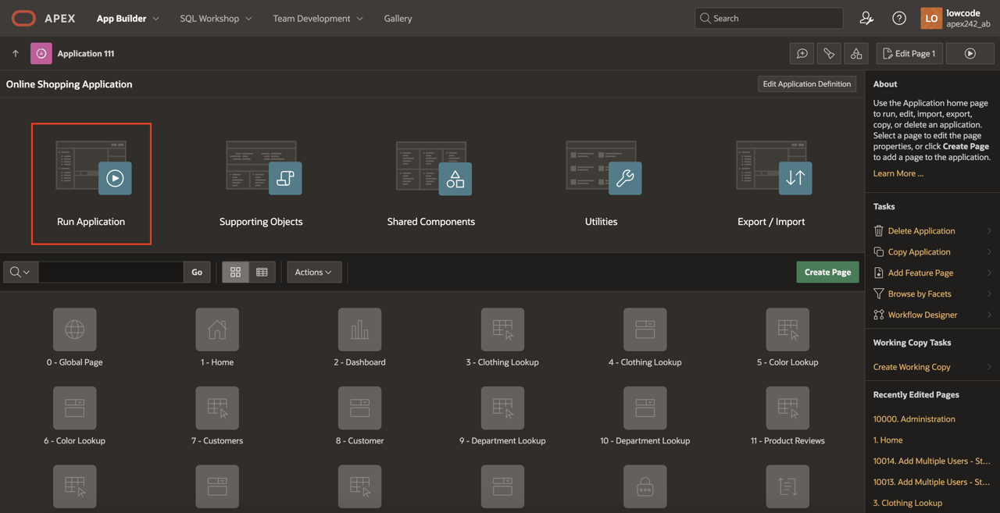
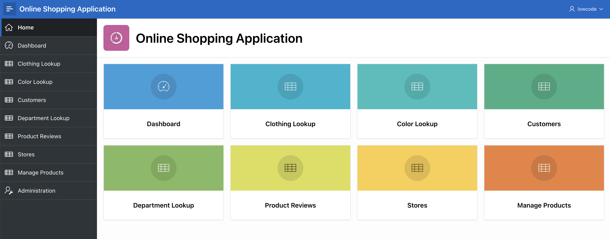

# Create a Database application based on Existing Tables

## Introduction

In this lab, you will learn to create a database application using existing tables in Oracle APEX. By following guided steps, you will develop an Online Shopping Application with various pages, charts, and reports. You will also implement an administration dashboard, enable features like Progressive Web Apps, and configure access control for secure management. This hands-on experience will help you understand the process of building a functional and secure data-driven application.

Estimated Time: 15 minutes

### Objectives

In this lab, you will:

- Create a database application based on existing tables.

- Add multiple pages, including dashboards, reports, and interactive pages.

- Configure administration pages and enable secure access controls.

- Implement Progressive Web App features.

- Explore and test the completed application.

## Task 1: Create an Application based on Existing Tables

This task introduces you to the App Builder in Oracle APEX. You will begin by creating a new application that serves as the foundation for the Online Shopping Application.

1. On your workspace home page, navigate to **App Builder**.

    

2. Click **Create**.

    

3. Select **Use Create App Wizard**.

    

## Task 2: Name the Application

In this task, you will name your application as Online Shopping Application and define its visual identity. The name helps identify the application in the workspace, and the wizard will automatically select an icon and color for it.

1. On the **Create an Application** page, for **Name**, enter **Online Shopping Application**.

    *Note that the icon and color in the create application wizard will be randomly selected, and hence they might be different for you.*

    

## Task 3: Add the Dashboard Page

Dashboards are essential for summarizing critical information using charts and visuals. In this task, you will add a dashboard to display key metrics such as product sales, store performance, order statuses, and product reviews using bar and pie charts.

1. On the **Create an Application** page, click **Add Page**.

    

2. Select **Dashboard**.

    

3. Select **Chart 1**, and enter/select the following:

    - Chart Type: **Bar**

    - Chart Name: **Top 10 Products**

    - Table or View: **PRODUCT_ORDERS**

    - Label Column: **PRODUCT_NAME**

    - Type: **Sum**

    - Value Column: **TOTAL_SALES**

    

4. Select **Chart 2**, and enter/select the following:

    - Chart Type: **Pie**

    - Chart Name: **Top 5 Stores**

    - Table or View: **STORE_ORDERS**

    - Label Column: **STORE_NAME**

    - Type: **Sum**

    - Value Column: **TOTAL_SALES**

    

5. Select **Chart 3**, and enter/select the following:

    - Chart Type: **Pie**

    - Chart Name: **Order Status**

    - Table or View: **CUSTOMER\_ORDER\_PRODUCTS**

    - Label Column: **ORDER_STATUS**

    - Type: **Sum**

    - Value Column: **ORDER_ID**

    

6. Select **Chart 4**, and enter/select the following:

    - Chart Type: **Bar**

    - Chart Name: **Product Reviews**

    - Table or View: **PRODUCT_REVIEWS**

    - Label Column: **PRODUCT_NAME**

    - Type: **Column Value**

    - Value Column: **AVG_RATING**

    

7. Under **Advanced**, enable **Set as Administration Page** and click **Add Page**.

    

    *Note - Setting a page as an Administration Page will ensure that only certain users can run the page. In this case, only users with Administration Rights can run the Dashboard page, which means this page will require authentication.*

## Task 4: Add Multiple Reports

Reports provide detailed views of data in your application. In this task, you will add multiple report pages to display various data sets like customers, stores, and products. This allows you to organize data and make it accessible to the app's administrators.

1. On the **Create an Application** page, click **Add Page**.

    

2. Under **Additional Pages**, select **Multiple Reports**.

    

3. On the **Add Multiple Reports** page, select the following tables and click **Add Pages**.

    - CLOTHING_LOOKUP
    - COLOR_LOOKUP
    - CUSTOMERS
    - DEPARTMENT_LOOKUP
    - PRODUCT_REVIEWS
    - STORES

    

    

## Task 5: Set Multiple Reports as Administration Pages

Not all pages should be accessible to all users. In this task, you will configure the report pages as Administration Pages, ensuring they are accessible only to authorized users with administrative privileges.

1. Edit each of the following pages to set it as an Administration Page:

    - CLOTHING_LOOKUP
    - COLOR_LOOKUP
    - CUSTOMERS
    - DEPARTMENT_LOOKUP
    - PRODUCT_REVIEWS
    - STORES

    

2. For each page you edit, click **Advanced** and enable **Set as Administration Page**.

3. Click **Save Changes**.

    

## Task 6: Add Manage Products Page

Interactive reports allow users to manage and analyze data dynamically. In this task, you will create a Manage Products page, enabling administrators to view and interact with product data in the database.

1. On the Create an  Application page, click **Add Page**.

    

2. Select **Interactive Report**.

    

3. On the **Add Report Page**, enter/select the following:

    - Page Name: **Manage Products**

    - Table: **PRODUCTS**

4. Under **Advanced**, enable **Set as Administration Page** and click **Add Page**.

    

## Task 7: Enable Features

Oracle APEX provides features like Progressive Web Apps (PWA) and Access Control to enhance application functionality and security. In this task, you will enable these features to make your app installable on devices and secure it with role-based access controls.

1. Under **Features**, check **Install Progressive Web App** and **Access Control**.

    *Note: Progressive Web Apps (PWAs) can be easily installed on any desktop or mobile device, offering users a more native app experience. Access Control enables role-based user authorization with a single click.*

    

## Task 8: Finish Creating the Application

After adding all the required pages and enabling features, this task will guide you to finalize and create the application. Once completed, you will be able to run the application and review its structure.

1. Scroll to the bottom of the page and click **Create Application**.

    

2. Once the application is created, you will find the new app on the app builder home page.
Click **Run Application**.

    

## Task 9: Explore the Application

In the final task, you will explore the Online Shopping Application by signing in, navigating through the pages, and testing its features. This step ensures the application is functioning as intended.

1. Enter your Credentials and click **Sign In**.

    

2. A new application will be displayed. Click on the navigation menu to explore the pages you just created.

    

## Summary

You have successfully created a database application in Oracle APEX using existing tables. This lab covered various aspects, including dashboards, reports, administration pages, access controls, and Progressive Web App features. With this knowledge, you can now build robust, data-driven applications tailored to your requirements. You may now **proceed to the next lab**.

## Acknowledgements

- **Author** - Roopesh Thokala, Senior Product Manager; Ankita Beri, Product Manager
- **Last Updated By/Date** - Ankita Beri, Product Manager, September 2024
