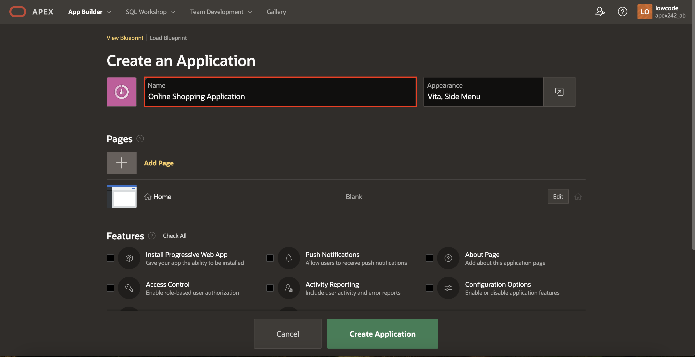
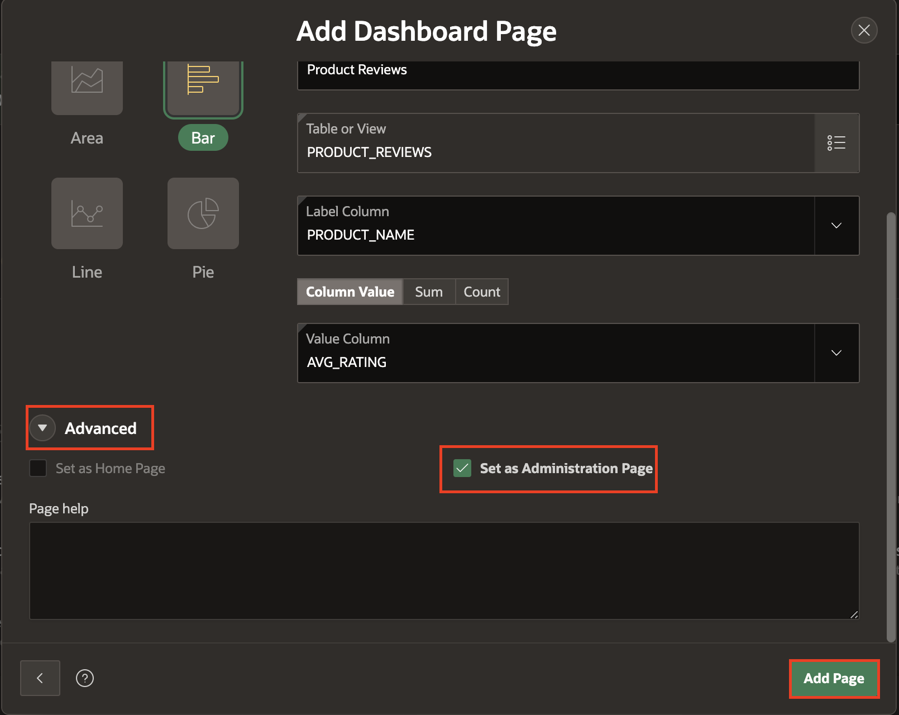

# Create a Database application based on Existing Tables.

In this lab, you will create a database application based on existing tables.

## Introduction

In this lab, you will create a database application based on existing tables.

Estimated Time: 15 minutes

<!--Watch the video below for a quick lab walkthrough.

-->

### Objectives

- Create an application using the tables and data you have installed.
- Create a Database application from a file.

## Task 1: Create an Application based on Existing Tables.

1. In the App Builder menu, click **App Builder**.

2. Click **Create**.

    

3.  Select **Use Create App Wizard**.

    

## Task 2: Name the Application

1. In the Create Application wizard, for Name, enter **Online Shopping Application**.

   *Note that the icon and colour in the create application wizard will be randomly selected, so they will most likely not be the same color or icon they see in the screenshot.*

    

## Task 3: Add the Dashboard Page

A dashboard page is a great way to show critical information using various charts. Installing the Sample Dataset also created several views, which join data from multiple tables. These views are ideal as the basis for the dashboard charts.

1. In the Create Application wizard, click **Add Page**.

2. Select **Dashboard**.

    

3. For Chart 1, Enter the following:

    * For Chart Type – Select **Bar**
    * For Chart Name – Enter **Top 10 Products**
    * For Table or View – Select **PRODUCT_ORDERS**
    * For Label Column – Select **PRODUCT_NAME**
    * For Type – Select **Sum**
    * For Value Column – Select **TOTAL_SALES**.

    

4. Click Chart 2; enter the following:

    * For Chart Type – Select **Pie**
    * For Chart Name – Enter **Top 5 Stores**
    * For Table or View – Select **STORE_ORDERS**
    * For Label Column – Select **STORE_NAME**
    * For Type – Select **Sum**
    * For Value Column – Select **TOTAL_SALES**.

    

5. Click Chart 3; enter the following:

    * For Chart Type – Select **Pie**
    * For Chart Name – Enter **Order Status**
    * For Table or View – Select **CUSTOMER\_ORDER\_PRODUCTS**
    * For Label Column – Select **ORDER_STATUS**
    * For Type – Select **Count**
    * For Value Column – Select **ORDER_ID**.

        

6. Click Chart 4, and enter the following:

    * For Chart Type – Select **Bar**
    * For Chart Name – Enter **Product Reviews**
    * For Table or View – Select **PRODUCT_REVIEWS**
    * For Label Column – Select **PRODUCT_NAME**
    * For Type – Select **Column Value**
    * For Value Column – Select **AVG_RATING**.

      

7. Click Advanced and check **Set as Administration Page**.

  

   *Note - Setting a page as an Administration Page will ensure that only certain users can run the page. In this case, only users with Administration Rights can run the Dashboard page, which means this page will require authentication.*

8. Click **Add Page**.

## Task 4: Add Multiple Reports

1. In the Create Application wizard, click **Add Page**.
2. Click the arrow to the left of **Additional Pages** to see additional page types.
3. Click **Multiple Reports**.

    

4. On the Create Multiple Reports Page, select the following tables:
    - CLOTHING_LOOKUP
    - COLOR_LOOKUP
    - CUSTOMERS
    - DEPARTMENT_LOOKUP
    - PRODUCT_REVIEWS
    - STORES

5. Click **Add Pages**.

    
    

## Task 5: Set Multiple Reports as Administration Pages

1. Edit each of the following pages to set it as an Administration Page:
    - CLOTHING_LOOKUP
    - COLOR_LOOKUP
    - CUSTOMERS
    - DEPARTMENT_LOOKUP
    - PRODUCT_REVIEWS
    - STORES

  

2. For each page you edit, click **Advanced** and check **Set as Administration Page**.

3. Click **Save Changes**.

    

## Task 6: Add Manage Products Page

1. In the Create Application wizard, click **Add Page**.
2. Select **Interactive Report**.

    

3. On the Report Page, enter the following:
    - For Page Name: Enter **Manage Products**
    - For Table: Select **PRODUCTS**

<!--
4. Expand Lookup columns, and enter the following:

    - Lookup Key 1 - select **CLOTHING_ID**
    - Display Column 1 - select **CLOTHING_LOOKUP.CLOTHING**
    - Lookup Key 2 - select **DEPARTMENT_ID**
    - Display Column 2 - select **DEPARTMENT\_LOOKUP.DEPARTMENT**
    - Lookup Key 3 - select **COLOR_ID**
    - Display Column 3 - select **COLOR_LOOKUP.COLOR**
-->
4. Click **Advanced** and check **Set as Administration Page**.

5. Click **Add Page**.

  

## Task 7: Set Features

Features are a set of optional application capabilities in Oracle APEX that you can include in your new Application. Access Control enables role-based user authorization with a single click.

1. Under **Features** section, check **Install Progressive Web App** and **Access Control**.

  

## Task 8: Finish Creating the Application

Now that you have added all the pages, it is time to create and review the app.

1. Scroll to the bottom of the page and click **Create Application**.

    

2. Once the Application is created, you will find the new app on the application home page.
Click **Run Application**.

    

## Task 9: Run the Application

1. Enter your Credentials. Click **Sign In**.

    

    The new Application will be displayed. Explore the pages that you just created by clicking on the navigation menu.

    

## Summary

You can now create an application with several page types based on existing database objects. You may now **proceed to the next lab**.

## Acknowledgements

- **Author** - Roopesh Thokala, Senior Product Manager
- **Contributor** - Ankita Beri, Product Manager
- **Last Updated By/Date** - Ankita Beri, Product Manager, January 2023
