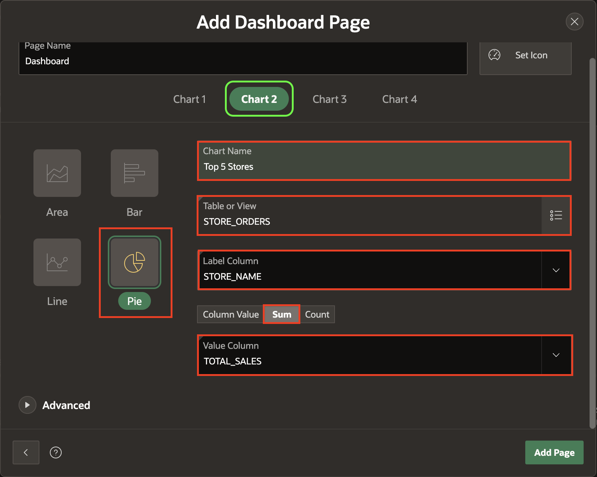
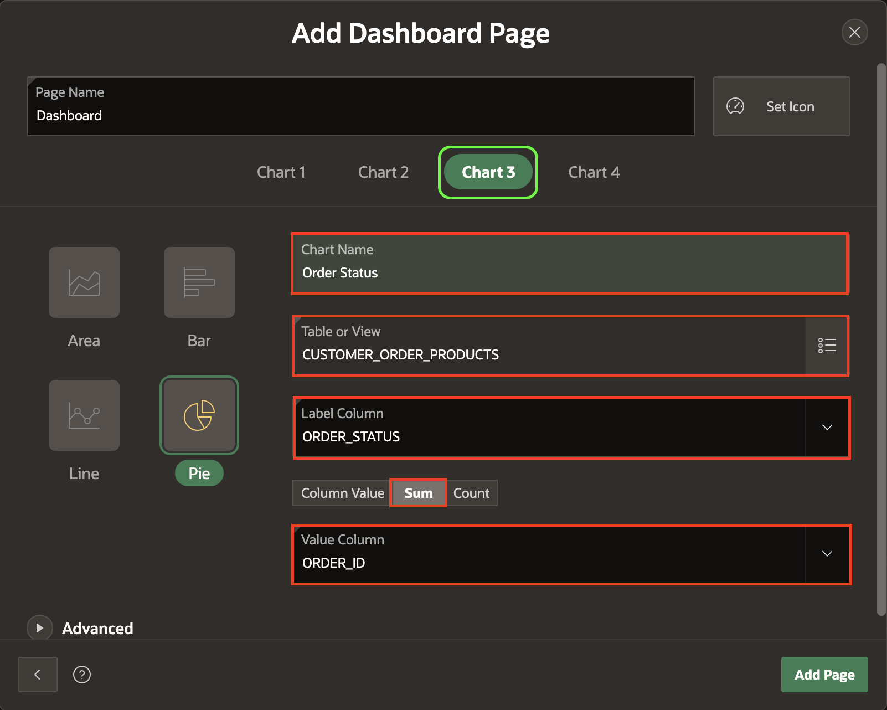
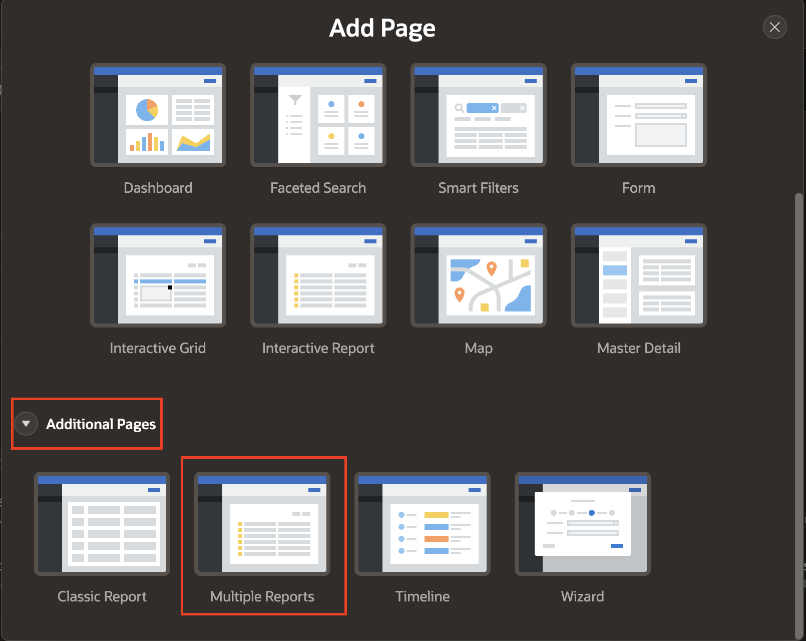
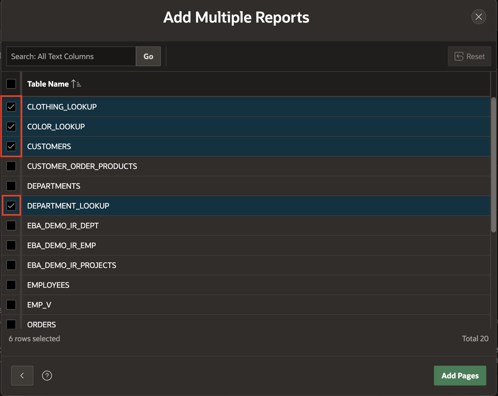
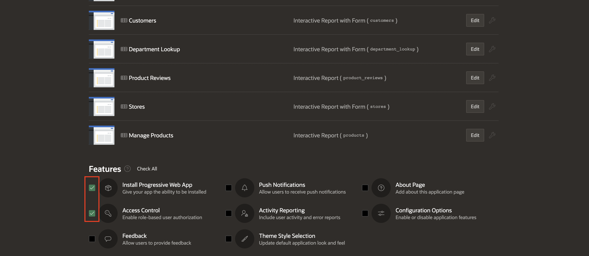
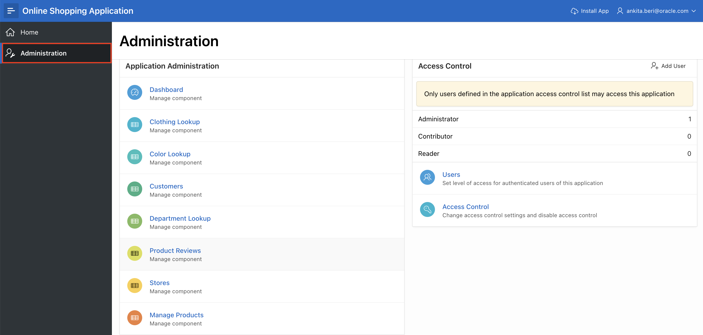

# Create a Database application based on Existing Tables

You learn how to create a database application using existing tables in this lab. Following the guided steps, you will use the App Builder tool to build an Online Shopping Application with various pages, charts, and reports. The lab will also demonstrate how to set up an administration page, enable features like Progressive Web Apps, and implement access control for secure management. You will gain hands-on experience developing a functional, data-driven application through this lab.

Estimated Time: 15 minutes

## Objectives

In this lab, you will:

- Create an application using the tables and data you have installed.

- Create a Database application from a file.

## Task 1: Create an Application based on Existing Tables

1. On your workspace home page, navigate to **App Builder**.

    

2. Click **Create**.

    

3. Select **Use Create App Wizard**.

    

## Task 2: Name the Application

1. On the **Create an Application** page, for **Name**, enter **Online Shopping Application**.

    *Note that the icon and color in the create application wizard will be randomly selected, and hence they might be different for you.*

    

## Task 3: Add the Dashboard Page

In this task, you will learn to create a dashboard. A dashboard page is a great way to show critical information using various charts. Installing the sample dataset created several views that join data from multiple tables. These views are ideal as the basis for the dashboard charts.

1. On the **Create an Application** page, click **Add Page**.

    

2. Select **Dashboard**.

    

3. Select **Chart 1**, and enter/select the following:

    - Chart Type: **Bar**

    - Chart Name: **Top 10 Products**

    - Table or View: **PRODUCT_ORDERS**

    - Label Column: **PRODUCT_NAME**

    - Type: **Sum**

    - Value Column: **TOTAL_SALES**

    

4. Select **Chart 2**, and enter/select the following:

    - Chart Type: **Pie**

    - Chart Name: **Top 5 Stores**

    - Table or View: **STORE_ORDERS**

    - Label Column: **STORE_NAME**

    - Type: **Sum**

    - Value Column: **TOTAL_SALES**

    

5. Select **Chart 3**, and enter/select the following:

    - Chart Type: **Pie**

    - Chart Name: **Order Status**

    - Table or View: **CUSTOMER\_ORDER\_PRODUCTS**

    - Label Column: **ORDER_STATUS**

    - Type: **Count**

    - Value Column: **ORDER_ID**.

    

6. Select **Chart 4**, and enter/select the following:

    - Chart Type: **Bar**

    - Chart Name: **Product Reviews**

    - Table or View: **PRODUCT_REVIEWS**

    - Label Column: **PRODUCT_NAME**

    - Type: **Column Value**

    - Value Column: **AVG_RATING**.

    

7. Under **Advanced**, enable **Set as Administration Page** and click **Add Page**.

    

    *Note - Setting a page as an Administration Page will ensure that only certain users can run the page. In this case, only users with Administration Rights can run the Dashboard page, which means this page will require authentication.*

## Task 4: Add Multiple Reports

1. On the **Create an Application** page, click **Add Page**.

    

2. Under **Additional Pages**, select **Multiple Reports**.

    

3. On the **Add Multiple Reports** page, select the following tables and click **Add Pages**.

    - CLOTHING_LOOKUP
    - COLOR_LOOKUP
    - CUSTOMERS
    - DEPARTMENT_LOOKUP
    - PRODUCT_REVIEWS
    - STORES

    

    

## Task 5: Set Multiple Reports as Administration Pages

1. Edit each of the following pages to set it as an Administration Page:

    - CLOTHING_LOOKUP
    - COLOR_LOOKUP
    - CUSTOMERS
    - DEPARTMENT_LOOKUP
    - PRODUCT_REVIEWS
    - STORES

    

2. For each page you edit, click **Advanced** and enable **Set as Administration Page**.

3. Click **Save Changes**.

    

## Task 6: Add Manage Products Page

1. On the Create an  Application page, click **Add Page**.

    

2. Select **Interactive Report**.

    

3. On the **Add Report Page**, enter/select the following:

    - Page Name: **Manage Products**

    - Table: **PRODUCTS**

4. Under **Advanced**, enable **Set as Administration Page** and click **Add Page**.

    

## Task 7: Enable Features

In this task, you will enable features before creating an application. Features are a set of optional application capabilities in Oracle APEX that you can include in your new application.

1. Under **Features**, check **Install Progressive Web App** and **Access Control**.

    *Note: Progressive Web Apps (PWAs) can be easily installed on any desktop or mobile device, offering users a more native app experience. Access Control enables role-based user authorization with a single click.*

    

## Task 8: Finish Creating the Application

Now that you have added all the pages, it is time to create and review the application.

1. Scroll to the bottom of the page and click **Create Application**.

    

2. Once the application is created, you will find the new app on the app builder home page.
Click **Run Application**.

    

## Task 9: Explore the Application

1. Enter your Credentials and click **Sign In**.

    

2. A new application will be displayed. Click on the navigation menu to explore the pages you just created.

    

## Summary

You can now create an application with several page types based on existing database objects. You may now **proceed to the next lab**.

## Acknowledgements

- **Author** - Roopesh Thokala, Senior Product Manager; Ankita Beri, Product Manager
- **Last Updated By/Date** - Ankita Beri, Product Manager, September 2024
