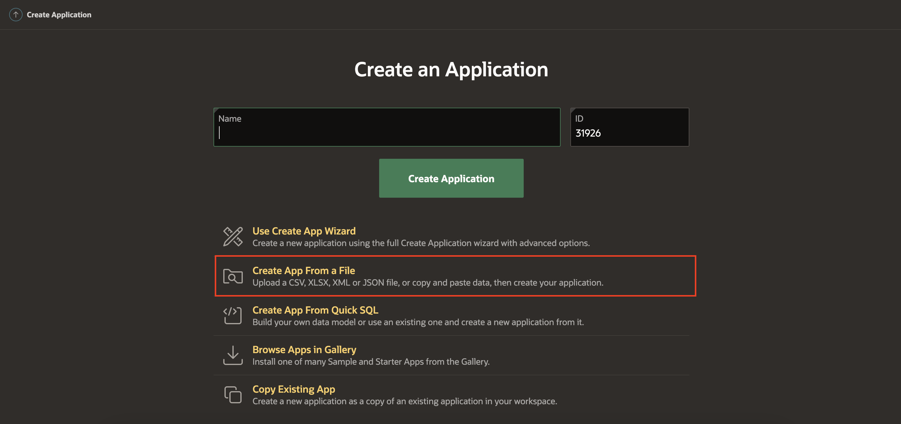
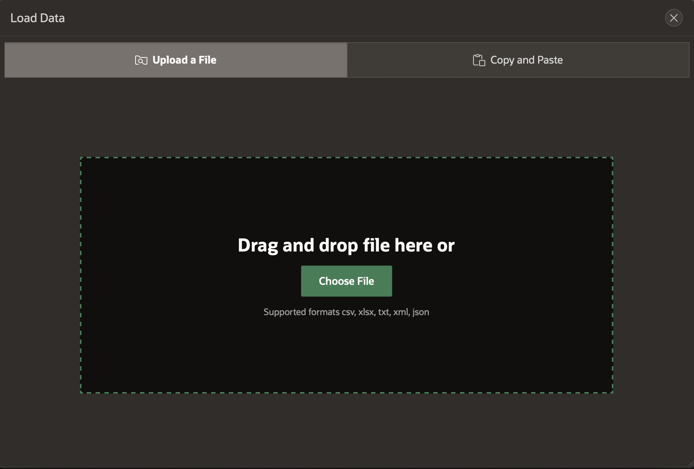
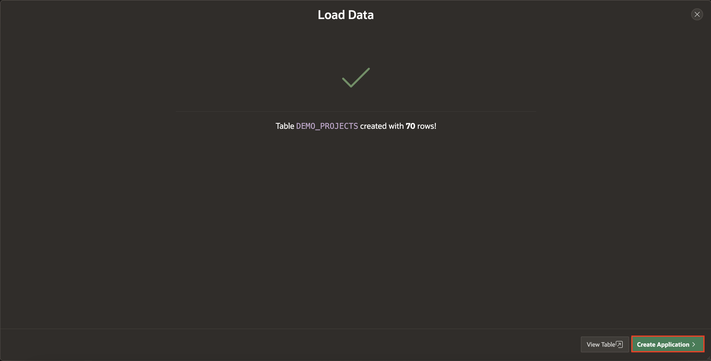
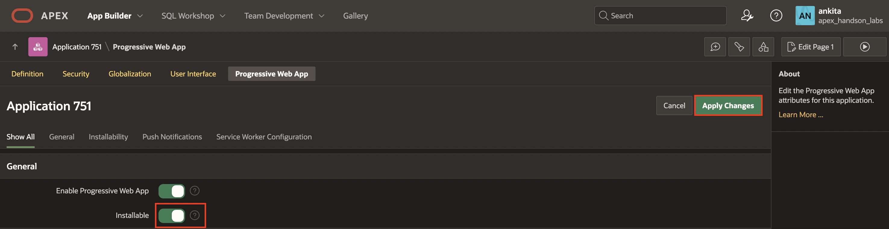

# Create an App from a Spreadsheet

In this lab, you build a simple application based on a spreadsheet. Remember that APEX is great for various apps, from simple ones to large, sophisticated apps based on local database objects, REST-enabled SQL objects, and even REST APIs.

While APEX developers spend the majority of their time in the App Builder, you should also investigate the SQL Workshop, where you can create and maintain database objects, Team Development, where you can track large APEX development projects, and the App Gallery, which contains numerous productivity and sample apps that can be installed within minutes.

Estimated Time: 10 minutes

## Objectives

In this lab, you will:

- Create an application from a spreadsheet.

- Restore a Deleted Application.

- Configure Progressive Web App.

## Task 1: Load Project data

1. On your APEX workspace home page, select **App Builder** and click **Create**.

    

2. Select **Create App From a File**.

    

    When creating an application from a file, APEX allows you to upload CSV, XLSX, XML, or JSON files and then build apps based on the data. Alternatively, you can copy and paste CSV data or load sample data.

3. On the **Load Data** page, click **Choose File**.

    

4. Download and select [**demo_projects.csv**](files/demo_projects.csv) file from your local system.

    

5. Review the parsed data. For **Table Name**, enter **DEMO_PROJECTS** and click **Load Data**.

    

    After clicking **Load Data**, you will see a spinner until the page finishes loading the data.

## Task 2: Create an Application

The Data Load wizard has created a new table and populated that table with the records from the sample data spreadsheet. Now, you will create an app based on this new table.

1. Verify that 70 rows are loaded into the **DEMO_PROJECTS** table in the Load Data dialogue. Then, click **Create Application**.

    

2. From the Create an Application page, you will remove the following pages:

    - Demo Projects Search

    - Demo Projects Report

    - Calendar

    On the **Create an Application** page, click **Edit** next to the **Demo Projects Search**.

    

3. Click **Delete** on the **Add Faceted Search Page** and then confirm it by clicking **OK**.

    

    

    Repeat the steps for **Demo Projects Report** and **Calendar**.

4. Click **Create Application**.

    

    When the wizard finishes creating the Application, you will be redirected to the Application's home page in the App Builder.

## Task 3: Load Application Blueprint

In this task, you learn to delete and restore the Demo Projects application using Oracle APEX's load blueprint feature.

1. Select the **Demo Projects** application on the workspace home page.

    

2. Click **Edit Application Definition**.

    

3. Click **Delete** to delete the application.

    

4. Click **Permanently Delete Now**.

    

5. Now, to restore the application using Blueprint, click **Create** on the workspace home page.

    

6. Select **Use Create App Wizard**.

    

7. At the top of the page, click **Load Blueprint**.

    

8. Select **Load** on the **Demo Projects** row.

    

9. Click **Create Application**.

    

## Task 4: Configure Progressive Web App Attributes

1. Navigate to **Shared Components** from the application home page.

    

2. Under **User Interface**, select **Progressive Web App**.

    

3. **Toggle On** Installable and click **Apply Changes**.

    

## Task 5: Run and Explore the New App

1. Navigate back to **DEMO\_PROJECTS** application and then click **Run Application**. This will open the runtime application in a new browser tab, allowing you to see how end users will view the app.

    

    

2. Enter your user credentials and click **Sign In**.

    *Note: Use the same Username and Password you used to sign into the APEX Workspace.*

    

3. Click the **Install App** icon on the top right of the page to install the application on your local system.

    

## Summary

You now know how to create a spreadsheet application by dragging and dropping a file or loading sample data for training purposes.

## What's Next?

The next workshop will teach you to navigate and review the page designer panes. You will know how to create a normal page, add a region, sub-region, and page items, and lock and unlock pages.

## Acknowledgements

- **Author** -  Roopesh Thokala, Senior Product Manager, Ankita Beri, Product Manager; Ankita Beri, Product Manager
- **Last Updated By/Date** - Ankita Beri, Product Manager, September 2024
