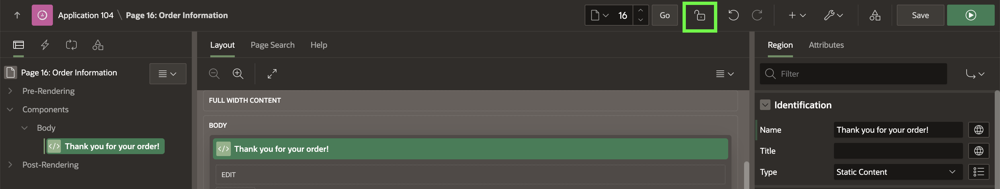
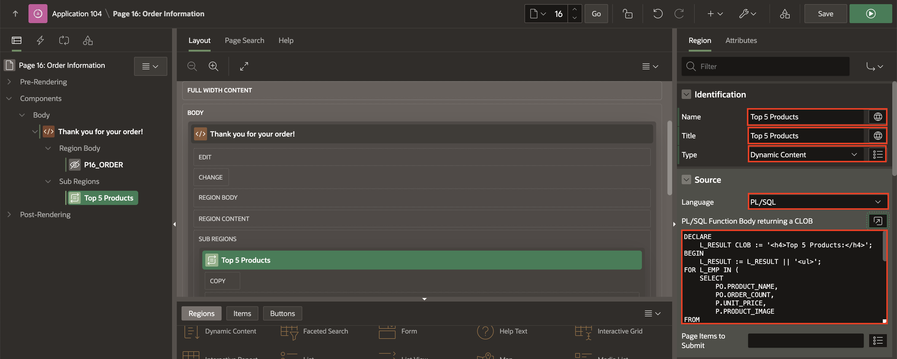
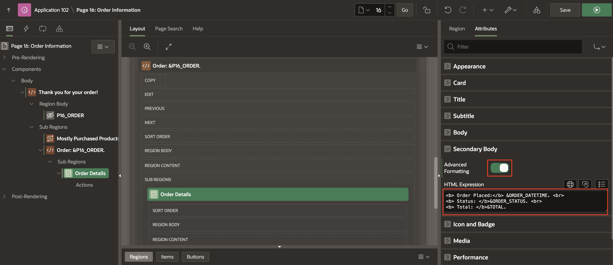
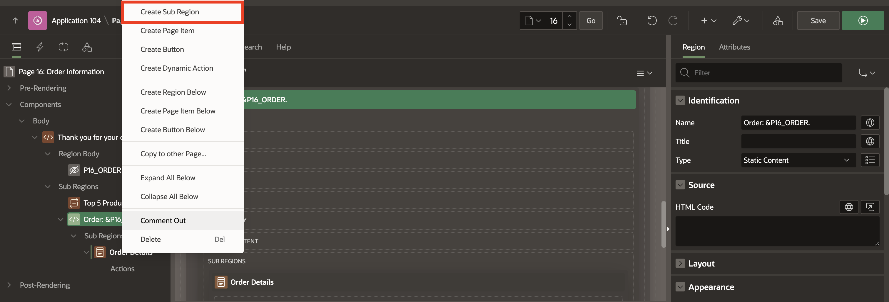

# Create the order page - Working with Pages and Regions

## Introduction

In this lab, you open the home page in Page Designer, navigate through and review the Page Designer panes. Then, you create a new page allowing customers to view their recent order details.

Customers will be able to view the following details of the Order:

- Order number
- Order date
- Status
- Total price
- Quantity and price of the items.

Estimated Time: 15 minutes

### Objectives

In this lab, you will:

- Navigate and Review the Page Designer panes.

- Create a page to review the items that the customer just bought.

### Downloads

Stuck or Missed out on completing the previous labs? Don't worry! You can download the application from **[here](fhttps://c4u04.objectstorage.us-ashburn-1.oci.customer-oci.com/p/EcTjWk2IuZPZeNnD_fYMcgUhdNDIDA6rt9gaFj_WZMiL7VvxPBNMY60837hu5hga/n/c4u04/b/livelabsfiles/o/data-management-library-files/apex-23-2-object-storage-files/hol3-lab1.sql)** and import it into your workspace. To run the app, please run the steps described in the following workshops:

1. **[Get Started with Oracle APEX](https://livelabs.oracle.com/pls/apex/r/dbpm/livelabs/run-workshop?p210_wid=3509)**

2. **[Using SQL Workshop](https://livelabs.oracle.com/pls/apex/r/dbpm/livelabs/run-workshop?p210_wid=3524)**

## Task 1: Navigate and Review the Page Designer panes

1. In the App Builder, run the **Online Shopping Application**.
    You are now in the application runtime environment. Use the developer toolbar to navigate to the Home page.
    In the Developer Toolbar, click **Page 1**.

    **Note**: If you are NOT on the Home page, then the Developer Toolbar will show the current page number, and clicking *Page xx* will navigate to the page xx instead of Page 1.

    

2. The Page Designer is displayed on Page 1. Page Designer has three main panes: the **Left**, **Central**, and **Right** Panes.
    You can change the size of each pane by selecting the dividers and sliding them left or right. Change the size of the grid layout and gallery by sliding the divider between them up and down.

    

3. On the page designer, you can invoke help on any attribute by clicking **Help** icon on the toolbar. Select a component and then select an attribute in the property editor to display help on that attribute.

    For example, in the screenshot below, select **Online Shopping Application** in the rendering tree on the left and then select **Sequence > Layout** in the property editor on the right. Click **Help** and the help text for **Sequence** is displayed.

    

4. Click the **+** icon (Create) in the page designer and select **Page**.

    

## Task 2: Create a Blank Page for Order Information

1. On the **Create a Page** dialog, select **Blank Page**.

    

2. On **Create Blank Page** dialog, enter/select the following:
    - Under Page Definition:

        - Page Number: **16**

        - Name: **Order Information**

    - Under Navigation:

        - Use Breadcrumb: Toggle **OFF**

        - Use Navigation: Toggle **ON**

          Click **Create Page**.

    

## Task 3: Add a Region

In this task, you will add a region to the page to display order details.

1. In the newly created page, navigate to the **Gallery Menu** at the bottom, showing Regions, Items, and Buttons categories and ensure that **Regions** tab is selected.

2. Drag a **Static Content** region and drop it in the **Body** section.

    

3. In the Property Editor, enter/select the following:

    - Identification > Title: **Thank you for your order!**

    - Under Appearance:

        - Template: **Content Block**

        - Template Options:

            - Click **Template Options** label to open the Template Options dialog.

            - Enable **Show Region Icon**

            - Click **OK**

        - Icon: **fa-heart**

    

## Task 4: Lock and Unlock Pages

Prevent conflicts during application development by locking pages in your application. By locking a page, you prevent other developers from editing it. You can lock a page on the Application home page, Page Locks page, and in Page Designer.

The Page Lock button on the Page Designer toolbar indicates whether a page is locked. The Page Lock button displays as an unlocked padlock if the page is unlocked.

1. To lock a page in Page Designer, click the **Page Unlocked icon** on the Page Designer toolbar.

    

2. Enter a comment in the **Comment** field. Click **Lock**. When a page is locked, the Page Lock button displays as a **Locked padlock**.

    

3. To unlock a page in Page Designer, click the **Page Locked icon** button. If another user has locked the page, the Lock button appears in red. You cannot unlock a page locked by another user.

    

4. Click the **Page locked by you** button on the Page Designer toolbar.  Click **Unlock**.

    

## Task 5: Add Items to the Page

Add a hidden item used to store the order ID that is not visible to the end user.

1. In the Rendering tree (left pane), right-click on **Thank you for your Order!** and select **Create Page Item**.

    

2. In the Property editor, enter/select the following:

    - Under Identification:

        - Name: **P16_ORDER**

        - Type: **Hidden**

    

## Task 6: Add Dynamic Content Region

In this task, you will add a region to display mostly purchased products along with their prices.

1. In the Rendering tree (left pane), right-click on the **Thank you for your Order!** region and select **Create Sub Region**.

    

2. In the Property editor, enter/select the following:

    - Under Identification:

        - Name: **Mostly Purchased Products**

        - Title: **Mostly Purchased Products**

        - Type: **Dynamic Content**

    - Under Source:

        - Language: **PL/SQL**

        - PL/SQL Function Body returning a CLOB: Copy and paste below code in the code editor:

        ```
        <copy>
        DECLARE
            L_RESULT CLOB := '<h4>Mostly Purchased Products:</h4>';
        BEGIN
            L_RESULT := L_RESULT || '<ul>';
        FOR L_EMP IN (
            SELECT
                PO.PRODUCT_NAME,
                PO.ORDER_COUNT,
                P.UNIT_PRICE,
                P.PRODUCT_IMAGE
        FROM
                 PRODUCT_ORDERS PO
            JOIN PRODUCTS P ON PO.PRODUCT_NAME = P.PRODUCT_NAME
        WHERE
                PO.ORDER_STATUS = 'COMPLETE'
            AND ROWNUM <= 5
        ORDER BY
            PO.ORDER_COUNT DESC
        ) LOOP
        L_RESULT := L_RESULT
                    || '<li><strong>'
                    || APEX_ESCAPE.HTML(L_EMP.PRODUCT_NAME)
                    || '</strong>'
                    || ' - '
                    || APEX_ESCAPE.HTML(L_EMP.UNIT_PRICE)
                    || '</li>';
            END LOOP;
            L_RESULT := L_RESULT || '</ul>';
            RETURN L_RESULT;
        END;
        ```
        </copy>

    

## Task 7: Add Static Content Region

In this task, you will add a sub-region to display order and items details.

1. In the Rendering tree (left pane), right-click on the **Thank you for your Order!** region and select **Create Sub Region**.

    

2. In the Property editor, enter/select the following:

    - Title: **Order: &P16_ORDER.** (including the period)

    - Type: **Static Content**

    

## Task 8: Add Order Details Region

Add a region to display Order details.

1. In the Rendering tree (left pane), right-click on the **Order: &P16_ORDER.** region and select **Create Sub Region**.

    

2. In the Property Editor, enter/select the following:

    - Under Identification:

        - Title: **Order Details**

        - Type: **Cards**

    - Under Source:

        - Type: **SQL Query**

        - SQL Query: Enter the following SQL Query:

            ```
            <copy>
            SELECT
                O.ORDER_ID,
                O.ORDER_DATETIME,
                O.CUSTOMER_ID,
                O.ORDER_STATUS,
                O.STORE_ID,
          (
            SELECT
                SUM(UNIT_PRICE * QUANTITY)
            FROM
                ORDER_ITEMS I
            WHERE
                I.ORDER_ID = O.ORDER_ID
          ) TOTAL
            FROM
                ORDERS O
            WHERE
                ORDER_ID = :P16_ORDER
            </copy>
            ```

        - Page Items to Submit: **&P16_ORDER.**

    

3. Click **Attributes** and enter/select the following:

    - Under **Secondary Body**:

        - Advanced Formatting: Toggle **On**

        - HTML Expression: Copy and paste the below HTML expression in the code editor:

            ```
            <copy>
            <b> Order Placed:</b> &ORDER_DATETIME. <br>
            <b> Status: </b>&ORDER_STATUS. <br>
            <b> Total: </b>&TOTAL.
            </copy>
            ```

    

## Task 9: Add Items Region

Add a region to display items in the Order.

1. In the Rendering tree (left pane), right-click on **Order: &P16_ORDER.** region and select **Create Sub Region**.

    

2. In the Property Editor, enter/select the following:

    - Under Identification:

        - Title: **Items**

        - Type: **Cards**

    - Under Source:

        - Type: **SQL Query**

        - SQL Query: Enter the following SQL Query:

            ```
            <copy>
            SELECT
                 O.LINE_ITEM_ID                ITEM,
                 P.PRODUCT_NAME                PRODUCT,
                 O.UNIT_PRICE,
                 O.QUANTITY,
               ( O.UNIT_PRICE * O.QUANTITY ) SUBTOTAL,
                 P.PRODUCT_IMAGE
            FROM
                ORDER_ITEMS O,
                PRODUCTS    P
            WHERE
                P.PRODUCT_ID = O.PRODUCT_ID
                AND ORDER_ID = :P16_ORDER
            </copy>
            ```

        - Page Items to Submit: **&P16_ORDER.**

    

3. Click **Attributes** and enter/select the following:

    - Title > Column: **PRODUCT**

    - Under Secondary Body:

        - Advanced Formatting: Toggle **ON**

        - HTML Expression: Copy and paste the below HTML expression in the code editor:

            ```
            <copy>
            <b>Quantity: </b> &QUANTITY. <br>
            <b>Unit Price: </b>&UNIT_PRICE.
            </copy>
            ```

    

    - Under Media:

        - Source: **BLOB Column**

        - BLOB Column: **PRODUCT_IMAGE**

        - Position: **Body**

        - Appearance: **Auto**

        - Sizing: **Fit**

    - Card > Primary Key Column 1: **ITEM**

    

4. Click **Save**.

## Summary

You now know how to add a new page to your existing APEX Application and add regions to define the page's content using the Page Designer. You may now **proceed to the next workshop**.

## What's Next?

In the next workshop, you learn how to create and develop various reports, including Interactive Grids, Smart Filters, Cards, and Faceted Searches.

## Acknowledgements

- **Author** - Roopesh Thokala, Senior Product Manager; Ankita Beri, Product Manager
- **Last Updated By/Date** - Ankita Beri, Product Manager, September 2024
