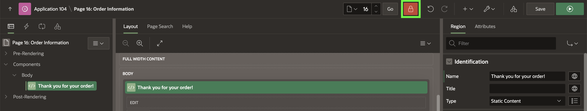
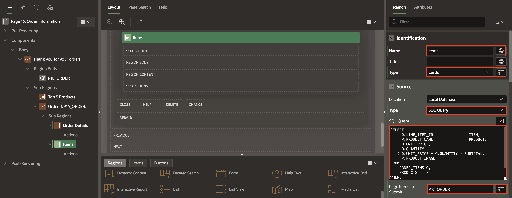

# Create the order page - Working with Pages and Regions

## Introduction

In this lab, you open the home page in Page Designer, navigate through and review the page Designer panes. Then, you create a new page allowing customers to view their recent order details.
Customers will find the following details of the Order:
- Order number
- Order date
- Status
- Total price
- Quantity and price of the items.  

Estimated Time: 15 minutes


### Objectives
In this lab, you will:
- Navigate and Review the Page Designer panes.
- Create a page to review the items that the customer just bought.

### Downloads
- Did you miss out on trying the previous labs? Don't worry! You can download the application from **[here](files/online-shopping-cart-1.sql)** and import it into your workspace. To run the app, please run the steps described in **[Get Started with Oracle APEX](https://apexapps.oracle.com/pls/apex/r/dbpm/livelabs/run-workshop?p210_wid=3509)** and **[Using SQL Workshop](https://apexapps.oracle.com/pls/apex/r/dbpm/livelabs/run-workshop?p210_wid=3524)** workshops.

## Task 1: Navigate and Review the Page Designer panes
Open the home page in Page Designer, navigate through and review the Page Designer panes.

1. In the App Builder, run the Online Shopping Application. You are now in the application runtime environment. Use the application menu to navigate to the Home page.
Use the application menu to navigate to the Home page. In the Developer Toolbar, click  **Page n**.

  Note: If you are not on the Home page, then the Developer Toolbar will show the current page number, and clicking Edit Page xx will navigate to that page instead of Page n.
    

2. The Page Designer is displayed on Page 1. Page Designer has three main panes: the Left, Central, and Right Pane.
You can change the size of each pane by selecting the dividers and sliding them left or right. Change the size of the Grid Layout and Gallery by sliding the divider between them up and down.

    

3. In the Page Designer, you can invoke help on any attribute by clicking **Help** Icon on the toolbar. Select a component and then select an attribute in the Property Editor to display help on that attribute.

  For Example, in this screenshot below, you select **Online Shopping Application** in the Rendering tree on the left and then select **Sequence > Layout** in the Property Editor on the right. The help text for **Sequence** is displayed.

    

4. click Create (the **+** icon) in the page designer and select **Page**.

    

## Task 2: Create a Normal Page - Order Information
Create a Normal Page to review the Order that the customer has made.

1. In the Create a Page dialog, Select **Blank Page** and click **Next**.

    

2. Enter the following:
    - Page Number - enter **15**
    - Name - enter **Order Information**  

  Now, Click on **Navigation**, and Enter the following.
    - Breadcrumb - Set to **No**
    - Navigation - Set to **Yes**
  Click **Create Page**.
  


## Task 3: Add a Region
Add a region to the page to display order details.

1. In the newly created page, navigate to the **Gallery Menu** at the bottom, showing Regions, Items, and Buttons categories and ensure that **Regions** is selected.
2. Drag a **Static Content** region and drop it to the **Body** section.

    

3. In the Property Editor, enter the following:
    - For Title - enter **Thank you for your order!**
    - For Template - select **Content Block**
    - For Template Options - Click on the rectangular area next to the Template Options label to open the Template Options dialog. Check **Show Region Icon** in the Dialog page and click **OK**.
    
    - For Icon, enter **fa-heart**

        

## Task 4: Lock and Unlock Pages
Prevent conflicts during application development by locking pages in your application. By locking a page, you prevent other developers from editing it. You can lock a page on the Application home page, Page Locks page, and in Page Designer.

The Page Lock button on the Page Designer toolbar indicates whether a page is locked. The Page Lock button displays as an unlocked padlock if the page is unlocked.

1. To lock a page in Page Designer, click the Page Unlocked button on the Page Designer toolbar.

  

2. Enter a comment in the **Comment** field. Click **Lock**. When a page is locked, the Page Lock button displays as a **locked padlock**.

  

3. To unlock a page in Page Designer, the Page Lock button displays as a locked padlock if a page is locked.

  

4. click the **Page locked by you** button on the Page Designer toolbar. If another user has locked the page, the Lock button appears in red. You cannot unlock a page locked by another user. Click Unlock.

  


## Task 5: Add Items to the Page
Add a hidden item used to store the order ID without the user's being able to see it.

1. In the Rendering tree (left pane), click on the **Thank you for your Order!** region to select it.
2. Right-click the region and click **Create Page Item**.

    

3. In the property editor, set the name and Type as follows:

    | Name |  Type  |
    | --- |  --- |
    | P15_ORDER | Hidden |

        

## Task 6: Add Static Content Region
Add a region to contain Order details and items.

1. In the Rendering tree (left pane), click on the **Thank you for your Order!** region.
2. Right-click the region and click **Create Sub Region**.

    

3. In the Property Editor, enter the following:
    - For Title - enter the expression (including the period) **Order: &P15_ORDER.**
    - For Type - select **Static Content**  

  

## Task 7: Add Order Details Region
Add a region to display Order details.

1. In the Rendering tree (left pane), navigate to the **Order: &P15_ORDER.** region.
2. Right-click the region and click **Create Sub Region**.

    

3. In the Property Editor, enter the following:
    - For Title - enter **Order Details**
    - For Type - select **Cards**
    - Under Source section:
        - For Type - select **SQL Query**
        - For SQL Query - enter the following SQL Query:

            ```
            <copy>
            SELECT o.order_id,
                o.order_datetime,
                o.customer_id,
                o.order_status,
                o.store_id,
                (SELECT Sum(unit_price * quantity)
                    FROM   order_items i
                    WHERE  i.order_id = o.order_id) total
            FROM   orders o
            WHERE  order_id = :P15_ORDER
            </copy>
            ```
      

4. Click **Attributes**.

    -  Search for the Secondary Body in the filter and do the following:
        - Set Advanced Formatting to **On**
        - For HTML Expression - enter:

            ```
            <copy>
            <b> Order Placed:</b> &ORDER_DATETIME. <br>
            <b> Status: </b>&ORDER_STATUS. <br>
            <b> Total: </b>&TOTAL.    
            </copy>
            ```
      

## Task 8: Add Items Region
Add a region to display items in the Order.

1. In the Rendering tree (left pane), navigate to the **Order: &P15_ORDER.** region.
2. Right-click the region and click **Create Sub Region**.

    
3. In the Property Editor, enter the following:
    - For Title - enter **Items**
    - For Type - select **Cards**
    - Under Source section:
        - For Type - select **SQL Query**
        - For SQL Query - enter the following SQL Query:

            ```
            <copy>
            SELECT  o.line_item_id                Item,
                    p.product_name                Product,
                    o.unit_price,
                    o.quantity,
                    ( o.unit_price * o.quantity ) Subtotal,
                    p.product_image
            FROM   order_items o,
                products p
            WHERE  p.product_id = o.product_id
            AND  order_id = :P15_ORDER
            </copy>
            ```
    

4. Click **Attributes** and do the following:

    - Under Title section:
        - For Column - select **PRODUCT**    

    - Under Secondary Body:
        - Set Advanced Formatting to **On**
        - For HTML Expression - enter:

            ```
            <copy>
            <b>Quantity: </b> &QUANTITY. <br>
            <b>Unit Price: </b>&UNIT_PRICE.    
            </copy>
            ```

    

    - Under Media section:
        - For Source - select **BLOB Column**   
        - For BLOB Column - select **PRODUCT_IMAGE**  
        - For Position - select **Body**  
        - For Appearance - select **Auto**  
        - For Sizing - select **Fit**

    - Under Card:
        - For Primary Key Column - Select **ITEM**.

    

5. Click **Save**.

## Summary
You now know how to add a new page to your existing APEX Application and add regions to define the page's content using the Page Designer. You may now **proceed to the next lab**.

## What's next
In the next hands-on lab, you learn how to create and develop various reports, including Interactive Grids, Smart Filters, Cards, and Faceted Searches.

## Acknowledgements
- **Author** - Roopesh Thokala, Senior Product Manager
- **Contributor** - Ankita Beri, Product Manager
- **Last Updated By/Date** - Roopesh Thokala, Senior Product Manager, January 2024
