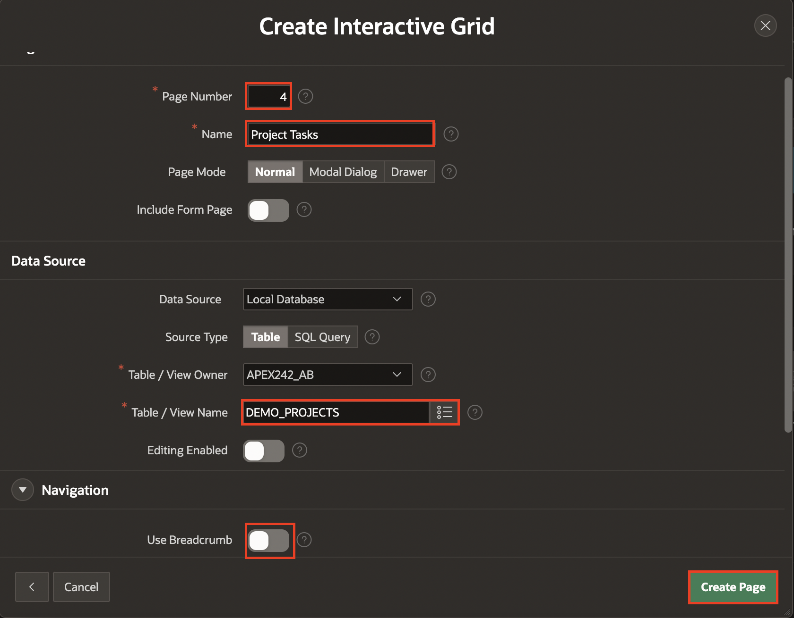
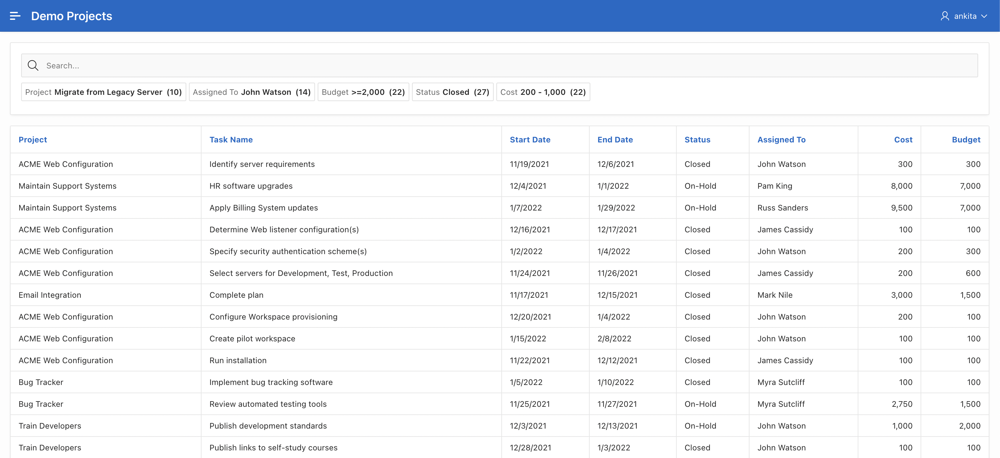

# Add Pages to the Demo Projects application

## Introduction

In this lab,
  - You navigate to **Demo Projects Application** and create an **Interactive Grid** and **Smart Filters** Pages.

<!--
Customers will be able to:
- Review the items in the shopping cart
- Edit the quantity of the items
- Remove an item
- Clear the shopping cart
- Proceed to checkout

Estimated Time: 20 minutes

Watch the video below for a quick walk through of the lab.

-->
Estimated Time: 20 minutes

### Objectives
In this lab, you will:
- Create Pages to Search and Edit the Projects and Tasks in **Demo Projects** Application.

### Downloads

- Did you miss out trying the previous labs? Don’t worry! You can download the application from **[here](files/demo-projects1.sql)** and import it into your workspace. To run the app, please run the steps described in **[Get Started with Oracle APEX](https://apexapps.oracle.com/pls/apex/r/dbpm/livelabs/run-workshop?p210_wid=3509)** and **[Using SQL Workshop](https://apexapps.oracle.com/pls/apex/r/dbpm/livelabs/run-workshop?p210_wid=3524)** workshops.

## Task 1: Add Interactive Grid to Demo Projects Application.
In this lab, you create an interactive grid on the **DEMO_PROJECTS** table. You already created the **Demo Projects** application in HOL-3. Now, you create an **Interactive Grid** in the **Demo Projects** application.

1. On the Workspace home page, click the App Builder icon. Select **Demo Projects** Application.

    

2. Click **Create Page**.

    

3. For Create a Page: Select Page Type - Select **Component** and then select **Interactive Grid**.

    

4. For Page Attributes, enter the following:
   Under **Page Definition**:
    - For Page Number, enter **4**.
    - For Page Name, enter **Project Tasks**  

  Under **Data Source**:
    - For **Table/View Name**, Select **DEMO_PROJECTS**.

  Under **Navigation**
    - For **Breadcrumb**, Set it to **No**.

  Click **Create Page**.

    

5. Now that you have created an **Interactive Grid** Page, you can view the page by clicking **Save** and **Run Page** on the top Right.

    

## Task 2: Add Smart Filters to Demo Projects Application.
In this lab, you create a Smart Filters report on the DEMO_PROJECTS table. You already created the **Demo Projects** application in HOL-3. Now, you will create a Smart Filters in the Demo Projects application.

1. Navigate to Create button and click **Page**.

    

2. For Create a Page: Select Page Type - Under **Component** tab, select **Smart Filters**.

    

3. For **Create Smart Filters**, enter the following:
   Under **Page Definition**:
    - For **Page Number**, enter **8**
    - For **Name**, enter **Project Tasks Search**  

   Under **Data Source**:
    - For **Table/View Name**, enter **DEMO_PROJECTS**  

   Under **Navigation**
      - For **Breadcrumb**, Set it to **No**.

   Click **Next**.

  

4. For **Select the Filters** page:
    - Leave the remaining details to defaults.
    - Click **Create Page**.

    

5. Now that you have created a **Smart Filters** Page, You can view the Page by Clicking **Save and Run Page**

    

## Summary

You now know how to create interactive grid and smart filters. You may now **proceed to the next lab**.

## Acknowledgments

- **Author** - Roopesh Thokala, Product Manager
- **Contributor** - Ankita Beri, Product Manager
- **Last Updated By/Date** - Roopesh Thokala, Product Manager, March 2022
