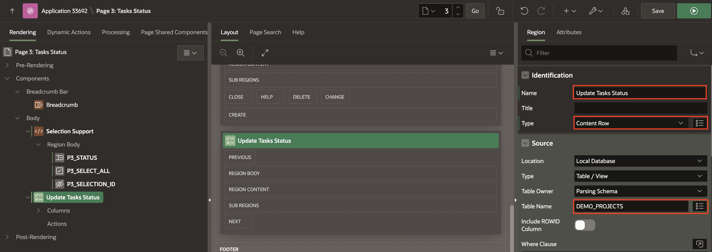
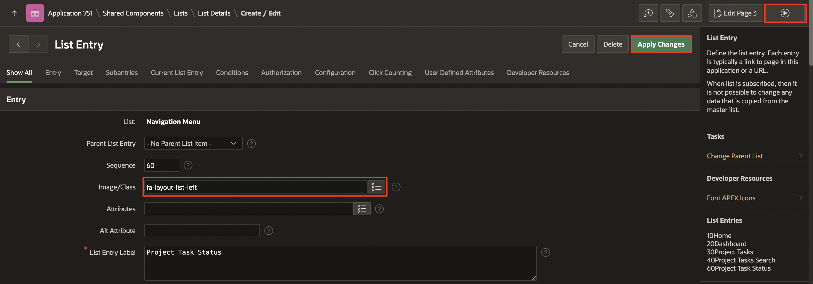

# Add Pages to the Demo Projects application

In this lab, you create an Interactive Grid, Smart Filters and Content Row Pages in the Demo Projects Application.

Estimated Time: 20 minutes

### Objectives
In this lab, you will:
- Create Pages to Search and Edit the Projects, Tasks and Project Task status in **Demo Projects** Application.

### Downloads

Stuck or Missed out on completing the previous labs? Don’t worry! You can download the application from **[here](https://c4u04.objectstorage.us-ashburn-1.oci.customer-oci.com/p/EcTjWk2IuZPZeNnD_fYMcgUhdNDIDA6rt9gaFj_WZMiL7VvxPBNMY60837hu5hga/n/c4u04/b/livelabsfiles/o/data-management-library-files/apex-23-2-object-storage-files/hol3-lab2.sql)** and import it into your workspace. To run the app, please run the steps described in the following workshops:
1. **[Get Started with Oracle APEX](https://livelabs.oracle.com/pls/apex/r/dbpm/livelabs/run-workshop?p210_wid=3509)**
2. **[Using SQL Workshop](https://livelabs.oracle.com/pls/apex/r/dbpm/livelabs/run-workshop?p210_wid=3524)**

## Task 1: Add Interactive Grid to Demo Projects Application
You create an interactive grid on the **DEMO_PROJECTS** table in this lab. You already created the **Demo Projects** application in **Workshop 3: Use SQL Workshop**. Now, you create an **Interactive Grid** in the **Demo Projects** application.

1. On the Workspace home page, click the App Builder icon. Select **Demo Projects** Application.

    

2. Click **Create Page**.

    

3. For Page Type, select **Interactive Grid**.

    

4. For Page Attributes, enter/select the following:

    - Under Page Definition:

        - Page Number: **4**

        - Page Name: **Project Tasks**  

    - Data Source > Table/View Name: **DEMO_PROJECTS**

    - Navigation > Use Breadcrumb: Toggle the button to **OFF**

   Click **Create Page**.

    

5. Click **Save and Run** to view the Interactive Grid page.

    

## Task 2: Add Smart Filters to Demo Projects Application
In this lab, you create a Smart Filters report on the DEMO_PROJECTS table.

1. Click the **+** icon and select **Page**.

    

2. For Page Type, select **Smart Filters**.

    

3. In Create Smart Filters wizard, enter/select the following:

    - Under Page Definition:

      - Page Number: **8**

      - Name: **Project Tasks Search**  

   - Data Source > Table/View Name: **DEMO_PROJECTS**  

   - Navigation > Use Breadcrumb: Toggle the button to **OFF**.

   Click **Next**.

  

4. In Select the Filters wizard, accept the default filters and click **Create Page**.

    

5. Click **Save and Run** to view the Smart Filters page.

    

## Task 3: Add Content Row to Demo Projects Application
You create a **Content Row** report in this lab on the DEMO_PROJECTS table. Content Row is a Classic Report template suitable for displaying most types of content. This report features a column for selection, such as a checkbox or radio button, an icon, a title and description, miscellaneous attributes, and actions.

1. Navigate to **+** icon and select **Page**.

    

2. In Create a Page wizard, select **Blank Page**.

    

3. In Create a Blank Page wizard, enter/select the following:
    - Page Number: **3**
    - Name: **Project Task Status**
    Click **Create Page**.

   

4. Under Page Rendering, right-click **Body** and select **Create Region**.

    

5. In the Property Editor, enter/select the following:  
    - Under Identification:

        - Title: **Project Task Status**

        - Type: **Content Row**

    - Source > Table Source: **DEMO\_PROJECTS**

      

6. Click on **Attributes** and enter the following:

    - Under Settings:

        - Overline: **&PROJECT.**

        - Title: **&TASK\_NAME.**

        - Description : **Task Assigned To: &ASSIGNED\_TO.**

        - Miscellaneous: **Cost: &COST.**

        

        

        - Display Avatar: Toggle the button to **ON**
        - Display Badge: Toggle the button to **ON**

    - Avatar > Icon: **fa-tasks**

    - Under Badge:

        - Label: **PROJECT**

        - Value: **STATUS**

        - State: **ASSIGNED\_TO**

    

7. Click **Save**.

8. Under **Shared Components**, select **Navigation Menu**. In the Property Editor, click **Edit Component**.

   

9. Click **Edit** icon for **Project Task Status**.

   

10. For Image/Class, enter **fa-layout-list-left**. Click A**pply Changes**.
    

11. Click **Run Application** to view the Project Tasks displayed as content rows.

    

## Summary
You now know how to create Interactive Grid, Smart Filters and Content Row pages. You may now **proceed to the next lab**.

## Acknowledgements
- **Author** - Roopesh Thokala, Product Manager
- **Contributor** - Ankita Beri, Product Manager
- **Last Updated By/Date** - Ankita Beri, Product Manager, January 2024
