# Add Pages to the Demo Projects application

In this lab, you will learn how to create different page types in the Demo Projects application, including Interactive Grid, Smart Filters, and Content Row pages. These pages allow users to search, filter, and manage project tasks and statuses. This hands-on experience will give you insight into how to effectively build and customize Oracle APEX applications to meet various business needs.

Estimated Time: 20 minutes

## Objectives

By the end of this lab, you will be able to:

- Create an Interactive Grid to search and edit project tasks.

- Implement Smart Filters to allow efficient filtering of project tasks.

- Design a Content Row page to display task details with selection and action capabilities.

### Downloads

Stuck or Missed out on completing the previous labs? Don’t worry! You can download the application from **[here](https://c4u04.objectstorage.us-ashburn-1.oci.customer-oci.com/p/EcTjWk2IuZPZeNnD_fYMcgUhdNDIDA6rt9gaFj_WZMiL7VvxPBNMY60837hu5hga/n/c4u04/b/livelabsfiles/o/data-management-library-files/apex-23-2-object-storage-files/hol3-lab2.sql)** and import it into your workspace. To run the app, please run the steps described in the following workshops:

1. **[Get Started with Oracle APEX](https://livelabs.oracle.com/pls/apex/r/dbpm/livelabs/run-workshop?p210_wid=3509)**

2. **[Using SQL Workshop](https://livelabs.oracle.com/pls/apex/r/dbpm/livelabs/run-workshop?p210_wid=3524)**

## Task 1: Add Interactive Grid to Demo Projects Application

In this task, you will create an Interactive Grid to display and manage tasks from the DEMO_PROJECTS table. An Interactive Grid allows users to interact with the data by sorting, filtering, and updating records directly within the grid.

1. On the Workspace home page, click **App Builder** and select **Demo Projects** application.

    

2. Click **Create Page**.

    

3. For Page Type, select **Interactive Grid**.

    

4. For page attributes, enter/select the following:

    - Under Page Definition:

        - Page Number: **4**

        - Page Name: **Project Tasks**

    - Data Source > Table/View Name: **DEMO_PROJECTS**

    - Navigation > Use Breadcrumb: Toggle **OFF**

      Click **Create Page**.

    

5. Click **Save and Run** to view the Interactive Grid page.

    

    

## Task 2: Add Smart Filters to Demo Projects Application

In this lab, you create a Smart Filters page on the **DEMO_PROJECTS** table.

1. On the **Page Designer** toolbar, navigate to **(+ v)** icon and select **Page**.

    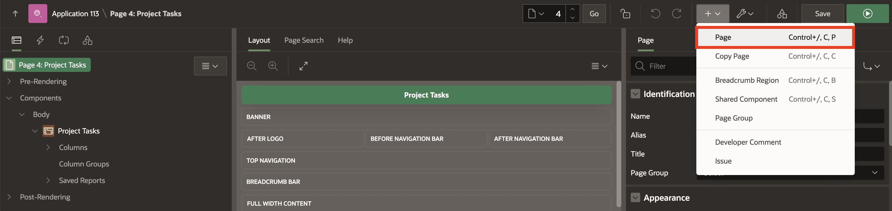

2. For Page Type, select **Smart Filters**.

    

3. In **Create Smart Filters** wizard, enter/select the following:

    - Under Page Definition:

        - Page Number: **8**

        - Name: **Project Tasks Search**

    - Data Source > Table/View Name: **DEMO_PROJECTS**

    - Navigation > Use Breadcrumb: Toggle **OFF**.

      Click **Next**.

    

4. Accept the default filters and click **Create Page**.

    

5. Click **Save and Run** to view the Smart Filters page.

    

    

## Task 3: Add Content Row to Demo Projects Application

In this task, you create a **Content Row** report with selection support on the DEMO_PROJECTS table. Content Row is a Classic Report template suitable for displaying most types of content. This report features a column for selection, such as a checkbox or radio button, an icon, a title and description, miscellaneous attributes, and actions.

1. On the **Page Designer** toolbar, navigate to **(+ v)** icon and select **Page**.

    

2. Select **Blank Page**.

    

3. On **Create Blank Page** wizard, enter/select the following:

    - Page Number: **3**

    - Name: **Tasks Status**

      Click **Create Page**.

    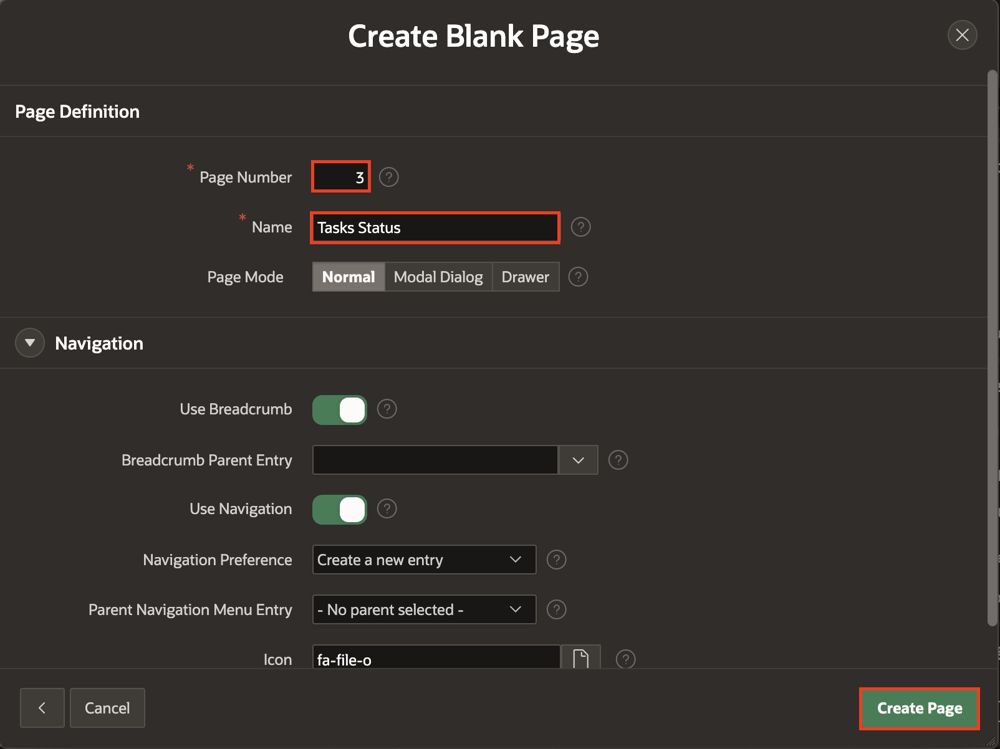

4. Under **Rendering** tab, right-click **Body** and select **Create Region**.

    

5. In the property editor, enter/select the following:

    - Identification > Name: **Selection Support**

    - Appearance > Template Defaults: Click **Use Template Options**

        - Common > Header: **Hidden**

        Click **OK**.

    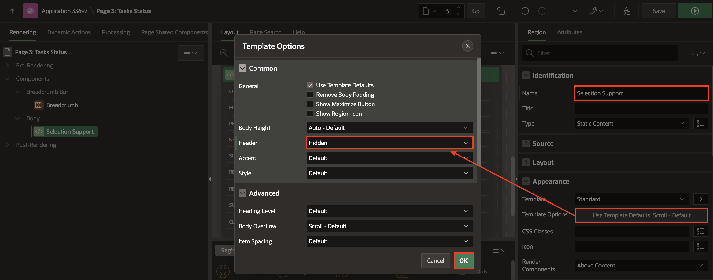

6. Right-click **Selection Support** region and select **Create Page Item**.

    

7. In the property editor, enter/select the following:

    - Under Identification:

        - Name: **P3\_STATUS**

        - Type: **Select List**

    - Label > Label: **Status**

    - Under List of Values:

        - Type: **SQL Query**

        - SQL Query:

        ```
        <copy>
        Select distinct status d, status r from demo_projects
        </copy>
        ```

        - Display Extra Values: Toggle **Off**

        - Display Null Value: Toggle **Off**

    

8. Right-click **Selection Support** region and select **Create Page Item**.

    

9. In the property editor, enter/select the following:

    - Under Identification:

        - Name: **P3\_SELECT\_ALL**

        - Type: **Checkbox**

    - Label > Label: **Select All**

    - Layout > Start New Row: Toggle **Off**

    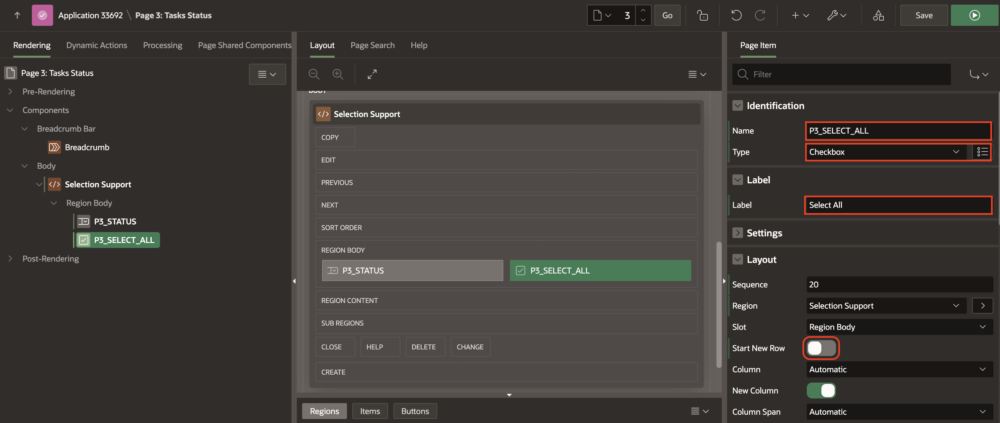

10. Right-click **Selection Support** region and select **Create Page Item**.

    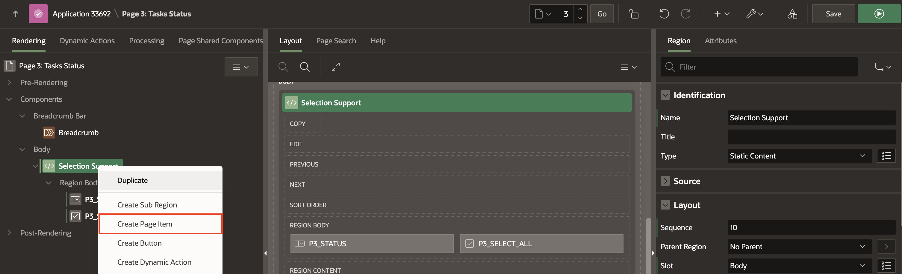

11. In the property editor, enter/select the following:

     - Under Identification:

        - Name: **P3\_SELECTION_ID**

        - Type: **Hidden**

    

12. Under **Page Rendering**, right-click **Body** and select **Create Region**.

    

13. In the Property Editor, enter/select the following:

    - Under Identification:

        - Title: **Update Tasks Status**

        - Type: **Content Row**

    - Source > Table Source: **DEMO\_PROJECTS**

    

14. Click **Attributes** and enter/select the following:

    - Under Settings:

        - Overline: **&PROJECT.**

        - Title: **&TASK\_NAME.**

        - Description : **Task Assigned To: &ASSIGNED\_TO.**

        - Miscellaneous: **Cost: &COST.**

        - Display Avatar: Toggle **ON**

        - Display Badge: Toggle the button to **ON**

    - Avatar > Icon: **fa-tasks**

    - Under Badge:

        - Label: **PROJECT**

        - Value: **STATUS**

        - State: **ASSIGNED\_TO**

    - Under Row Selection:

        - Type: **Multiple Selection**

        - Current Selection Page Item: **P3\_SELECTION\_ID**

        - Select All Page Item: **P3\_SELECT\_ALL**

    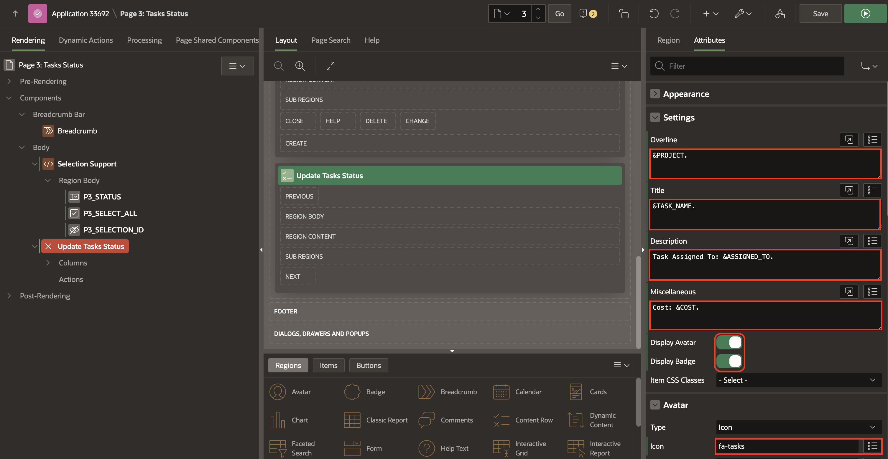

    

15. Right-click **Selection Support** region and select **Create Button**.

    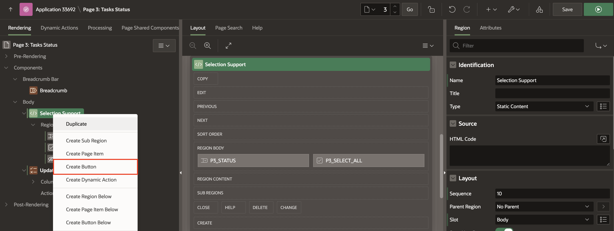

16. In the property editor, enter/select the following:

    - Under Identification:

        - Button Name: **Update**

        - Label: **Update**

    - Layout > Slot: **Change**

    - Under Appearance:

        - Button Template: **Text with Icon**

        - Hot: Toggle **ON**

        - Icon: **fa-save**

    

17. Right-click **Update** button and select **Create Dynamic Action**.

    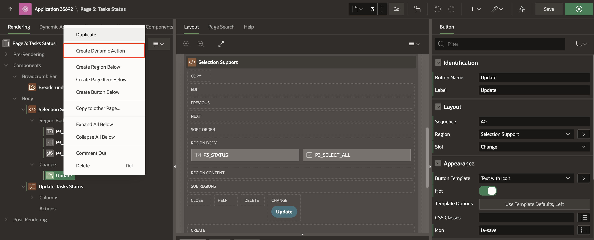

18. In the property editor, for name enter **Update Status**.

    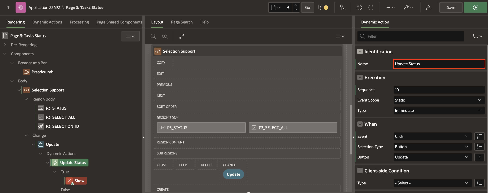

19. Click **Show** and in the property editor, enter/select the following:

    - Identification > Action: **Execute Server-side Code**

    - Settings > PL/SQL Code: Copy and paste the below code in the code editor:

    ```
    <copy>
    BEGIN
    UPDATE DEMO_PROJECTS
    SET
        STATUS = :P3_STATUS
    WHERE
        ID IN (
            SELECT
                COLUMN_VALUE
            FROM
                TABLE ( APEX_STRING.SPLIT(:P3_SELECTION_ID, ':') )
        );

    END;
    </copy>
    ```

    - Items to Submit: **P3\_STATUS,P3\_SELECTION\_ID**

    

20. Right-click **True** action and select **Create TRUE Action**.

    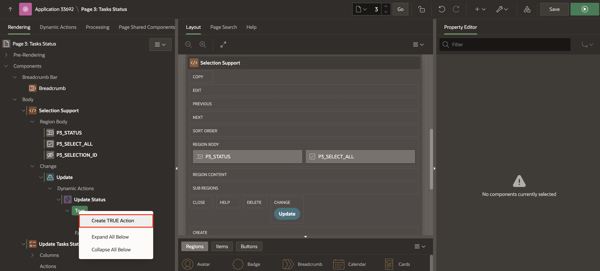

21. In the property editor, enter/select the following:

    - Identification > Action: **Refresh**

    - Under Affected Elements:

        - Selection Type: **Region**

        - Region: **Update Tasks Status**

    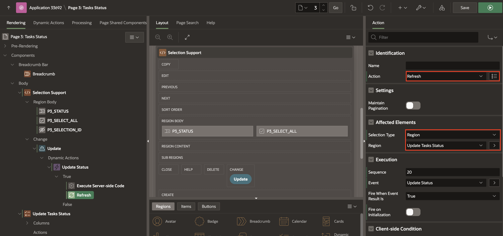

22. Click **Save and Run**.

    

23. To update the status of the Project Tasks, select any status from the list, check the rows you want to update, and then click the **Update** button.

    

    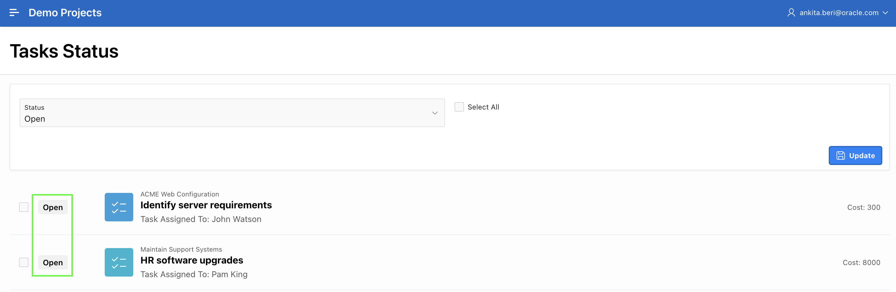

## Summary

You now know how to create Interactive Grid, Smart Filters and Content Row pages. You may now **proceed to the next lab**.

## Acknowledgements

- **Author** - Roopesh Thokala, Senior Product Manager; Ankita Beri, Product Manager
- **Last Updated By/Date** - Ankita Beri, Product Manager, September 2024
