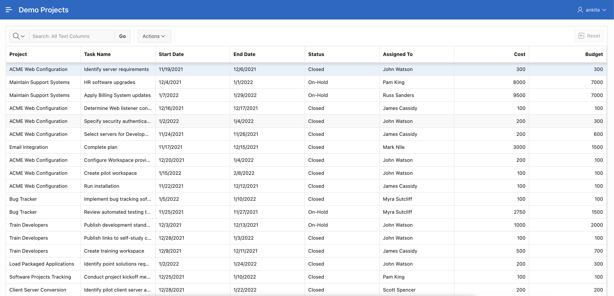
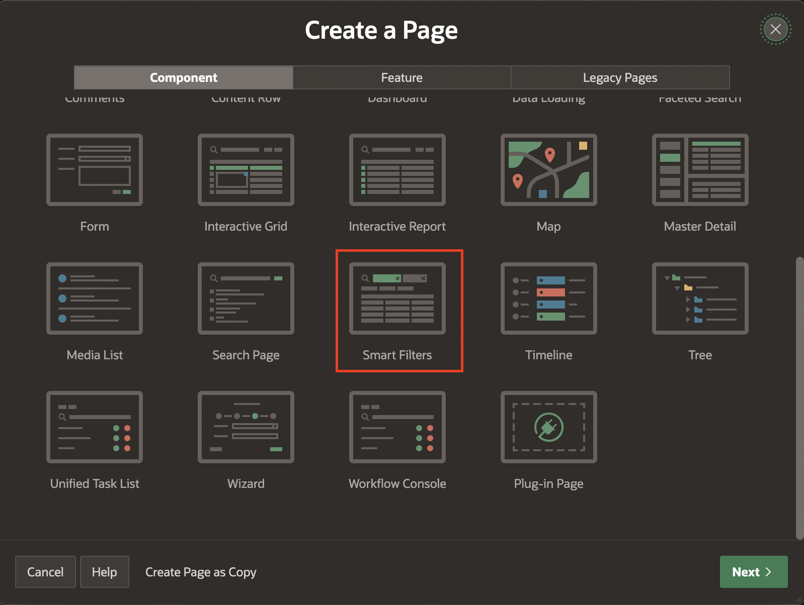
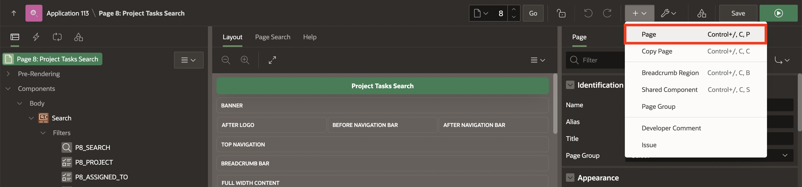
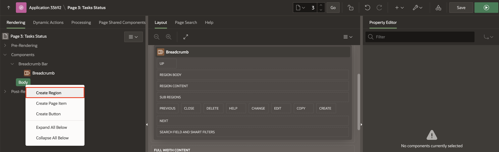

# Add Pages to the Demo Projects application

## Introduction

In this lab,
  - You navigate to **Demo Projects Application** and create an **Interactive Grid**, **Smart Filters** and **Content Row** Pages.

Estimated Time: 20 minutes

### Objectives
In this lab, you will:
- Create Pages to Search and Edit the Projects, Tasks and Project Task status in **Demo Projects** Application.

### Downloads

- Did you miss out on trying the previous labs? Don’t worry! You can download the application from **[here](files/demo-projects-1.sql)** and import it into your workspace. To run the app, please run the steps described in **[Get Started with Oracle APEX](https://apexapps.oracle.com/pls/apex/r/dbpm/livelabs/run-workshop?p210_wid=3509)** and **[Using SQL Workshop](https://apexapps.oracle.com/pls/apex/r/dbpm/livelabs/run-workshop?p210_wid=3524)** workshops.

## Task 1: Add Interactive Grid to Demo Projects Application.
You create an interactive grid on the **DEMO_PROJECTS** table in this lab. You already created the **Demo Projects** application in HOL-3. Now, you create an **Interactive Grid** in the **Demo Projects** application.

1. On the Workspace home page, click the App Builder icon. Select **Demo Projects** Application.

    

2. Click **Create Page**.

    

3. For Page Type - Select **Interactive Grid**.

    

4. For Page Attributes, enter the following:

   Under **Page Definition**:

    - For Page Number: Enter **4**.

    - For Page Name: Enter **Project Tasks**  

   Under **Data Source**:

    - For **Table/View Name** : Select **DEMO_PROJECTS**.

   Under **Navigation**

    - For **Breadcrumb** : Set it to **No**.

   Click **Create Page**.

    

5. Now that you have created an **Interactive Grid** Page, you can view the page by clicking **Save** and **Run Page** on the top Right.

    

## Task 2: Add Smart Filters to Demo Projects Application.
In this lab, you create a Smart Filters report on the DEMO_PROJECTS table.

1. Navigate to Create (+ icon) and Select **Page**.

    

2. For Page Type - Select **Smart Filters**.

    

3. For **Create Smart Filters**, Enter the following:

   Under **Page Definition**:

      - For **Page Number**: Enter **8**

      - For **Name**: Enter **Project Tasks Search**  

   Under **Data Source**:

      - For **Table/View Name** : Select **DEMO_PROJECTS**  

   Under **Navigation**:

      - For **Breadcrumb**: Set it to **No**.

   Click **Next**.

  

4. For **Select the Filters** page:
    - Leave the remaining details to defaults.
    - Click **Create Page**.

    

5. Now that you have created a **Smart Filters** Page, You can view the Page by Clicking **Save and Run Page**

    

## Task 3: Add Content Row to Demo Projects Application.  
You create a **Content Row** report in this lab on the DEMO_PROJECTS table. Content Row is a Classic Report template suitable for displaying most types of content. This report features a column for selection, such as a checkbox or radio button, an icon, a title and description, miscellaneous attributes, and actions.

1. Navigate to Create button (+ icon) and Select **Page**.

    

2. For Create a Page, Select **Blank Page**.

    

3. For **Create a Blank Page**:
    - For Page Number: Enter **3**
    - For Name: Enter **Project Task Status**
    - Leave the remaining details to defaults.
    - Click **Create Page**.

   

4. Under Page Rendering, Right-click Body and Select **Create Region**.

    

5. In the Property Editor, Enter the following:  
    Under **Identification**:

      - For Title: Enter **Project Task Status**

      - For Type: Select **Content Row**

    Under **Source**:

      - For Table Source: Select **DEMO\_PROJECTS**

      

6. Click on Attributes and Enter the following:

   Under **Settings**:

     - For Overline: Enter **&PROJECT.**

     - For Title: Enter **&TASK\_NAME.**

     - For Description : Enter **Task Assigned To: &ASSIGNED\_TO.**

     - For Miscellaneous: Enter **Cost: &COST.**

    

    

     - Enable **Display Avatar** and **Display Badge**

   Under **Avatar**:

     - For Icon: Enter **fa-tasks**

   Under **Badge**:

     - For Label: Select **PROJECT**

     - For Value: Select **STATUS**

     - For State: Select **ASSIGNED\_TO**

  

7. Click **Save**

8. Under **Shared Components** Tab, Select **Navigation Menu** then **Edit Component**.

   

9. Click Edit icon for **Project Task Status** and for **Image/Class**, enter **fa-layout-list-left** and Click Apply Changes.

   

   

10. Click **Run Application**.

    

## Summary
You now know how to create interactive grid, smart filters and Content row pages. You may now **proceed to the next lab**.

## Acknowledgements
- **Author** - Roopesh Thokala, Product Manager
- **Contributor** - Ankita Beri, Product Manager
- **Last Updated By/Date** - Ankita Beri, Product Manager, January 2024
