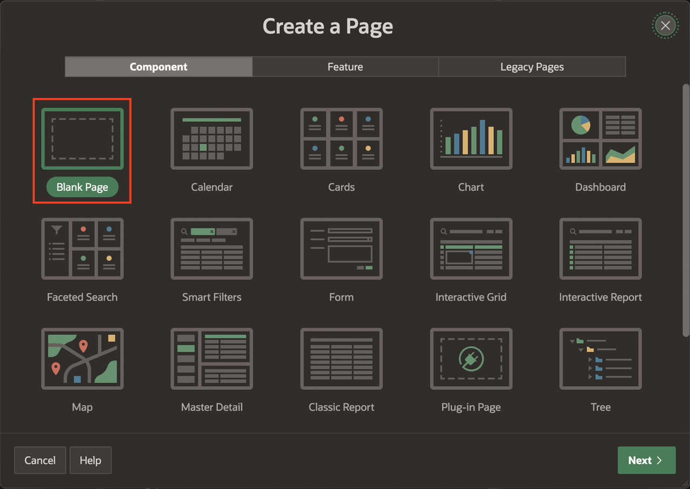

<!--# Create the shopping cart page -->
# Add Cards and Faceted search page to the Shopping Cart application
## Introduction

In this lab, you create:
  - **Application Items** and **Application Process**
  - **Cards** pages to view **Product Details** and **Customer Reviews** in the online Shopping Cart Application.
  - **Faceted Search Page** to view **Products**.

<!--
Customers will be able to:
- Review the items in the shopping cart
- Edit the quantity of the items
- Remove an item
- Proceed to checkout

Estimated Time: 20 minutes

Watch the video below for a quick walk through of the lab.

[](youtube:Cvl9xMAqnm8)-->

Estimated Time: 20 minutes

### Objectives
In this lab, you will:
- Create a page to list the products in the Shopping Cart
- Create Pages to Search and Edit the Projects in Demo Projects Application.


### Downloads

- Did you miss out trying the previous labs? Don’t worry! You can download the application from **[here](files/online-shopping-cart-2.sql)** and import it into your workspace. To run the app, please run the steps described in **[Get Started with Oracle APEX](https://apexapps.oracle.com/pls/apex/r/dbpm/livelabs/run-workshop?p210_wid=3509)** and **[Using SQL Workshop](https://apexapps.oracle.com/pls/apex/r/dbpm/livelabs/run-workshop?p210_wid=3524)** workshops.


## Task 1: Create Application Items
These items are needed to count the number of items in the shopping cart and the icon to display in the Navigation Bar.

1.  Navigate to **Online Shopping Application** and then Click on **Shared Components**

    

    

2. Under Application Logic, click **Application Items**.

    

3. Click **Create**.

    

4. Create two items as follows:

    | Name |  Scope  |
    | --- |  --- |
    | SHOPPING\_CART\_ICON  | Application|
    | SHOPPING\_CART\_ITEMS | Application |

5. Click **Create Application Item** and create the second item.

    

    

## Task 2: Create Application Process
This process is needed to refresh the number of items in the Shopping Cart, which will be shown in the navigation bar.

1. Click on **Shared Components**.

    

2. Under Application Logic, click **Application Processes**.

    

3. Click **Create** and enter the following:
    - For Name - enter **Initialize Shopping Cart Header**
    - For Process Point - select **On Load: Before Header (page template header)**

  

  

4. Click **Next**.

5. For Code, enter:

    ```
    <copy>
    -- Initialize shopping cart navigation bar to show appropriate icon and count
    DECLARE
        l_cnt NUMBER := manage_orders.get_quantity;
    BEGIN
        IF l_cnt > 0 THEN
            :SHOPPING_CART_ITEMS := l_cnt;
            :SHOPPING_CART_ICON := 'fa-cart-full';
        ELSE
            :SHOPPING_CART_ITEMS := '';
            :SHOPPING_CART_ICON := 'fa-cart-empty';
        END IF;
    END;
    </copy>
    ```

6. Click **Next**.

    

7. Click **Create Process**.

    

## Task 3: Create a Normal Page - Shopping Cart
The shopping cart page allows users to review and edit the products in the cart, also users can create the order or clear the shopping cart.

1. Click on Application Home.  ***The ID of your application may vary***.

    

2. Click **Create Page**.

    

3. Select **Blank Page** and click **Next**.

    

4. For Create Blank Page, enter the following:
    Under **Page Definition**
    - Page Number - enter **16**
    - For Name - enter **Shopping Cart**

    Under **Navigation**
    - For Breadcrumb - Set as **No**
    - For Navigation - Set as **No**

   Click **Create Page**.
 

## Task 4: Add a Cards Region
This region will list the items that have been added temporarily to the shopping cart.

1. In the new page created, navigate to the **Gallery Menu**.
2. Drag a **Cards** region and drop it to the  **Body** section.

    

3. In the Property Editor, enter the following:
    - For Title - enter **Shopping Cart**
    - Under Source section:
     - For Type - select **SQL Query**
     - For SQL Query - enter the following SQL Query:

        ```
            <copy>
            SELECT seq_id item,
                p.product_image,
                p.product_id,
                p.product_name name,
                p.unit_price,
                n002               quantity,
                p.unit_price* n002 subtotal,
                b.brand
            FROM   apex_collections a,
                products p,
                json_table (p.product_details, '$' columns ( brand varchar2(4000) path '$.brand') ) b
            WHERE  collection_name = 'PRODUCTS'
            AND    p.product_id = a.n001
            </copy>
        ```
     

4. Click on **Attributes** and enter the following:

    - Under Appearance section:
      - For Layout \- select **Horizontal (Row)**
    - Under Title section:
      - For Column \- select **NAME**

    - Under Subtitle section:
      - For Column - select **BRAND**    

    - Under Body section:
      - Set Advanced Formatting to **On**
      - For HTML Expression - enter the following:

       ```
        <copy>
        Quantity: &QUANTITY.
        </copy>
       ```

     

    - Under Secondary Body section:
       - Set Advanced Formatting to **On**
       - For HTML Expression - enter the following:

     ```
            <copy>
            <b>Unit Price: &UNIT_PRICE. </b> <BR>
            <b>Subtotal: &SUBTOTAL. </b>
            </copy>
     ```

    - Under Media section:
       - For Source - select **BLOB Column**
       - For BLOB Column - select **PRODUCT_IMAGE**  


    

    - Under Messages section:
       - For When No Data Found - enter: **Your shopping cart is empty!**

    - Under Card section:
      - For Primary Key Column 1 - select **ITEM**

 

## Task 5: Add an Action to the Shopping Cart
This action allows customers to open a page to edit a particular item in the shopping cart.

1. In the Rendering tree (left pane), navigate to **Actions** under **Shopping Cart**.
2. Right-click **Actions** and click **Create Action**.

 

3. In the Property Editor, enter the following:
    - For Label - enter **Edit**
    - For Target - click **No Link Defined**:
      - For Page - enter **17**  
        *{Note: Page 17 wil be created in the next lab}*
      - Set items as follows:

          | Name             |  Value       |
          | ---              |  ---         |
          | P17\_PRODUCT\_ID | &PRODUCT_ID. |

      - Click **Ok**.
    - For Display Type - select **Text with Icon**
    - For Icon - enter **fa-cart-edit**

   Click **Save**.

  

This configures the (Edit) button to open page 17, passing the value of the PRODUCT_ID column of the current card as the value for the page item P17\_PRODUCT\_ID in the called page.

## Task 6: Create a Modal Page

Create a Modal Page to add products to the cart.

1. Navigate to Create button and click **Page**.

  

2. Select **Blank Page** and click **Next**.

  

3. Enter the following and click **Create Page**.
  - Page Number - enter 17
  - For Name - enter **Add to Cart**
  - For Page Mode - select **Modal Dialog**  

  Click **Create Page**.
  


## Task 7: Add Cards Region for Product Details

This region allows users to review the details of the product, such as brand, price, description, and more.

1. In the new modal page created, navigate to the **Gallery Menu**.
2. Drag a **Cards** region and drop it to the Content Body section.

       
3. In the Property Editor, enter the following:
    - For Title, enter **Product**
    - Under Source section:
     - For Type - select **SQL Query**
     - For SQL Query - enter the following SQL Code:

      ```
       <copy>
            SELECT product_id,
                product_name,
                unit_price,
                product_details,
                product_image,
                image_mime_type,
                image_filename,
                image_charset,
                image_last_updated,
                color_id,
                department_id,
                clothing_id,
                d.description,
                b.brand
            FROM   products p,
                json_table (p.product_details, '$' columns ( description varchar2(4000) path '$.description') ) d,
                json_table (p.product_details, '$' columns ( brand       varchar2(4000) path '$.brand') ) b
            WHERE  product_id = :p17_product_id
            </copy>
     ```

    

    - For Template Options - check **Use Template Defaults**
      - For **Style** - select **Style C**
      - Click **Ok**
    


4. Click **Attributes** and enter the following:

  - Under Appearance section:
      - For Layout: select **Float**

  - Under Title section:
      - For Column - select **PRODUCT_NAME**

  - Under Subtitle section:
      - For Column - select **BRAND**

  - Under Body section:
      - For Column - select **DESCRIPTION**

  

  - Under Secondary Body section:    
        - Set Advanced Formatting to **On**.
        - For HTML Expression - enter the following:

         ```
         <copy>
         Price: &UNIT_PRICE.
         </copy>
         ```   

  - Under Media section:
    - For Source - select **BLOB Column**
    - For BLOB Column - select **PRODUCT_IMAGE**
    - For Position - select **First**
    - For Appearance - select **Square**
    - For Sizing - select **Fit**  


   


  - Under Card section:
      - For Primary Key Column 1 - select **PRODUCT_ID**    

   

## Task 8: Add Cards Region for Customer Reviews
This region lets users read the customer reviews for this product.

1. Navigate to the **Gallery Menu**.
2. Drag a **Cards** region and drop it to the Content Body section under **Product** region.

       

3. In the Property Editor, enter the following:
    - For Title - enter **Customer Reviews**
    - Under Source section:
     - For **Type** - select **SQL Query**
     - For **SQL Query** - enter the following SQL Code:

     ```
            <copy>
            SELECT m.rating,
                m.review
            FROM   products p,
                product_reviews m
            WHERE  p.product_name = m.product_name
                AND p.product_id = :p17_product_id
                order by m.rating desc
            </copy>
      ```

    - Under Appearance section:
      - For Template - select **Standard**

    

4. Click **Attributes** and enter the following:

    - Under Appearance section:
     - For Layout - select **Horizontal (Row)**

    - Under Title section:
     - Set Advanced Formatting to **On**
     - For HTML Expression - enter the following:

     ```
            <copy>
            <b>Review:</b> &REVIEW. <br>
            <b>Rating:</b> &RATING.
            </copy>
      ```  

      
    - Under Messages:
     - For When No Data Found - enter **There are no customer reviews yet.**

      

5. Click **Save**.

## Task 9: Add the Products Page.

1. Navigate to Create button **+** and click **Page**.

  

2. Select **Faceted Search** Option and then Click **Next**.

  

3. Enter the following and click **Next**.
    Under **Page Definition**:
    - Page Number - enter **19**
    - For Name - enter **Products**

  Under **Data Source**:
    - For Table/View Name - Select **PRODUCTS**.

  Under **Navigation**:
    - For Breadcrumb - Set to **No**.

   

4. For Facet Selection, Select **Display as** option as **Cards**, Leave the remaining options to default and click **Next**.

    

5. For Create Faceted Search, Select the following:
  - Select **Grid**
  - Title Column - select **PRODUCT_NAME**
  - Body Column - select **- Select Column -** (to unselect the default   column chosen)
  - Click **Create Page**

  


## **Acknowledgments**

- **Author** - Roopesh Thokala, Product Manager
- **Contributors** - Roopesh Thokala, Product Manager
- **Last Updated By/Date** - Roopesh Thokala, Product Manager, March 2022
