# Add Cards and Faceted search page to the Shopping Cart Application

In this lab, you'll extend the functionality of the Online Shopping Application by adding features to the shopping cart, product pages, and a faceted search page. Customers can review items in the cart, edit quantities, remove products, and proceed to checkout. You'll also create pages allowing users to view product details and customer reviews, enhancing the application's user experience.

The tasks will guide you through the process of adding dynamic functionality to your application using Oracle APEX components such as Cards and Application Processes.

Estimated Time: 20 minutes

## Objectives

By the end of this lab, you will:

- Create application items and processes for managing the shopping cart.

- Design Card regions to display product details and customer reviews.

- Implement a faceted search page to list and filter products.

- Set up actions to edit cart items and handle checkout processes.

### Downloads

Stuck or Missed out on completing the previous labs? Don’t worry! You can download the application from **[here](https://c4u04.objectstorage.us-ashburn-1.oci.customer-oci.com/p/EcTjWk2IuZPZeNnD_fYMcgUhdNDIDA6rt9gaFj_WZMiL7VvxPBNMY60837hu5hga/n/c4u04/b/livelabsfiles/o/data-management-library-files/apex-23-2-object-storage-files/hol4.sql)** and import it into your workspace. To run the app, please run the steps described in the following workshops:

1. **[Get Started with Oracle APEX](https://livelabs.oracle.com/pls/apex/r/dbpm/livelabs/run-workshop?p210_wid=3509)**

2. **[Using SQL Workshop](https://livelabs.oracle.com/pls/apex/r/dbpm/livelabs/run-workshop?p210_wid=3524)**

## Task 1: Create Application Items

In this task, you will create two application items that help display and update the shopping cart icon and count in the navigation bar.

1. Navigate to **App Builder** and select **Online Shopping Application**.

    

2. Click **Shared Components**.

    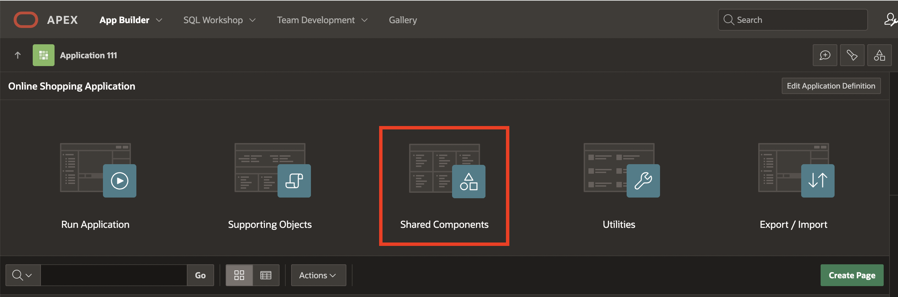

3. Under **Application Logic**, click **Application Items**.

    

4. Click **Create**.

    

5. Create the following two items one after the other:

    | Name                  | Scope       |
    | --------------------- | ----------- |
    | SHOPPING\_CART\_ICON  | Application |
    | SHOPPING\_CART\_ITEMS | Application |
    {: title="List of Application Items"}

6. Click **Create Application Item** and create the second item.

    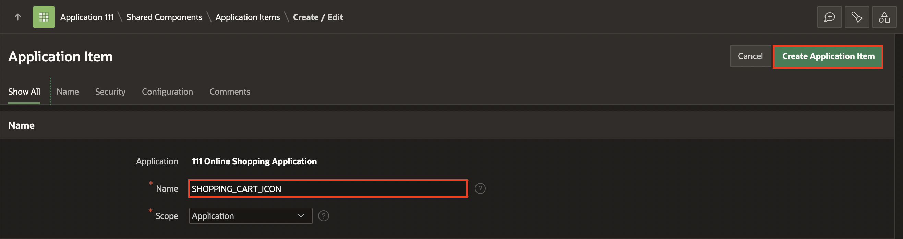

    

## Task 2: Create Application Process

You'll create an application process to initialize and update the shopping cart, ensuring that the correct number of items and icon are shown in the navigation bar.

1. Click **Shared Components**.

    

2. Under **Application Logic**, click **Application Processes**.

    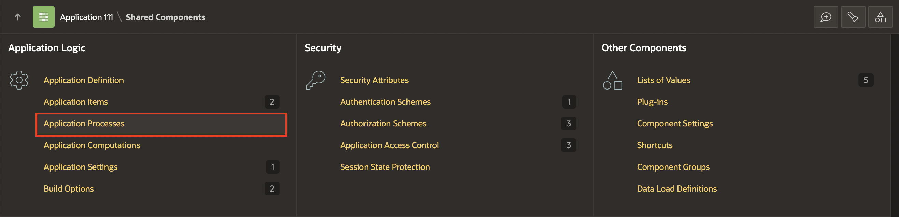

3. Click **Create**.

    

4. For **Name** enter **Initialize Shopping Cart Header** and click **Next**.

    

5. For **Code**, copy and paste below code snippet and click **Next**.

    ```
    <copy>
    -- Initialize the shopping cart navigation bar to show appropriate icons and count
    DECLARE
        l_cnt NUMBER := manage_orders.get_quantity;
    BEGIN
        IF l_cnt > 0 THEN
            :SHOPPING_CART_ITEMS := l_cnt;
            :SHOPPING_CART_ICON := 'fa-cart-full';
        ELSE
            :SHOPPING_CART_ITEMS := '';
            :SHOPPING_CART_ICON := 'fa-cart-empty';
        END IF;
    END;
    </copy>
    ```

    

6. Click **Create Process**.

    

## Task 3: Create a Blank Page for Checkout

This task walks you through creating a blank page for the shopping cart, where users can review, edit, or clear items and proceed to checkout.

1. Click **Application ID**.  ***The ID of your application may vary***.

    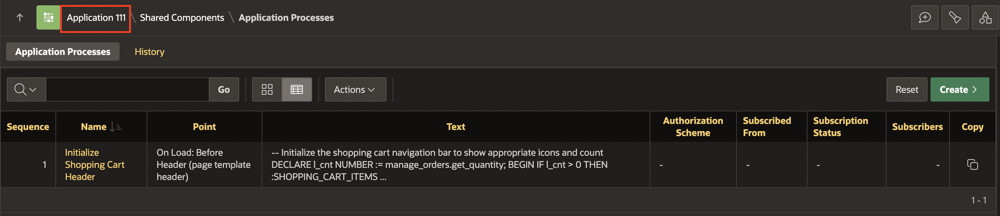

2. Click **Create Page**.

    

3. Select **Blank Page**.

    

4. In the **Create Blank Page** wizard, enter/select the following:

    - Under Page Definition:

        - Page Number: **17**

        - For Name: **Shopping Cart**

    - Under Navigation:

        - Use Breadcrumb: Toggle **OFF**

        - Use Navigation: Toggle **OFF**

        Click **Create Page**.

    

## Task 4: Add a Cards Region

Here, you'll design a Cards region to display items in the shopping cart, including details like product image, price, and quantity.

1. Navigate to gallery and drag a **Cards** region and drop it to the  **Body** section.

    

2. In the Property Editor, enter/select the following:

    - Identification > Name: **Shopping Cart**

    - Under Source:

        - Type: **SQL Query**

        - SQL Query: Enter the following SQL Query:

        ```
        <copy>
        SELECT
            SEQ_ID              ITEM,
            P.PRODUCT_IMAGE,
            P.PRODUCT_ID,
            P.PRODUCT_NAME      NAME,
            P.UNIT_PRICE,
            N002                QUANTITY,
            P.UNIT_PRICE * N002 SUBTOTAL,
            B.BRAND
        FROM
            APEX_COLLECTIONS A,
            PRODUCTS         P,
            JSON_TABLE ( P.PRODUCT_DETAILS, '$'
                COLUMNS (
                    BRAND VARCHAR2 ( 4000 ) PATH '$.brand'
                   )
                )
            B
        WHERE
        COLLECTION_NAME = 'PRODUCTS'
        AND P.PRODUCT_ID = A.N001
        </copy>
        ```

    

3. Click **Attributes** and enter the following:

    - Appearance > Layout: **Horizontal (Row)**

    - Title > Column: **NAME**

    - Subtitle > Column: **BRAND**

    - Under Body:

        - Advanced Formatting: Toggle the button to **ON**

        - HTML Expression: Enter the following:

        ```
        <copy>
        Quantity: &QUANTITY.
        </copy>
        ```

    

    - Under Secondary Body:

        - Advanced Formatting: Toggle the button to **ON**

        - HTML Expression: Enter the following:

         ```
        <copy>
        <b>Unit Price: &UNIT_PRICE. </b> <BR>
        <b>Subtotal: &SUBTOTAL. </b>
        </copy>
        ```

    - Under Media:

        - Source: **BLOB Column**

        - BLOB Column: **PRODUCT_IMAGE**

    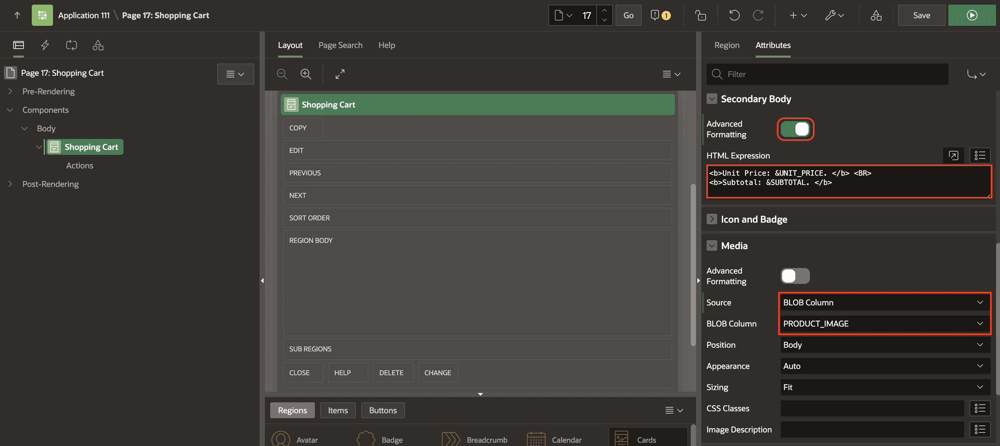

    - Under Messages:

        - When No Data Found: **Your shopping cart is empty!**

        - No Data Found Icon: **fa-cart-empty**

    - Cards > Primary Key Column 1: **ITEM**

    

4. Click **Save and Run**.

    

## Task 5: Add an Action to the Shopping Cart

In this task, you will add an "Edit" action button that allows users to edit the items in their cart.

1. In the **Rendering** tab, navigate to **Shopping Cart** region.

2. Right-click **Actions** and select **Create Action**.

    

3. In the Property Editor, enter/select the following:

    - Label: **Edit**

    - Target: **No Link Defined**:

        - Page: **18** *{Note: Page 18 will be created in the next Task}*

        - Set items:

            | Name             | Value        |
            | ---------------- | ------------ |
            | P18\_PRODUCT\_ID | &PRODUCT_ID. |

      Click **OK**.

    - Under Appearance:

        - Display Type: **Text with Icon**

        - Icon: **fa-cart-edit**

    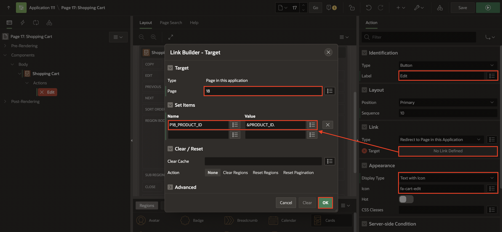

    This configures the (Edit) button to open page 18, passing the value of the PRODUCT_ID column of the current card as the value for the page item P18\_PRODUCT\_ID in the called page (page 18).

4. Click **Save**.

## Task 6: Create a Modal Page

You'll create a modal page that enables users to add products to the cart through a pop-up interface.

1. On the **Page Designer** toolbar, navigate to **(+ V)** icon and select **Page**.

    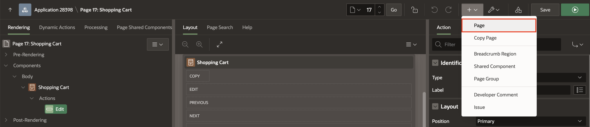

2. Select **Blank Page**.

    

3. Enter/select the following:

    - Page Number: **18**

    - Name: **Add to Cart**

    - Page Mode: **Modal Dialog**

    Click **Create Page**.

    

## Task 7: Add Cards Region for Product Details

This task helps you create a Cards region that shows detailed product information like name, brand, and price on the product page.

1. Navigate to the **Gallery Menu**. Drag a **Cards** region and drop it in the Content Body section.

     

2. In the Property Editor, enter/select the following:

    - Identification > Name: **Product**

    - Under Source:

        - Type: **SQL Query**

        - SQL Query: Enter the following SQL Code:

    ```
    <copy>
        SELECT
            PRODUCT_ID,
            PRODUCT_NAME,
            UNIT_PRICE,
            PRODUCT_DETAILS,
            PRODUCT_IMAGE,
            IMAGE_MIME_TYPE,
            IMAGE_FILENAME,
            IMAGE_CHARSET,
            IMAGE_LAST_UPDATED,
            COLOR_ID,
            DEPARTMENT_ID,
            CLOTHING_ID,
            D.DESCRIPTION,
            B.BRAND
        FROM
            PRODUCTS P,
            JSON_TABLE ( P.PRODUCT_DETAILS, '$'
                    COLUMNS (
                        DESCRIPTION VARCHAR2 ( 4000 ) PATH '$.description'
                    )
                )
            D,
            JSON_TABLE ( P.PRODUCT_DETAILS, '$'
                    COLUMNS (
                BRAND VARCHAR2 ( 4000 ) PATH '$.brand'
                    )
                )
            B
        WHERE
            PRODUCT_ID = :P18_PRODUCT_ID
    </copy>
    ```

    - Page Items to Submit: **P18\_PRODUCT\_ID**

    - Under Appearance, click **Template Options**:

        - Style: **Style C**

        Click **OK**.

    

    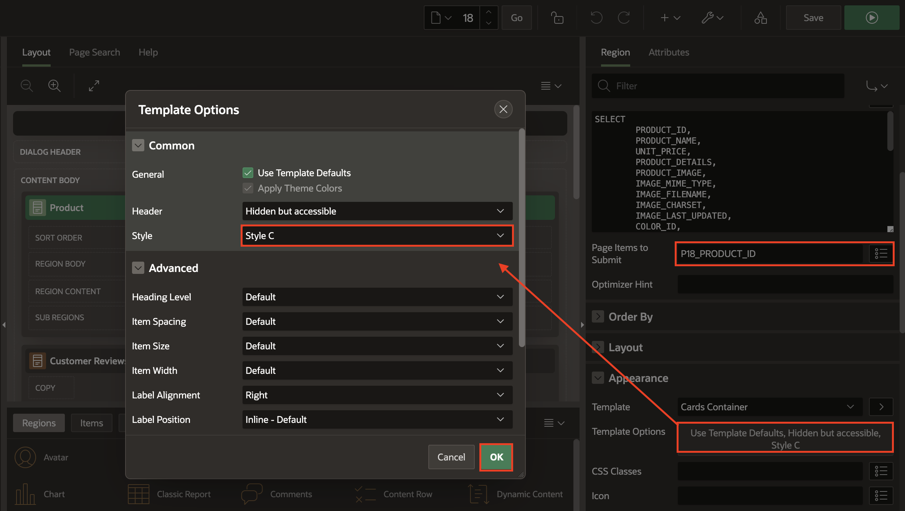

3. Click **Attributes** and enter/select the following:

    - Appearance > Layout: **Float**

    - Title > Column: **PRODUCT_NAME**

    - Subtitle > Column: **BRAND**

    - Body > Column: **DESCRIPTION**

    

    - Under Secondary Body:

        - Advanced Formatting: Toggle the button to **ON**

        - HTML Expression: Enter the following:

        ```
        <copy>
          Price: &UNIT_PRICE.
        </copy>
        ```

    - Under **Media** section:

        - Source: **BLOB Column**

        - BLOB Column: **PRODUCT_IMAGE**

        - Position: **First**

        - Appearance: **Square**

        - Sizing: **Fit**

    

    - Card > Primary Key Column 1: **PRODUCT_ID**

    

## Task 8: Add Cards Region for Customer Reviews

You'll add another Cards region to display customer reviews for the selected product, helping customers make informed decisions.

1. Navigate to the **Gallery Menu**. Drag a **Cards** region and drop it to the Content Body section under **Product** region.

    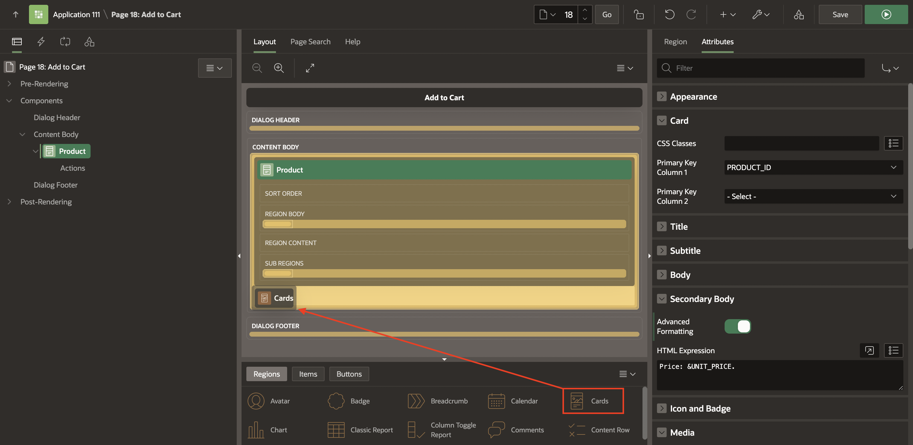

2. In the Property Editor, enter/select the following:

    - Identification > Name: **Customer Reviews**

    - Under Source:

        - Type: **SQL Query**

        - SQL Query: Enter the following SQL Code:

        ```
        <copy>
        SELECT
            M.RATING,
            M.REVIEW
        FROM
            PRODUCTS        P,
            PRODUCT_REVIEWS M
        WHERE
            P.PRODUCT_NAME = M.PRODUCT_NAME
            AND P.PRODUCT_ID = :P18_PRODUCT_ID
        ORDER BY
            M.RATING DESC
        </copy>
        ```

        - Page Items to Submit: **P18\_PRODUCT\_ID**

    - Appearance > Template: **Standard**

    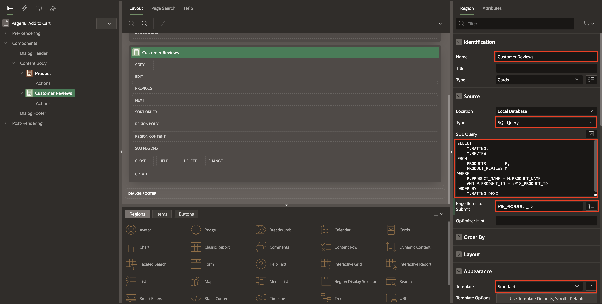

3. Click **Attributes** and enter the following:

    - Appearance > Layout: **Horizontal (Row)**

    - Under Title:

        - Advanced Formatting: Toggle the button to **ON**

        - HTML Expression: Enter the following:

        ```
        <copy>
        <b>Review:</b> &REVIEW. <br>
        <b>Rating:</b> &RATING.
        </copy>
          ```

    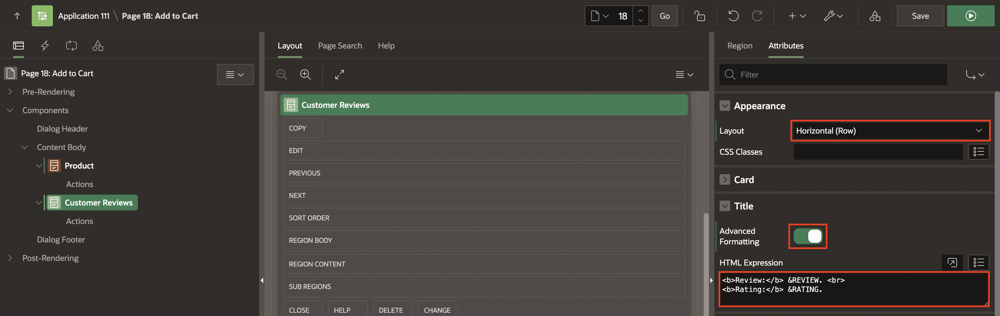

    - Messages > When No Data Found: **There are no customer reviews yet.**

    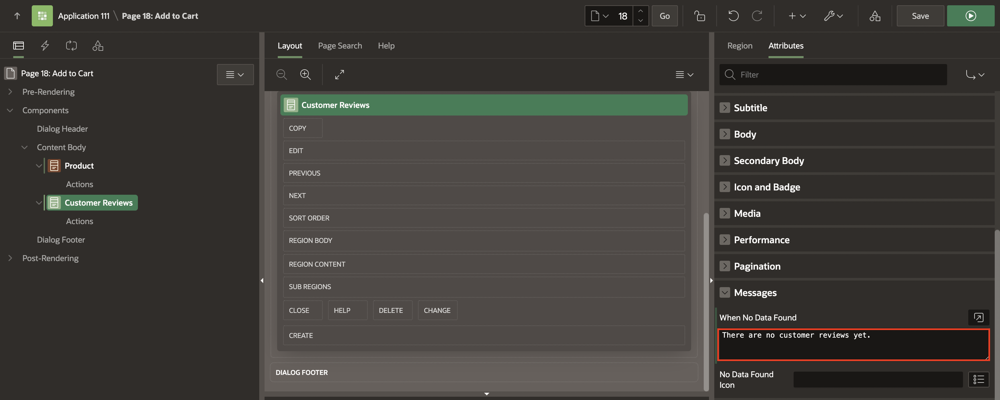

4. Click **Save**.

## Task 9: Add the Products Page

The final task will guide you in creating a faceted search page that lists products, allowing users to filter and browse through the available products easily.

1. On the **Page Designer** toolbar, navigate to **(+ V)** icon and select **Page**.

    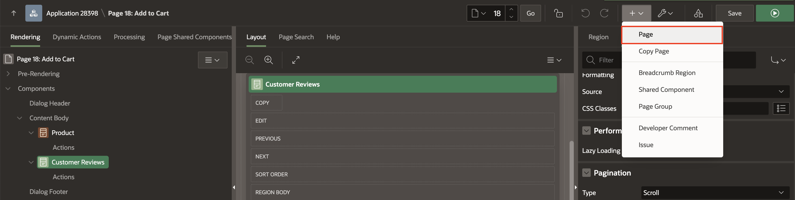

2. Select **Faceted Search**.

    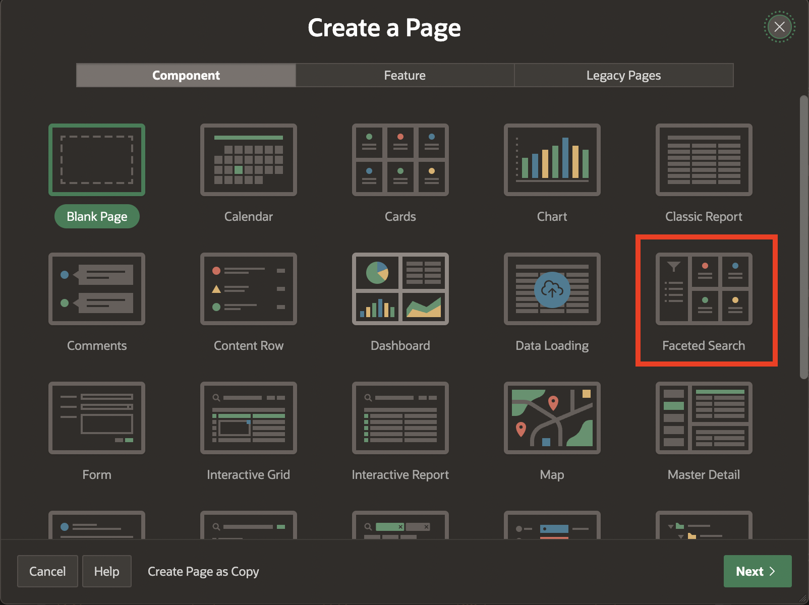

3. Enter/select the following:

    - Under Page Definition:

        - Page Number: **19**

        - Name: **Products**

    - Data Source > Table/View Name: **PRODUCTS**

    - Navigation > Use Breadcrumb: Toggle **OFF**

    Click **Next**.

    

4. For Facet Selection, select the **Display as** option as **Cards**.

    Click **Refresh**. Accept the remaining default options, and click **Next**.

    

5. In the **Create Faceted Search** wizard, enter/select the following:

     - Cards Layout: **Grid**

     - Title Column: **PRODUCT_NAME(Varchar2)**

     - Body Column : **- Select Column -** (to unselect the default column chosen)

     Click **Create Page**.

    

6. Click **Save and Run**.

    

## Summary

You now know how to create an Application item, Application process, Faceted search page and Cards page. You may now **proceed to the next workshop**.

## What's Next?

In the next workshop, you learn how to customize an Interactive Report as a developer and an end-user.

## Acknowledgements

- **Author** - Roopesh Thokala, Senior Product Manager; Ankita Beri, Product Manager
- **Last Updated By/Date** - Ankita Beri, Product Manager, September 2024
