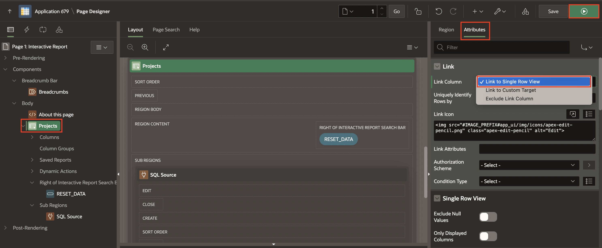

# Customize Interactive Report as a Developer

## Introduction

In this hands-on lab, as a developer, you will learn how to manage and customize the Interactive Report within the Sample Reports application. Interactive Reports offer robust and flexible reporting features, enabling end users to manipulate the data displayed according to their preferences. As a developer, you'll explore key customization options to enhance the user experience, such as modifying the report layout, configuring download formats, and controlling the display of key elements.

Estimated Time: 15 minutes

### Objectives

By the end of this lab, you will be able to:

- Customize the Interactive Report layout and links.

- Modify pagination settings and display row ranges.

- Enable and configure download formats for Excel and PDF.

- Control visibility of report features like the search bar and rows per page selector.

- Save and manage reports for end users.

## Task 1: Customize an Interactive Report as a Developer

In this task, you will customize the Interactive Report within the Sample Reports application. You will modify the report’s link column, pagination, search bar, and download options to optimize the end-user experience.

1. On the Workspace home page, click **App Builder**. Select the **Sample Reporting** Application.

    

2. Click **Run Application**.

    

3. Select **Interactive Report**.

    

4. First, view the Interactive Report in the page designer. In the Developer Toolbar, click **Page XXX**.

    

5. When the end users click an edit icon for a specific row, they should be directed to a page showing the row's column values. The Interactive Report currently has a link column to a Form Page. Modify your Interactive Report to have a link to a single-row view.

    **a.** Under Rendering, navigate to **Projects** Interactive Report and then, in the Property Editor select **Attributes** tab. For Link > Link Column, select **Link to Single Row View**.

    Click **Save and Run**.

    

    **b.** In the report, ensure that **1. Primary Report** is selected in the report toolbar. Click the **edit icon** (**pencil**) for any row.

    

    **c.** The single-row view is displayed. Click **Report View** to return to the report.

    

6. The current pagination type of the interactive report is **Row Ranges X to Y**. Let's say you always want to show your end users the total number of rows in the report as part of the pagination display. To do so, in the Developer Toolbar, click **Page 1**.

    **a.** In the **Rendering** tab, navigate to **Projects** region and in the Property Editor, select **Attributes** tab.

    **b.** Under Pagination, for Type, select **Row Ranges X to Y of Z**.

    

7. You want to customize the display of the Search Bar. End users should be able to select the display of the desired number of rows per page.

    In the Property Editor, navigate to **Attributes > Search Bar**. Enter/select the following:

    - Rows Per Page Selector: Toggle **ON**

    - Maximum Rows Per Page: **10**

    

8. You want to enable the **Excel** and **PDF** download formats and disable **Send as Email** formats in the Download option.

    In the property editor, navigate to **Attributes** tab and enter/select the following:

    - Under Download:

        - Formats: Enable **Excel** and **PDF**

        - Send as Email: Toggle **OFF**

    

9. Now that you have finished the customization for end users, click **Save and Run**.

10. Notice that the **row selector** and the **new pagination type** are available on the report.

    

11. Select **Actions** > **Report** > **Save Report**.

    

12. The Save Report dialog displays. Notice that the **Public** check box is now available. Enter/select the following:

    - Save(Only displayed for developers): **As Named Report**

    - Name: **Projects Public Report**

    - Enable **Public**

    Click **Apply**.

    

13. This report is now saved as a public report for all users and is available in the Reports drop-down list.

    

14. Click **Actions** > **Download**.

15. Notice that the **Excel** and **PDF** formats are available. Click the **Close** icon.

    

    

16. From the Reports drop-down list, select **1. Primary Report**.

    

## Summary

You now know how to Manage and Customize the Interactive report as a developer. You may now **proceed to the next lab**.

## Acknowledgements

- **Author** - Roopesh Thokala, Senior Product Manager; Ankita Beri, Product Manager
- **Last Updated By/Date** - Ankita Beri, Product Manager, September 2024
