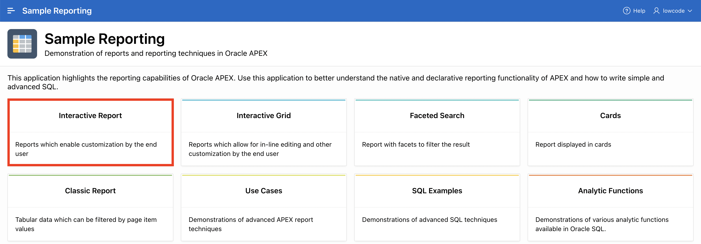
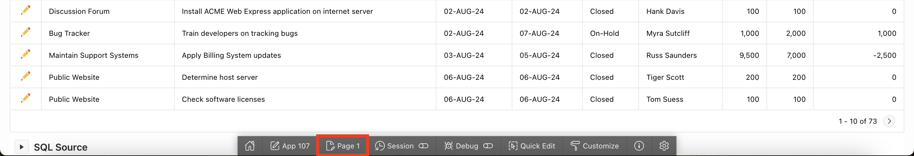
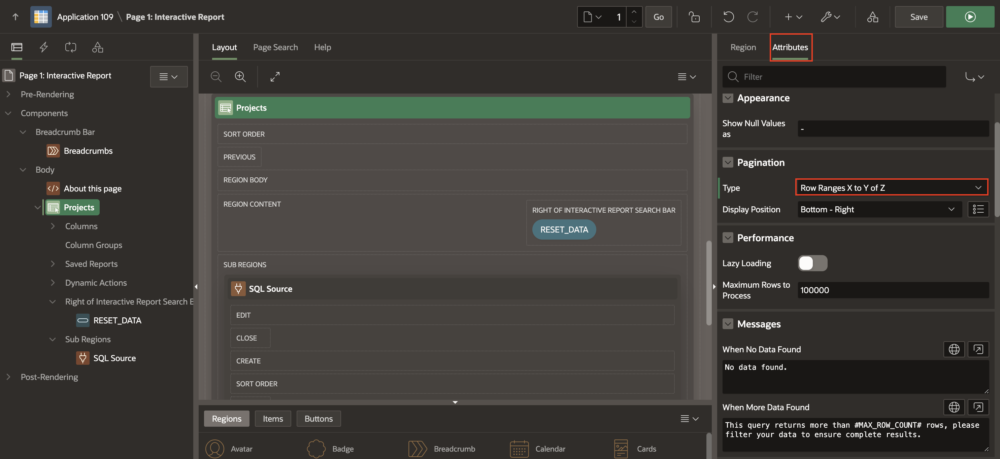
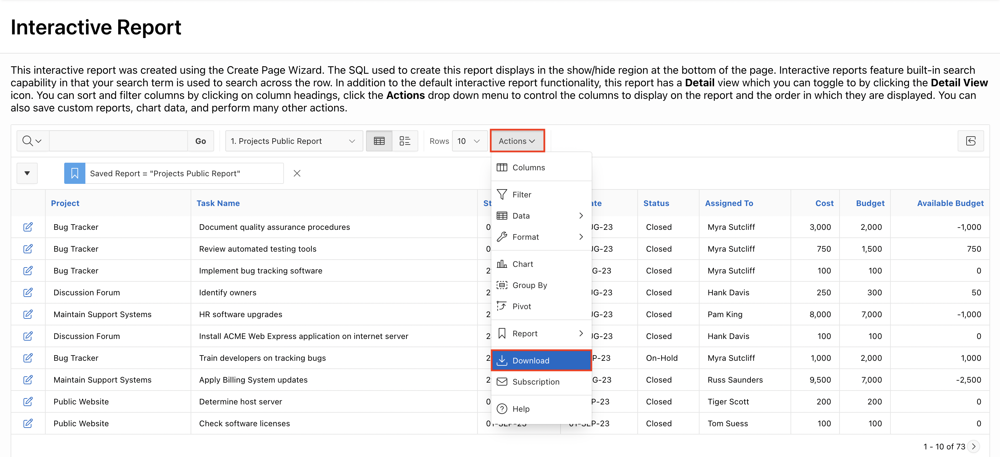

# Customize Interactive Report as a Developer

## Introduction

In this hands-on lab, you will Manage and Customize the Interactive report in the **Sample Reports** application as a **Developer**.

Estimated Time: 15 minutes

### Objectives

In this lab, you:
- Customize your Interactive Report page in **Sample Reports** Application both as a **Developer**.

### Downloads

- Did you miss out on trying the previous labs? Don't worry! You can download the application from **[here](files/sample-reporting-1.sql)** and import it into your workspace. To run the app, please run the steps described in **[Get Started with Oracle APEX](https://apexapps.oracle.com/pls/apex/r/dbpm/livelabs/run-workshop?p210_wid=3509)** and **[Using SQL Workshop](https://apexapps.oracle.com/pls/apex/r/dbpm/livelabs/run-workshop?p210_wid=3524)** workshops.

## Task 1: Customize an Interactive report as a Developer

In this lab, you edit an interactive report in Page Designer and customize it for end users.

1. On the Workspace home page, click the App Builder icon. Select **Sample Reporting** Application.

    

2. Click **Run Application**.

    

3. Select **Interactive Report**.

    

4. First, view the Interactive Report in the page designer. In the Developer Toolbar,
   click **Edit Page \<n\>**.

      

5. When the end users click an edit icon for a specified row, they should be directed to a page showing the row's column values. The interactive report currently has a link column to a Form Page. Modify your interactive report to have a link to a single-row view.
    a) Under Rendering, navigate to **Projects** Interactive Report and then on the Property Editor select **Attributes**. Under **Link**, for **Link Column**, select **Link to Single Row View**. Click **Save and Run Page**.

    

    b)  In the report, ensure that you've selected the "1. Primary Report" in the report toolbar. click the **edit icon** (**pencil**) for any row.

    

    c) The single-row view is displayed. Click the **Report View** button to return to the report.

    

6. The current pagination type of the interactive report is **Row Ranges X to Y**. Suppose you always show your end users the total number of rows in the report as part of the pagination display. In the Developer Toolbar, click **Edit Page 1**.  

    a) Under Rendering, navigate to **Projects** Interactive Report and select **Attributes** in the **Property Editor**.  

    b) In the **Property Editor**, Under **Attributes**, Search for **Pagination**. For Type, **select Row Ranges X to Y of Z**.

    

7. You want to customize the display of the Search Bar. End users should be able to select the display of the desired number of rows per page.  
    In the property editor, locate **Search Bar** under **Attributes**. Perform the following:

    - Enable Rows Per Page Selector.
    - Enter **10** for **Maximum Rows Per Page**.

    

8. You want to disable the Email in the Download option of the Actions menu. In the property editor, navigate to Download. Deselect **Send as Email** download format.

9. You want to enable the **Excel** and **PDF** formats in the Download option of the **Actions** menu. In the property editor, navigate to Download. Select **Excel** and **PDF** download formats.

    

10. Now that you have finished the customization for end users, click **Save** and **Run Page**.

11. Notice that the **row selector** and the **New pagination type** are available on the report.

    

12. Select **Actions** > **Report** > **Save Report**.

    

13. The Save Report dialog displays. Notice that the **Public** check box is now available. Perform the following:

    - For Save, select **As Named Report**
    - For **Name**, enter **Projects Public Report**
    - Enable the **Public** checkbox

    Click **Apply**.

    

14. This report is now saved as a public report for all users and is available in the Reports drop-down list.

    

15. Click **Actions** > **Download**.

16. Notice that the **Excel** and **PDF** formats are available. Click the **Close** icon.

    

    

17. From the Reports drop-down list, select **Primary Report**.

## Summary

You now know how to Manage and Customize the Interactive report as a developer. You may now **proceed to the next lab**.

## Acknowledgments

- **Author** - Roopesh Thokala, Senior Product Manager
- **Last Updated By/Date** - Ankita Beri, Product Manager, January 2024
