# Customize Interactive Report as an End User

## Introduction

In this lab, you Manage and Customize the Interactive report in the **Sample Reports** application as an **End User**.

Estimated Time: 20 minutes

### Objectives

In this lab, you:

- Customize your Interactive Report page in **Sample Reports** Application as an **End User**.

## Task 1: Customize an Interactive report as an End User

In this lab, you customize and use an interactive report as an end user.

1. To start with, run the **Sample Reporting** application. Click **App Builder**.

    

2. Navigate to **Sample Reporting** and then click **Run Application**.

    

    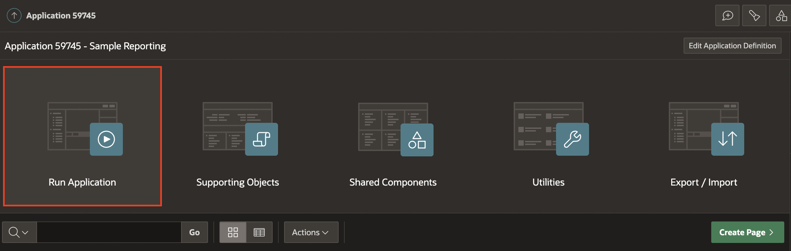

3. In the **navigation menu** or in the **Cards Region**, click **Interactive Report**.

    

4. Suppose you want to avoid displaying the report's **Start Date** and **End Date** columns. Also, you want the **Status** column to show just after the **Assigned To** column. To do so, perform the following steps:

    **a.** Click **Actions** and select **Columns**.

    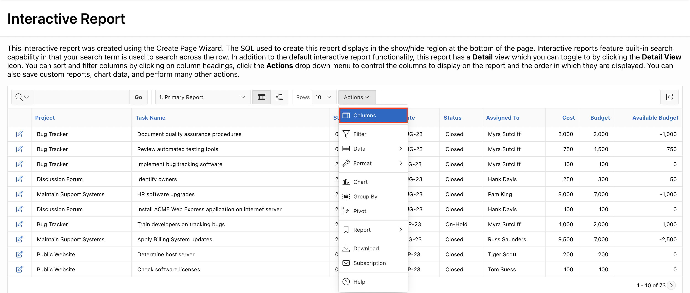

    **b.** The Select Columns dialog appears. The columns on the right are displayed, and those on the left are hidden. Select **Start Date** and **End Date** in **Display in Report group**, and move the selected columns into the **Do Not Display** list by clicking the left arrow **<**.

    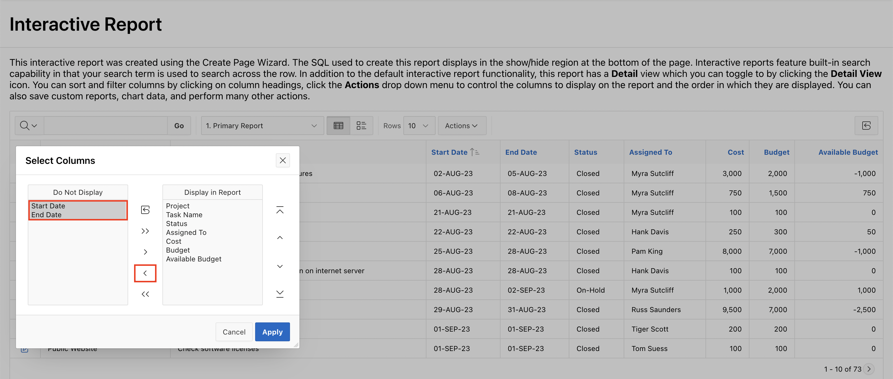

    **c.** You can reorder the displayed columns using the arrows on the far right.
    Select **Status** in the Display in Report group and click the **Down arrow** once. Then, click **Apply**.

    

    **d.** The interactive report is displayed with the changes made in the above steps.

    

5. Next, let's say you want to filter the report results. First, you want to filter the report to display rows which meet the criteria **Cost <= 2000**. Within these filtered results, you create another filter to show rows with **Project is Bug Tracker**. Perform the following steps:

    **a.** Click **Actions** and select **Filter**.

    

    **b.** In the filter dialog, enter/select the following:

    - Column: **Cost**

    - Operator: **<=**

    - Expression: **2000**

    Click **Apply**.

    

   **c.** Next, add the second filter to the **Project** column. Click the **Actions > Filter**.

    

   **d.** In the filter dialog, select the following:

    - Column: **Project**

    - Operator: **=**

    - Expression: **Bug Tracker**

    Click **Apply**.

    

    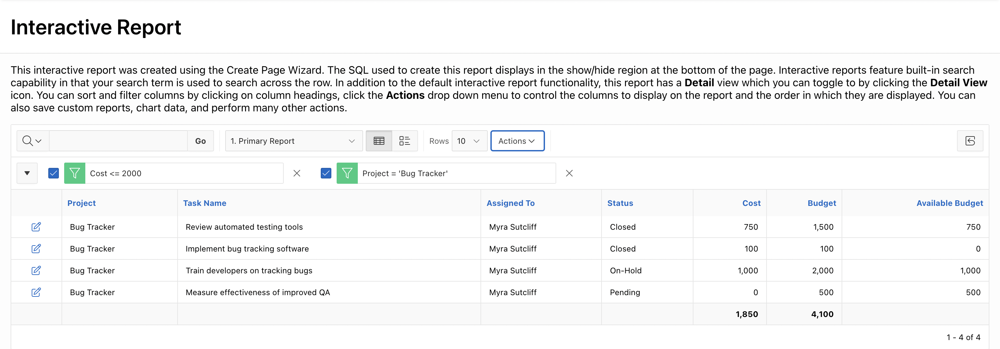

   **e.** Notice that two filters are applied. Fewer rows are displayed because only the rows that meet the filter criteria are displayed. You can remove each filter by clicking the **Remove Filter** icon next to the filter you want to remove.

   Click the **Remove Filter** icon next to both filters.

    

6. Now, imagine you want to sort the report on the **Cost** column. To do so, perform the following:

    **a.** Select **Actions** > **Data** > **Sort**.

    

    **b.** Remove the existing sort columns under **Column** for rows 2 and 3. Restore the value to the default **- Select Column -**.

    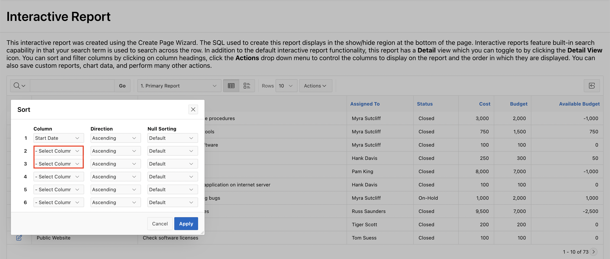

    **c.** Select the following in Row 1:

    - Column: **Cost**

    - Direction: **Descending**

     Click **Apply**.

    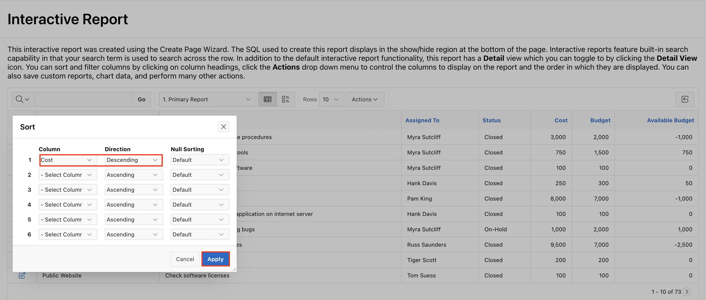

    **d.** The report is now sorted in the **Descending** order of **Cost**.

    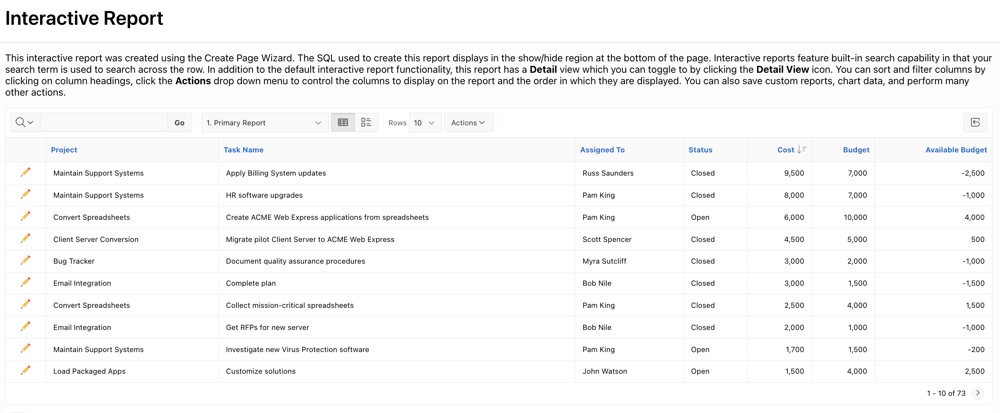

7. Create an aggregation against the **Available Budget** column. You want to display the sum of the **Available Budget**. Perform the following:

    **a.** Select **Actions** > **Data** > **Aggregate**.

    

    **b.** In the **Aggregate** dialog, select the following:

    - Function: **Sum**

    - Column: **Available Budget**.

    Click **Apply** to add the aggregation at the end of the last Column of the report.

    

    **c.** The aggregate function is applied to the Column. Notice that the sum of **Available Budget** is displayed at the end of the report under the Column. Navigate to the last page to view the sum.

    

8. In the report, you want to include **Cost** calculated with tax. The computation you want to make is **Cost * 1.05**. You create a computed column in the interactive report.

    **a.** Select **Actions** > **Data** > **Compute**.

    

    **b.** The Compute dialog appears. Enter/select the following:
    - Column Label: **Cost with Tax**.

    - Computation Expression:

        - Under Columns alias, click **Cost**

        - Under Keypad, click *1.05

    Click **Apply**.

    

    **c.** The new computed Column **Cost with Tax** now appears in the report.

    

9. Create a Control Break on the **Project** column.

    **a.** Select **Actions** > **Format** > **Control Break**.

    

    **b.** In the control break dialog, in row number 1, for Column select **Project**, and click **Apply**.

    

    **c.** The control break is now applied. Notice that the aggregation you created in a previous step appears at the end of each control break.

    

10. Let's say you want to highlight those rows with **Cost** value less than or equal to **500**. You add the highlighting to rows while continuing with the control break you created in the previous step.

    **a.** Select **Actions** > **Format** > **Highlight**.

    

    **b.** In the Highlight dialog, enter/select the following:

    - Name: **Cost less than or equals 500**

    - Background Color: **#d0f1cc**

    - Text Color: **#0000000**

    - Column: **Cost**

    - Operator: **<=**

    - Expression: **500**

    Click **Apply**.

    

    **c.** Notice that the rows that meet the condition are highlighted in **Green**.

    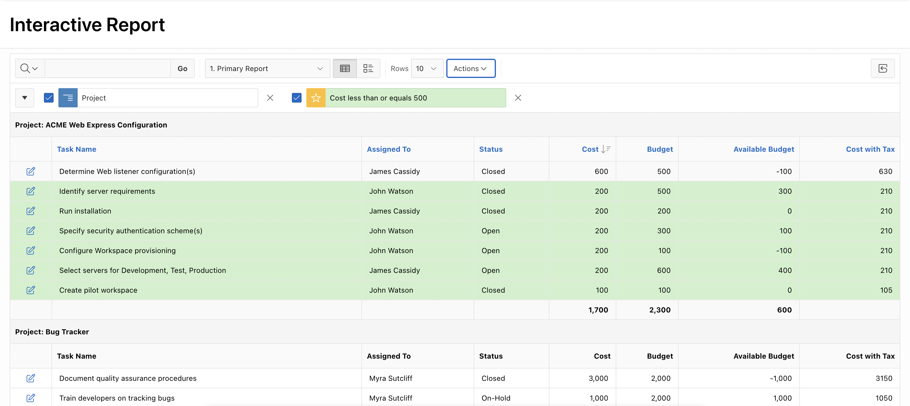

11. Now, you want to control the number of rows displayed on your **Interactive Report** page.

    **a.** Select **Actions** > **Format** > **Rows Per Page** > **5**.

    

    **b.** Notice that the **Rows Per Page** in your Interactive Report is now **1-5**.

    

12. In your interactive report, you want to include a Chart to display the Average **Cost** for each **Project**. Your interactive report should include both the Report and Chart views.

    **a.** Select **Actions** > **Chart**.

    

    **b.** In the chart dialog, select/enter the following:

    - Chart Type: **Bar**

    - Label: **Project**

    - Value: **Cost**

    - Function: **Average**

    Click **Apply**.

    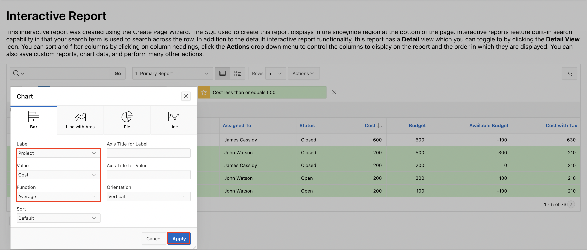

    **c.** The chart is created. Toggle between the **View Chart** and **View Report**.

    

13. Create a Group By report to display each **Project** with the **Total Budget**.

    **a.** Click **View Report Icon**. Select **Actions** > **Group By**.

    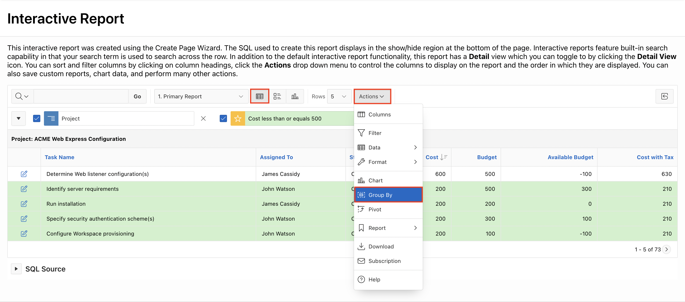

    **b.** In the Group By dialog, enter/select the following:

    - Group By Column: **Project**

    - Function: **Sum**

    - Column: **Budget**

    - Label: **Total Budget**

    - Format Mask: **$5,234.10** (Expand the Select List to view the Format Mask list of example formats.)

    - Sum: Toggle the button to **ON**

    Click **Apply**.

    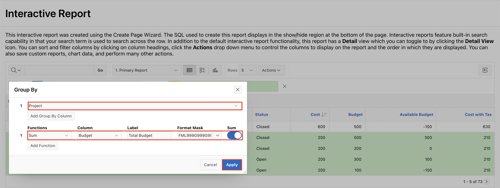

    **c.** The Group By report is created. You also see the sum of the Budget. Notice that the **icon** for View Group By has also been added.

    

    **d.** Click the **X** to the right of **Edit Group By** to remove the filter.

    

14. You want to display the **Sum** of Cost that are available with each **Project** and **Assigned To**. The results should be in a cross-tab format. Create a Pivot Report.

    **a.** Click **Actions** > **Pivot**.

    

    **b.**  In the Pivot dialog, enter/select the following:

    - Pivot Columns: **Assigned To**

    - Row Columns: **Project**

    - Functions: **Sum**

    - Column: **Cost** and **Budget**

    - Label: **Total Cost** and **Total Budget**

    - Sum: Toggle the button to **ON**.

    Click **Apply**.

    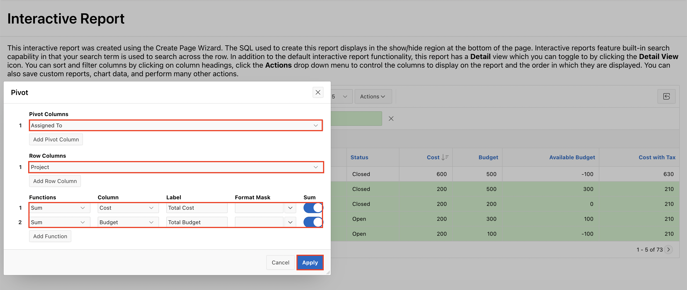

    **c.** The Pivot report is displayed, and a **View Pivot icon** is created next to the actions button.

    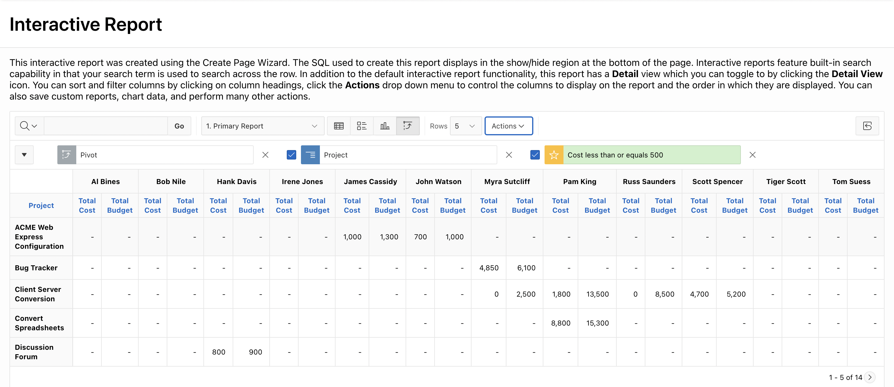

15. You want to save the report with all the customization.

    **a.** Select **Actions** > **Report** > **Save Report**.

    

    **b.** For Name, enter **My Private Report** and click **Apply**.

    

16. A drop-down list automatically appears with the report you just created being selected.

    You want to reset the Default **Primary Report** back to the default settings and remove any customizations you have made. To do so, perform the following:

    **a.** Select **Primary Report** from the Reports drop-down list. The primary report is now displayed. You can make any changes to this report, which will not be reflected in the 'My Private Report' you just created.

    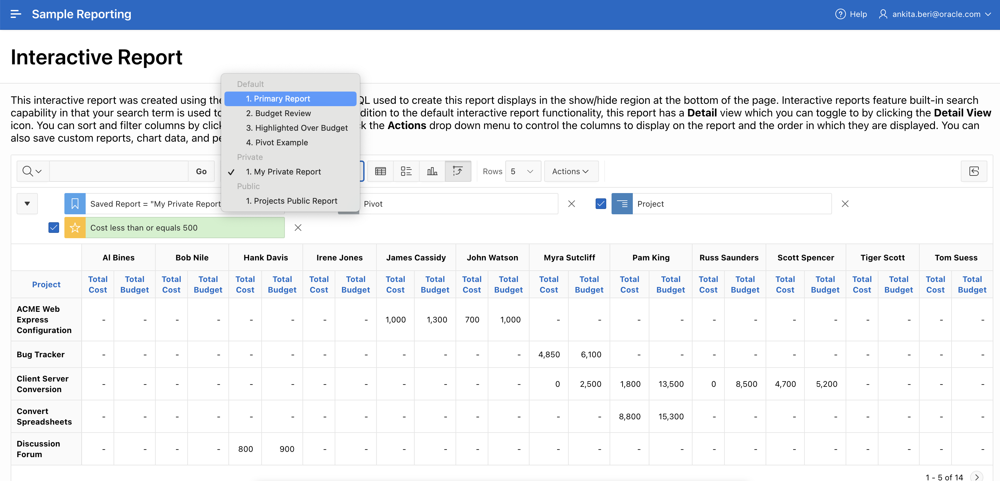

    **b.** Select **Actions** > **Report** > **Reset** to restore the primary report to its default settings.

    

    **c.** In the reset dialog, click **Apply**.

    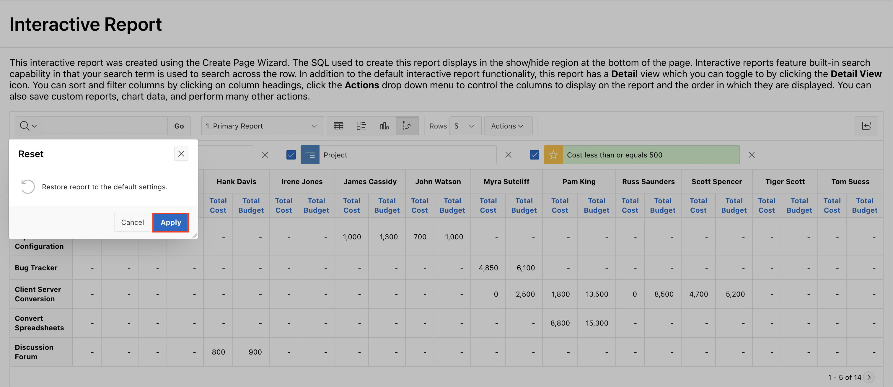

17. You want to download the customized report as a CSV.

    **a.** From the reports drop-down list, select **My Private Report**.

    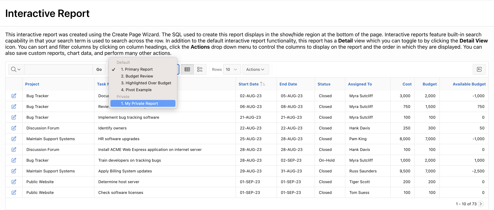

    **b.** Select **Actions** > **Download**.

    

    **c.** In the Download dialog, select **CSV** and click **Download**.

    

    **d.** The report is now downloaded as a CSV.

    

## Summary

You now know how to manage and customize the Interactive report as an End User. You may now **proceed to the next workshop**.

## What's Next?

In the next workshop, you learn how to customize Interactive Grid as a developer and an end user.

## Acknowledgements

- **Author** - Roopesh Thokala, Senior Product Manager; Ankita Beri, Senior Product Manager
- **Last Updated By/Date** - Ankita Beri, Product Manager, September 2024
