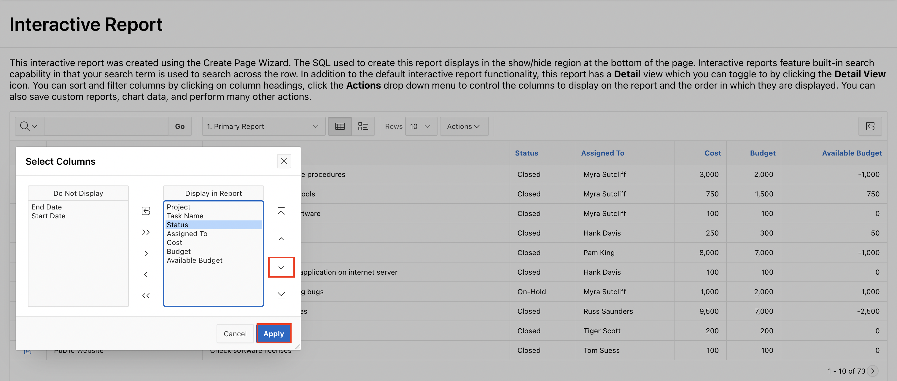
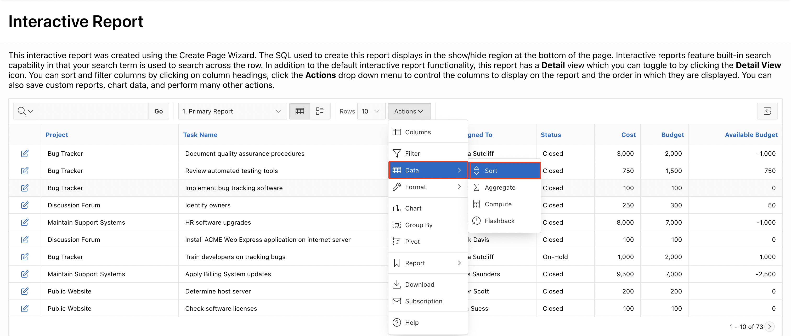
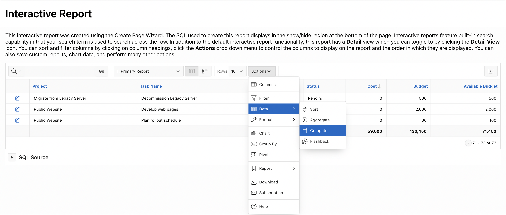
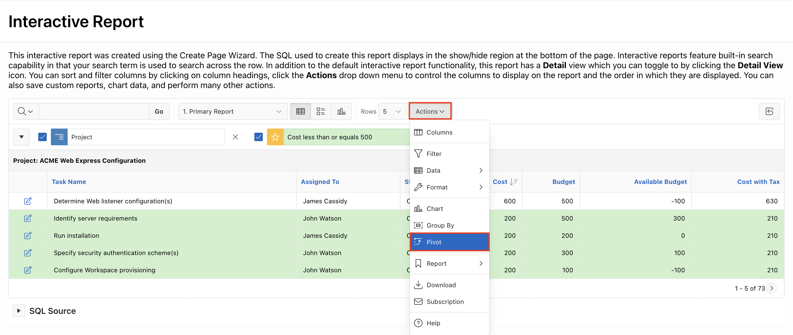

# Customize Interactive Report as an End-user

## Introduction

In this Hands-on-lab, you will Manage and Customise the Interactive report in the **Sample Reports** application as an **End-user**.

Estimated Time: 20 minutes

### Objectives

In this lab, you:
- Customise the Interactive Report page you have in **Sample Reports** Application as an **End-user**.

## Task 1: Customize an Interactive report as an end-user.

 In this lab, you customize and use an interactive report as an end user.

1. To start with, run the **Sample Reporting** application. Click **App Builder**.

    

2. Navigate to **Sample Reporting** and then click **Run Application**.

    

    

3. In the **navigation menu** or in the **Cards Region**, click **Interactive Report**.

    

4. Suppose that you do not want to display the **Start Date** and **End Date** columns in the report. Also, you want the **Status** column to display just after the **Assigned To** column. Perform the following steps:  

    a) Click Actions and select Columns.

    

    b) The **Select Columns** dialog appears. The columns on the right are displayed, and the columns on the left are hidden. Select **Start Date** and **End Date** in **Display in Report group**, and move the selected columns into the **Do Not Display** list by clicking the left arrow **<**.

    

    c) You can reorder the displayed columns using the arrows on the far right.
       Select **Status** in the Display in Report group and click the Down arrow once. Then, click **Apply**.

    

    

    d) The interactive report is displayed with the changes made in the above steps.

    

5. Next, let's say you want to filter the report results. First, you want to filter the report to display rows which meet the criteria **Cost <= 2000**. Within these filtered results, you then create another filter to display rows with **Project is Bug Tracker**. Perform the following steps:  

    a) Click Actions and select Filter.

    

    b) For Filter Type, Select the following:

    - For **Column**, select **Cost**
    - For **Operator**, select **<=**
    - For **Expression**, enter **2000**   
    Then, click **Apply**.

    

   c) Next, add the second filter on the **Project** column. Click the **Actions** menu and select **Filter**.

    

   d) In the Filter Dialog, select the following:

    - For Column, select **Project**
    - For Operator, select **=**
    - From the Expression list, select **Bug Tracker**
    Click **Apply**.

    

    

   e) Notice that two filters are applied. Fewer rows are displayed because only the rows that meet both the filter criteria are disaplyed. You can remove each filter by clicking the Remove Filter icon, next to the filter you want to remove.  
   Click the **Remove Filter** icon next to both the filters

    

6. Now imagine you want to sort the report on the **Cost** column.

    a) Select **Actions** > **Data** > **Sort**.

    

    b) Remove the existing sort columns under **Column** by using the select list in rows 2 and 3 of the Column column to restore the value to the default **- Select Column -**.

    

    c) Select **Cost** for Column, **Descending** for **Direction** and click **Apply**.

    

    d) The report is now sorted in the **Descending** order of **Cost**.

7. Create an aggregation against the **Available Budget** column. You want to display the sum of the **Available Budget**.  

    a) Select **Actions** > **Data** > **Aggregate**.

    

    b) In the **Aggregate** dialog, select **Sum** for Function, **Available Budget** for Column. Click **Apply** to add the aggregation at the end of the last column of the report

    

    c) The aggregate function is applied on the column. Notice that the sum of **Available Budget** is displayed at the end of the report under the column. Navigate till the last page to view the sum.

    

8. In the report, suppose you want to include **Cost** calculated with tax. The computation you want to make is **Cost * 1.05**. You create a computed column in the interactive report.

    a) Select **Actions** > **Data** > **Compute**.

    

    b) The Compute dialog appears.  
       - For Column Label, enter **Cost with Tax**.  
       - For Computation Expression, click **Cost** under Columns alias. Click *1.05 under Keypad.  
      Click **Apply**.

    

    c) The new computed column **Cost with Tax** now appears in the report.

    

9. Create a Control Break on the **Project** column.

    a) Select **Actions** > **Format** > **Control Break**.

    

    b) In the Control Break dialog, in row number 1, select **Project** for Column, and click **Apply**.

      

    c) The control break is now applied. Notice that the aggregation that you created in a previous step appears at the end of each control break.

      

10. Let's say, you want to highlight those rows with **Cost** value less than or equal to **500**. You add the highlighting to rows while continuing with the control break that you created in the previous step.

    a) Select **Actions** > **Format** > **Highlight**.

    

    b) In the Highlight dialog, enter **Cost less than or equals 500** for Name.  
       Select **Green** for Background Color and **Black** for Text Color.  
       For Highlight Condition: Select **Cost** column, and **<=** Operator. Enter  **500** for Expression.  
       Click **Apply**.

      

   c) Notice that the rows that meet the condition are highlighted in Green color.

        

11. Now, You want to control the number of rows to display in your **Interactive Report** page.

    a) Select **Actions** > **Format** > **Rows Per Page** > **50**.

    

    b) Notice that the **Rows Per Page** in your Interactive Report is now **1-50**.

    

12. In your interactive report, you want to include a Chart to display the Average **Cost** for each **Project**. Your interactive report should include both the Report and Chart views to toggle.

    a) Select **Actions** > **Chart**.

    

    b) In the Chart dialog, select / enter the following:  
      • Chart Type: **Bar**  
      • Label: **Project**  
      • Value: **Cost**  
      • Function: **Average**  
      Click **Apply**.

    

    c) The chart is created. Toggle between the View Chart and View Report.

    

13. Create a Group By report to display each **Project** with the **Total Budget**.  
    a) Click View Report.  
       Select **Actions** > **Group By**.

        

    b) In the Group By dialog enter / select the following:  
      • Group By Column: **Project**  
      • Function: **Sum**  
      • Column: **Budget**  
      • Label: **Total Budget**  
      • Format Mask: Select **$5,324.10** from the Format Mask list of example formats.
      Make sure you enable Sum and click **Apply**.

       

    c) The Group By report is created. You also see the sum of the Budget. Notice that the icon for View Group By is also added.

    

    d) Click the **X** to the right of **Edit Group By** to remove the filter.

    

14. You want to display the **Sum** of Cost that are available with each **Project** and **Assigned To**. The results should be in a crosstab format. Create a Pivot Report.  

    a) Click **Actions** > **Pivot**.

    

    b)  In the Pivot dialog enter / select:  
        - Pivot Columns: **Assigned To**
        - Row Columns: **Project**
        - Functions: **Sum**
        - Column: **Cost** and **Budget**
        - Label: **Total Cost** and **Total Budget**
        - Set **Sum** to **Yes**.
      Click **Apply**.

    

    c) The Pivot report is displayed, and a View Pivot icon is created next to Actions button.

    

15. You want to save the report with all the customization.

    a) Select **Actions** > **Report** > **Save Report**.

    

    b) Enter **My Private Report** for Name and click **Apply**.

    

16. A drop-down list automatically appears with the report you just created being selected. You can view the default primary report.
You want to reset the **Primary Report** back to the default settings and remove any customizations that you have made so far.  

    a) Select **Primary Report** from the Reports drop down list. The primary report is now displayed. You can make any changes to this report and it will not be reflected in the 'My Private Report' private report you just created.

    

    b) To restore the primary report back to its default settings, Select **Actions** > **Report** > **Reset**.

    

    c) In the Reset dialog, click **Apply**.

    

    d) From the Reports drop down list, select **My Private Report**.

    

17. You want to download the customized report as a CSV.  

    a) Select **Actions** > **Download**.

    

    b) In the Download dialog, select **CSV**.

      

    c) The report is now downloaded as a CSV.

       

## Summary

You now know how to Manage and Customise the Interactive report as an End-User. You may now **proceed to the next lab**.

## Acknowledgments

- **Author** - Roopesh Thokala, Product Manager
- **Contributor** - Ankita Beri, Product Manager
- **Last Updated By/Date** - Roopesh Thokala, Product Manager, May 2022
