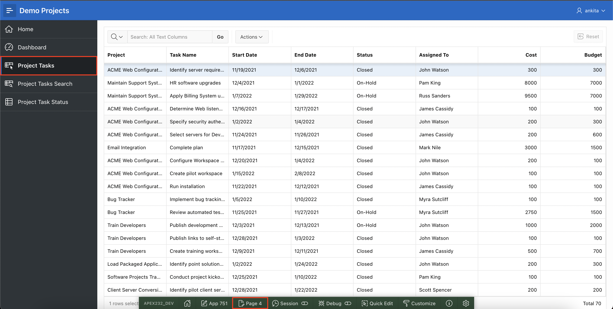
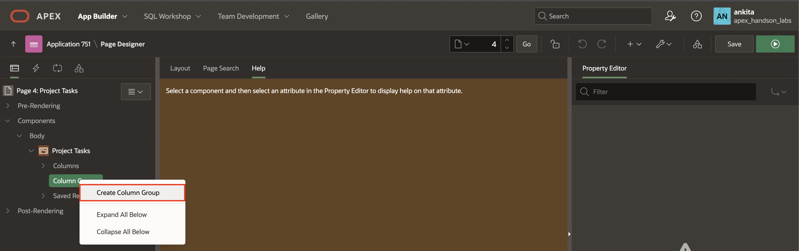
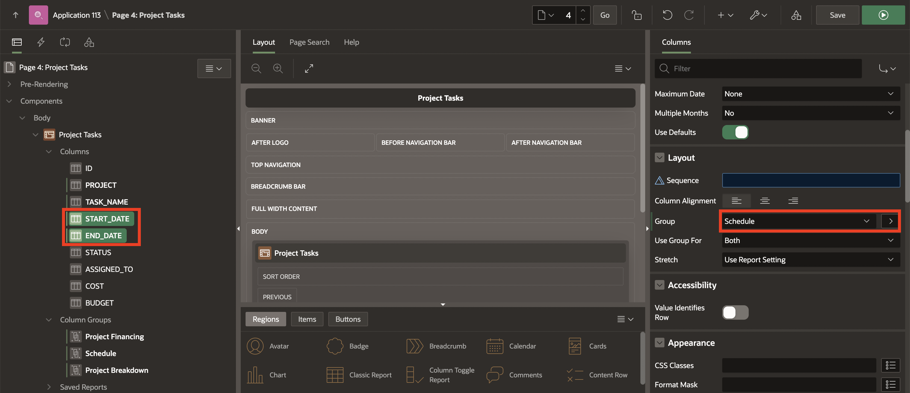
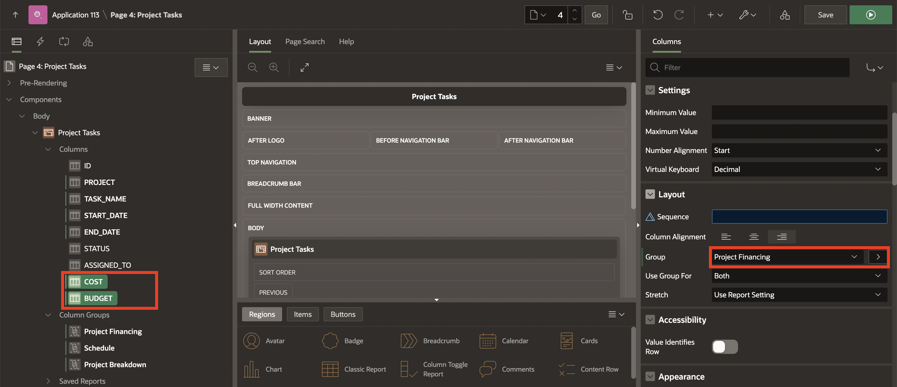
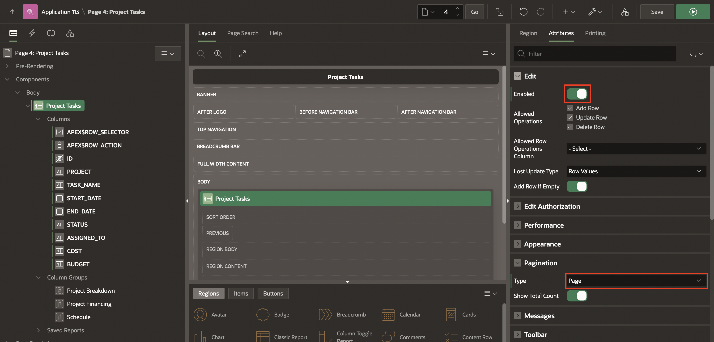
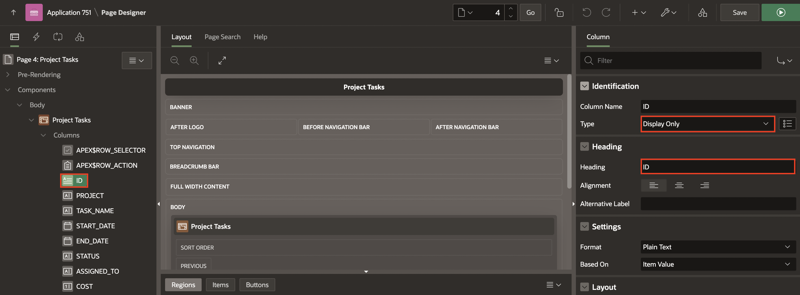

# Customize Interactive Grid as a Developer
<!--# Create the shopping cart page -->
## Introduction

In this lab, you customize:
  - **Project Tasks** page we Created in Lab 5.
  - **Interactive Grid** Page as a developer.

<!--
Customers will be able to:
- Review the items in the shopping cart
- Edit the quantity of the items
- Remove an item
- Clear the shopping cart
- Proceed to checkout

Estimated Time: 20 minutes

Watch the video below for a quick walk through of the lab.

-->

Estimated Time: 20 minutes

### Objectives
In this lab, you:
- Customise the Interactive Grid page you have created in **Demo Projects** Application as a **Developer**.

### Downloads

- Did you miss out trying the previous labs? Don’t worry! You can download the application from [here](files/demo-projects-2.sql) and import it into your workspace. To run the app, please run the steps described in **Hands-on-lab-01** and **Hands-on-Lab-02**.

## Task 1: Manage and Customize Interactive Grid as a Developer
This lab uses the **Demo Projects** application. In this lab, you customize the **Interactive Grid** for end users. You create column groups, set pagination type, and set the report downloadable formats that should be available for end users. You also enable end users to save the report as Public interactive grids and convert a read only interactive grid to an editable interactive grid.

1. Navigate to **App Builder** and run the **Demo Projects** application.

    

    

2. In the navigation menu, click **Projects Tasks**. You want to customise the display of this interactive grid for your end users. In the Developer Toolbar, click **Edit Page 4**.

    

3. Add column group headers to the interactive grid as:
    - Project Breakdown: Project, Task_Name columns
    - Schedule: Start\_Date, End\_Date columns
    - Project Financing: Cost, Budget columns  

    a) In the page designer, under Components > Body, navigate to **Project Tasks** Interactive Grid region and right-click **Column Groups**. Select **Create Column Group**.

    

    b) In the Property Editor, enter **Project Breakdown** for Heading.

    

    c) Repeat the above two steps **a** and **b** to create column groups: **Schedule** and **Project Financing**.

    d) Now that you created column groups, you need to assign columns to them. Expand **Columns** and select **Project** and **Task_Name** columns.

    e) In the property editor, under **Layout**, select **Project Breakdown** for Group.

    

    f) Then, select **Start_Date** and **End_Date** columns. In the property editor, under **Layout**, select **Schedule** for Group.

    

    g) Finally, select **Cost**, and **Budget** columns. In the property editor, under **Layout**, select **Project Financing** for Group.

    Then, click **Save** and **Run Page**.

    

    h) The interactive grid now displays column groups.

    

4. Rearrange the columns in the interactive grid. You want to display the column groups Project Breakdown, Schedule, and Project Financing display in order followed by Status and Assigned To.

    a) Hover the mouse over the Project Financing column group header to display the drag handle. Your mouse cursor also changes when it comes into contact with the drag handle. Click and hold the drag handle.

    b) Then, drag the column group to the Status column location. The heading shifts out of place in the row. The Project Financing column group should be followed by the Status column. Release the mouse. The Project Financing column group drops into place.

    

    

5. You want to ensure that end users can save Public interactive grids. You want to exclude HTML from the download formats available to end users.
    a) Under Rendering, select the **Project Tasks** Interactive Grid region.

    b) In the property editor, select **Attributes** , then navigate to **Enable Users To**. Click **Save Public Report** to enable the feature. Under **Download**, deselect the **HTML** check box.

    

6. Convert this read only interactive grid in to an **Editable interactive grid**. Then, reset the pagination as Page type displaying the total row count.  

    a) Under Rendering, select the **Project Tasks** Interactive Grid region.

    b) In the property editor, navigate to **Attributes** and then navigate to Edit. Click **Enabled**, to turn on the feature.

    Also Under **Pagination**, select **Page** for Type.

    

7. Delete the column groups in the interactive grid. Under Rendering > Project Tasks Interactive Grid > Column Groups. Select **Schedule**, **Project Breakdown** and **Project Financing**, right-click and click **Delete**.

    

8. Suppose you want to display the ID column and exclude the ID column from DML operations. Under **Page Rendering > Project Tasks** Interactive Grid, expand Columns and select **ID**.

   Under **Identification** Section:
   - For Type :Select **Display Only**

   Under **Heading** Section:
   - For Heading : Enter **ID**

  Click **Save and Run Page**.

    

## Summary

You now know how to Manage and Customise the Interactive Grid as a developer. You may now **proceed to the next lab**.

## Acknowledgments

- **Author** - Roopesh Thokala, Product Manager
- **Contributor** - Ankita Beri, Product Manager
- **Last Updated By/Date** - Ankita Beri, Product Manager, October 2023
