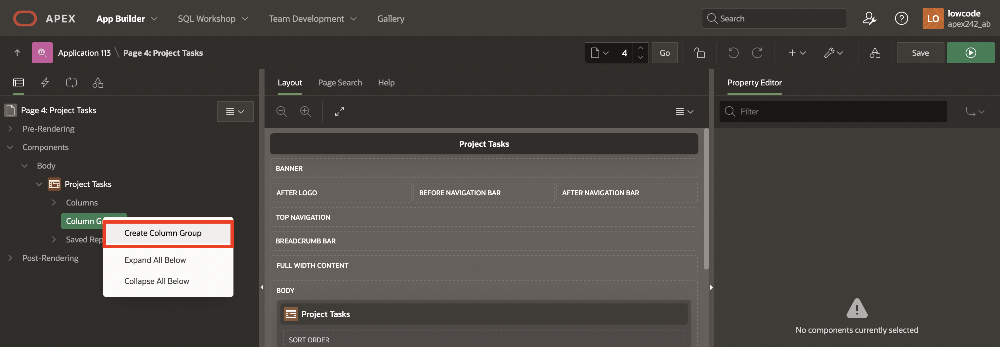
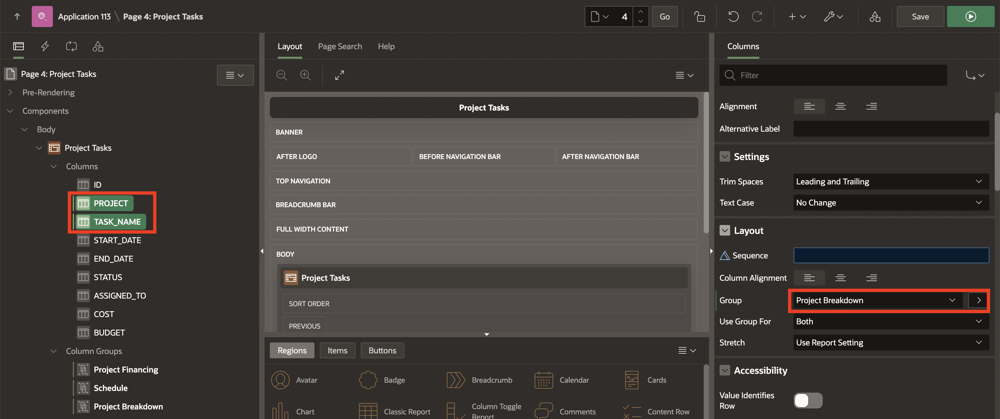
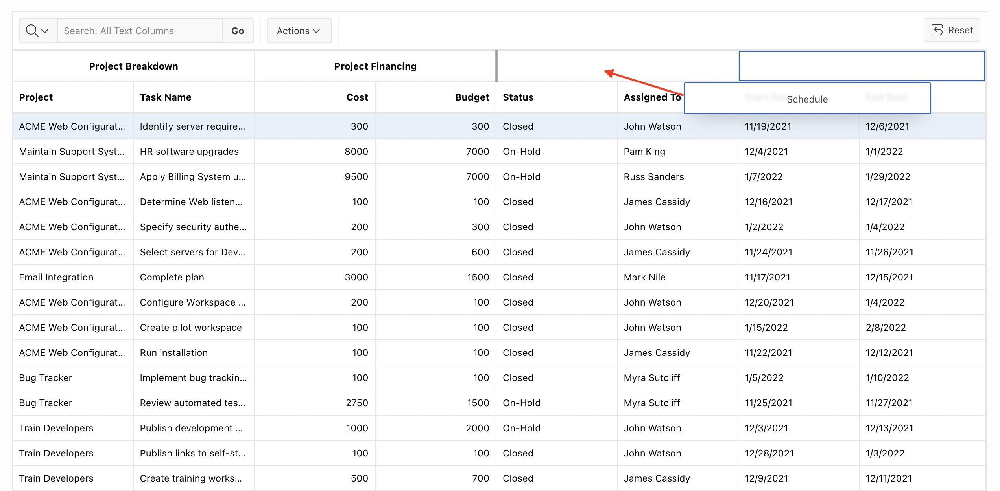
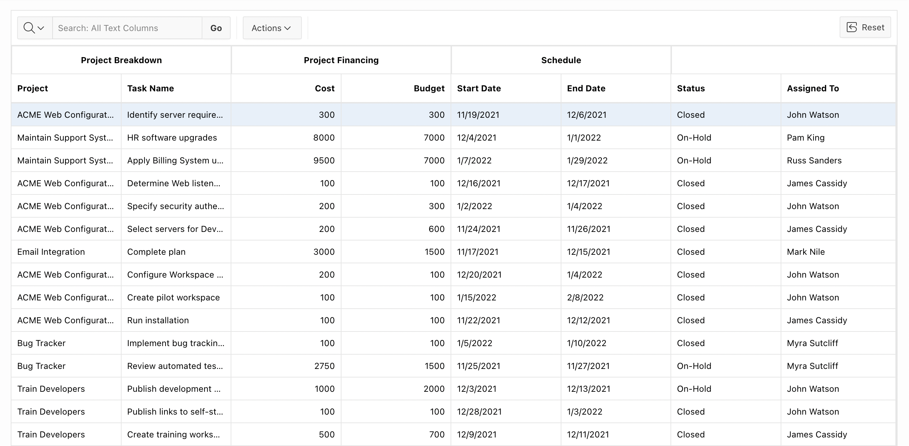
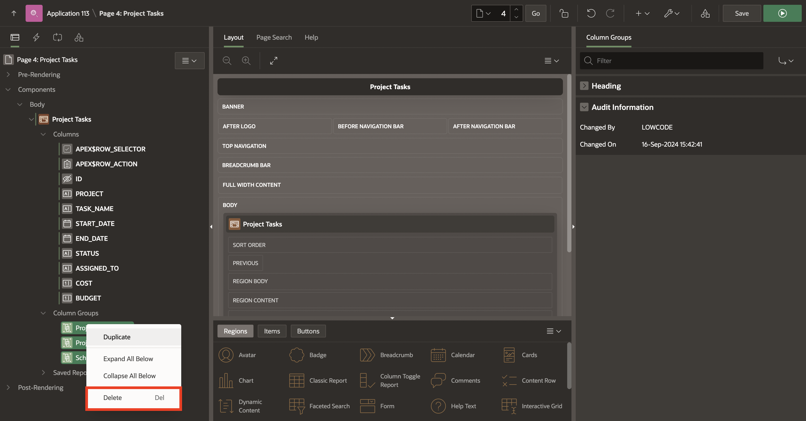
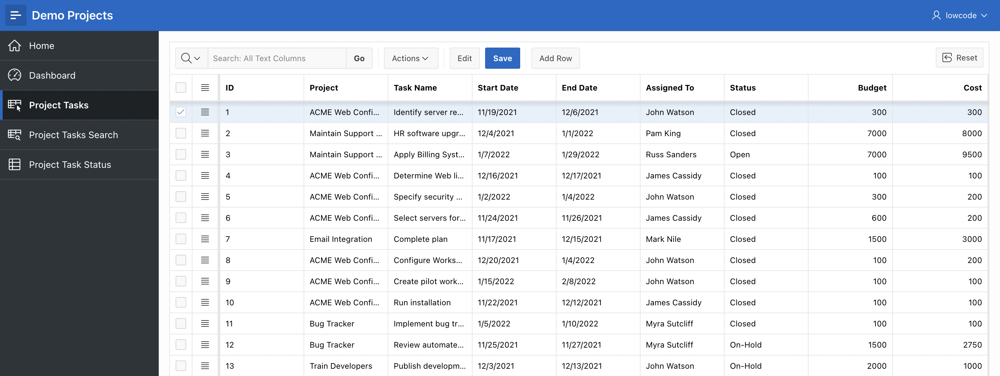

# Customize Interactive Grid as a Developer

## Introduction

In this lab, you will learn how to customize and manage an interactive grid for end users using the **Demo Projects** application. You will create column groups, set pagination types, and control report download formats. Additionally, you will enable users to save public interactive grids and convert a read-only grid into an editable one. By the end, you will understand how to effectively manage grid settings and configurations to enhance user experience.

Estimated Time: 10 minutes

### Objectives

In this lab, you will:

- Create and manage column groups in an interactive grid.

- Rearrange columns and organize grid layout for optimal user experience.

- Enable users to save public interactive grid reports and customize downloadable formats.

- Convert a read-only interactive grid into an editable one.

- Modify pagination settings and display the total row count in the grid.

- Exclude specific columns from DML operations and configure them for display-only purposes.

## Task 1: Manage and Customize Interactive Grid as a Developer

In this task, you customize the Interactive Grid for end users. You create column groups, set pagination type, and set the report downloadable formats that should be available for end users. You also enable end users to save the report as **Public** interactive grids and convert a read-only interactive grid to an editable one.

1. Navigate to **App Builder**, select **Demo Projects** application and click **Run Application**.

    

    

2. In the navigation menu, click Projects Tasks. In the Developer Toolbar, click Page 4 to customize this interactive grid for your end users.

    

3. In the Property Editor, add the following column Group headers to the interactive grid:

    - **Project Breakdown**: Project, Task_Name columns

    - **Schedule**: Start\_Date, End\_Date columns

    - **Project Financing**: Cost, Budget columns

    **a)** Navigate to **Project Tasks** region, right-click **Column Groups** and select **Create Column Group**. Create the following three column groups one after the other.

    | Column Group          | Heading       |
    | --------------------- | ----------- |
    | Project Breakdown  | Project Breakdown |
    | Schedule | Schedule |
    | Project Financing | Project Financing |
    {: title="Column Groups"}

    

    

    **b)** Now that you have created column groups, you must assign them columns. Expand **Columns** in the rendering tree and select **PROJECT** and **TASK_NAME** columns.

    In the property editor, under **Layout**, select **Project Breakdown** for the group.

    

    **c)** Then, in thee rendering tree, select **START\_DATE** and **END\_DATE** columns.

    In the property editor, under **Layout**, select **Schedule** for the group.

    

    **d)** Finally, in the rendering tree, select **COST**, and **BUDGET** columns. In the property editor, under **Layout**, select **Project Financing** for Group.

    Then, click **Save and Run**.

    

    **e)** The interactive grid now displays column groups.

    

4. Rearrange the columns in the interactive grid. You want to display the column groups Project Breakdown, Schedule, and Project Financing in order, followed by Status and Assigned To.

    **a)** Hover the mouse over the **Project Financing** column group header to display the drag handle. Your mouse cursor also changes when it comes into contact with the drag handle. Click and hold the **drag** handle.

    **b)** Then, drag the column group to the **Status** column location. The Heading shifts out of place in the row. The Status column should follow the Project Financing column group. Release the mouse. The Project Financing column group drops into place.

    

    

5. You want to ensure end users can save Public interactive grids. You want to exclude HTML from the download formats available to end users.

    **a)** In the **Rendering** tab, select the **Project Tasks** Interactive Grid region.

    **b)** In the property editor, select **Attributes**, and perform the following steps:

    - Enable Users To > Save Public Report: Toggle **ON**.

    - Download > Disable **HTML**

    

6. Convert this read-only interactive grid into an **Editable interactive grid**. Then, reset the pagination as page type, displaying the total row count.

    **a)** Under Rendering, select the **Project Tasks** Interactive Grid region.

    **b)** In the property editor, navigate to **Attributes** and perform the following steps:

    - Edit > Enabled: Toggle **ON**

    - Pagination > Type: **Page**

    

7. Delete the column groups in the interactive grid.

    Navigate to Project Tasks > Column Groups. Right-click **Schedule**, **Project Breakdown** and **Project Financing**, and select **Delete**.

    

8. Suppose you want to display the ID column and exclude the ID column from DML operations.

    Navigate to **Project Tasks > Columns > ID**.

    In the Property Editor, enter/select the following:

    - Identification > Type: **Display Only**

    - Heading > Heading: **ID**

    Click **Save and Run**.

    

    

## Summary

You now know how to Manage and Customize the Interactive Grid as a Developer. You may now **proceed to the next lab**.

## Acknowledgements

- **Author** - Roopesh Thokala, Senior Product Manager; Ankita Beri, Product Manager
- **Last Updated By/Date** - Ankita Beri, Product Manager, September 2024
