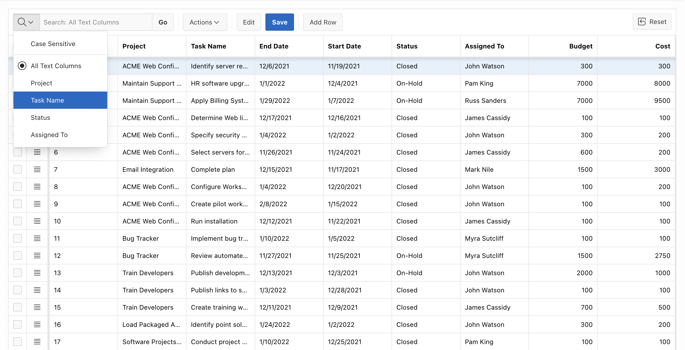
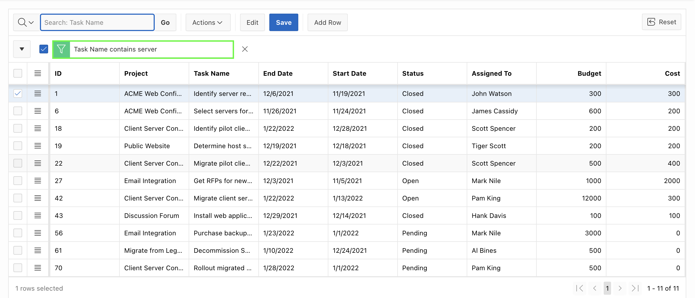
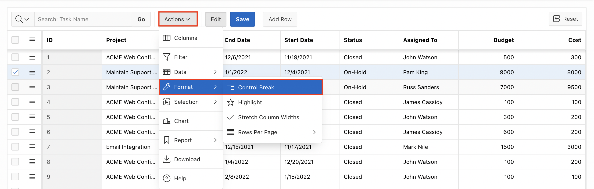
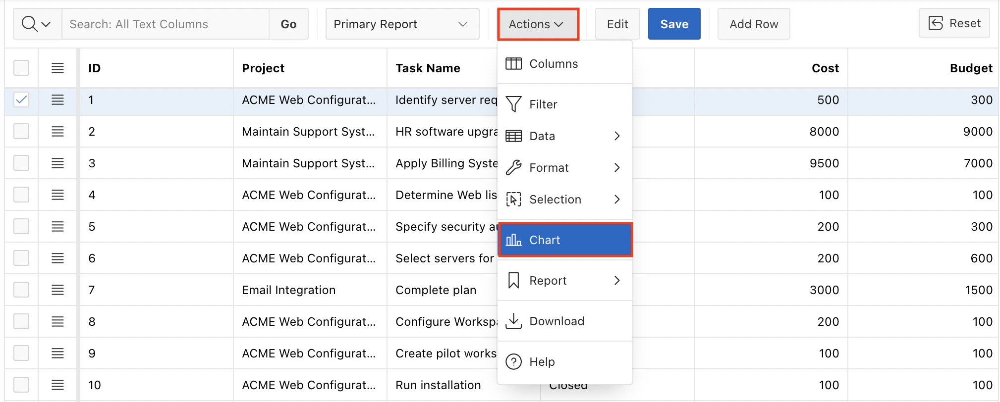

# Customizing Interactive Grid as an End-user
<!--# Create the shopping cart page -->
## Introduction

In this lab, you customize:
  - **Project Tasks** page we Created in Lab 5.
  - **Interactive Grid** Page as an end user.

<!--
Customers will be able to:
- Review the items in the shopping cart
- Edit the quantity of the items
- Remove an item
- Clear the shopping cart
- Proceed to checkout

Estimated Time: 20 minutes

Watch the video below for a quick walk through of the lab.

-->

Estimated Time: 20 minutes

### Objectives
In this lab, you:
- Customise the Interactive Grid page you have created in **Demo Projects** Application both as an **End-user**.

## Task 1: Customize interactive grid as an end-user.
In this lab, you use and customize the display of your interactive grid. You also edit an editable interactive grid.

1. Notice that the interactive grid is editable now. You see the Edit, Save, and Add Row buttons. Also, the pagination type that you have set is displayed now. Perform a non-case-sensitive search for ‘**server**’ on the entire interactive grid.  
To do this, enter **server** in the search bar text area and click **Go**.

 

2. Remove the filter by clicking the **X** icon.  
Now, in the search bar, click the **magnifying glass** and select **Task Name** column.

 

3. Enter **server** in the text area and click **Go**. Notice that the search is now restricted only to the **Task Name** column.

  

4. Remove the filter by clicking the **X** icon. You want to update the Cost for the Project with Id 1. Click the field and replace the existing value with **500**.

  

5. The changes are not saved yet. Click the **Save** button.  
    The changes are saved now.

  

6. You want to update another row. This time, click the Row Actions menu icon at the edge of the row for the project with Id **2** and select **Single Row View**.

  

7. You are now in the single row view of the project with Id **2**. Replace the existing value for Budget with **9000** and click **Save**. Then, click **Report View**.  

    

  The row now displays **9000** for Budget.

8. You want to create a control break on the Project column. Click **Actions > Format > Control Break**.

  

9. In the Control Break dialog, enter **Project** for Column and click **Save**.

  

10. The control break is now applied. You want to highlight rows that meet a      condition. Select Actions > Format > Highlight.

  

11. In the Highlight dialog, enter the following:
  - Name: Enter **Project Costing greater than 800**
  - Background Color: Click Colors and select **Yellow**.
  - Text Color: Click Colors and select **Red**.
  - Column: Select **Cost**
  - Operator: Select **greater than or equals**
  - Value: Enter **800**  

    Click **Save**.
    

12. Notice the rows with cost greater than 800 are highlighted.

  

13. You want to save the changes made to the interactive grid. Select **Actions** > **Report** > **Save As**.

  

14. In the Report – Save As dialog, select Private for Type. Enter **My Private Report** for Name. Click **Save**.

  

15. Notice that the Primary interactive grid and the interactive grid you saved now are available in the Reports drop down list.  
You want to return back to the Primary interactive grid. Click **Primary Report** in the Reports drop down list.

    

16. You want to make few more customizations and save the interactive grid as another Private report. You do not want the **Start Date**, **End Date**, and **Assigned To** columns to be displayed in the report.
Click the **Start Date** column header and then click **Hide**.

    

  Similarly perform the same step for **End Date** and **Assigned To** column.

17. You want to add a chart to the interactive grid. Select **Actions** > **Chart**.

    

18. In the Chart dialog:
    - Type: Select **Bar**
    - Label: Select **Project**
    - Value: Select **Cost**
    - Aggregation: Select **Sum**  
    Click **Save**.
  

19. The chart is displayed. You want to save the customization made to the interactive grid. Select **Actions** > **Report** > **Save As**.

  

20. In the Report – Save As dialog, select **Private** for Type. Enter **My Custom Report** for Name. Then, click **Save**.

  

21. The report is now saved under Private in the Reports drop down list. Click the **Grid** icon.

  

22. You want to download the report. Select **Actions > Download**.

  

23.  Note that the **HTML** download option is no longer available. Select **Excel** and click **Download**.

  

24. The report is now downloaded as **Excel**.

  

## **Acknowledgments**

- **Author** - Roopesh Thokala, Product Manager
- **Contributors** - Roopesh Thokala, Product Manager
- **Last Updated By/Date** - Roopesh Thokala, Product Manager, April 2022
