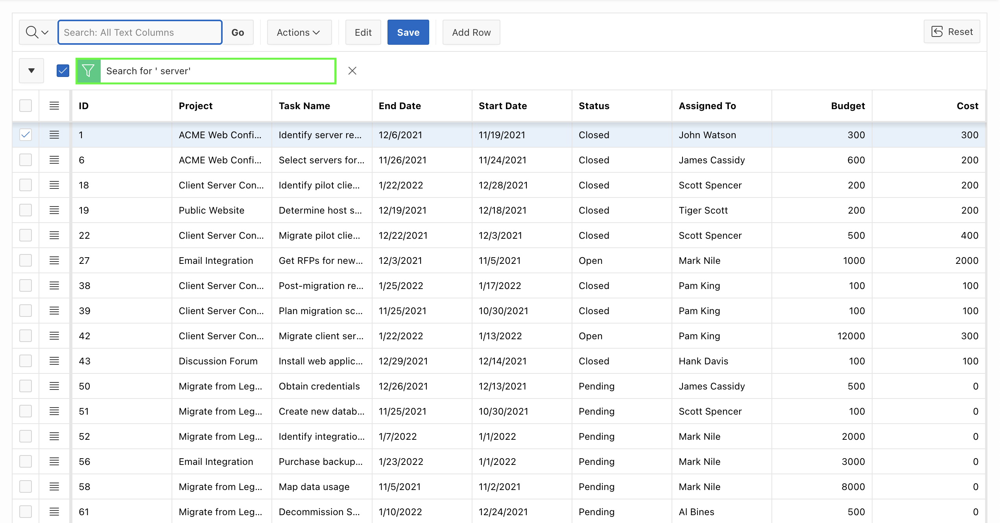
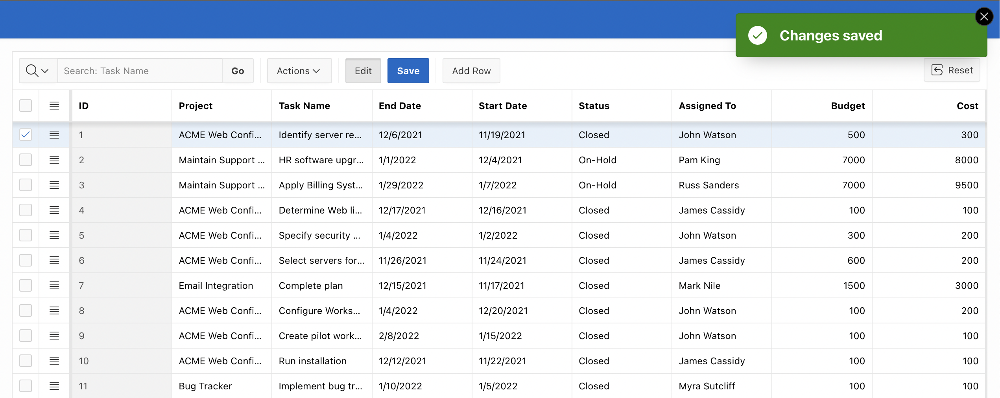
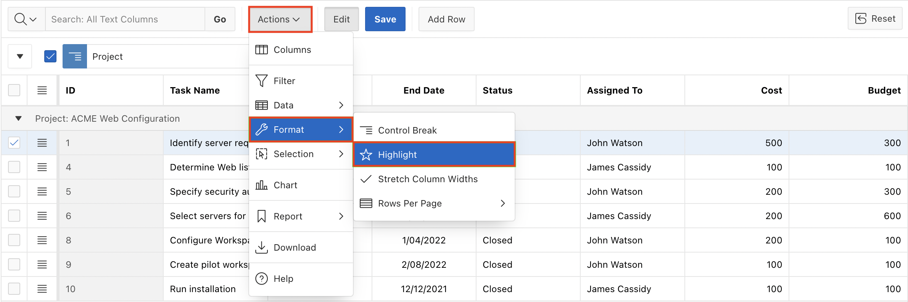
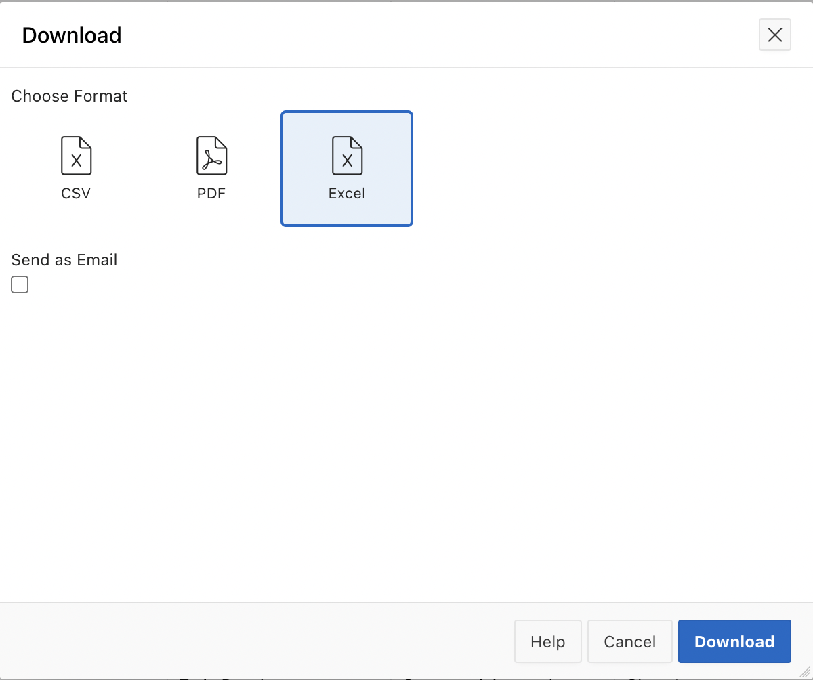

# Customize Interactive Grid as an End-user

## Introduction

In this lab, you will learn how to customize and manage an interactive grid as an end-user. You will perform tasks like searching, updating data, applying control breaks, highlighting specific rows, and saving grid customizations. Additionally, you will explore adding charts and downloading the interactive grid in various formats.

Estimated Time: 10 minutes

### Objectives

In this lab, you will:

- Perform searches and filter data within an interactive grid.

- Edit and save changes to rows in an editable grid.

- Apply control breaks, highlight rows based on conditions, and hide specific columns.

- Create and save customized reports, including charts, and download them in different formats.

## Task 1: Customize Interactive Grid as an end-user

In this task, you customize the display of your interactive grid and edit an editable interactive grid.

1. Notice that the interactive grid is editable now. You see the Edit, Save, and Add Row buttons. Also, the pagination type that you have set is displayed now. Perform a non-case-sensitive search for '**server**' on the interactive grid.
To do this, enter **server** in the search bar text area and click **Go**.

    

2. Remove the filter by clicking the **X** icon. Click the **magnifying glass** in the search bar and select the **Task Name** column.

    

3. Enter **server** in the text area and click **Go**. The search is restricted to the **Task Name** column.

    

4. Remove the filter by clicking the **X** icon. You want to update the **Budget** for the Project with ID 1. Click the corresponding field and replace the existing value with **500**.

    

5. The changes have yet to be saved. Click **Save**.

    

6. You want to update another row. This time, click the Row Actions (Hamburger) menu icon at the edge of the row for the project with Id **2** and select **Single Row View**.

    

7. You are now in the single-row view for the project with ID **2**. Replace the existing value for Budget with **9000** and click **Save**.

    Then, click **Grid View**.

    

    The row now displays **9000** for Budget.

8. You want to create a control break on the Project column.

    Click **Actions > Format > Control Break**.

    

9. In the Control Break dialog, for Column, enter **Project** and click **Save**.

    

10. The control break is now applied. You want to highlight rows that meet a condition.

    Select **Actions > Format > Highlight**.

    

11. In the Highlight dialog, enter/select the following:

    - Name: **Project Costing greater than 800**

    - Background Color: Click Colors and select **Yellow**.

    - Text Color: Click Colors and select **Red**.

    - Column: **Cost**

    - Operator: **greater than or equals**

    - Value: **800**

    Click **Save**.

    

12. Notice the rows with a cost greater than 800 are highlighted.

    

13. You want to save the changes made to the interactive grid.

    Select **Actions** > **Report** > **Save As**.

    

14. In the Report – Save As dialog, enter/select the following:

    - Type: **Private**

    - Name: **My Private Report**

    Click **Save**.

    

15. Notice that the primary interactive grid and the interactive grid you saved are now available in the Reports drop-down list.

    You want to return to the Primary interactive grid. Click **Primary Report** (Default) in the reports drop-down list.

    

16. You want to customize more and save the interactive grid as another private report. You do not want the **Start Date**, **End Date**, and **Assigned To** columns to be displayed in the report.

    Click the **Start Date** column header and select **Hide** from the context menu.

    

    Similarly, perform the same step to hide the **End Date** and **Assigned To** columns.

17. You want to add a chart to the interactive grid.
Select **Actions** > **Chart**.

    

18. In the Chart dialog, enter/select the following:

    - Type: **Bar**

    - Label: **Project**

    - Value: **Cost**

    - Aggregation: **Sum**

    Click **Save**.

    

19. The chart is displayed. You want to save the customization made to the interactive grid. Select **Actions** > **Report** > **Save As**.

    

20. In the Report – Save As dialog, enter/select the following:

    - Type: **Private**

    - Name: **My Custom Report**

    Click **Save**.

    

21. The report is now saved under Private in the reports drop-down list. Click the **Grid** icon.

    

22. You want to download the report. Select **Actions > Download**.

    

23. The HTML download option is no longer available. Select **Excel** and click **Download**.

    

24. The report is now downloaded as **Excel** to your local system.

    

## Summary

You now know how to Manage and Customize the Interactive report as an End User. You may now **proceed to the next workshop**.

## What's Next?

In the next workshop, you will learn how to create page items and buttons.

## Acknowledgements

- **Author** - Roopesh Thokala, Senior Product Manager; Ankita Beri, Product Manager
- **Last Updated By/Date** - Ankita Beri, Product Manager, September 2024
