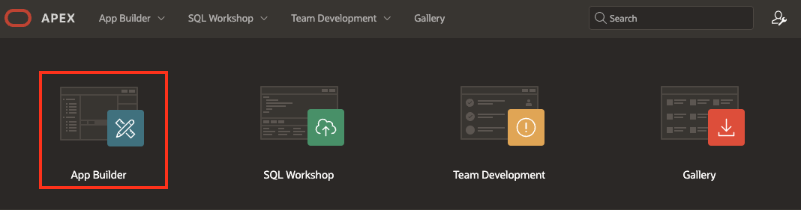
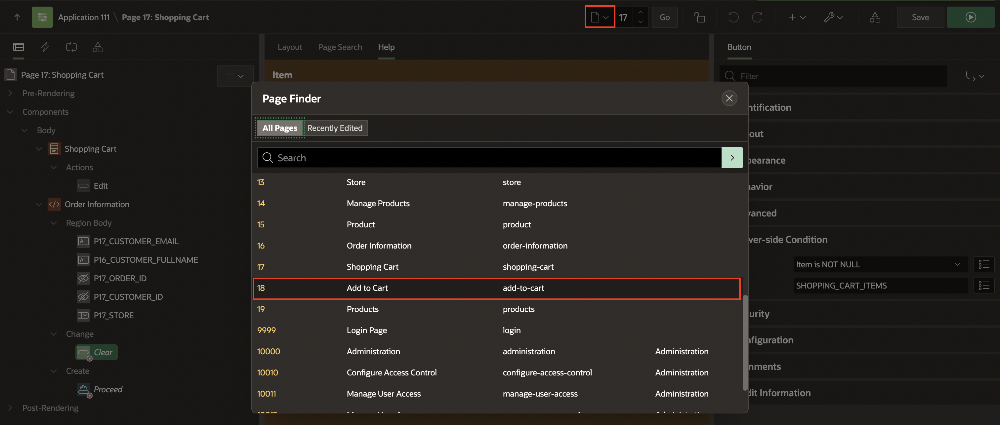
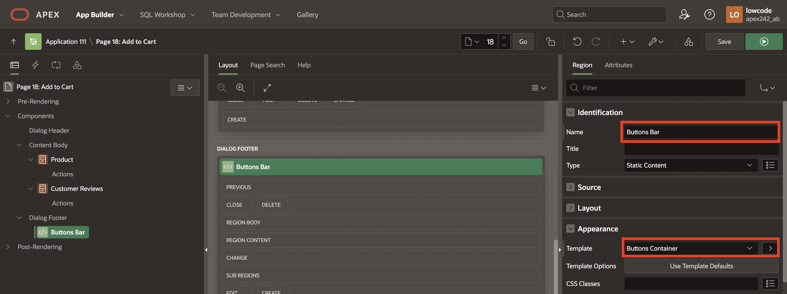

# Create and Use Page-Level Items and Buttons

In this lab, you create new Page Items and Buttons in the Shopping Cart and Add to Cart pages we created in **Lab 2: Developing Reports** Workshop.


Estimated Time: 20 minutes


### Downloads

- Did you miss out trying the previous labs? Don’t worry! You can download the application from [here](https://c4u04.objectstorage.us-ashburn-1.oci.customer-oci.com/p/EcTjWk2IuZPZeNnD_fYMcgUhdNDIDA6rt9gaFj_WZMiL7VvxPBNMY60837hu5hga/n/c4u04/b/livelabsfiles/o/data-management-library-files/apex-23-2-object-storage-files/hol5-lab-2.sql) and import it into your workspace. To run the app, please run the steps described in the following workshops:
1. **[Get Started with Oracle APEX](https://livelabs.oracle.com/pls/apex/r/dbpm/livelabs/run-workshop?p210_wid=3509)**
2. **[Using SQL Workshop](https://livelabs.oracle.com/pls/apex/r/dbpm/livelabs/run-workshop?p210_wid=3524)**


## Task 1: Add Items and Buttons to display Order Information

1. Navigate to the **App Builder**. Then, click on **Online Shopping Application**.

    

    


2. Now, select the **Shopping Cart** page.

    

3. Drag a **Static Content** region and drop it to the right of the Shopping Cart region to create a second region of content.

    

4. In the Property Editor, enter the following:
    - Title: **Order Information**

    

5. Navigate to the **Order Information** (left pane) region.

6. Right-click the **Order Information** region and click **Create Page Item**.

    

7. In the **Property Editor**, enter/select the following:

    - Name: **P16\_CUSTOMER\_EMAIL**
    - Type: **Text Field**
    - Label: **Email Address**
    - Validation > Value Required: Toggle the button to **Off**.

    

8. Create four page items as follows:

    | Name                    | Type        | Label     | Template            | Value Required |
    | ----------------------- | ----------- | --------- | ------------------- | -------------- |
    | P16\_CUSTOMER\_FULLNAME | Text Field  | Full Name | Optional - Floating | Off            |
    | P16\_ORDER\_ID          | Hidden      |           |                     |                |
    | P16\_CUSTOMER\_ID       | Hidden      |           |                     |                |
    | P16_STORE               | Select List | Store     | Optional - Floating | Off            |
    {: title="List of Page Items to be created"}

    For **P16\_STORE** item, in the property editor, navigate to List of Values group, and enter/select the following:
    - Type: **SQL Query**
    - SQL Query: enter the following SQL Query:

        ```
        <copy>
        select STORES.STORE_NAME as STORE_NAME,
            STORES.STORE_ID as STORE_ID
        from STORES
        </copy>
        ```
    - Display Extra Values: Toggle the button to **Off**
    - Null Display Value: **- Select a Store -**

    

9. Navigate to the **Order Information** (left pane) region.
10. Right-click the **Order Information** region and select **Create Button**.

      

11. Create two buttons as follows:

    | Button Name | Label               | Button Position | Button Template | Hot | Icon          |
    | ----------- | ------------------- | --------------- | --------------- | --- | ------------- |
    | Proceed     | Proceed to Checkout | Create          | Text            | On  |               |
    | Clear       | Clear Shopping Cart | Change          | Text with Icon  | Off | fa-cart-empty |
    {: title="List of Buttons to be created"}

    | Create Proceed Button                                     | Create Clear Button                                          |
    | --------------------------------------------------------- | ------------------------------------------------------------ |
    |  |  |
    {: title="Screenshot references to create Buttons"}


     Under Server-side Condition:
    | Button Name | Type             | Item                  |
    | ----------- | ---------------- | --------------------- |
    | Proceed     | Item is NOT NULL | SHOPPING\_CART\_ITEMS |
    | Clear       | Item is NOT NULL | SHOPPING\_CART\_ITEMS |
    {: title="Server-side conditions for Buttons"}

     

    Click **Save**.

## Task 2: Add Items and Buttons to Edit the Cart
In this task, you will create four-page items:
- **PRODUCT\_ID**: To get the product ID.
- **ACTION**: To identify the action (Add / Edit / Delete) made for the customer.
- **QUANTITY**: To permit customers to select the number of items to add or edit in the shopping cart.
- **SHOPPING\_CART\_ITEMS**: To get the number of items (total) in the shopping cart after an action is performed.

1. From the page designer, click the **Page Finder** icon. Then in the Page Finder popup, select **Page 17**.

      

2. Drag a **Static Content** region and drop it to the **Dialog Footer**.

       

3. In the Property Editor, enter/select the following:
    - Title: **Buttons Bar**
    - Template: **Buttons Container**

    

4. In the Rendering tree (left pane), navigate to **Buttons Bar** region.
5. Right-click the **Buttons Bar** region and click **Create Page Item**.

     

6. Create four items as follows. In the Property Editor, edit the following:

    | Name                      | Type        | Label    | Template |
    | ------------------------- | ----------- | -------- | -------- |
    | P17_ACTION                | Hidden      |
    | P17\_PRODUCT\_ID          | Hidden      |
    | P17_SHOPPING\_CART\_ITEMS | Hidden      |
    | P17_QUANTITY              | Select List | Quantity | Required |
    {: title="Page Items' properties"}

    For **P17_QUANTITY** item, in the property editor, enter/select the following:
    - Under List of Values:
        - Type: **Static Values**
        - Static Values: **Display1, Display2** and enter the following:

            | Display Value | Return Value |
            | ------------- | ------------ |
            | 1             | 1            |
            | 2             | 2            |
            | 3             | 3            |
            | 4             | 4            |
            | 5             | 5            |
            {: title="Display and Return Values"}

    - Click **OK**.
    - Display Extra Values: Toggle the button to **Off**
    - Display Null Value: Toggle the button to **Off**

    

7. Navigate to **Buttons Bar** region (left side). Right-click and select **Create Button**.
     

8. Create three buttons as follows:

    | Name   | Label            | Button Position | Button Template | Hot |
    | ------ | ---------------- | --------------- | --------------- | --- |
    | Add    | Add to Cart      | Next            | Text            | On  | On |
    | Edit   | Update Quantity  | Create          | Text            | On  |    |
    | Delete | Remove from Cart | Edit            | Text            | Off |
    {: title="Buttons to be created"}

    

     Under Server-side Condition section:
    | Name   | Type             | Item         |
    | ------ | ---------------- | ------------ |
    | Add    | Item is zero     | P17_QUANTITY |
    | Edit   | Item is NOT zero | P17_QUANTITY |
    | Delete | Item is NOT zero | P17_QUANTITY |
    {: title="Server-side conditions for Buttons}

          

9. For **Delete** button, in the property editor, enter/select the following:
    - Under Appearance section > Template Options:
        - Type: **Danger**
        - Style: **Display as Link**
        - Spacing Right: **Large**

    Click **OK**.

    Click **Save**.

    

## Summary
In this lab, You learned how to create new Page Items and Buttons for Shopping Cart and Add to Cart pages. This enables the end users to review, edit item quantities, remove items, clear the cart, and proceed to checkout for a more user-friendly shopping experience. You may now **proceed to the next lab**.

## Whats Next?
In the next workshop, you understand how to create validations in APEX to ensure data integrity. Then you also explore creating custom processes to enhance shopping cart functionality. Lastly, you learn to implement Dynamic Actions for seamless cart management and navigation.


## Acknowledgments
- **Author** - Roopesh Thokala, Senior Product Manager
- **Contributors** - Ankita Beri, Product Manager
- **Last Updated By/Date** -  Roopesh Thokala, Senior Product Manager, January 2024
