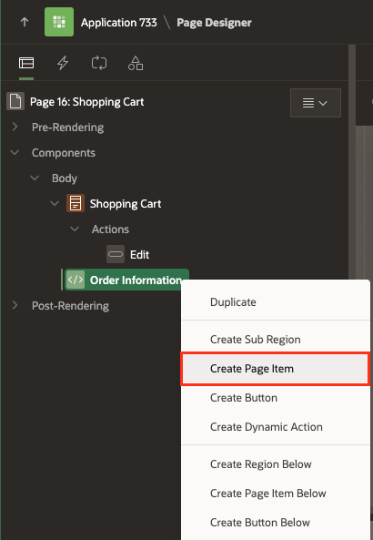
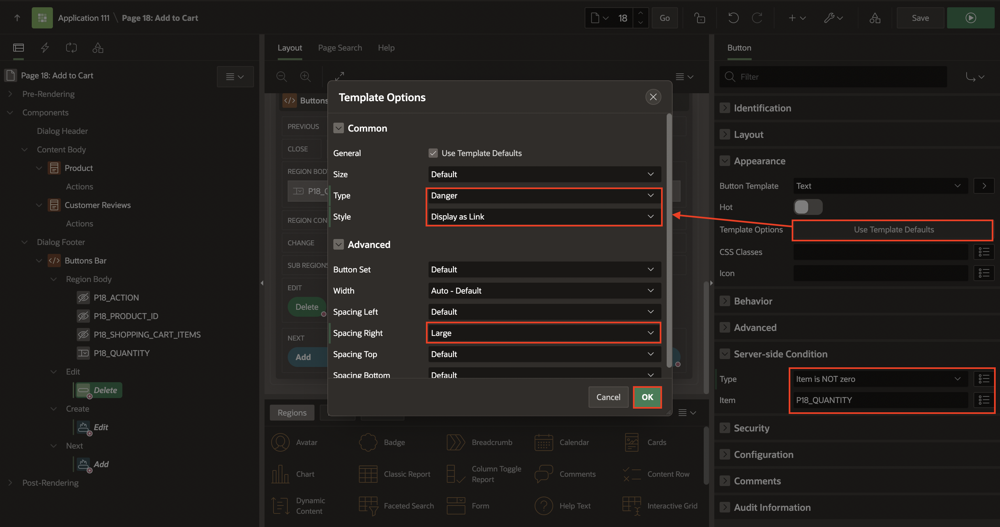

# Create and Use Page-Level Items and Buttons

## Introduction

In this lab, you create new Page Items and Buttons in the Shopping Cart and Add to Cart pages we created in  the **Lab 2** of **Developing Reports** Workshop.

Customers will be able to:
- Review the items in the shopping cart
- Edit the quantity of the items
- Remove an item
- Clear the shopping cart
- Proceed to checkout

Estimated Time: 20 minutes

### Objectives
In this lab, you will:
* Create new Page Items and Buttons in the Shopping Cart and Add to Cart pages.

### Downloads

- Did you miss out trying the previous labs? Don’t worry! You can download the application from **[here](files/hol7-lab1.sql)** and import it into your workspace. To run the app, please run the steps described in **[Get Started with Oracle APEX](https://apexapps.oracle.com/pls/apex/r/dbpm/livelabs/run-workshop?p210_wid=3509)** and **[Using SQL Workshop](https://apexapps.oracle.com/pls/apex/r/dbpm/livelabs/run-workshop?p210_wid=3524)** workshops.


## Task 1: Add Items and Buttons to the Page

1. Navigate to the **App Builder**. Then Click on **Online Shopping Application**.

    

    


2. Now you select **Shopping Cart** under **Page Icons**.

    

3. Drag a **Static Content** region and drop it to the right of the Shopping Cart region to create a second region of content.

    

4. In the Property Editor, enter the following:
    - For Title - enter **Order Information**

    

5. Navigate to the **Order Information** (left pane) region.

6. Right-click the **Order Information** region and click **Create Page Item**.

    

7. In the **Property Editor**, Enter the following.

    - For Name, Enter **P16\_CUSTOMER\_EMAIL**
    - For Type, Select **Text Field**.
    - For Label, Enter **Email Address**.
    - Under Validation, for Value Required, Set it to **Off**.

    

8. Create four items as follows:

    | Name |  Type  | Label  | Template | Value Required |
    | --- |  --- | --- | --- | --- |
    | P16\_CUSTOMER\_FULLNAME | Text Field | Full Name | Optional - Floating | Off |  
    | P16\_ORDER\_ID | Hidden |  | | |
    | P16\_CUSTOMER\_ID | Hidden |  | | |
    | P16_STORE | Select List | Store | Optional - Floating | Off |

    For **P16\_STORE** item, in the list of values section, configure the type as follows:
    - For Type - select **SQL Query**
    - For SQL Query - enter the following SQL Query:

        ```
        <copy>
        select STORES.STORE_NAME as STORE_NAME,
            STORES.STORE_ID as STORE_ID
        from STORES
        </copy>
        ```
    - Set Display Extra Values - to **Off**
    - For Null Display Value - enter **- Select a Store -**

    

9. Navigate to the **Order Information** (left pane) region.
10. Right-click the **Order Information** region  and click **Create Button**.

      

11. Create two buttons as follows:

    | Button Name | Label  | Button Position | Button Template | Hot | Icon |
    | --- |  --- | --- | --- | --- | --- |
    | Proceed | Proceed to Checkout | Create | Text | On | |
    | Clear | Clear Shopping Cart | Change | Text with Icon | Off | fa-cart-empty |

    | Create Proceed Button                          |  Create Clear Button                            |
    | ----------------------------------- | ----------------------------------- |
    |  |  |


     Under Server-side Condition:
    | Button Name | Type  | Item  |
    | --- |  --- | --- |
    | Proceed | Item is NOT NULL | SHOPPING\_CART\_ITEMS |
    | Clear | Item is NOT NULL | SHOPPING\_CART\_ITEMS |

     

    Click Save.

## Task 2: Add Items and Buttons
In this task, you will create four-page items:
- PRODUCT_ID: To get the product ID
- ACTION: To identify the action (Add / Edit / Delete) made for the customer
- QUANTITY: To permit customers to select the number of items to add or edit in the shopping cart
- SHOPPING\_CART\_ITEMS: To get the number of items (total) in the shopping cart after an action is made

1. Navigate to **Page Finder** and click on **File**. Then in the popup **Page Finder**, Select **Page 17**.

      

2. Drag a **Static Content** region and drop it to the **Dialog Footer**.

       

3. In the Property Editor, enter the following:
    - For Title - enter **Buttons Bar**
    - For Template - select **Buttons Container**

  

4. In the Rendering tree (left pane), navigate to **Buttons Bar** region.
5. Right-click the **Buttons Bar** region and click  **Create Page Item**.

     

6. Create four items as follows. In the Property Editor, do the following:

    | Name |  Type  | Label  | Template |
    | ---  |  ---   | ---    | --- |
    | P17_ACTION | Hidden |
    | P17\_PRODUCT\_ID | Hidden |
    | P17_SHOPPING\_CART\_ITEMS | Hidden |
    | P17_QUANTITY | Select List | Quantity | Required |

    For **P17_QUANTITY** item, do the following:
    - Under List of Values section:
        - For Type - select **Static Values**
        - For Static Values - click **Display1, Display2** and enter the following:

            | Display Value |  Return Value  |
            | --- |  --- |
            | 1 | 1 |
            | 2 | 2 |
            | 3 | 3 |
            | 4 | 4 |
            | 5 | 5 |

    - Click **Ok**
    - Set Display Extra Values to **Off**
    - Set Display Null Value to **Off**

  

7. Navigate to **Buttons Bar** region (left side).
8. Right-click the region and click **Create Button**.
     
9. Create three buttons as follows:

    | Name | Label | Button Position |Button Template | Hot |
    | ---  | ---   | ---             | --- | ---             |
    | Add          | Add to Cart | Next |Text  |  On  |  On |
    | Edit         | Update Quantity| Create   |Text  |  On | |
    | Delete       | Remove from Cart | Edit   |Text  |  Off |

    

     Under Server-side Condition section:
    | Name | Type | Item |
    | ---  | ---   | ---             |
    | Add  | Item is zero | P17_QUANTITY |
    | Edit         | Item is NOT zero | P17_QUANTITY |
    | Delete       | Item is NOT zero | P17_QUANTITY |

          

10. For **Delete** button, apply the following changes:
    - Under Appearance section, click Template Options:
        - For Type - select **Danger**
        - For Style -select **Display as Link**
        - For Spacing Right, select **Large**
    - Click **Ok**.
    - Click **Save**.

    

## Summary
In this hands-on lab, You learned how to create new Page Items and Buttons for Shopping Cart and Add to Cart pages. This enables the end users to review, edit item quantities, remove items, clear the cart, and proceed to checkout for a more user-friendly shopping experience. You may now **proceed to the next lab**.

## Whats Next
In the next Lab, you understand how to create validations in APEX to ensure data integrity. Then you also explore creating custom processes to enhance shopping cart functionality. Lastly, you learn to implement dynamic Actions for seamless cart management and navigation.


## Acknowledgments
- **Author** - Roopesh Thokala, Senior Product Manager
- **Contributors** - Ankita Beri, Product Manager
- **Last Updated By/Date** -  Roopesh Thokala, Senior Product Manager, January 2024
