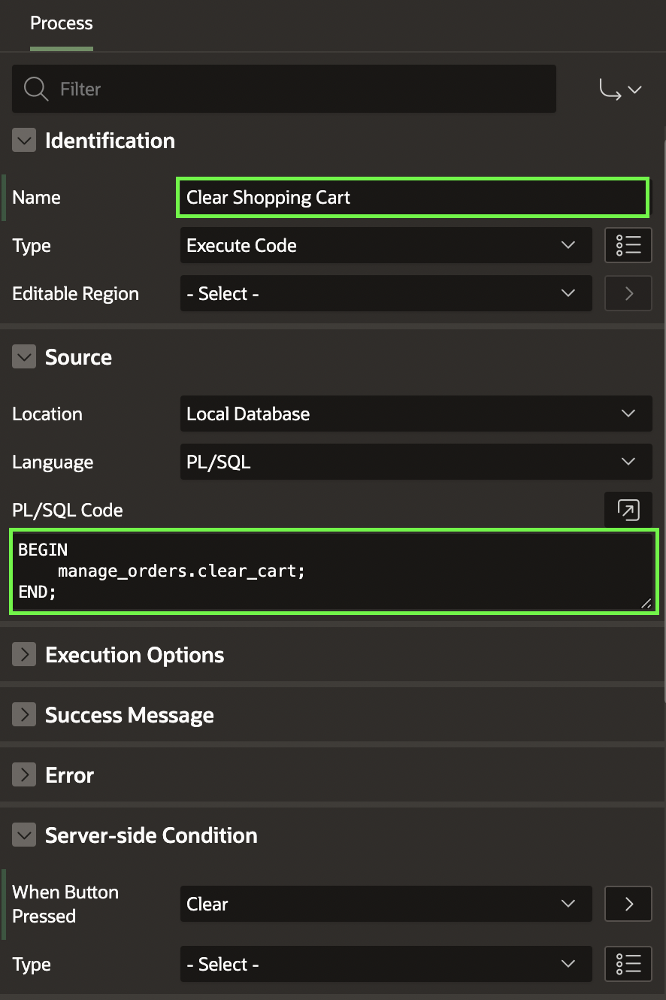

# Add Validations and Processes to the Shopping Cart Page

## Introduction


This Hands-on Lab is a collection of six tasks. After completing this lab, your application will enable customers to:

- Review the items in the shopping cart
- Edit the quantity of the items
- Remove an item
- Clear the shopping cart
- Proceed to checkout

Estimated Time: 15 minutes


### Objectives
In this lab, you will:
- Create Validations, Processes and Branches to manage the Shopping Cart

### Downloads

- Did you miss out trying the previous labs? Don’t worry! You can download the application from **[here](files/online-shopping-cart-4.sql)** and import it into your workspace. To run the app, please run the steps described in in **[Get Started with Oracle APEX](https://apexapps.oracle.com/pls/apex/r/dbpm/livelabs/run-workshop?p210_wid=3509)** and **[Using SQL Workshop](https://apexapps.oracle.com/pls/apex/r/dbpm/livelabs/run-workshop?p210_wid=3524)** workshops.


## Task 1: Create Validations on the Page

1. Navigate to the **App Builder**. Then Click on **Online Shopping Application**.

    

2. Now you select **Shopping Cart** under **Page Icons**.

    

3. In the Rendering tree (left pane), click **Processing** tab.

4. Over **Validating**, right-click **Create Validation**.

       

5. Create three validations for the following items: Name, Email, and Store

    

    | Name |  Type (under Validation) | Item |
    | --- |  --- | --- |
    | Validate Name | Item is NOT NULL | P16\_CUSTOMER\_FULLNAME |
    | Validate Email | Item is NOT NULL | P16\_CUSTOMER\_EMAIL |
    | Validate Store | Item is NOT NULL | P16_STORE |

    Under Error:

    | Error Message | Display Location | Associated Item |
    | --- |  --- | --- |
    | Please enter your name | Inline with Field and in Notification | P16\_CUSTOMER\_FULLNAME |
    | Please enter your email address | Inline with Field and in Notification | P16\_CUSTOMER\_EMAIL |
    | Please select a store | Inline with Field and in Notification | P16_STORE |

     

     As these validations only apply when user proceeds to checkout, let's create that condition.
     Under Server-side Condition, set the following:

    | Name  | When Button Pressed |
    | ---   |  --- |
    | Validate Name  | Proceed |
    | Validate Email | Proceed |
    | Validate Store | Proceed |   

            

## Task 2: Add a Process to Create the Order

1. On the **Processing** tab (left pane).
2. Right-click **Processing** and click **Create Process**.

     

3. In the Property Editor, enter the following:
        
    - For Name - enter **Checkout**
    - For Type -select **Execute Code**
    - For PL/SQL Code - enter the following PL/SQL code:

        ```
        <copy>
        BEGIN
            MANAGE_ORDERS.create_order (
                                        p_customer       => :P16_CUSTOMER_FULLNAME,
                                        p_customer_email => :P16_CUSTOMER_EMAIL,
                                        p_store          => :P16_STORE,
                                        p_order_id       => :P16_ORDER_ID,
                                        p_customer_id    => :P16_CUSTOMER_ID);   
        END;                                    
        </copy>
        ```

    - For Success Message, enter **Order successfully created: &P16\_ORDER\_ID.**
    - Under Server-side condition, for When Button Pressed, select **Proceed**

  

## Task 3: Add Process to Clear the Shopping Cart

1. On the **Processing** tab (left pane).
2. Right-click **Processing** and click **Create Process**.
3. Create a second process to clear the shopping cart. In the Property Editor, enter the following:
    - For Name - enter **Clear Shopping Cart**
    - For Type - select **Execute Code**
    - For PL/SQL Code - enter the following PL/SQL code:

    ```
    <copy>
    BEGIN
        manage_orders.clear_cart;
    END;
    </copy>
    ```

    - Under Server-side condition, for When Button Pressed, select **Clear**.

  

## Task 4: Add Branches to the Page

1. On the **Processing** tab (left pane).
2. Right-click **After Processing** and click **Create Branch**.

       

3. In the Property Editor, enter the following:  

    - For Name - enter **Go to Orders**

    - Navigate to Target attribute and click **No Link Defined**.
        - For Type - select **Page in this application**
        - For Page - enter **16**
        - For Set Items - enter:

          | Name | Value  |
          | --- |  --- |
          | P16_ORDER | &P16\_ORDER\_ID. |
          
        - For Clear Cache - enter **16**.
        - Click **OK**.

    - Under Server-side condition, for When Button Pressed, select **Proceed**.

    

4. Create a second branch when the user clears the shopping cart. Right-click on **After Processing** and click **Create Branch**.

5. In the Property Editor, enter the following:
    - For Name - enter **Go to Products**

    - Navigate to Target attribute and click **No Link Defined**
        - For Type - select **Page in this application**
        - For Page - enter **1**
        - For Clear Cache - enter **1**
        - Click **OK**

    - Under Server-side condition, for When Button Pressed, select **Clear**

## Summary

You now know how to add validations, processes and branches to your APEX page. You may now **proceed to the next lab**.

## Acknowledgments

- **Author** - Roopesh Thokala, Product Manager
- **Contributor** - Ankita Beri, Product Manager
- **Last Updated By/Date** - Roopesh Thokala, May 2022
