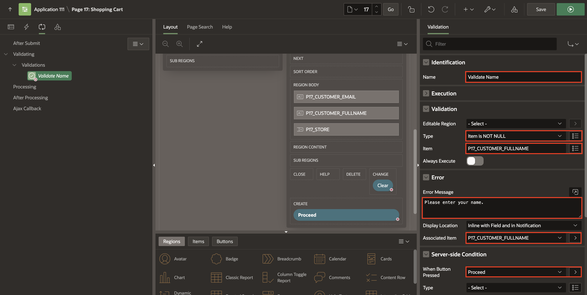
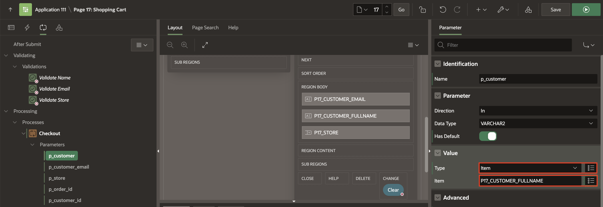
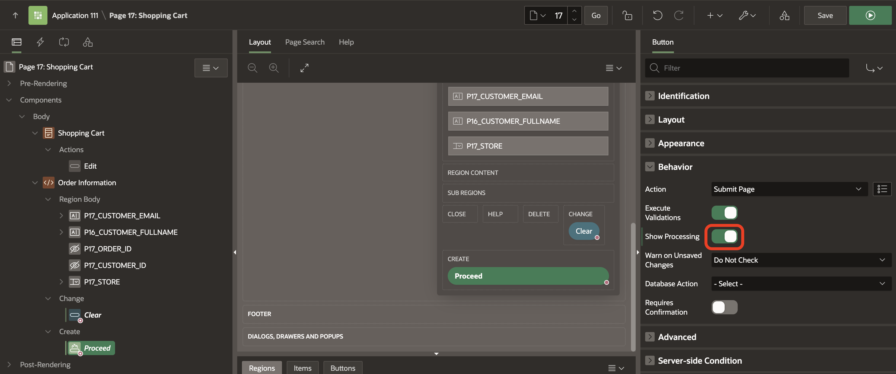
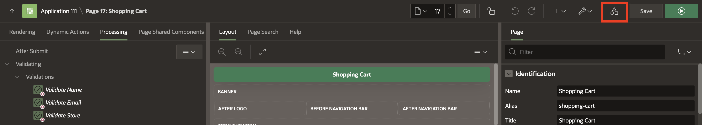
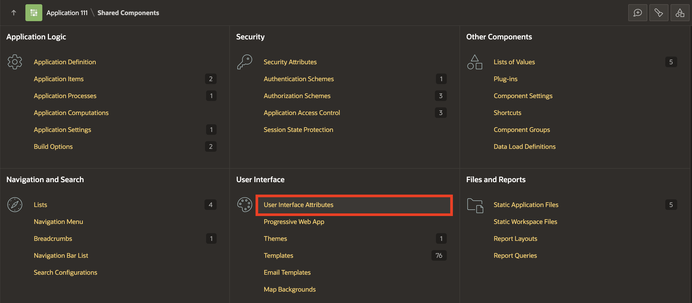
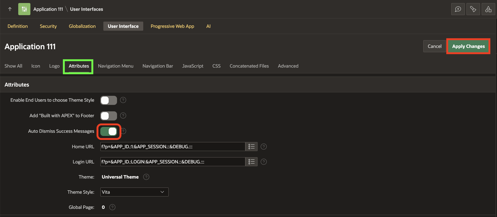
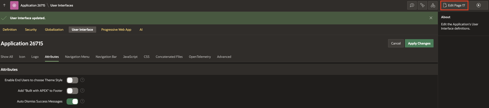

# Add Validations and Processes to the Shopping Cart Page

## Introduction

This lab enhances a shopping cart page by adding critical validations, processes, and branching processes to manage customer orders effectively. By the end, customers can place orders seamlessly, validate required information, clear their cart, and quickly proceed to checkout. These tasks ensure the application runs smoothly and delivers an optimized user experience.

Estimated Time: 15 minutes

### Objectives

In this lab, you will:

- Create validations to ensure required fields are filled.

- Implement processes to create orders and manage the shopping cart.

- Add branching logic to efficiently transition between pages.

- Clear the shopping cart and proceed to checkout seamlessly.

## Task 1: Create Validations on the Page

In this task, you will add validations to ensure that required fields on the shopping cart page—such as customer name, email, and store—are filled before proceeding to the next steps. If mandatory information is missing, these validations will prompt the user with appropriate error messages.

1. Navigate to the **App Builder**.

    

2. Click **Online Shopping Application**.

    

3. Select **17 - Shopping Cart** page.

    

4. Navigate to **Processing** tab. Right-click **Validating** and select **Create Validation**.

    

5. In the property editor, enter/select the following:

    - Identification > Name: **Validate Name**

    - Under Validation:

        - Type: **Item is NOT NULL**

        - Item: **P17\_CUSTOMER\_FULL_NAME**

    - Under Error:

        - Error Message: **Please enter your name.**

        - Associated Item: **P17\_CUSTOMER\_FULLNAME**

    - Server-side Condition > When Button Pressed: **Proceed**

    

6. Create two more validations for the following items: **Email** and **Store**.

    | Name           | Validation > Type | Validation > Item       | Error Message                      | Associated Item         | Server-side Condition > When Button Pressed |
    | -------------- | ----------------- | ----------------------- | ------------------------------- |----------------------- | ------------- |
    | Validate Email | Item is NOT NULL  | P17\_CUSTOMER\_EMAIL    | Please enter your email address | P17\_CUSTOMER\_EMAIL    | Proceed |
    | Validate Store | Item is NOT NULL  | P17_STORE               | Please select a store           | P17_STORE               | Proceed |
    {: title="Validation Properties"}

    

    

## Task 2: Add a Process to Create the Order

This task focuses on creating a backend process that allows users to submit their orders. You will invoke a PL/SQL package that handles order creation, ensuring the order is successfully placed with all relevant customer information.

1. Navigate to **Processing** tab (left pane). Right-click **Processing** and select **Create Process**.

    

2. In the Property Editor, enter/select the following:
    - Under Identification:

        - Name: **Checkout**

        - Type: **Invoke API**

    - Under Settings:

        - Type: **PL/SQL Package**

        - Package: **MANAGE_ORDERS**.  You can type in the name or pick from the list.

        - Procedure or Function: **CREATE_ORDER**,  defined in the selected PL/SQL package. You can type in the name or pick from the list.

    

3. Expand the **Checkout** process. Under **Parameters**, select **p_customer** and enter/select the following:

    - Under Value:

        - Type: **Item**

        - Value: **P17\_CUSTOMER\_FULLNAME**

    

4. Click **Save**.

## Task 3: Add Process to Clear the Shopping Cart

In this task, you will create a process to clear the shopping cart when the customer requests it. This includes providing a success message and redirecting the user to the shopping cart page, ensuring they can start fresh.

1. In the **Processing** tab, right-click **Ajax Callback** and select **Create Process**.

    

2. In the property editor, enter/select the following:

    - Identification > Name: **clear_cart**

    - Source > PL/SQL Code: Copy and paste the below code:

        ```
       <copy>
        BEGIN
            manage_orders.clear_cart;
        END;
        ```

        </copy>

    - Success Message > Success Message: **Your cart has been successfully cleared**

    - Server-side Condition > When Button Pressed: **Clear**

    

3. Under **Rendering** tab, select **Proceed**. In the Property Editor, under **Behavior**, enable **Show Processing**.

    This would avoid accidental multiple-page submissions by displaying a processing animation and temporarily disabling page interaction using the new Show Processing attribute available for page buttons.

    

4. Click **Save**.

5. Navigate to **Shared Components**.

    

6. Under **User Interface**, click **User Interface Attributes**.

    

7. Under **Attributes**, enable **Auto Dismiss Success Messages** and click **Apply Changes**.

    By turning this new application's User Interface attribute on, all success messages in the application will be dismissed automatically.

    Also, you can use the new **setDismissPreferences** API to control dismiss preferences and customize the timing of the auto-dismiss functionality.

    

## Task 4: Add Branches to the Page

In this task, you will create a branching process that redirects the user to the appropriate page after they submit an order. Branches ensure a smooth navigation experience by guiding users based on their actions, such as checking or viewing their order details.

1. In the top right corner, navigate to **Edit Page 17**.

    

2. In the **Processing** tab (left pane), right-click **After Processing** and select **Create Branch**.

    

3. In the Property Editor, enter/select the following:

    - Identification > Name: **Go to Orders**

    - Target: Click **No Link Defined**.

        - Type: **Page in this application**

        - Page: **16**

        - Set Items: Enter/select the following:

            | Name           | Value            |
            | -------------- | ---------------- |
            | P16\_ORDER | &P17\_ORDER\_ID. |
            {: title="List of Taregt Item(s)"}

        - Clear Cache: **16**.

        Click **OK**.

    - Server-side condition > When Button Pressed: **Proceed**.

    

4. Click **Save**.

## Summary

In this hands-on lab, you learned to create data validations for page items, ensuring data accuracy. You also implemented a dedicated page process to streamline order creation. Additionally, the lab covered clearing the shopping cart and enabling a seamless transition to the checkout process, enhancing the overall user experience. You may now **proceed to the next lab**.

## What's Next

In the next lab, you explore the use of Dynamic Actions to manage the shopping cart, allowing for efficient real-time updates. Additionally, you learn how to review product details and enable users to add, edit, or remove items from their cart with the help of Page Process.

## Acknowledgements

- **Author** - Roopesh Thokala, Senior Product Manager; Ankita Beri, Product Manager
- **Last Updated By/Date** - Ankita Beri, Product Manager, September 2024
